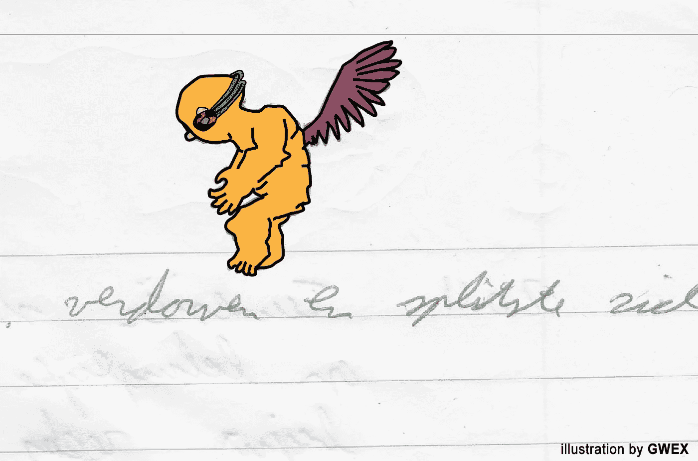

# 无人驾驶汽车，谢谢——不，谢谢

> 原文：<https://medium.com/coinmonks/autonomous-driverless-cars-thanks-no-thanks-3f3c624326f9?source=collection_archive---------10----------------------->

## 报价和评论-5

开车上下班是地狱:早起，试图在交通变得太拥挤之前离开，路上喝咖啡，迟到 1 分钟...对我来说，这是我有过的最脑残的经历。我慢慢开始觉得自己像一袋排在有轮子的饼干罐里的土豆，等着被切成薯条。

为了恢复我的生活和大脑活动，我换了一辆摩托车:每天早上都有清新的风，没有交通堵塞，而且需要保持高度警惕，因为路上的每辆车都试图杀死你，大多数都是那些像天线宝宝一样的白痴。但是对我来说，没有更好的方式来开始新的一天。它唤醒我，激活我的大脑，开始我的一天。

这正是我对所有自动驾驶的东西的问题:纯粹丰满的瓦力茧。在我们意识到之前，我们就像一袋袋迟钝的土豆一样被运送，有知觉的机器获取我们的体温和电活动。与此同时，我们消费着投影在挡风玻璃上的泡泡新闻和网飞系列。我不想要自动驾驶汽车；我不想遇到任何交通堵塞。

但是，让我们不要扮演福特的客户，他们想要一匹更快的马，看看在一个红色交通灯被视为糟糕的用户体验而不是安全行为的世界里，无人驾驶汽车可以提供什么。

交通堵塞，除非我们改变我们的交通系统，否则情况不会改善。但这不仅仅是从我们目前的汽油燃料汽车到无人驾驶/自动驾驶电动汽车的机器转变。这里越来越有趣了。不仅交通工具会改变，我们整个社会和经济也会改变。

一个名为“自主生态系统”的 YouTube 系列描述了这些变化。

例如，市中心的停车位不再需要了。这将改变内城的整个基础设施。此外，汽车的价值主张也会发生变化。谁将拥有/购买/拥有这辆车，个人还是公司？汽车的品牌重要还是公司及其提供的服务重要？

这也将对个人和城市财政产生巨大影响。人们花在买车、保险和燃料上的所有钱都可以花在别的事情上。这对你有好处，但是城市将不得不处理他们预算中的巨大缺口。

> “正如俄勒冈大学城市主义未来中心主任尼科·拉科议长所解释的那样，问题在于许多城市利用汽车带来的资金来平衡预算:汽油税、车辆注册费、交通罚单和数十亿美元的停车收入。”(自动驾驶汽车可能会让城市陷入财政危机——[连线](https://www.wired.com/story/autonomous-vehicles-might-drive-cities-to-financial-ruin))

因此，城市的设计将会改变，组织城市经济的方式也会改变。这样，无人驾驶汽车也将引发我们基础设施的彻底变革。也许我们会得到

> “移动枢纽”，骑车人可以在自行车、汽车、公共汽车和地铁之间转换。车站能成为给电动自行车、小型摩托车甚至汽车充电的地方吗？(Lyft 的大规模自行车共享购买是为了统治街道

但是我们还没有到那一步。目前，许多公司竞相发布第一辆真正的无人驾驶汽车。他们试图开发自己的自动驾驶系统。然而，交通安全属于公共领域:交通规则、道路、交通灯以及交通法规和执法都是一般事务，由政府机构组织或在其监督下进行。众多公司投入的所有努力、精力和资本是否能够并应该被集中到一个管理所有公司的安全系统中？

安全带、安全气囊和防撞缓冲区显然是汽车的一部分，可以防止乘客在事故中受到伤害。道路、道路信号、交通灯和交通规则是预防事故的公共措施。自动驾驶软件和安全系统是道路的一部分还是汽车的一部分？我会说，伦理学家的精神食粮。这是一顿大餐，所以开始吃吧。这是一些开胃菜。

> 国家安全委员会首席执行官黛博拉·赫斯曼说:“如果我们有一个单一的系统，有明确的预期、明确的可交付成果、明确的故障模式和结果，就会有更高水平的透明度和理解。”
> ……
> “然而，一些专家认为“一刀切”的方法存在严重的风险。Argo 的 Salesky 警告说:“它把每个人都锁在一个单一的系统中，这个系统可能不允许未来的创新或变化。"不是每个人都在解决同样的原因或解决方案."(自动驾驶系统应该兼容吗— [数字趋势](https://www.digitaltrends.com/cars/should-autonomous-driving-systems-be-compatible))

显而易见，我们的交通系统将会改变。交通状况已经发生了变化。红色交通灯被视为糟糕的用户体验。操作手机而不是驾驶车辆不再是一个例外。因此，允许司机将控制权交给软件，并不是一个坏主意。围绕无人驾驶汽车的发展是否会导致交通堵塞的减少，我不知道。真正的考验将是在寒冷的冬天后的第一个炎热的夏季周末去海滩的路上。就我个人而言，我希望这种变化将带来一个三层的道路系统，顶层用于送货无人机，中间层用于自主运输，底层用于需要像《星球大战》中的裸体飞车 74-Z 那样用电动自行车开始一天生活的人。我等不及了…

链接:
如你所见，《连线》杂志上有很多与无人驾驶汽车相关的故事:
-[https://www . Wired . com/story/distributed-driving-studies-statistics](https://www.wired.com/story/distracted-driving-studies-statistics)
-[https://www . Wired . com/story/autonomous-vehicles-may-drive-cities-to-financial-ruin](https://www.wired.com/story/autonomous-vehicles-might-drive-cities-to-financial-ruin)
-[https://www . Wired . com/story/lyft-motivate-bike-share-aquisition](https://www.wired.com/story/lyft-motivate-bike-share-aquisition)
-【详情