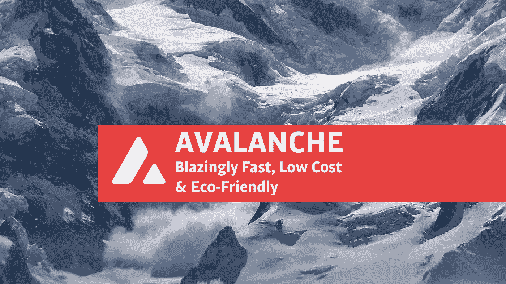

# 雪崩:更快更便宜的以太坊挑战者$AVAX

> 原文：<https://medium.com/coinmonks/avalanche-faster-cheaper-ethereum-challenger-avax-bc94e0a404dd?source=collection_archive---------3----------------------->

数百万美元的投资，一个新的 block explorer，以及与游戏行业的联系:雪崩生态系统正在发展，并将 AVAX 推向了一个新的历史新高。

Photo by [Krzysztof Kowalik](https://unsplash.com/@kowalikus?utm_source=unsplash&utm_medium=referral&utm_content=creditCopyText) on [Unsplash](https://unsplash.com/?utm_source=unsplash&utm_medium=referral&utm_content=creditCopyText), edited by the author

加密市场的上升趋势正在影响 AVAX，即雪崩网络的本地加密货币。看起来 AVAX 市值的增加是一个…