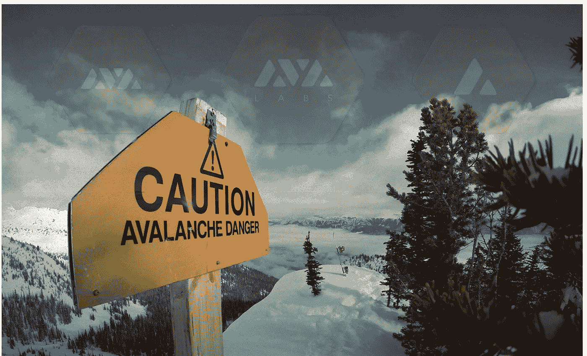

# 雪崩来了…

> 原文：<https://medium.com/coinmonks/avalanche-is-coming-13b34fda2687?source=collection_archive---------3----------------------->

*From left to right : The Avalanche Platform, Avalabs and $AVAX*

# 密码之旅:过去、现在和未来

跟踪加密空间并不容易。

尤其是当你错过了比特币和以太坊革命的时候:

*   在 2010 年，这个十八九岁/二十出头的男孩无视了他的计算机科学同学，他想用我们工程学院的计算机创建一个比特币采矿平台。人们更关注社交，而不是梦想一个更好/更公平/更高科技的金融世界。
*   在 **2014** 中，这位年轻的数据科学高管没有研究他的朋友和同事关于“新的革命性智能合同协议”的说法。重点是建立一个稳定的局势。

然后是 2016-2017 年**的**加密热，它点燃了研究(太多)项目的好奇心，从可收集的猫，到关注隐私的麻省理工学院领导的新区块链，或承诺将数千万用户带入加密空间的消息/博客应用。以及大量的技术革命、治理辩论和智慧冲突。秘密真人秀的伟大时代。在泡沫爆炸之前。而证交会“踢蚁丘”。表明市场仍处于起步阶段。

尽管有些戏剧性，一些项目设法保持在轨道上，最重要的是保持他们的主张。就像**泰佐斯(XTZ)**——尽管采用率仍在上升。其核心理念链上治理，正式核查(保证机构级合同)，真正的流动性证据的股份和经济原则没有退缩。最重要的是，它被证明在主网发布两年后仍然有效。随着 CBDC 在全球范围内受到调查，以及机构投资者对可审计性的需求，如果它能够扩大规模，就能提供一笔不错的交易。

而今天我们在 **2020** 。COVID 的年份。这是美国最重要的选举之一。黑天鹅年。**以及雪崩协议($AVAX)上线之年。**我很少看到这种社区建设和反馈，再加上新技术、有能力的领导团队和交付。有一些失误，未来还会有，但我想分享我的旅程，以确保这些是未来更好、更成功的平台的学习。以下帖子(由社区成员和 Avalabs 团队发布)涵盖以下内容:

*   [***了解雪崩的历史、团队和里程碑:***](/@mounaimderraz/the-avalanche-ecosystem-3f06c5f9387e) *一个 CS 博士团队如何设法将一份“匿名”白皮书翻译成现实生活中的平台。*
*   [***理解雪崩共识机制:***](/avalabs/avalanche-consensus-101-99c68a3e3159) *是什么让雪氏家族的共识协议从传统或中本家族的协议中脱颖而出？*
*   [***什么让雪崩与众不同:***](https://cryptoseq.medium.com/what-sets-avalanche-apart-from-other-blockchains-3c5f4a4c0889)**什么让平台的平台与其他链区分开来？**
*   *[**理解 Avalanche 对于 DeFi 的价值主张:**](/@mounaimderraz/defi-an-avalanche-to-the-world-13205bd850ba)*Avalanche 为什么要打造一个真实世界的去中心化金融平台。**
*   *[***了解雪崩平台:***](/avalabs/the-ava-platform-a-tech-primer-7a9b5de57a35#:~:text=The%20Avalanche%20network%20is%20a,platform%20must%20validate%20these%20chains.&text=Staking%20in%20the%20main%20subnet,cross%2Dchain%20commitments%20between%20subnets.) *平台的 tokenomics 有哪些？如何在 X 链、P 链、C 链中导航或者创建自己的子链？阿瑟勒姆是什么？**
*   *[***部署智能合约:***](/avalabs/deploy-a-smart-contract-on-ava-using-remix-and-metamask-98933a93f436) 如何使用已有的工具在 C 链上部署 solidity 智能合约？*
*   *[***雪崩生态系统迅速扩张:***](/@CryptoSeq/the-avalanche-ecosystem-is-rapidly-expanding-private-securities-ilos-dexs-synthetics-ce480387a111) 雪崩项目和生态系统状态 4 个月后的 mainnet。*

***最后，是什么让我对当今的加密/数字资产世界感到兴奋？***

*第一，我很有信心**雪崩** ( **$AVAX)** 在未来会发挥重大作用。我在即将到来的技术堆栈和基础中看到了许多与伟大的 L1 和 L2 项目的协同作用和非常好的想法。*

*此外，我相信数字资产和分散金融领域的研究反映了我们的社会和经济斗争，汇集了来自各大洲的人们，解决了长期以来的问题，即让金融世界不仅对少数幸福的人开放，而且对每个人开放(相信我，当你来自非洲时，这不是轻描淡写)。*

***从雪崩开始的有用链接:***

* [## AVA 实验室:打造金融互联网

### AVA 实验室使用区块链技术使启动金融应用程序变得简单。

www.avalabs.org](https://www.avalabs.org/)  [## 雪崩

### 7 796 会员，1 334 在线欢迎来到官方雪崩电报！Avalanche 是一个开源平台，用于…

t.me](https://t.me/avalancheavax)  [## 雪崩中心:社区成长平台| AVA 实验室

### 从扩展努力到开放源码开发，成员直接为重要的研究、教育和…

社区. avax .网络](https://community.avax.network) 

> [*在您的收件箱中直接获得最佳软件交易*](https://coincodecap.com/?utm_source=coinmonks)

*