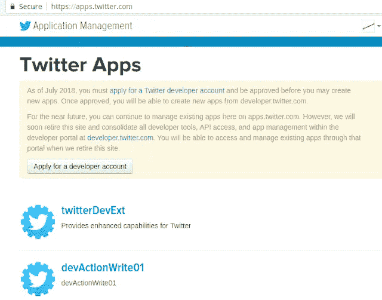
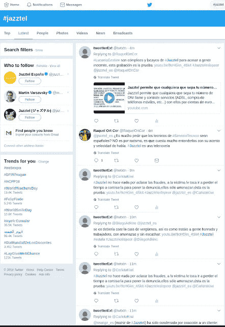
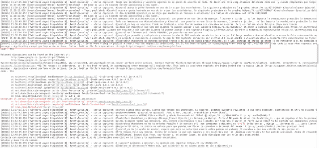
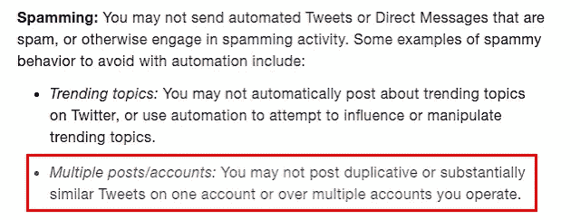

# 复仇者机器人:一个报复客户虐待的推特机器人

> 原文：<https://medium.com/coinmonks/avenger-bot-a6270ff7a957?source=collection_archive---------5----------------------->

## 构建一个多线程机器人来回复选定的推文

**TL；DR:** 一个多线程 Twitter 机器人的完整 Java 代码，它传播关于客户滥用以及如何(不)被 Twitter 禁止的消息。

Twitter API 是主要互联网组织最早提供的 API 之一，它可能是全球使用最多的 API，尽管在过去几年中 Twitter 一直在让开发者更难使用它，你可以查看 [**这个**](https://www.theverge.com/2018/5/16/17362138/twitter-api-third-party-apps-changes-explained) 作为例子。不是每个人都在 Twitter 上，但几乎每个企业都在，尤其是大型电信公司。他们中的大多数甚至通过 Twitter 提供客户支持，尽管通常很糟糕(支持)，但至少这是一个开放的渠道，你可以与其他沮丧的客户分享你的沮丧。

# 动机

当西班牙的一家主要电信运营商开始大肆追逐我的母亲和我的整个家庭时，因为有人使用她的名字和身份证号码从他们那里欺诈性地购买服务，而这些服务从来没有支付过(看起来他们是故意的？几乎没有任何安全控制，我决定在 Twitter 上报复。

我非常生气，Jazztel(电信公司)对寻找真相不感兴趣，他们指责我妈妈不支付她的账单，并威胁她要去法院，这个电话对话(西班牙语)证明了这一点。

我从几个月前看的这篇文章中获得了灵感。

但我的“*复仇者机器人*”比这更复杂，它使用 [**Twitter 流媒体 API**](https://developer.twitter.com/en/docs/tutorials/consuming-streaming-data.html) 来监听发给 Jazztel 的推文，然后用愤怒的抱怨来回复它们(我知道这可能不会有任何影响，但至少这是一种在学习的同时释放我的愤怒的方式，因为这在技术上具有挑战性，我也觉得这很有趣)。

# 履行

因此，我需要的第一件事是一个 Twitter 帐户，我的机器人将在这个帐户下运行，然后还有一个“Twitter 应用程序”，以便检索针对 Twitter API 进行身份验证和授权所需的四个安全密钥。

幸运的是，我从我之前的一个宠物项目 的工作中获得了所有这些，因为从几个月前开始，Twitter 强迫他们 API 的新用户注册一个开发者账户，并等待注册(希望)被批准。

然后我开始开发我的机器人，几个晚上之后我就把它准备好了，整个源代码(Java 8)都可以在 [**GitHub**](https://github.com/VictorGil/avenger-bot) 上找到。

这些是**的主要特点:**

-四个安全密钥:
*消费者密钥(API 密钥)
消费者秘密(API 秘密)*
*访问令牌*
*访问令牌秘密*
在 [**JSON 配置文件**](https://github.com/VictorGil/avenger-bot/blob/master/src/main/resources/config/config.json) 中加密，并在运行时使用存储在环境变量中的密码解密。

-它通过 Spring Framework 使用非常简单的依赖注入，我选择 XML 配置而不是注释，因为正如 Sam Atkinson 在四年半多前他的 [**著名帖子**](http://samatkinson.com/why-i-hate-spring/) 中所说:*我不喜欢魔术。* 我也不喜欢在 XML 中使用"*代码*"，这就是为什么我说"*****简单的*** *依赖注入*"之前，我强烈认为 Spring(或任何其他 DI 框架)应该被使用**只是为了将 beans 连接在一起**，仅此而已，没有智能/定制类型转换，没有 SpEL，等等**

**-它使用一个 [**阻塞队列**](https://github.com/VictorGil/avenger-bot/blob/master/src/main/java/net/devaction/avengerbot/tweetscapturedproducer/TweetsQueueImpl.java) 来实现生产者/消费者模式。**

**-应用程序在 Linux 上通过实现[**signal handler**](https://github.com/VictorGil/avenger-bot/blob/master/src/main/java/net/devaction/avengerbot/main/Manager.java#L17)接口接收到 WINCH 信号后正确关闭(优雅地从 tweets 流中断开连接)(这个关闭机制的完整动机和解释值得我在不久的将来写一篇自己的帖子)。**

**bot 使用 [**Twitter4j**](http://twitter4j.org/) 库，所以我不需要直接处理 REST/HTTP。**

**-没有单元测试，但至少包含了一些“*测试器*”类，它们帮助我在编写代码时验证代码。**

# **执行**

**在我完成编码后，我准备运行它，看看机器人在行动。**

**我第一次启动它时，一切似乎都很好，每次发布包含在 [**config.json**](https://github.com/VictorGil/avenger-bot/blob/master/src/main/resources/config/config.json#L7) 中定义的关键字的新推文时，机器人都会在等待半随机时间后回复。**

****

**但是过了一个小时左右，我得到了下面这个难看的错误:**

****

**这意味着我的应用程序被禁止发布推文，尽管它仍然可以阅读它们。我也可以在 Twitter 网络用户界面上看到它**

****

**但是为什么呢？我一直小心翼翼地不去达到 Twitter API 的限制，我的机器人总是在两个连续的 tweet 提交之间等待超过 2.5 分钟，远远超过 36 秒的限制。**

**经过一番研究，我在 Twitter 垃圾邮件规则中找到了答案:**

****

**我的机器人从 20 条文本中随机选择推文的内容，因此在发布了几条包含相同文本的推文后，我的应用程序被禁止了。**

# **未来的工作**

**所有软件开发人员都讨厌松散的需求，但它们是日常事务，而像 Scrum 这样的完整方法论就是为了解决这个问题而产生的。**

**在这种情况下，几个悬而未决的问题浮现在我的脑海:
*到底是什么让两条推文“基本相似”？
如果两条推文包含相同的单词，但顺序不同，Twitter 会认为它们是重复的吗？
如果只有 80%的词是一样的呢？如果只有 60%呢？一天只重复一次同样的推文可以吗？或者一周一次？***

**Twitter 文档故意不回答这些问题，并且从其他来源获得的信息是**。所以我唯一的选择就是实验和测试。****

****这是否意味着所有的争论都是徒劳的？绝对不行！我有了一个想法，一个挑战，并完成了它。有些事情困扰着我，我做了些什么(我也很享受)。因此，尽管由于一些不可预见的限制，结果并不理想，但整个经历是完全值得的。
我必须尝试一些对我来说新的东西，我也有机会与任何可能对它感兴趣的人分享整个故事。****

****目前，我正在等待我的 Twitter 开发者请求被接受，以便我可以创建一个新的应用程序。一旦我能够再次使用 API 发布推文，我甚至可能会做一些研究并加入一些人工智能，以便生成足够清晰的推文来发布，而不会被 Twitter 禁止…****

****因此，如果我找到一个变通办法，我也可能会启动我的复仇者机器人来对付另一家不尊重他们的客户/乘客的公司:[**【smart wings**](/p/826c1bb4add0)。
敬请期待！****

*****原载于*[***www.devaction.net***](https://www.devaction.net/2018/10/avenger-bot.html)*。*****

> ****[直接在您的收件箱中获得最佳软件交易](https://coincodecap.com/?utm_source=coinmonks)****

********