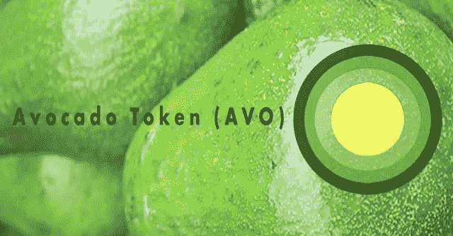

# 鳄梨网络令牌水龙头

> 原文：<https://medium.com/coinmonks/avocado-network-token-faucet-94973204d288?source=collection_archive---------5----------------------->



Avocado Network

我最近为[鳄梨网](https://github.com/AvocadoNetwork/governance)和他们的 [AVO](https://etherscan.io/address/0xfa6f7881e52fdf912c4a285d78a3141b089ce859#code) 令牌做了一个 [erc20](https://github.com/OpenZeppelin/openzeppelin-solidity/tree/master/contracts/token/ERC20) 令牌水龙头。这个想法是有一个令牌水龙头，允许用户请求 AVO 令牌，并在请求成功后设置一个时间锁。要求如下:

*   捐赠者可以向智能合同发送 AVO
*   用户可以调用这些方法中的任何一种:
    get1000Avo() —要成功，该用户的最后一次调用必须至少在 1 小时之前
    get2000Avo() —要成功，该用户的最后一次调用必须至少在 2 小时之前
    get5000Avo() —要成功，该用户的最后一次调用必须至少在 5 小时之前

让我们看看我们是如何将这些需求实现到一个全功能的智能契约中的。

对于不耐烦的人来说，这里是包含所有代码的回购协议。

# 水龙头合同

这些要求意味着两件事:

*   水龙头应该有一个主人，能够打开/关闭水龙头
*   水龙头应该接受 ERC20 基本令牌

首先，该合同从 [Open Zeppelin](https://github.com/OpenZeppelin/openzeppelin-solidity.) 继承了这两个合同: [Ownable.sol、](https://github.com/OpenZeppelin/openzeppelin-solidity/blob/master/contracts/ownership/Ownable.sol)和 [ERC20Basic.sol](https://github.com/OpenZeppelin/openzeppelin-solidity/blob/master/contracts/token/ERC20/ERC20Basic.sol) 。

```
import “./token/ERC20Basic.sol”;
import “./ownership/Ownable.sol”;
```

很好，现在我们可以很容易地使用这两个合同中的方法来构建我们的水龙头，但首先让我们设置一些存储以供以后使用:

```
 string public faucetName;
 ERC20Basic public tokenInstance;
 bool public faucetStatus;
 mapping(address => uint256) status;
```

非常简单，我们有一个水龙头实例的名称、一个 ERC20 基本令牌的实例、水龙头的状态，以及一个请求地址及其时间锁状态的映射。

很好，让我们看看构造函数:

```
constructor(address _tokenInstance, string _faucetName)
 public
 {
    tokenInstance = ERC20Basic(_tokenInstance);
    faucetName = _faucetName;
    faucetStatus = true; emit FaucetOn(faucetStatus);
 }
```

构造函数接受两个参数:已经部署的令牌实例的地址和水龙头的名称。然后，它使用该地址设置一个 ERC20Basic 令牌的实例，设置水龙头名称，打开水龙头并发出一个 nice 事件。

现在我们需要设置一些常量:

```
 uint256 constant oneKToken = 1000000000000000000000;
 uint256 constant twoKToken = 2000000000000000000000;
 uint256 constant fiveKToken = 5000000000000000000000;
 uint256 constant oneHours = 1 hours;
 uint256 constant twoHours = 2 hours;
 uint256 constant fiveHours = 5 hours;
```

Solidity 提供了[时间](http://solidity.readthedocs.io/en/v0.4.24/units-and-global-variables.html?highlight=time)的单位，我们可以很容易地使用它来设置每种方法的时间锁定周期。我们还设置了每个函数要分配的令牌数量。

让我们看看水龙头的功能实际上是如何工作的；每个功能将遵循相同的逻辑:

*   通过访问状态图检查发送者的时间锁定状态
*   如果状态为锁定，则恢复
*   如果状态未锁定，则向发送者发送其令牌并更新其状态
*   最后发射一个事件让世界知道刚刚发生了什么

一般流程如下:

```
function drip1000Token()
 public
 faucetOn()
 {
     if(checkStatus(msg.sender)) {
         revert();
     }
     tokenInstance.transfer(msg.sender, oneKToken);
     updateStatus(msg.sender, oneHours); emit OneKTokenSent(msg.sender);
 }
```

该函数首先检查水龙头是否打开，然后我们检查发送者的时间锁定状态:

```
function checkStatus(address _address)
 internal
 view
 returns (bool)
 {
     //check if first time address is requesting
     if(status[_address] == 0) {
         return false;
     }
     //if not first time check the timeLock
     else {
          // solium-disable-next-line security/no-block-members
          if(block.timestamp >= status[_address]) {
              return false;
          }
          else {
              return true;
          }
     }
 }
```

注意这个函数有内部修饰符。首先，我们检查发送者是否是第一次请求，如果是，酷，让他们有他们的令牌。否则，我们通过将其与当前块时间戳进行比较来检查其时间锁的状态。如果数据块时间戳小于其当前锁定时间，这意味着该时间段尚未过去，您不能拥有令牌，否则您可以开始使用，我们会向您发送令牌，然后更新您的状态:

```
function updateStatus(address _address, uint256 _timelock)
 internal
 { // solium-disable-next-line security/no-block-members
     status[_address] = block.timestamp + _timelock;
 }
```

这仅仅意味着将您的时间锁设置为当前块时间戳加上所需的等待时间，在本例中为 1 小时。

以下是完整的合同代码:

Faucet.sol

很好，是时候写一些测试了。

# 测试水龙头

当然，我们使用[松露](http://truffleframework.com/)进行开发，所以我们有一个很好的测试套件。让我们来看一个检查 `drip1000Token()` 函数的测试:

Faucet_1000Token.test.js

首先我们得到需要测试的工件，然后我们从 [Open Zeppelin](https://github.com/OpenZeppelin/openzeppelin-solidity/tree/master/test/helpers) 中挑选一些好帮手。我们确保在测试之前在`beforeEach`块中部署契约。

对于实际测试，首先我们向合同发送一些 AVO 令牌:

```
//Donor sends AVO to faucet await AVO.transfer(faucet.address, amount, { from: accounts[1] }) faucet_balance = await AVO.balanceOf.call(faucet.address, { from: accounts[0] }) assert.equal(faucet_balance.toNumber(), amount)
```

然后我们有一个地址要求 1000 个 AVO 令牌:

```
//Sends 1000 AVO to requesting address
 confirm = await faucet.drip1000Token({from: accounts[0]})
 faucet_balance = await AVO.balanceOf.call(faucet.address, { from: accounts[0] })
 assert.equal(faucet_balance.toNumber(), amount — drip)
 sender_balance = await AVO.balanceOf.call(accounts[0], { from: accounts[0] })
 assert.equal(sender_balance.toNumber(), drip)
```

该发件人可以再次请求吗？不是:

```
//check previous sender is now locked from requesting again
 await assertRevert(faucet.drip1000Token({from: accounts[0]}))
```

现在让我们向前移动 1 小时，看看发送者是否可以获得更多令牌:

```
//advancing 1 hour in time
 const unlockTime = latestTime() + duration.hours(1)
 await increaseTimeTo(unlockTime)
```

给我更多的 AVO！

```
//previous sender can now request again
 confirm = await faucet.drip1000Token({from: accounts[0]})
 faucet_balance = await AVO.balanceOf.call(faucet.address, { from: accounts[0] })
 assert.equal(faucet_balance.toNumber(), 0)
 sender_balance = await AVO.balanceOf.call(accounts[0], { from: accounts[0] })
 assert.equal(sender_balance.toNumber(), 2*drip)
```

我们可以走了！

前往水龙头回购获得[完整的测试套件](https://github.com/AvocadoNetwork/smart-contract-faucet/tree/master/test)。

# 释放；排放；发布

水龙头发布为 [v2.0.0](https://github.com/NFhbar/smart-contract-faucet/releases) ，你可以在 [ethpm](https://www.ethpm.com/registry/packages/48) 上获得，或者简单地分叉/克隆[回购](https://github.com/AvocadoNetwork/smart-contract-faucet)。

就是这样！如果你更愿意在 [Remix](http://remix.ethereum.org/) 中处理这个合同，我设置了一个[要点](https://gist.github.com/NFhbar/e2112d0d909881e5c82b2c3d6a1c5e75)供你使用。

向 [Avocado Network](https://github.com/AvocadoNetwork) 、 [Peter Evans](https://github.com/peter-evans) 和 [agro1986](https://github.com/agro1986) 大声呼喊，感谢他们的重要贡献和评论。

非常感谢你阅读这篇文章！如果你觉得这篇文章很有用**，请点击这篇文章，并确保关注我的更多常规内容**，也请查看我的 [Github](https://github.com/NFhbar) ，因为我定期发布示例代码和项目。如果你有任何问题，欢迎在下面回复或者给我发邮件。

玩得开心！