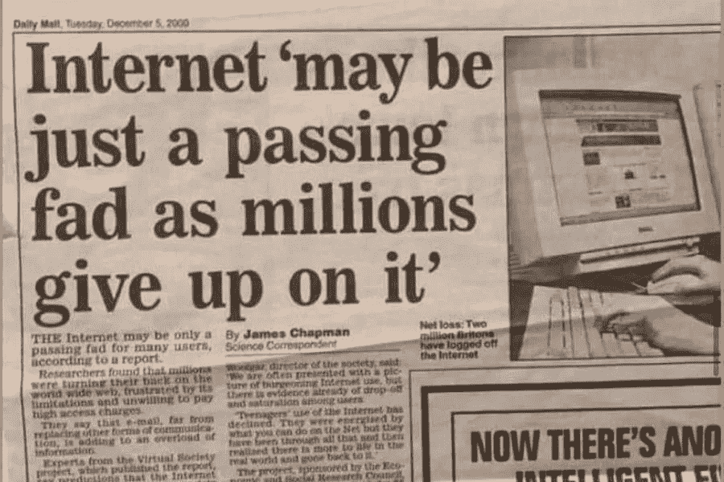

# 避免这 3 种常见的加密骗局

> 原文：<https://medium.com/coinmonks/avoid-these-3-common-crypto-scams-e926a3cdfcb?source=collection_archive---------5----------------------->

## 去年价值 19 亿美元的密码被盗

加密货币和 NFTs 就像 1995 年的互联网。

大多数人都听过人们谈论比特币或 NFTs。大多数人不明白它是如何工作的。很多人认为这是个骗局。还有一小部分人赚了很多钱。

Image from [Upworthy](https://www.upworthy.com/1990s-predictions-about-the-internet)