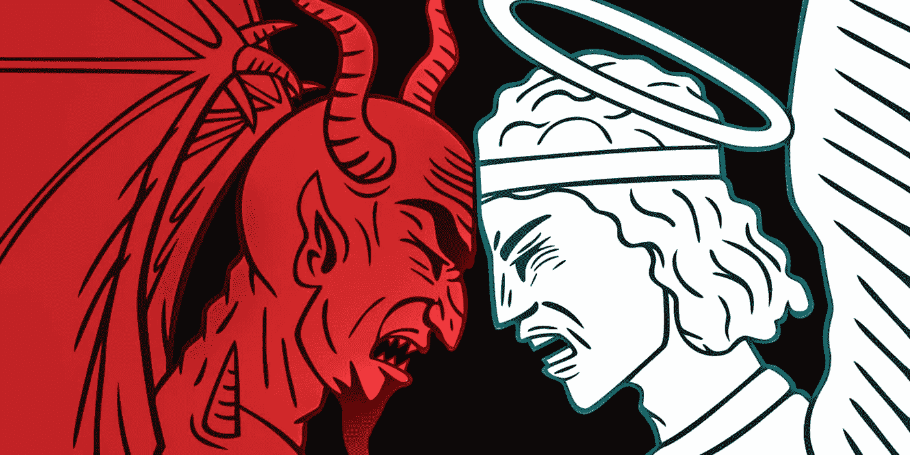
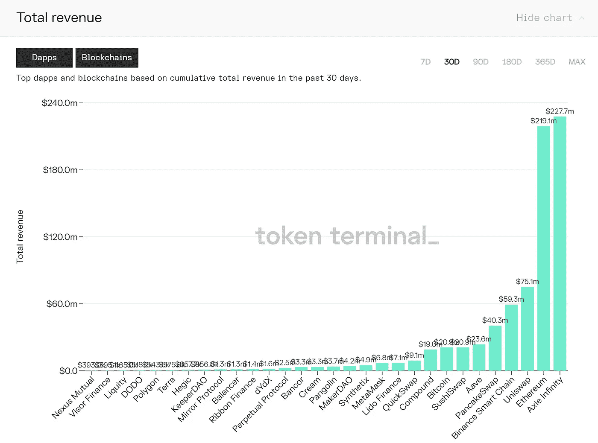
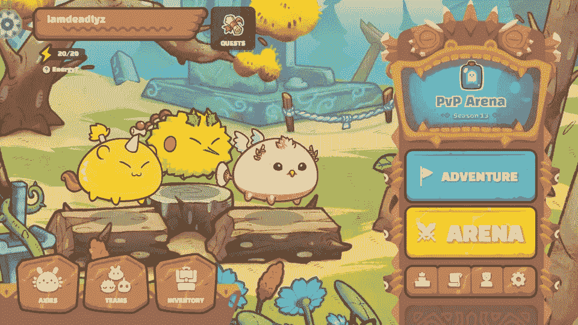
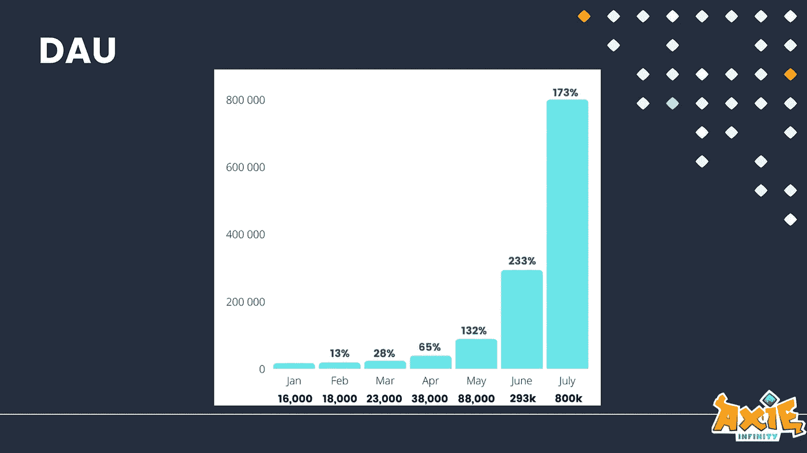
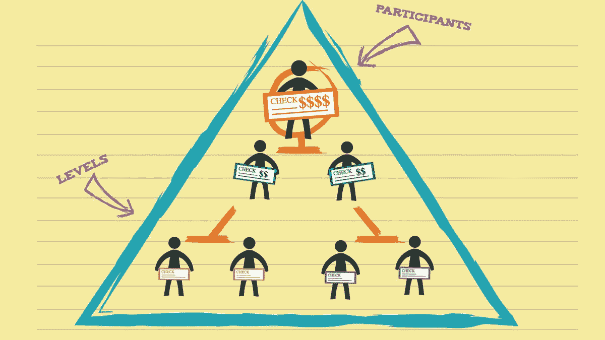
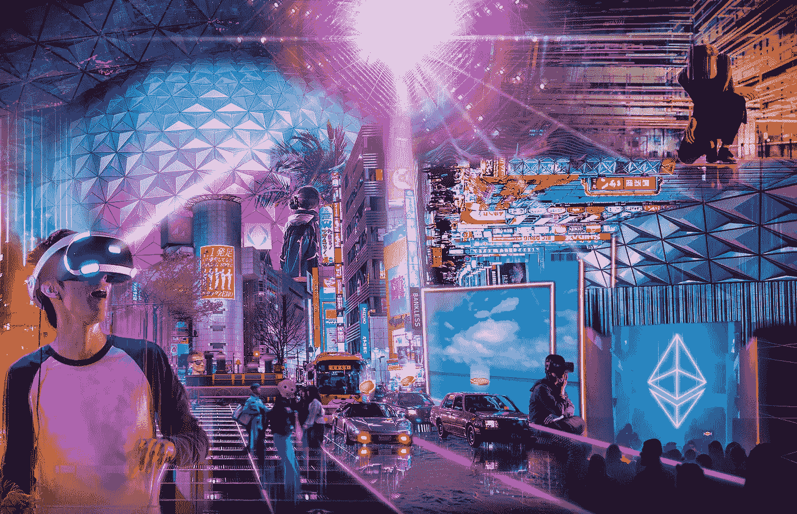

# axie Infinity——目前最大的庞氏骗局？

> 原文：<https://medium.com/coinmonks/axie-infinity-a-developing-worlds-messiah-or-the-biggest-ponzi-scheme-in-crypto-right-now-564ecfb62054?source=collection_archive---------0----------------------->

Review: Axie Infinity play to earn crypto game — Is it a scam or a legit opportunity to make easy money on the blockchain? One can’t help but ask; review below.

在过去的几个月里，Axie Infinity 一直是秘密世界内外的头条新闻。对于那些一直生活在岩石下的人来说——这是一款区块链驱动的在线社交游戏，玩家与可爱的小怪物 Axies 战斗，获得一个名为 Smooth Love trophy(SLP)的令牌，可以出售现金或用于繁殖更多 Axies，也可以出售。该游戏巧妙地结合了口袋妖怪、Cryptokitties，甚至分散土地(你可以购买土地)的功能。

数字看起来不错。仅在 7 月份，其治理令牌的市值就增长了 10 倍，使其跻身前 50 名，仅落后 MakerDAO 几个名次，其稀释后的估值为 110 亿美元。凭借 [80 万日活跃用户](https://axie.substack.com/)，其基于过去 30 天的年化收入为 12 亿——与 Candy Crush 相同。

Currently higher total revenues than Ethereum or almost all of DeFi combined 😵

当谈到设计游戏性和它的轴的图像时，开发者肯定做对了一些事情，但是到目前为止，对它的病毒式传播最大的贡献因素是它的经济性。玩家被高度激励继续玩 Axie，因为以目前的速度，他们可以从全职玩 Axie】每月赚到[1.000 美元。这在像菲律宾这样的发展中国家很有吸引力，在那里这代表着不错的生活工资。目前](https://www.benzinga.com/markets/cryptocurrency/21/07/22183270/axie-infinity-the-game-where-you-can-earn-1-000-a-month-in-ethereum)[超过 40%的 Axie 玩家](https://playercounter.com/axie-infinity/)在这个国家。

主流媒体已经接受了这种说法，称这一概念为“游戏赚钱”( play-to-earn )( T7 ),有望在“元宇宙”创造数百万个新工作岗位，并为发展中国家数百万通常“没有银行账户”的人带来经济权力，这些国家的劳动力市场和政府往往无法为他们提供摆脱贫困的途径。现在甚至有人在 Axie 的基础上建立了自己的全部业务——培育 Axie 并将其借给希望加入的新玩家。最大的此类项目 [(YGG)](https://www.coingecko.com/en/coins/yield-guild-games) 现在有了一个标志，它刚刚达到了 20 亿美元的全面摊薄估值。

加密影响者也对 Axie 赞不绝口，就我所见，它已经出现在每一个著名的加密播客上，并得到了不加批判的热情支持。我明白了。这看起来像是 cryptoverse 一直在等待的重大突破之一——一种在当前的编码员、复杂的交易和投机者的加密社区之外具有潜在巨大吸引力的产品——有望通过一个有趣的界面让 10 亿新用户加入加密。有什么不爱？

Axies in the flesh. Aren’t they cute?

-

**让我们看看引擎盖下的**

*不可否认，这是一个很棒的故事，有很多令人感觉良好的因素和亮眼的数字，每个有自尊的风投都会不惜一切代价投资。然而，对于每一个大繁荣周期的叙述，人们都必须保持谨慎，并仔细审视这一增长引擎是如何得到推动的，以及它的可持续性如何。让我们从一个玩家的角度来看这些数字。*

*[目前购买 3 个轴](https://marketplace.axieinfinity.com/axie)大约需要 1000 美元——这是开始游戏的必要条件。当然，这个游戏很有趣，但这与当今任何人为任何类型的在线游戏所支付的费用相去甚远。Cryptokitties 起价 5 美元，堡垒之夜不收你任何费用，目的是让尽可能多的人开始玩，试图在以后向你追加销售付费的游戏内物品。这是一个很常见的模型。 [CandyCrush 每个用户月收入约为 0.36 美元](https://www.businessofapps.com/data/candy-crush-statistics/)；更加复杂的多平台游戏[堡垒之夜做得更好，基于其 3.5 亿的月活跃用户群，每个用户每月 1.42 美元。](https://www.businessofapps.com/data/fortnite-statistics/)*

*那么 Axie 比所有其他游戏的体验好 500 倍，这意味着人们会预先支付 1000 美元，只是为了享受它吗？当然不是。尤其是绝大多数位于发展中国家的那些参与者。玩家加入并支付这么多钱仅仅是因为他们认为这是一个创收的机会。就目前而言，的确如此。然而，要问的问题是——这些钱从哪里来？*

**

*The currently exponential growth of Axie’s Daily Active User base*

*-*

***游戏经济如何运作***

*对于每一种具有经济价值的产品或服务，都需要有买家和卖家。卖家通过投入他们的资源(时间、金钱、材料等)来创造或分发产品来赚钱，而买家则付费从卖家那里购买、许可或租赁产品。净净，卖家从产品中赚钱，买家付钱从产品中获益。买方支付的总金额必须等于卖方的总收入。*

*就 Axie 而言，如上所述，目前似乎每个人都希望成为一名卖家——通过投入时间玩、赚、卖 SLP 和繁殖 Axie 来赚钱。换句话说，每个人都希望带走比他们投入的更多的钱。这就是他们支付 1000 美元价格的原因。*

*就目前而言，这是可行的，因为每个月加入的[新玩家的数量大于当前玩家的数量](https://axie.substack.com/)，这意味着人们可以在不到 2 个月的时间内将他们的钱从[收回。使用上面的术语，每个月新加入者是净购买者，支付先前加入者的利润。大约两个月后，当他们赚回最初的投资时，他们就变成了净卖家。就这样继续下去。注意到和金字塔计划的相似之处了吗？](https://www.youtube.com/watch?v=quVvhBvnGto&feature=youtu.be&ab_channel=Solthos)*

*一个[传销](https://coinmarketcap.com/alexandria/article/5-of-the-biggest-crypto-ponzi-schemes)的定义是，只要有更多层以正确的速度进入，每一层都赚钱。每个传销听起来都很棒，表面上看起来与合法的高增长业务没有什么区别，只要它持续下去。但是每一个金字塔计划最终都达到饱和，当新的层次无法通过招募更多的层次来盈利时，整个计划就会崩溃。*

*就目前的情况来看，这种命运对阿西来说是不可避免的。很难预测崩溃将在何时发生，因为加密和迷因股票泡沫已被证明能够持续比预期更长的时间，但尽管如此，它只能接触到这么多的日常玩家，除非世界上所有的人都放弃我们目前正在做的事情，并在大约 13 个月的时间内开始全职玩 Axie。对我来说似乎不太可能，尽管这可能是能想象到的最具讽刺意味的世界末日场景之一。*

*相比之下，美国能够全职谋生的职业运动员人数目前约为 11.800 人，约占总人口的 0.0036%。职业游戏玩家的数量更少，[大约 8000](https://cyberathletiks.com/how-many-gamers-are-there-in-the-world/#:~:text=With%20around%208000%20professional%20players,professional%20gamers%20in%20the%20world.)。在供养能力较弱的发展中国家，人口比例会更低。幸运的是，即使是 Axie 的创造者也明白这一点，并把*可持续发展*作为他们‘白皮书’的重点之一。我花时间读了它，发现它基本上没有内容。因此，让我用人类的语言为你总结和分类这些选择。*

**

*Each pyramid scheme follows the same blueprint.*

*-*

***前进的道路***

*只有两种情况:*

*A.)如果这个游戏仍然是一个自给自足的零和经济，那么购买者必须总是玩家自己。也就是说，有相同数量的玩家认为这是“玩即赚”，也有相同数量的玩家认为这是“玩即付”。一旦金字塔倒塌，最近两个月加入的玩家成为支付者，这种情况就会不由自主地发生。*

*实际上，分配情况会更糟——一小部分人会获得可观的利润，而更多的人会遭受损失，因为他们会将收入再投资到游戏中。大多数泡沫都会出现这种情况，这似乎最有可能成为 Axie 目前的发展方向。*

*-*

*B.)Axie 的唯一希望是，它不再成为一个自给自足的循环经济，而是从游戏之外获得收入，用来自其他人的钱补贴玩家，这些人本身不是逐利的玩家，而是自愿拿出他们的钱，以支付游戏内部的一些东西，而不期望获得利润。*

*这可以是一个免费的玩家阶层，他们加入游戏而不需要购买 axies，并最终购买游戏中的物品来增强他们的体验，就像堡垒之夜内部的人们所做的那样。可能是一群公司在游戏中向玩家宣传他们的产品。它可以是政府或非盈利性的捐赠和资助，旨在让发展中国家进入加密领域。所有这些例子都摘自 Axie 白皮书[的“长期可持续发展”一节](https://whitepaper.axieinfinity.com/gameplay/axie-population-and-long-term-sustainability)。*

*让我们再一次看看这里的数字。为了保持目前的收入足够高，让人们玩赚取全职，广告收入将需要 1.000 美元/玩家/月。这仍然是现实值的至少 1.000 倍。为了让一个非收入阶层的玩家来补贴收入阶层，收入者与非收入者的比例至少需要达到 1:700，假设非收入者愿意平均每月支付 1.40 美元，与堡垒之夜一致。假设非营利组织会找到资金并愿意资助数百万人全职玩密码游戏是可笑的。*

*因此，游戏确实可以变得可持续，但前提是赚钱玩家的数量减少到总玩家数量的 1/700，这仍将比任何其他在线游戏中赚取收入的职业玩家的比例高出数倍。但或许有可能，如果大部分收入流向玩家，而不是公司。这种转变看起来并不美好，这将意味着许多人无法收回投资，并遭受损失。不要误解我，我希望看到数百万菲律宾人通过加密找到经济自由，但是——一如既往——如果一些事情看起来好得不像真的，它通常是真的。*

*-*

***总之***

*关于社会破坏的事情是这样的——只要它成功地将资源(如计算能力或人力)投入到社会重视和经济回报的事物中，它就是可持续的。利用电力保障支付安全区块链无缝结算价值数十亿美元的交易就是一个很好的例子。创造新类型的在线工作，如为区块链项目开发人员，甚至为发达国家的公司提供增值服务，是另一个可行且可持续的好例子。*

*将大量的人力资源作为一种经济活动引入游戏本身是不可持续的，除非产生的价值以某种方式转化为游戏之外的*现实世界*，就像上面的例子一样。当然，也许有一天[的元宇宙](https://www.theverge.com/22588022/mark-zuckerberg-facebook-ceo-metaverse-interview)会进化到比今天的“真实世界”有更高的 GDP 但肯定不会在接下来的几个月里成为现实，这是这个游戏为了维持自身而需要实现的。*

*因此——让我们继续探索大胆的工作、娱乐和金钱的新模式，但也让我们始终保持谨慎，不要陷入泡沫而引火烧身。如果你读了我的其他文章，你会发现我是一个非常支持加密的人，但即使是我，也已经艰难地学会了区分炒作和价值的重要性，以及在一个周期的正确时间投入时间和金钱。在我看来——Axie 目前是 crypto 中价格膨胀和概念上被过度炒作的资产之一，你可以选择随大流，或者反对它。我知道我会做什么。*

**

*A Ready Player One type metaverse, waiting to be unleashed upon us.*

*如果你喜欢这篇关于 Axie Infinity 的评论——它是骗局、传销还是合法游戏——➡️[在推特上找到我](https://twitter.com/m_goes_distance)🐦。请随意跟我来或者鼓掌，像这样-*

**

> *加入 Coinmonks [电报频道](https://t.me/coincodecap)和 [Youtube 频道](https://www.youtube.com/c/coinmonks/videos)获取每日[加密新闻](http://coincodecap.com/)*

## *另外，阅读*

*   *[复制交易](/coinmonks/top-10-crypto-copy-trading-platforms-for-beginners-d0c37c7d698c) | [加密税务软件](/coinmonks/crypto-tax-software-ed4b4810e338)*
*   *[网格交易](https://coincodecap.com/grid-trading) | [加密硬件钱包](/coinmonks/the-best-cryptocurrency-hardware-wallets-of-2020-e28b1c124069)*
*   *[最佳加密交易所](/coinmonks/crypto-exchange-dd2f9d6f3769) | [印度最佳加密交易所](/coinmonks/bitcoin-exchange-in-india-7f1fe79715c9)*
*   *开发人员的最佳加密 API*
*   *[密码电报信号](http://Top 4 Telegram Channels for Crypto Traders) | [密码交易机器人](/coinmonks/crypto-trading-bot-c2ffce8acb2a)*
*   *最佳[密码借贷平台](/coinmonks/top-5-crypto-lending-platforms-in-2020-that-you-need-to-know-a1b675cec3fa)*
*   *杠杆代币的终极指南*
*   *[最适合加密交易的 VPN](https://coincodecap.com/best-vpns-for-crypto-trading)*
*   *[火币的加密交易信号](https://coincodecap.com/huobi-crypto-trading-signals) | [HitBTC 审核](/coinmonks/hitbtc-review-c5143c5d53c2)*
*   *[TraderWagon 回顾](https://coincodecap.com/traderwagon-review) | [北海巨妖 vs 双子星 vs BitYard](https://coincodecap.com/kraken-vs-gemini-vs-bityard)*
*   *[如何在 FTX 交易所交易期货](https://coincodecap.com/ftx-futures-trading)*
*   *[OKEx vs KuCoin](https://coincodecap.com/okex-kucoin) | [摄氏替代品](https://coincodecap.com/celsius-alternatives) | [如何购买 VeChain](https://coincodecap.com/buy-vechain)*
*   *[3 commas vs . Pionex vs . crypto hopper](https://coincodecap.com/3commas-vs-pionex-vs-cryptohopper)*
*   *[如何使用 Cornix 交易机器人](https://coincodecap.com/cornix-trading-bot)*
*   *[Bitget 评论](https://coincodecap.com/bitget-review) | [双子星 vs BlockFi](https://coincodecap.com/gemini-vs-blockfi) cmd| [OKEx 期货交易](https://coincodecap.com/okex-futures-trading)*
*   *[用信用卡购买密码的 10 个最佳地点](https://coincodecap.com/buy-crypto-with-credit-card)*