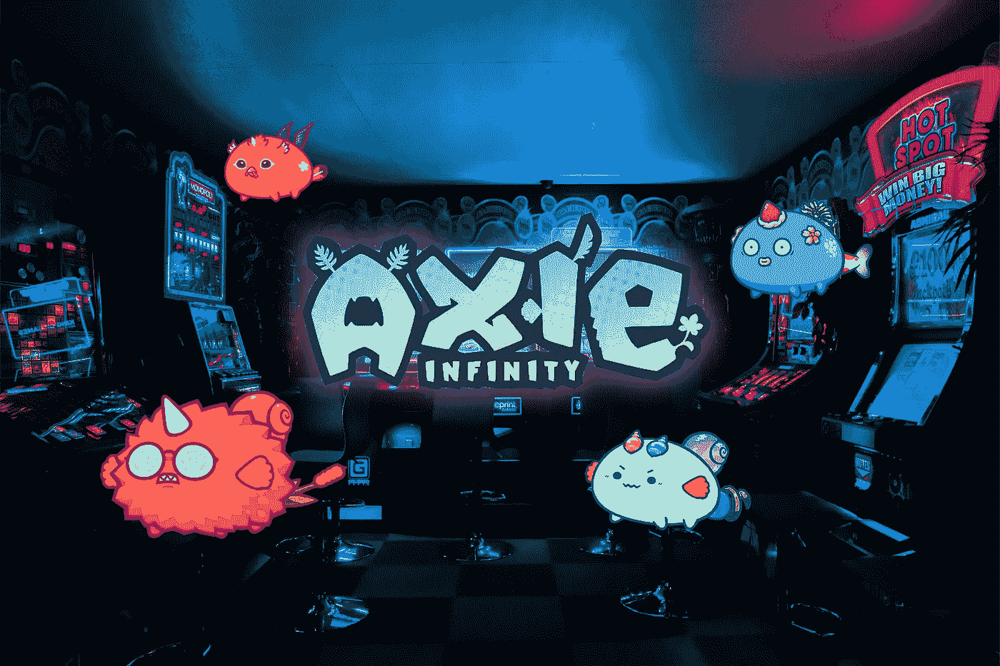

# Axie Infinity:游戏 NFT 革命或庞氏骗局？

> 原文：<https://medium.com/coinmonks/axie-infinity-gaming-nft-revolution-or-ponzi-scheme-3d81b1647429?source=collection_archive---------0----------------------->

Jeff Zirlin 运营着有史以来最大的 NFT 项目。他的区块链游戏 [Axie Infinity 拥有 100 万用户和 21 亿美元的收入](https://fortune.com/nfty-50/2021/jeff-zirlin/)——**仅购买玩**所需的怪物就要花费大约 1000 美元。

Axie Infinity — Photo by [Carl Raw](https://unsplash.com/@carltraw?utm_source=unsplash&utm_medium=referral&utm_content=creditCopyText) on [Unsplash](https://unsplash.com/?utm_source=unsplash&utm_medium=referral&utm_content=creditCopyText), edited by the author

最近，网络游戏 Axie Infinity 已经成为世界上最有价值的 NFT 收藏。主要是因为用户可以通过游戏赚钱。这个**是不是一个** …