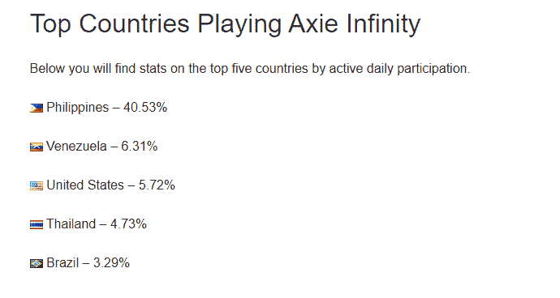
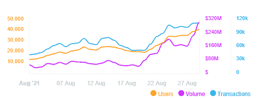

# axie Infinity:NFTs 如何定义游戏赚钱经济

> 原文：<https://medium.com/coinmonks/axie-infinity-how-nfts-defined-the-play-to-earn-economy-c5733a4b11bf?source=collection_archive---------6----------------------->

## NFT 为人们在娱乐的同时谋生铺平了道路

Photo by [Axie Infinity Facebook Group](https://www.facebook.com/AxieInfinity) on Facebook

注:*这个故事在档案里丢了，最近才被挖出来。*

*欢迎来到新经济时代，在这里赚钱从未如此令人愉快——呆在家里，做自己的老板，养几只叫做“Axies”的可爱小动物帮你赚钱。*

*如果你在 90 年代末度过了大部分童年时光，你可能会记得这款在任天堂 64 游戏机和 Gameboy 游戏机上玩的游戏，在这款游戏中，你从三个怪物中选出一个；参加比赛并最终获胜。还记得神奇宝贝吗？神奇宝贝在北美市场上市后，在整个 20 世纪 90 年代和 21 世纪初取得了惊人的成功。*

但是，神奇宝贝游戏并不仅仅在游戏机上结束。

*2016 年，一款新的神奇宝贝游戏在移动端推出，‘神奇宝贝 Go’。游戏的目标是寻找、战斗和捕捉尽可能多的神奇宝贝并与之战斗。这款游戏在发布后的六个月内就引起了轰动，每月吸引超过 2 亿用户，在第一个月就获得超过*[*2.06 亿美元的收入*](https://www.businessofapps.com/data/pokemon-go-statistics/) *。然而，这个游戏并没有让任何人变得富有或者能够赚钱谋生。它只是让游戏的开发者变得富有。这款游戏并不是建立在以太坊区块链之上，也没有智能合约。*

***阿希无穷已经进入房间***

类似于任天堂 64 和 Gameboy 上的原始神奇宝贝游戏，Axie Infinity 是一款人们拥有自己的名为“Axies”的生物并与其他玩家战斗的游戏。除此之外，axes 的主人还可以定制和升级他们可爱的 axes，这款新的区块链支持的游戏于 2018 年开始，最近由于其令牌([*【AXS*](https://www.coingecko.com/en/coins/axie-infinity)*)的疯狂价格飙升至 70 美元，在撰写本文时已经起飞。越来越多的人开始登上这个平台来玩赚钱游戏。*

# 围绕 Axie Infinity 的炒作

Axie Infinity 不同于市场上的任何其他在线游戏。Sky Mavis-Axie Infinity 是一款基于 NFT 的加密货币游戏，开发自一家越南游戏工作室，玩家在完成与另一名玩家的战斗后，可以获得 [SLP](https://www.coingecko.com/en/coins/smooth-love-potion) 代币。这些代币可以用来繁殖 Axies，在游戏市场上使用，并转换成菲亚特在现实世界中消费。

围绕 Axie Infinity 的炒作不仅仅是在虚拟游戏中赚钱和玩游戏的兴奋和快乐。然而，游戏中的角色也在玩家内部释放了很多情绪。它们很可爱，将来会很值钱。此刻

当疫情在 2019 年袭击并在 2020 年恶化时，许多人失业并努力跟上日常开支。受打击最大的显然是发展中国家。然而，这些国家的社区意识到还有其他赚钱的方式，并依靠玩游戏和加密货币为生。Axie Infinity 是这方面的先锋。菲律宾以压倒性优势创下了 T4 玩家人数最多的记录，委内瑞拉位居第二。

谁知道呢，如此可爱的动物能让玩家为它们带来一些收入。

Source: Axie Infinity Live Player Count via [playercounter.com](https://playercounter.com/axie-infinity/)

Axie Infinity 的日活跃玩家从 4 月份的 [3 万增长到今年 8 月份的 100 万](https://fortune.com/2021/08/25/crypto-video-game-axie-infinity-crypto-traders-unemployed/)，大约增长了 3200%(那些都是难以置信的数字)。当然，Pokémon Go 完全让 Axie Infinity 的玩家数字相形见绌。然而，请记住，在 Pokémon Go 发布的时候，它可以在 IOS 和 Android 手机上下载，并且可以通过简单的步骤开始使用 UX/UI。

当失业在菲律宾和委内瑞拉等发展中国家造成损失时，Axie Infinity 游戏风靡全球。人们失去了工作，无法有可持续的收入来源来养家糊口。Axie Infinity 来得正是时候，因为全球疫情在许多国家肆虐，影响了数百万人。这种两极分化的游戏在几个月的时间里，从 NFT 疯狂的个人赚钱取乐，到帮助失业的个人在危机时期养活家人。虽然，天空 Mavis 的意图本质上不是“帮助失业者”，但游戏的精神实质上使人们能够找到谋生的机会。著名作家、励志演说家金克拉曾经说过:

> “停止销售，开始帮助”

更不用说，Axie Infinity 是一款基于 NFT 区块链的在线游戏，而且只能在桌面上使用；对于一个普通的 Joe 来说，开始玩这个游戏有很多障碍。目前，区块链和加密货币领域正面临这些挑战，以获得主流采用，因为该领域的可访问性。因此，Pokémon Go 和 Axie Infinity 之间的玩家数量不应成为区分这两款游戏的关键标志。

# 展望 NFTs 和即玩即赚的未来

在过去的一年中，NFTs 占据了中心位置。作为 NFT 最大的市场，OpenSea 自 2017 年推出以来已经记录了[40.1 亿美元的总销售额，上个月为 30.5 亿美元。大部分交易量来自 Axie Infinity、CryptoPunks 和 Art Blocks，它们的销售额在过去一个月中飙升，仅略高于 20 亿美元。](https://dappradar.com/ethereum/marketplaces/opensea)

Source: OpenSea 30 Day Sales Volume via [DappRadar.com](https://dappradar.com/ethereum/marketplaces/opensea)

那么，NFTs 会成为未来的事物吗？

不可替代的代币将成为未来的一大部分，这不仅仅局限于游戏和艺术行业。预计时尚、体育和娱乐行业的需求将呈指数级增长(但今天我们将讨论游戏)。游戏目前是一个[在 2020 年价值 1750 亿美元的产业](https://newzoo.com/insights/articles/global-games-market-to-generate-175-8-billion-in-2021-despite-a-slight-decline-the-market-is-on-track-to-surpass-200-billion-in-2023/)，预计在未来 6 年内将是这个数字的三倍。行业体量庞大，未来增速较大。

我们已经看到了如何将 NFTs 集成到游戏中。这种协同作用使玩家能够做的不仅仅是获得游戏内的奖励，而不能离线去获得现实世界中的奖励。Axie Infinity 等游戏成为第一个达到 10 亿美元的 NFT 项目，成为头条新闻。游戏工作室正在关注这个非功能性游戏和游戏可以共存的领域。

# 最后的想法

Axie Infinity 重塑了游戏玩家在虚拟世界中的收入方式。玩家现在可以通过玩游戏(当然，锦标赛除外)来套现和谋生，而不是赚取游戏内奖励并只能在游戏内使用这些奖励。NFT 的空间正在扩大，这种新的资产类别总会有需求。NFT 将成为未来组织的一部分。

> 加入 Coinmonks [电报频道](https://t.me/coincodecap)和 [Youtube 频道](https://www.youtube.com/c/coinmonks/videos)了解加密交易和投资

## 也阅读

 [## 杠杆代币[多头代币]终极指南

### 杠杆化令牌是具有杠杆化风险敞口的 ERC20 令牌，不考虑保证金、要求、管理…

medium.com](/coinmonks/leveraged-token-3f5257808b22)  [## 最佳加密交易所| 2021 年十大加密货币交易所

### 加密货币交易所的加密交易需要了解市场，这可以帮助你获得利润。之前…

blog.coincodecap.com](https://blog.coincodecap.com/crypto-exchange)  [## 2021 年最佳加密交换平台| CoinCodeCap

### 编辑描述

blog.coincodecap.com](https://blog.coincodecap.com/best-swap-platforms)  [## 2021 年最佳加密借贷平台| 6 大比特币借贷平台

### 获得比特币和其他加密货币的最佳贷款利率

medium.com](/coinmonks/top-5-crypto-lending-platforms-in-2020-that-you-need-to-know-a1b675cec3fa)  [## 2021 年 6 大最佳硬件钱包|顶级加密硬件钱包[更新]

### 最好的加密货币硬件钱包是绝对必要的。我们将在 NGRAVE、Ledger Nano X 和…

medium.com](/coinmonks/the-best-cryptocurrency-hardware-wallets-of-2020-e28b1c124069)  [## 2021 年最佳免费加密交易机器人

### 2021 年币安、比特币基地、库币和其他密码交易所的最佳密码交易机器人。四进制，位间隙…

medium.com](/coinmonks/crypto-trading-bot-c2ffce8acb2a)  [## 最佳 4 个加密交易信号电报通道

### 这是乏味的找到正确的加密交易信号提供商。因此，在本文中，我们将讨论最好的…

medium.com](/coinmonks/best-crypto-signals-telegram-5785cdbc4b2b)  [## 获取信号、交易机器人和套利

### 编辑描述

blog.coincodecap.com](https://blog.coincodecap.com/bitsgap-review)