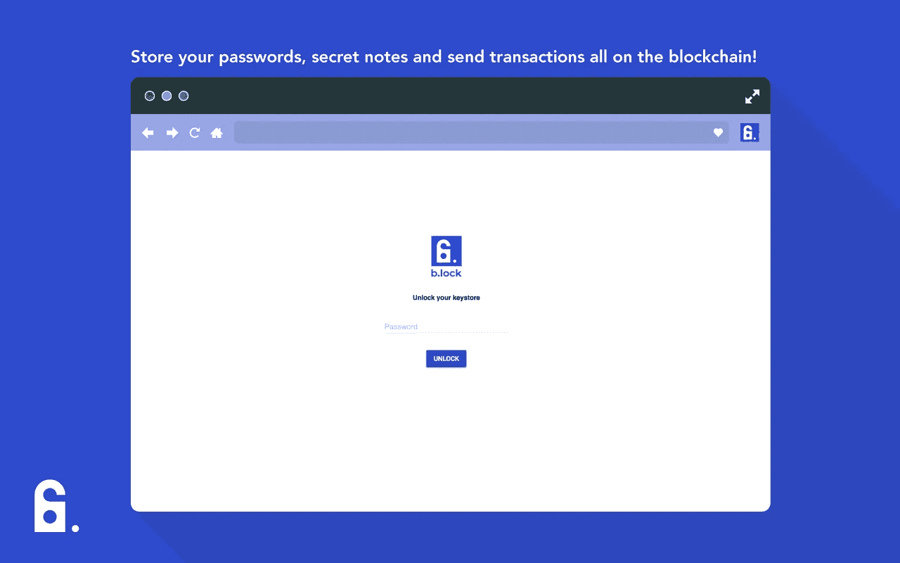
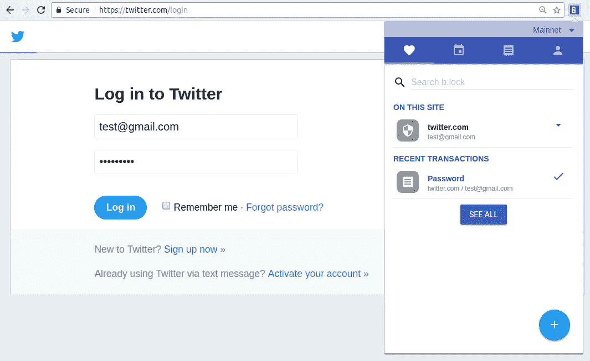

# b.lock:区块链驱动的密码管理器

> 原文：<https://medium.com/coinmonks/b-lock-the-blockchain-powered-password-manager-d7ec94524af9?source=collection_archive---------5----------------------->

## 使用加密和区块链技术，b.lock 是一个 Chrome 扩展，可以帮助你以最安全和不可信的方式管理你的密码。

## 如今，随着我们必须登录的服务越来越多，密码管理器变得比以往任何时候都更加重要。然而，现有的密码管理器存在一些问题:

*   对于由第三方管理的密码管理器服务:您必须信任第三方不会泄露您的普通密码，并使用适当的加密算法来保护您的密码的机密性。除此之外，第三方仍有可能关闭或丢失他们的数据库，而您的密码也可能丢失。
*   对于一个运行在你自己机器上的开源密码管理程序:你确实可以完全控制你的密码。然而，你必须手动备份你的加密密码，以防你的机器损坏或丢失。不保证您的密码可用。

## **考虑到这些问题，我们开发了 b . lock——第一个分散的、区块链驱动的密码管理器，它利用** [**星云区块链**](https://nebulas.io) **来存储用户的加密密码。工作原理很简单:**

*   这是一个开源的 Chrome 扩展，可以让你保存/检索你的密码/秘密笔记。
*   您的帐户已链接到一个 Nebulas 帐户。
*   b.lock 使用 AES-256 加密算法，使用您的 Nebulas 私钥(即主密钥)来加密您的密码和秘密笔记。
*   b.lock 将加密的密码/秘密笔记保存在区块链星云上。
*   因此，只要你有你的私人钥匙，你的密码将随时随地被你访问
*   除了你没有人能解密加密的密码。因此，您可以真正控制您的密码。

**如果你想试试 b.lock，这里有 Chrome 扩展****的 [**链接**](https://chrome.google.com/webstore/detail/block-password-manager/hjbpkcanpblbdfeoogkbpkbjmacakmjn)**

****如果你对 b.lock 如何工作很好奇，** [**查看我们的 Github 库**](https://github.com/BlockProject/b-lock) **。****

**如果您有任何问题或询问，请随时联系我们 b.lock.project.io@gmail.com**