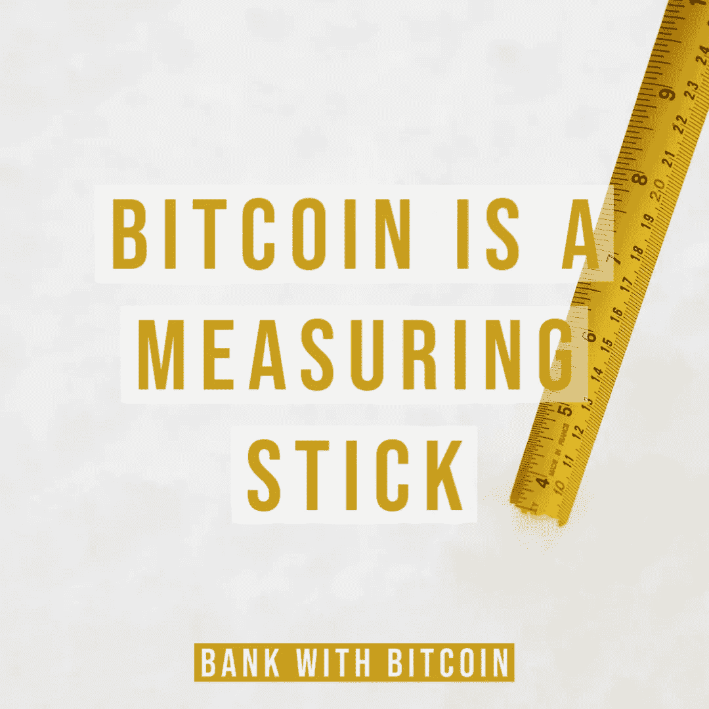
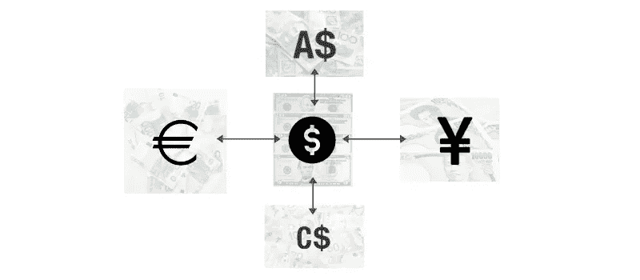
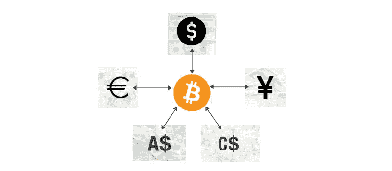

# 比特币是一根测量棒

> 原文：<https://medium.com/coinmonks/baams-bitcoin-as-a-measuring-stick-e88e6a3f17f4?source=collection_archive---------2----------------------->

## 巴姆斯

## 对经济稳定的初步探索。

稳定是人类最难以捉摸和渴望的属性之一。它是完全可预测的事情在未来发生的确定性/保证。

因为它与金融和经济有关，所以在价格/价值中寻求稳定。

当我们挣钱时，我们期望/希望它不会贬值。毕竟，在获得这笔钱的过程中，我们交易了我们最宝贵的资产——时间。我们总是能赚更多的钱，但是我们不能赚更多的时间。

然而，正如历史向我们展示的那样，当涉及到人和财务时，我们似乎很难建立一个稳定的通用价值单位。当我们找不到稳定时，我们创造稳定。

几千年来，黄金一直是世界货币的背景；它已经成为一种人们或多或少觉得存放财富很舒服的物品。人们一直知道黄金是稀缺的，但它一直是一种优秀的价值储存手段。此前，随着世界向高度互联的版本转变，使黄金成为理想资产的相同属性，正成为阻碍黄金作为全球贸易/商业工具传播的相同属性。沉重、庞大、安全成本高且难以分割。尽管黄金能够储存价值，但它不能作为一种计量单位，我们不会用黄金来为我们的汽车/抵押贷款/收入/日常开支定价。

菲亚特来了。我们在黄金中找不到稳定性，所以我们转向纸币。假设是，如果我们有一个负责创造货币的“智能”组织，那么我们将最终实现稳定。最引人注目的也许是美元*(美国东部时间。【1914 年)。1944 年，作为布雷顿森林协定的一部分，美元成为世界储备货币；这意味着世界将以美元来命名其经济活动，美元成为经济活动的隐喻“衡量标准”。因此，如果任何政府需要进行贸易，如日本(日元)→法国(欧元)或加拿大(加元)→澳大利亚(澳元)&介于两者之间，那么转换过程将如下所示:*

这种以美元为锚的体系一直有效，直到它失效。由于权力斗争的全球政治紧张加上荒谬的通货膨胀，美元正在失去其主导地位&世界正在失去其衡量尺度。

人文学科的努力再一次证明了自己是徒劳的；不仅仅是储备资产在贬值，而且每一种已经被创造出来的政府货币要么已经贬值了 90%,要么完全不复存在。

稳定到此为止……对于任何法定货币来说，问题不在于它是否会失灵，而在于它何时失灵。人们会转向什么？

不要害怕，大约在 2009 年，比特币在这里！

比特币被称为很多东西；好的，坏的和有毒的。不管谁对它有什么想法，在引擎盖下，比特币是最任意稳定的技术创新。
不，不是资产/价格；技术。

无论比特币在任何给定时间的市场交易价格如何，我们都可以非常肯定地预测，下一个区块将在大约 10 分钟后出现。我们还知道，下一个区块将被添加到现有的链中&一定数量的比特币将被支付给矿工。

通过最先进的军用级加密标准(SHA-256)和巨大的电能消耗(POW)的放大，比特币不仅仅是一个转移价值的网络；它成为最先进的工具，我们可以用它来标记时间，公开地跟踪社会经济活动的进程。

比特币的稳定性在于其程序的可预测性。

近乎完美的可预测性，即比特币提供了取代美元作为世界储备资产的完美锚。比特币是中立的，因为它不容易受到困扰现有法定系统的政治偏见的影响&贸易可以在对所有世界参与者平等有利的情况下发生。

其固有的渐进线性和分散化抵消了菲亚特系统的潜在交易对手风险。主权政府可以保持主权&创造本地交换媒介的更自然的过程可以发生。

现在看起来似乎很遥远，但有一天，你可能会用比特币为你的下一栋房子定价，告诉你的朋友你救了多少只小智，并根据他们的比特币持有量阅读福布斯富豪榜。

向更高的高度和更好的治理🥂