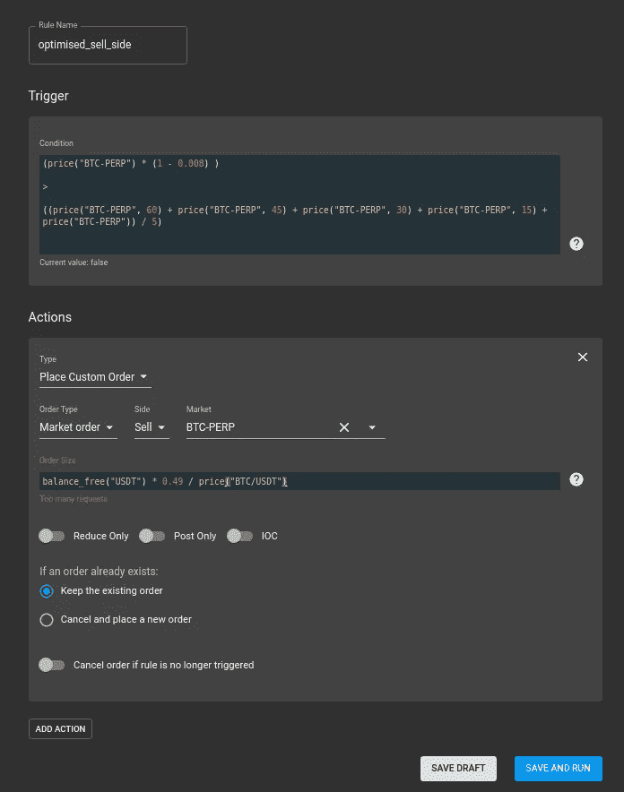

# 回溯测试并在 FTX 部署自动化交易策略

> 原文：<https://medium.com/coinmonks/back-testing-and-deploying-a-automated-trading-strategy-to-ftx-f84073ee1ad6?source=collection_archive---------0----------------------->

我参与 cryptos 已经有一段时间了。作为一个自由主义者，我发现去中心化的概念很吸引人。

作为一名计算机科学的非全日制硕士研究生，我的论文是关于人工智能代理在加密货币市场中的应用。

[FTX 交易所](https://ftx.com/#a=2746848)对我来说是一个新的交易所，然而，一旦我看到它有一个 Quant 区。我不得不参与进来。

更新:我已经进入了比赛的决赛，如果你能在 twitter 上为我的作品投票的话！

更新:谢谢 FTX 和社区

关节第一！:D

Quant zone 允许你定义规则，然后让它们在市场上实时执行。

对我来说，唯一的问题是没有办法对它进行回溯测试。

幸运的是，PyAlgotrade 来救了我。这将允许我们根据市场数据有效地回测我们的策略，看看它们的表现如何。

(这不是纯粹智力挑战的投资建议！)

## **Python 规则设计和优化**

我们的简单规则将包括使用市价单购买 BTC。(这不是一个复杂的策略，但是，它充分说明了这种方法有多么强大)

因为我自己的目标只是收集更多的 BTC，我们不会对交易计数或其他指标进行优化。

> 另外，请阅读我们的 [FTX 密码交易所评论](/coinmonks/ftx-crypto-exchange-review-53664ac1198f)

## **OHLC 聚会**

例如，我们将以 100 万支蜡烛收集 BTC/美元的 OHLCV。我们将直接从 FTX 收集数据，使用奇妙的 CCXT 库；

```
import pandas as pd
import ccxt
import datetimeexchange = ccxt.ftx()def gather_data():
 data = exchange.fetch_ohlcv(“BTC/USD”)
 df = pd.DataFrame(data)
 df.columns = ([“Date Time”, “Open”, “High”, “Low”, “Close”, “Volume”])
 def parse_dates(ts):
 return datetime.datetime.fromtimestamp(ts/1000.0)
 df[“Date Time”] = df[“Date Time”].apply(parse_dates)
 df.to_csv(“sampledata.csv”)def main():
gather_data()if __name__ == “__main__”:
 main()This can be run as so;python3 data_gather.py
```

## **编码策略**

实际上，我们希望以尽可能好的价格购买尽可能多的 BTC。

因此，我们将检查从价格中抵消多少会给我们带来获得更多 BTC 的最佳回报。

幸运的是，Pyalgotrade 为我们处理了很多这样的问题。

所以，我们可以先做这样的事情；

```
 from __future__ import print_functionfrom pyalgotrade import strategy
from pyalgotrade.barfeed import quandlfeed, csvfeed
from pyalgotrade.technical import maclass Accumulator(strategy.BacktestingStrategy):
 def __init__(self, feed, instrument, buy_offset, buy_percent):
 super(Accumulator, self).__init__(feed, 10000)
 self.__position = None
 self.__instrument = instrument
 self.__sma = ma.SMA(feed[instrument].getPriceDataSeries(), 60)
 self.offset = buy_offset
 self.buy_percent = buy_percentdef onEnterOk(self, position):
 execInfo = position.getEntryOrder().getExecutionInfo()
 self.info(“BUY at $%.2f” % (execInfo.getPrice()))def onEnterCanceled(self, position):
 self.__position = Nonedef onExitOk(self, position):
 execInfo = position.getExitOrder().getExecutionInfo()
 self.info(“SELL at $%.2f” % (execInfo.getPrice()))
 self.__position = Nonedef onExitCanceled(self, position):
 # If the exit was canceled, re-submit it.
 self.__position.exitMarket()def onBars(self, bars):
 # Wait for enough bars to be available to calculate a SMA.
 # print(bars)
 bar = bars[self.__instrument]
 # self.info(bar.getClose())
 # self.info(self.__sma[-1])if self.__sma[-1] is None:
 returnbar = bars[self.__instrument]
 # If a position was not opened, check if we should enter a
 # long position.
 shares = (self.getBroker().getCash() / bars[self.__instrument].getPrice())if self.__position is None:
 if (bar.getPrice() * (1 + self.offset) < self.__sma[-1]):
 # Enter a buy market order. The order is good till canceled.
 self.__position = self.enterLong(self.__instrument, shares, True)
 # Check if we have to exit the position.
 elif not self.__position.exitActive():
 if (bar.getPrice() * (1 — self.offset) > self.__sma[-1]):
 # Enter a buy market order. The order is good till canceled.
 self.__position.exitMarket()def getSMA(self):
 return self.__sma
```

## **回溯测试**

现在我们已经有效地编码了我们的策略，是时候看看它是什么样子了；

为了做到这一点，我们将运行这样设置的回溯测试代码；

```
 # python3 strategy.pyfrom pyalgotrade import strategy
from pyalgotrade.bar import Frequency
from pyalgotrade.barfeed import csvfeed
from pyalgotrade.stratanalyzer import returns
from pyalgotrade.stratanalyzer import tradesfrom pyalgotrade import plotterfrom accumulator_strategy import Accumulatordef main():
 feed = csvfeed.GenericBarFeed(frequency=Frequency.MINUTE)
 feed.addBarsFromCSV(“ETH”, “sampledata.csv”)# Evaluate the strategy with the feed’s bars.
 myStrategy = Accumulator(feed, “ETH”, buy_offset=0.0024, buy_percent=0.1)
 # myStrategy.run()returnsAnalyzer = returns.Returns()
 myStrategy.attachAnalyzer(returnsAnalyzer)
 tradesAnalyzer = trades.Trades()
 myStrategy.attachAnalyzer(tradesAnalyzer)# Run the strategy.plt = plotter.StrategyPlotter(myStrategy)
 # Include the SMA in the instrument’s subplot to get it displayed along with the closing prices.
 plt.getInstrumentSubplot(“ETH”).addDataSeries(“SMA”, myStrategy.getSMA())
 # Plot the simple returns on each bar.
 plt.getOrCreateSubplot(“returns”).addDataSeries(“Simple returns”, returnsAnalyzer.getReturns())# Run the strategy.
 myStrategy.run()
 myStrategy.info(“Final portfolio value: $%.2f” % myStrategy.getResult())# Plot the strategy.
 plt.plot()print(“Final portfolio value: $%.2f” % myStrategy.getResult())if __name__ == “__main__”:
 main()
```

我们可以看到它实际上看起来相当不错！

但是，您会注意到，我们在进入市场方面可能会做得更好。


## **优化**

为了优化策略，我们可以再次使用 pyAlgotrade

`python3 optimiser.py`

不幸的是，这将产生大量的调试问题，但是，如果您仔细查看输出，您会发现更好的参数；

到目前为止最好的结果 10000，带参数(' BTC '，0.008，0.49)

将这些参数插入原始绘图仪，我们看到:


最好的结果显然是买最便宜的…

现在我们有了这个规则，我们实际上可以去 FTX 实施它，作为一个耐心的规则，只是坐着等待，直到这些条件得到满足。

## **FTX 量子区规则**

FTX 让这变得简单得可笑。我们首先注册一个账户；

(不要脸的塞我的推荐链接让你获得 5%的费用优惠！https://ftx.com

不幸的是，我们不能将策略直接插入交易中，但是我们可以有效地模拟我们的优化策略。

## 第一步

我们去量子区


## 第二步

创建新规则


## 第三步

我们设置我们的触发器，这是一个布尔值。当 BTC *优化补偿的价格小于移动平均价格时，我们简单地设置它为真


## 第四步

现在，我们为要下的订单设置触发器，同样，我们将使用优化中的参数；


## 第五步

现在，我们需要设置规则的卖方



保存，规则就完成了！

每隔 15 秒，将检查条件，并在最佳时机下订单。

## **结论**

正如你所看到的，在 FTX 上建立并运行一个策略是非常快速和容易的。

根据对这篇文章的反应，我会再做一个可视化的结果，或者关于如何收听一个事件驱动的交易回溯测试系统的 FTX 网站。

任何和所有捐款立即用于购买比特币！

BTC:
37 frtmujtlr 8 qztkwyhh 7 d5a VIV 4x oz8g

BCH:
0 xec 34 CD 3 abde BC 781647083 af 3d 2 fafadacb 35d 63

[勇敢支持](https://brave.com/bal844)

[Patreon](https://www.patreon.com/8baller030)

**参考文献**

Github 回购—[https://github.com/8ball030/ftx_competition_entry](https://github.com/8ball030/ftx_competition_entry)

CCXT—[https://github.com/ccxt/ccxt](https://github.com/ccxt/ccxt)

https://gbeced.github.io/pyalgotrade/

https://ftx.com/#a=2746848 FTX 交易所

## 另外，阅读

[](/coinmonks/ftx-crypto-exchange-review-53664ac1198f) [## FTX 交易所评论——交易费用、利弊

### FTX 加密货币衍生品交易所综述

medium.com](/coinmonks/ftx-crypto-exchange-review-53664ac1198f) [](/coinmonks/crypto-trading-bot-c2ffce8acb2a) [## 加密交易机器人——最佳免费加密交易机器人

### 2021 年币安、比特币基地、库币和其他密码交易所的最佳密码交易机器人。四进制，位间隙…

medium.com](/coinmonks/crypto-trading-bot-c2ffce8acb2a) 

> [在您的收件箱中直接获得最佳软件交易](https://coincodecap.com/?utm_source=coinmonks)

[](https://coincodecap.com/?utm_source=coinmonks)