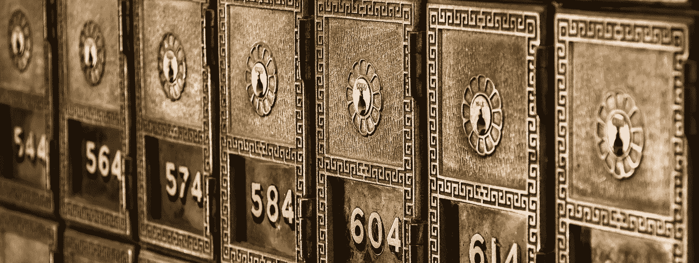
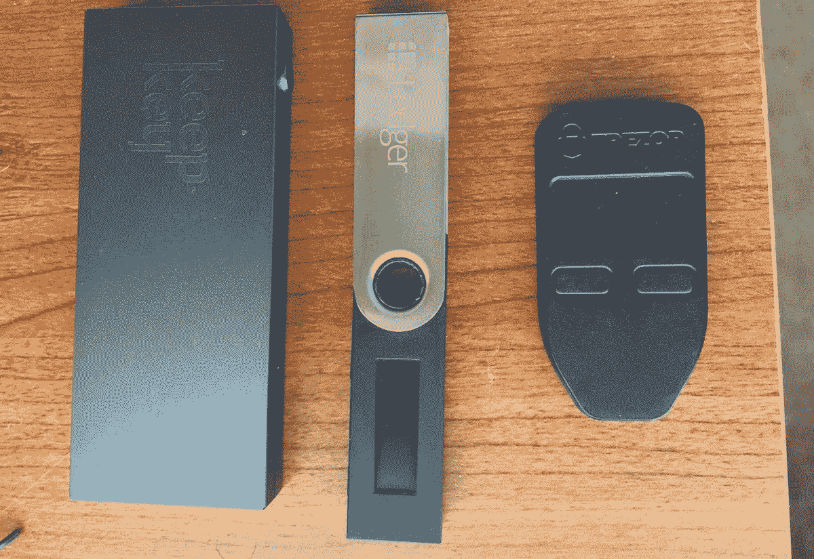

# 立即备份您的硬件钱包恢复种子

> 原文：<https://medium.com/coinmonks/back-up-your-hardware-wallet-recovery-seed-right-now-7d3a4d69ab50?source=collection_archive---------8----------------------->

在阅读了一千遍却没有付诸行动之后，你终于变得理智起来，订购了一个硬件钱包来存储你宝贵的加密资产。毕竟，即使你的投资没有超出你的损失，你的小金库现在也开始增长到一大笔钱，你希望这些钱远离小偷和意外事故。

*小心:你还没有脱离险境！*

## 硬件钱包是不够的

如果你选择了跟随大多数人，并得到了一个分类账 Nano S，这并不重要；如果你是一个有 Trezor 的老前辈，或者如果你在网上迷路了，不知何故最后有了一个 Keepkey。它们都将在初始化时为您提供一个由 12 到 24 个 [BIP39 单词](https://github.com/bitcoin/bips/blob/master/bip-0039/english.txt)组成的助记恢复短语(又名种子),使您能够将备份导入任何兼容的钱包中。

You bought one. Good. That is a first step. Now secure it.

您现在需要明白的是，在您的硬件钱包丢失、被盗、损坏或破解的不幸情况下，**这个恢复短语是您的最后一招**。这意味着你应该找到一种比硬件钱包更安全的方式来储存它，因为你希望它能够安全地抵御盗窃、火灾甚至是你的疯狗。

> 另读:[最佳比特币硬件钱包](/coinmonks/the-best-cryptocurrency-hardware-wallets-of-2020-e28b1c124069)

## 保护你的资产不受墨菲定律的影响

> 任何可能出错的事情都会出错

然后，您将与几种赔率进行斗争，以挽救您宝贵的加密资产:

*   你的措辞应该不会让大自然母亲大发脾气。
*   你的短语应该是安全的，不会被心怀不轨的人窃取。
*   如果你发生了什么不好的事情，你亲近的人应该可以找到你的短语。

## 您应该如何存储恢复短语？ ***

⛔️ **不要:**

*   **背下来。你的大脑是一块黏糊糊的不可靠的肉。醉酒司机很容易打碎你的脑袋。那不是我所说的安全的地方。**
*   **把它放在你的硬件钱包旁边。这就像把钥匙留在你家前门的锁上。**
*   **上传到任何云存储方案** (Dropbox，Drive，Evernote)。就是不要。也不要将其存储在本地计算机上。如果你被一个疯子用枪指着，让你这么做，那就选择最好的加密方式。实际上，你甚至不应该在键盘上敲一次。
*   **在一张纸上写下恢复种子，并把它存放在你的房子里**(你也把你的硬件钱包放在那里)。当你的房子因为你的哑巴邻居手里拿着大麻烟睡着了而着火的时候，火焰不会避开那张特定的纸，而会融化你的硬件钱包。
*   **把它纹在你的右屁股上。**这太奇怪了。

✅ **做**:

*   在认真使用你的钱包之前，至少恢复一次，检查一下你的恢复阶段。您也可以使用 Trezor 钱包中的“[检查恢复种子](https://blog.trezor.io/test-your-seed-backup-dry-run-recovery-df9f2e9889)”功能(如果您不害怕键盘记录器)或直接在 Trezor 上使用。
*   **将您的恢复短语存放在安全的地方。如果你把它放在家里，就把它做成防火保险箱，但是要注意，保险箱将会是小偷第一眼看到的东西。最好使用银行的存款箱。我知道我们不喜欢银行，但这仍然是这些天来银行可以发挥作用的地方。**
*   **在不同的地方储存你的种子的多个副本。两个备份比一个备份好。三个最好。九个可能是偏执狂。**
*   **将你的短语**分开，这样你就需要取回几个备份才能得到整个种子。如果你与不同的可信任的家庭成员分享这些部分，并且如果你出了什么事，允许他们收回资金，这种方法会很有效。
*   **在你的硬件钱包**上使用一个 [**密码**](https://support.ledgerwallet.com/hc/en-us/articles/115005214529-Advanced-Passphrase-options) **，这样恢复种子就不足以到达你的主储存点。并在不受密码保护的地址上留下一些资金，以保持可信的可否认性。**
*   买一个专门的硬件来备份你的种子。我说的是 [*隐钢*](https://cryptosteel.com/) / [*细木工板*](https://www.blockplate.com/)/[*cold ti*/](https://coldti.com/)[/*安全词*](https://coinstorage.guru/) 。(我将很快与您分享备份您的恢复种子的硬件解决方案的比较审查，我将在此处链接到它)
*   **考虑一下** [**沙米尔的秘密分享**](https://en.wikipedia.org/wiki/Shamir%27s_Secret_Sharing) **方案**如果你和你的朋友对密码学很了解的话。

我不是说你应该立刻实施所有这些建议。请务必定期检查您的备份方法，并根据存储资产的价值进行相应的检查。

祝你们平安！

关注我的推特[了解更多故事。](https://twitter.com/JimmyRagosa)

**随时建议任何补充或修改！*