# 反向传播概念在 5 个难度级别中解释

> 原文：<https://medium.com/coinmonks/backpropagation-concept-explained-in-5-levels-of-difficulty-8b220a939db5?source=collection_archive---------2----------------------->

**纯数学意义上的神经网络中的反向传播是什么？**

# **小家伙:**

反向传播被计算机用来从错误中学习，更好地做一件特定的事情。因此，使用这种计算机可以继续猜测，并且越来越擅长猜测，就像人类在某一特定任务中所做的那样。

然后，这些计算机可以将它们非常擅长的许多小任务组合起来，组成一个可以做更大事情的系统，比如驾驶汽车。

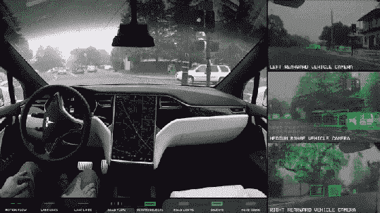

Tesla self driving car

# **高中生:**

人工智能可以通过向计算机提供大量数据以及人类提供的正确解决方案(称为标记数据)并训练线性分类器、神经网络等模型来获得，这些模型可以推广到它以前从未见过的数据。反向传播是计算机用来找出猜测和正确解之间的误差的技术，提供了对该数据的正确解。

反向传播在历史上被用来以快速的方式在数据结构中遍历树。我们让计算机猜测一个值，并使用微积分通过偏导数计算误差。然后，我们修正这个错误以获得更好的猜测，并再次反向传播以找到更好的调整错误。这种反复猜测的方法显示了反向传播的递归性。人工智能模型的训练需要很长的时间和大量的计算，它需要一切可以加快它的速度。

一些人还认为反向传播是一种糟糕的方法，应该被解决方案所取代，这些解决方案涉及对偏导数进行积分，以一次性直接获得最终误差，而不是花费大量计算时间的步骤，或者一些其他算法。用别的东西代替反向传播仍然是一个研究领域。

这个完整的算法被称为梯度下降。梯度下降(或类似算法)的一部分，你推断错误(通常用微积分)和纠正它被称为反向传播。

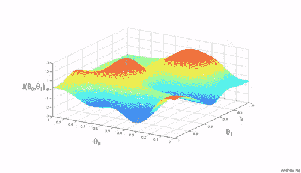

Gradient descent animation by Andrew Ng

# **毕业:**

因此，计算机科学中的反向传播是一种算法方式，通过这种方式，我们将某些计算的结果递归地发送回父节点。

[https://en.wikipedia.org/wiki/Backpropagation](https://en.wikipedia.org/wiki/Backpropagation)

在机器学习中，反向传播向神经网络发送反馈。

因此，任何训练步骤都包括计算梯度(微积分中的微分)，然后进行反向传播(对梯度进行积分，以返回权重应该变化的方式)。

**理解微积分的简单案例研究:苹果 vs 橘子**

举个简单的例子，我们训练一个简单的直线分类器，它绘制`**y = MX+c `**。分类器的目标是找出正确的 m 和 c 值，给定水果的半径(x 轴)和 rgb 值(y 轴)，对苹果和橘子进行二进制分类。**所以分类器必须在 x-y 平面上画一条直线，把它分成两部分，一部分是苹果，另一部分是橘子。**

梯度将为 d/dx(mx+c) => m，这是 dy/dx 的偏导数，在本例中为直线的斜率。

然后，我们在必须优化的某个函数上计算**损失**，比如 RMS prop(正确值与预测值的均方根)，其中，我们通过将实点(如(x1，y1)、(x2，y2)……(xn，yn)代入等式，将数据应用于我们的预测梯度值。

损失=RMS 道具(guess_m，guess_c)(数据，正确答案)。

之所以称之为**损失**，是因为**给了我们猜测和正确答案**之间的错误。损失使用 RMS 支柱的优化函数上的演算来计算。

这将给我们一个“增量”，通过它我们当前的 m 和 c 值必须改变。

反向传播步骤是当我们计算“增量”并使用它来更新 m 和 c 值时。

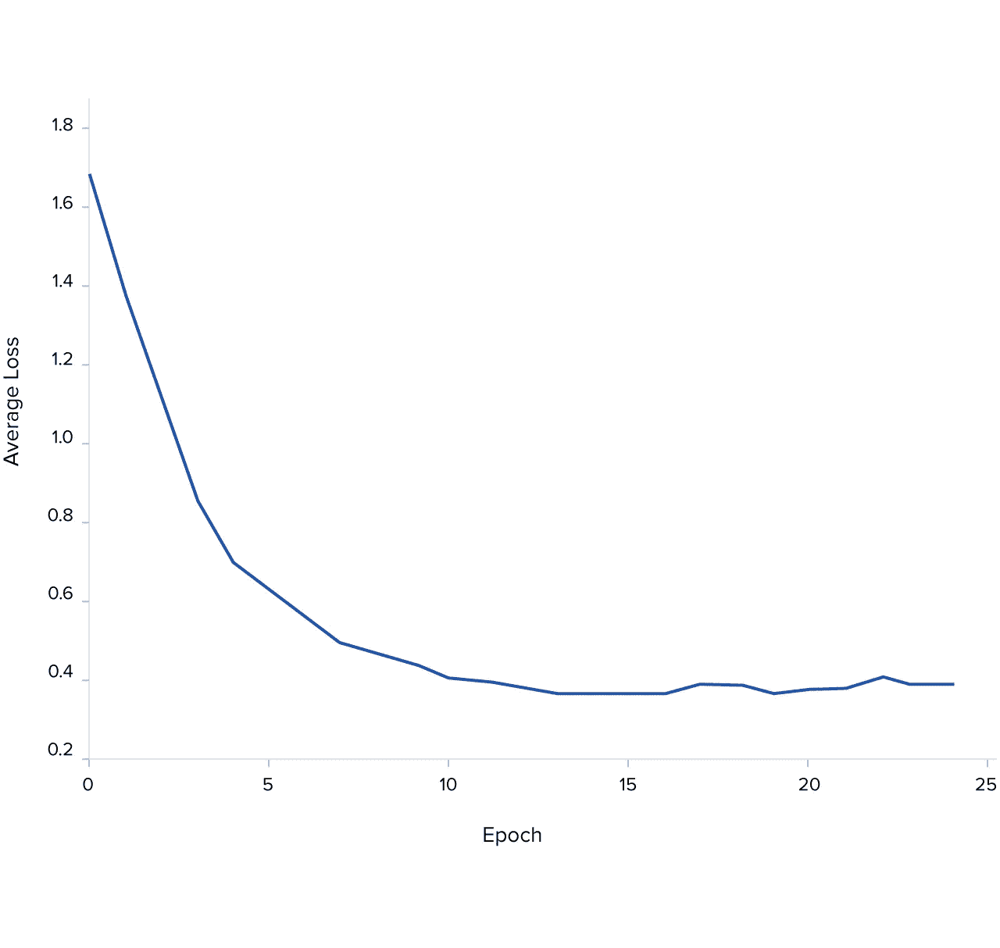

So by minimizing the loss , we get a better model as shown in the animation below

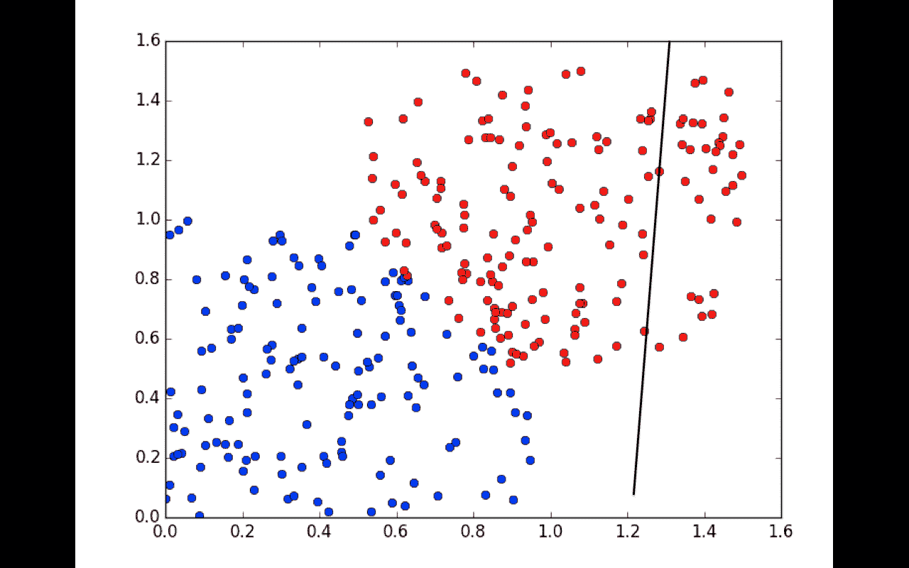

**现在在更复杂的场景说神经网络**

神经网络中的每个神经元/感知器都由一个权重组成，该权重表示它在训练中累积的数据/偏差。**该权重例如可以是 0 和 1 的 128×64 矩阵。**该示例中的 128 将是作为输入的前一层中的节点数目，而 64 将是下一层中的输出节点数目。

在 **Adam 优化**函数中，我们有具有**对数值的等式来归一化比例**。这意味着对“log”或具有“e”的等式(在数学中可以表示为无穷级数)进行积分和微分。

Adam 优化函数有一个 **RMS 道具**值和一个动量函数，它来自 **AdaGrad** 。为了便于反向传播，我认为大家对 Gradient depression 都很熟悉，这一点在其他很多地方会有更好的解释。

[https://en . Wikipedia . org/wiki/random _ grade _ depression # Adam](https://en.wikipedia.org/wiki/Stochastic_gradient_descent#Adam)

反向传播步骤将发回维基百科链接中给出的值的“增量”。

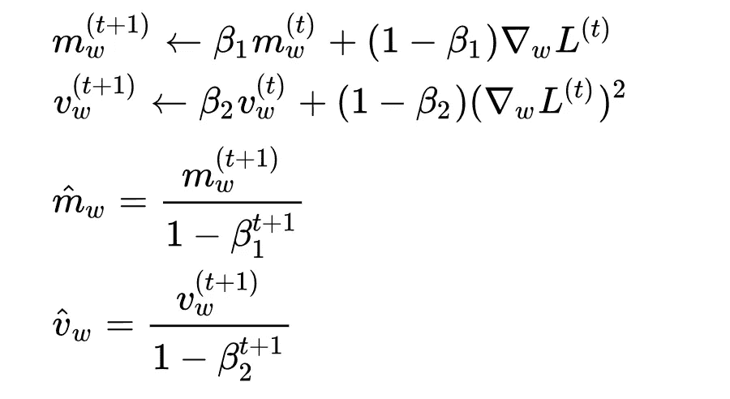

Wikipedia (ignore the complex symbols if you don’t get them)

在哪里

m =动量，

v =速度

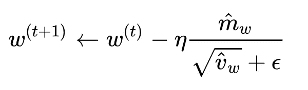

因此**权重(t+ 1) =权重(t) -增量**。

实际上，一层神经网络中的每个节点的权重都是通过一种叫做**向量化**的技术同时并行计算出来的，这种技术通过在 GPU、TPU 或某些微处理器上使用矩阵乘法标志进行并行化来提高其性能。

所以更多关于

> *反向传播(对梯度进行积分，以恢复权重变化的方式)*

假设你在 y=mx + c 上训练这个模型 100 次

**所以在迭代 1 中:**

m1 = m0(随机 init)+δ(均方根损耗方程)，其中δ是通过对 **m** 的均方根损耗方程进行部分微分得到的

c1 = c0(随机 init)+δ(均方根损耗方程)，其中δ是通过对 **c** 的均方根损耗方程进行部分微分得到的

**迭代 2 中:**

m2 = m1+δ(均方根损耗公式)

C2 = C1+δ(均方根损耗公式)

**在迭代 1 至 100 中:**

m100 = m0 + **求和**(δ_ 从 1 到 100(RMS prop 方程))

这与

m100 = m0 + **积分**(delta _ 从 1 到 100(RMS prop 方程))，这对于我们简单的苹果和橘子来说效果很好，除了如果网络很深，你不可能一次完成，而是一层一层地完成。

现在，您已经了解了这个简单的过程，它同样适用于 128 x 64 权重的单个节点，我们必须讨论如何将其应用于神经网络中的此类节点的网络。要快速复习偏导数和如何计算微积分部分，请查看 5 分钟后的[反向传播](https://www.youtube.com/watch?v=q555kfIFUCM)，您现在会更好地理解它。

如果我们能够将反向传播应用到更复杂的神经网络中，比如那些在 LSTM、RNN 或 GRU 的《穿越时间的反向传播》中描述的神经网络，我们就可以进行文本翻译、音乐生成等。

Language translation can be done using LSTM’s

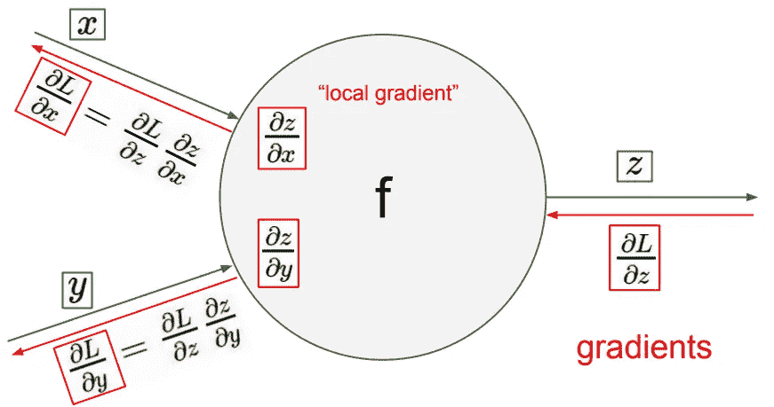

所以到目前为止，我们讨论的是训练一个有输出函数 f 的节点的权重。

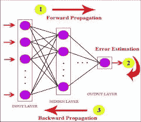

在深层神经网络中(deep 表示许多层，一层的宽度就是其中的节点数)，必须通过每一层**向前传播**得到预测值，计算误差，然后在每一层反向传播误差(用δ更新权重)。

因此，将按照相反的顺序计算每一层的增量，网络将如下所示进行训练。如果网络有 5 层，**为了计算第 1 层**的反向传播误差，我们必须从第 1 层= >第 2 层= > … = >第 5 层= >输出激活进行正向传播，然后从输出激活= >第 5 层= >第 4 层… = >第 1 层进行反向传播，然后使用这个增量固定第 1 层中每个节点的权重。

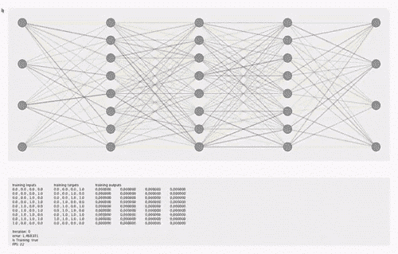

So after backpropagating the errors in all the nodes your model learns to correctly identify how important things are in its guesses or if it should guess/correlate things differently

或者对于卷积网络，你会有额外的困难，如通过池层反向传播

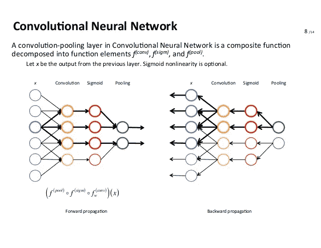

因此，在深度网络中，前向传播后，您必须先反向传播激活函数(在最后一层),如下所示

**ReLU =>**

如果 x>0，y = x

= 0，如果 x <0

or **Softmax** 是堆叠在一起的多个 sigmoids

或者**Sigmoid**=>y = 1/(1+pow(e，-x))

然后将“delta”作为损失函数传递给倒数第二层，该层将计算 delta 的 delta，依此类推。上面描述的功能似乎很容易区分不是吗？

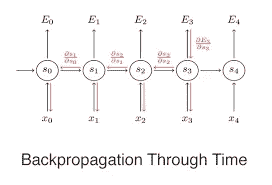

一个更复杂的情况是，不得不反向传播一个深度网络，这个网络正在被分批训练或通过时间反向传播(就像 RNN、LSTM 或 GRU 那样)。

这些循环神经网络或 RNN 神经网络有一种被称为“跳跃连接”的东西，这使它们能够在非常深的网络中轻松传播变化。门控循环单元或 GRU 氏症也有一个“记忆门”来跟踪数据中的一些“上下文”，还有一个“遗忘门”来标记上下文不相关的地方。LSTM 的 GRU 门还有一个额外的“输出门”,在大型数据集上表现得更好。

这些 LSTM 可以用来建立网络，预测种族、性别、语言翻译、创作音乐和混合艺术风格。类似地，LSTM 也有一种独特的方法来反向传播他们的误差，你可以通过对不同门的方程进行部分微分来估计。更多细节请看这篇关于[通过时间](http://axon.cs.byu.edu/~martinez/classes/678/Papers/Werbos_BPTT.pdf)反向传播的论文。

[https://en.wikipedia.org/wiki/Long_short-term_memory](https://en.wikipedia.org/wiki/Long_short-term_memory)

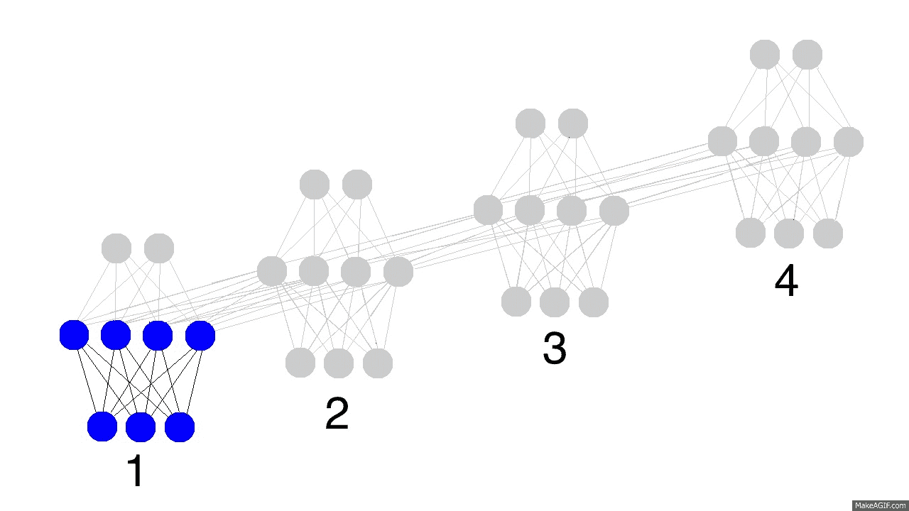

TL；速度三角形定位法(dead reckoning)

反向传播的基本原理是，对于每个节点将有一个随机权重矩阵 W，反向传播将更新为 W = W-δ，其中δ是该节点的输出函数的导数，它表示在该节点的一个步骤中要校正的误差。

也看看这个视频:[5 分钟后反向传播](https://www.youtube.com/watch?v=q555kfIFUCM)

要获得自己实现它的感觉的代码参考，请查看底部的中型文章。

# **研究生&博士:**

最好从专家的研究论文和视频中更详细地理解这个概念。我会为此提供一些链接。

这里[是给亚当的纸。](https://arxiv.org/pdf/1412.6980.pdf)

[这里](https://www.youtube.com/watch?v=W86H4DpFnLY)是一段由 **Yoshua Bengio** 制作的反向传播视频，他在过去几十年里一直大力支持反向传播。

[这里](https://www.quora.com/Why-is-Geoffrey-Hinton-suspicious-of-backpropagation-and-wants-AI-to-start-over)是一篇关于为什么 **Geoffrey Hinton** 认为我们应该放弃反向传播，寻找更好的方法的文章。

> 伊利诺斯大学厄巴纳-香槟分校(2006 年)计算神经科学&神经病学医学博士 Tsvi Achler
> 
> [2017 年 10 月 3 日更新](https://www.quora.com/Why-is-Geoffrey-Hinton-suspicious-of-backpropagation-and-wants-AI-to-start-over/answer/Tsvi-Achler)
> 
> 我认为辛顿做得还不够。反向传播不是根本问题，是网络结构问题。神经网络不应局限于前馈配置。Backprop 只能训练前馈网络，并且只要网络是前馈的，它将仍然是最佳解决方案之一。

[https://towards data science . com/why-we-need-a-better-learning-in-deep-learning-2 FAA 0 e 81 f 6b](https://towardsdatascience.com/why-we-need-a-better-learning-algorithm-than-backpropagation-in-deep-learning-2faa0e81f6b)

同样，对于如何从随机性和重复猜测中获得智慧的更广泛的直觉，看一看蒙特卡洛方法和马尔可夫链。

如果你上了**吴恩达关于深度学习**的课程，他让你用代码对各种方程进行反向传播，我最喜欢的损失函数是

L(y '，y) = -(y*log(y') + (1-y)*log(1-y '))

因为它被用在很多机器学习算法中，比如:

*   如果`y = 1` == > `L(y',1) = -log(y')` == >我们希望`y'`最大== > `y`最大值为 1
*   如果`y = 0` == > `L(y',0) = -log(1-y')` == >我们希望`1-y'`最大== > `y'`尽可能小，因为它只能有 1 个值。

然后我们对 L(y '，y)求导，得到梯度。

成为研究生或博士的一部分意味着能够阅读研究论文以获得洞察力。 **NIPS** 和 **ICLR** 是这一领域的著名活动，你可以从中了解更多信息，并获得大量资料。

我没有在 numpy 中包含反向传播的代码示例，因为您最终通常会使用 PyTorch 或 Tensorflow 这样的库来实现它。**此外，由于反向传播与网络类型密切相关，每个节点类型通常有不同的实现方式**，但事实上它保持不变，即你使用微积分来获得数学函数的误差，所以你必须阅读所有的论文来理解每个反向传播实现方式**。对大多数人来说，学习反向传播的目的是为了理解研究背后的数学原理，或者他们的图书馆正在做什么。我希望这篇文章能让你对这个概念有一个直观的认识，然后再去看其他一些高级文章，这些文章都是从直接实现它的困难开始的，比如**

1.[https://medium . freecodecamp . org/build-a-flexible-neural-network-with-back propagation-in-python-acffeb 7846d 0](https://medium.freecodecamp.org/build-a-flexible-neural-network-with-backpropagation-in-python-acffeb7846d0)

2.[https://ayearofai . com/rohan-Lenny-1-neural-networks-the-back propagation-algorithm-explained-abf 4609d 4 f 9d](https://ayearofai.com/rohan-lenny-1-neural-networks-the-backpropagation-algorithm-explained-abf4609d4f9d)

或者一些解释梯度下降直觉的文章比如[https://medium . com/data things/neural-networks-and-back propagation-in-a-simple-way-explained-f540a 3611 f5e](/datathings/neural-networks-and-backpropagation-explained-in-a-simple-way-f540a3611f5e)

那都是乡亲们！

> 加入 Coinmonks [电报频道](https://t.me/coincodecap)和 [Youtube 频道](https://www.youtube.com/c/coinmonks/videos)获取每日[加密新闻](http://coincodecap.com/)

## 另外，阅读

*   [复制交易](/coinmonks/top-10-crypto-copy-trading-platforms-for-beginners-d0c37c7d698c) | [加密税务软件](/coinmonks/crypto-tax-software-ed4b4810e338)
*   [电网交易](https://coincodecap.com/grid-trading) | [加密硬件钱包](/coinmonks/the-best-cryptocurrency-hardware-wallets-of-2020-e28b1c124069)
*   [密码电报信号](http://Top 4 Telegram Channels for Crypto Traders) | [密码交易机器人](/coinmonks/crypto-trading-bot-c2ffce8acb2a)
*   [最佳加密交易所](/coinmonks/crypto-exchange-dd2f9d6f3769) | [印度最佳加密交易所](/coinmonks/bitcoin-exchange-in-india-7f1fe79715c9)
*   [面向开发人员的最佳加密 API](/coinmonks/best-crypto-apis-for-developers-5efe3a597a9f)
*   最佳[密码借贷平台](/coinmonks/top-5-crypto-lending-platforms-in-2020-that-you-need-to-know-a1b675cec3fa)
*   杠杆代币的终极指南
*   [7 个最佳零费用加密交易平台](https://coincodecap.com/zero-fee-crypto-exchanges)
*   [最佳网上赌场](https://coincodecap.com/best-online-casinos) | [期货交易机器人](/coinmonks/futures-trading-bots-5a282ccee3f5)
*   [分散交易所](https://coincodecap.com/what-are-decentralized-exchanges) | [比特 FIP](https://coincodecap.com/bitbns-fip)
*   [用信用卡购买密码的 10 个最佳地点](https://coincodecap.com/buy-crypto-with-credit-card)
*   [加拿大最佳加密交易机器人](https://coincodecap.com/5-best-crypto-trading-bots-in-canada) | [Bybit vs 币安](https://coincodecap.com/bybit-binance-moonxbt)