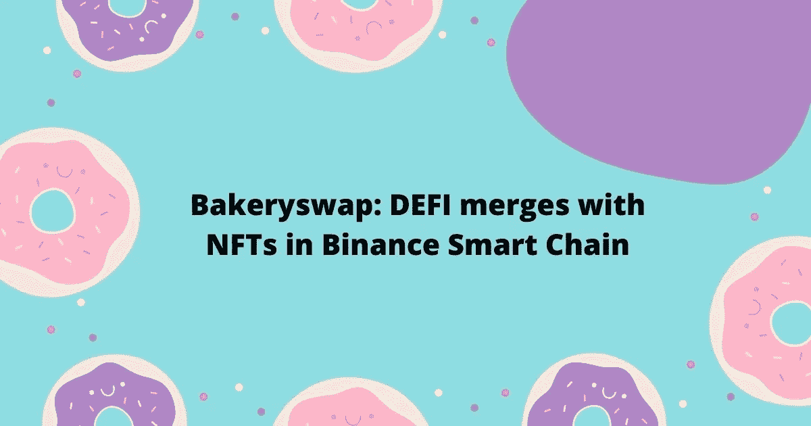

# Bakeryswap: DEFI 与币安智能链中的 NFTs 合并

> 原文：<https://medium.com/coinmonks/bakeryswap-defi-merges-with-nfts-in-binance-smart-chain-c1799578ab4?source=collection_archive---------0----------------------->

在[语音](https://www.voice.com/post/@tulip/bakeryswap-defi-merges-with-nfts-in-binance-smart-chain-1604692974-1)阅读我的原创文章。

在现存的著名区块链中，以太坊是最高的，波尔卡多特是一个值得注意的选择，泰佐斯和创已经在那里有一段时间了，但直到现在还没有看到太多的采用。

**还有一个人们谈论较少的区块链。那就是币安智能连锁(BSC)。我广泛使用了币安智能链，发现它非常快速和便宜，交易便宜到几分钱。我们将关注一个非常有趣的 BSC 项目，Bakeryswap**

[**面包店**](https://bakeryswap.org/)

Bakeryswap 是 BSC 生态系统中一个值得关注的项目。

**值得注意的地方包括**

它是一种 AMM(自动做市商)协议，具有互换和收益农业功能。

它现在正在戏弄 NFT 的世界，并推出基于 Defi 的 NFT 解决方案。

它是第一个提供替代货币流动性池(LP)的 BSC AMM，如 LINK、DOT 等。

没有预售，也没有预开采。

为 BEP2 和 BEP20 令牌提供套利机会

流动性提供者也将获得烘焙代币奖励

烘焙代币使一个人能够赚取交易费的一部分，并参与 BakerySwap 的投票。

**部分统计:**

所有烘焙农场的 1%将归团队所有

总供应量:293 564 197.80753

烘焙燃烧至今:198556421

持有人:17 870 人

**如何使用 Bakeryswap？**

您需要安装元掩码浏览器扩展，并在自定义 RPC 下添加以下详细信息

网络名称:币安智能连锁

添加了 RPC URL:[https://bsc-dataseed1.binance.org/](https://bsc-dataseed1.binance.org/)

链号:56

象征:BNB

阻止浏览器 URL:[https://bscscan.com/](https://bscscan.com/)

将添加币安智能链。现在你将能够使用 [Bakeryswap](https://bakeryswap.org/#/home) 。

首先，将 BEP20 BNB 发送到您刚刚添加的元掩码(BSC)。

获得烘焙代币的选项:

*1。互换:*

使用兑换功能购买烘焙代币。值得注意的是，与其他 Defi 代币一样，Bakeryswap 的价格也大幅下跌。据我看，它已经找到了底价，应该是进场的好时机。

*2。累积奖金并赢取*

贝克斯沃普有一个流动性开采的条款。如果你想提供流动性，你需要有等量的两种代币。

还是那句话，相比以太坊。BSC 中的交易成本会很便宜，几分钱。

**赚烤**

Bakeryswap 提供多种收入选择。这些包括参与贝克 BNB，BAK BUSD，贝克点有限责任公司。投资回报率在波动。

**连击**

输入 NFTs。Combos 是在 Bakeryswap 推出的第一批 NFT。组合可以通过贡献烘焙来获得。更高的连击有更高的赌注力量。根据连击的赌注能力，可以下注连击来赢取烘焙。

4 种组合是-基本，普通，豪华，和最高。

10000–20000 烘焙:基本

20000–50000 烘焙:常规

50000–100000 烘焙:奢华

烘焙 100000 次以上:最高

所有的组合现在已经被铸造并且在市场上可得到。NFT 组合也是一个烘焙农业工具。你可以下注 NFT 连赢烘焙。你也可以交易 combo 或者分解回来烘焙。

**NFT 超市**

Bakeryswap 最近在其发射台推出了一个名为“战斗宠物”的项目。是一款以宠物为 NFT 的宠物饲养游戏。这些宠物现在在市场上出售用于烘烤

**数码艺术品(即将推出)**

在即将发布的版本中，Bakeryswap 也将把数字艺术带入市场。考虑到 Superrare、Rarible 等项目非常受欢迎，这是一个很好的细分市场。

**发射台**

战斗宠物是作为第一个发射台项目推出的。宠物是战斗宠物的原生统治令牌。每买一只宠物 NFT 就免费赠送一只。更多即将推出。

**烘焙用例**

只有与烘焙相关的池才会被烘焙。

Launchpad 项目可以使用任何 BAKE pair LP 代币进行筹款，

烘焙赌注允许用户下注烘焙，并在项目中赢得新的项目代币或资产。

使用 Bakeryswap 的合作伙伴必须用 Bake 支付费用

**接下来的步骤**

改善 NFT 功能。这方面的例子包括 NFT 的股份烘烤农场、NFT 的投标制度和拍卖

完成 GamiFi 功能、抽奖和基于烘焙的奖励的任务

创建一个烘焙开发者生态系统

引入对 AMM、NFT 数据和代币价格图表的分析

保证金交易和衍生品

Bakeryswap 是一个非常有趣的项目，在币安的大力支持下，我看到了光明的前景。小心点。如果你能在评论中留下你的观点供进一步讨论，我将不胜感激。

如果您能在评论中留下您的观点以供进一步讨论，我将不胜感激。

**参考:**bakery swap 培养基

**阅读更多:** [第一波尔卡多 NFTs:sub punks](https://tulip311bit.medium.com/the-first-polkadot-nfts-substrapunks-3398f33c8ae1)

跟我来

https://twitter.com/rumadas123➡推特:

https://www.linkedin.com/in/ruma-das-a1439320/➡领英:

## 另外，阅读

*   [最佳加密交易机器人](/coinmonks/whats-the-best-crypto-trading-bot-in-2020-top-8-bitcoin-trading-bot-c16adeb13317)
*   最好的比特币[硬件钱包](/coinmonks/the-best-cryptocurrency-hardware-wallets-of-2020-e28b1c124069?source=friends_link&sk=324dd9ff8556ab578d71e7ad7658ad7c)
*   [加密复制交易平台](/coinmonks/top-10-crypto-copy-trading-platforms-for-beginners-d0c37c7d698c)
*   最好的[加密税务软件](/coinmonks/best-crypto-tax-tool-for-my-money-72d4b430816b)
*   [最佳加密交易平台](/coinmonks/the-best-crypto-trading-platforms-in-2020-the-definitive-guide-updated-c72f8b874555)
*   [unis WAP 最佳钱包](/coinmonks/best-wallets-to-use-uniswap-e91a6385d9e8)
*   最佳[加密借贷平台](/coinmonks/top-5-crypto-lending-platforms-in-2020-that-you-need-to-know-a1b675cec3fa)
*   [block fi vs Celsius](/coinmonks/blockfi-vs-celsius-vs-hodlnaut-8a1cc8c26630)vs Hodlnaut
*   莱杰 vs 特雷佐
*   [德里比特评论](/coinmonks/deribit-review-options-fees-apis-and-testnet-2ca16c4bbdb2)
*   Bitsgap 评论——一个轻松赚钱的加密交易机器人
*   为专业人士设计的加密交易机器人
*   [3commas Review](https://blog.coincodecap.com/3commas-review-an-excellent-crypto-trading-bot) |一款优秀的密码交易机器人
*   [3Commas vs Cryptohopper](/coinmonks/cryptohopper-vs-3commas-vs-shrimpy-a2c16095b8fe)
*   Bitmex 上的[保证金交易的白痴指南](/coinmonks/the-idiots-guide-to-margin-trading-on-bitmex-dbbd7742c6fc?source=friends_link&sk=7bfa99d2a181142510c8442c8ddb0786)
*   [加密摇摆交易的权威指南](/coinmonks/the-definitive-guide-to-crypto-swing-trading-7e4af6496d4d?source=friends_link&sk=70448050bd9323b42f63bfc0bb1e60d1)
*   [Bitmex 高级保证金交易指南](/coinmonks/bitmex-advanced-margin-trading-guide-2270c195ce25?source=friends_link&sk=1d986cca731f5084b9a2db4a4bc4a7ad)
*   [开发人员的最佳加密 API](/coinmonks/best-crypto-apis-for-developers-5efe3a597a9f)
*   [加密套利](/coinmonks/crypto-arbitrage-guide-how-to-make-money-as-a-beginner-62bfe5c868f6)指南:新手如何赚钱
*   顶级[比特币节点](https://blog.coincodecap.com/bitcoin-node-solutions)提供商
*   最佳[加密制图工具](/coinmonks/what-are-the-best-charting-platforms-for-cryptocurrency-trading-85aade584d80)
*   了解比特币最好的[书籍有哪些？](/coinmonks/what-are-the-best-books-to-learn-bitcoin-409aeb9aff4b)

> [直接在您的收件箱中获得最佳软件交易](https://coincodecap.com?utm_source=coinmonks)

