# 烤坏了。开始吧。

> 原文：<https://medium.com/coinmonks/baking-bad-get-started-485a8c8ea3d0?source=collection_archive---------0----------------------->

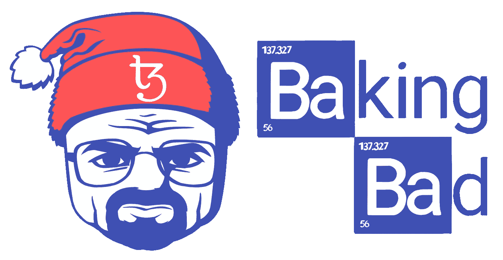

> [Baking Bad](https://baking-bad.org/) —一项独立服务，用于计算委托 Tezos 的奖励，并将其与实际收到的付款进行匹配。
> 
> 我们不赞美一个或羞辱另一个代表团服务。我们只是为 Tezos 社区提供了一个免费的工具来检查 baker 的公平性和责任性。因此，授权者可以检查奖励是否全额支付，以及它们与承诺的相符程度。

首先要做的是输入你授权的 KT 地址，然后按“回车”或点击“放大镜”。

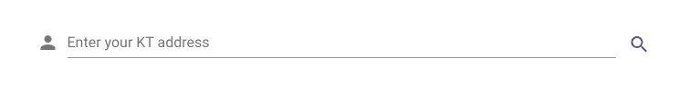

将出现一个屏幕，显示有关您付款的所有信息。

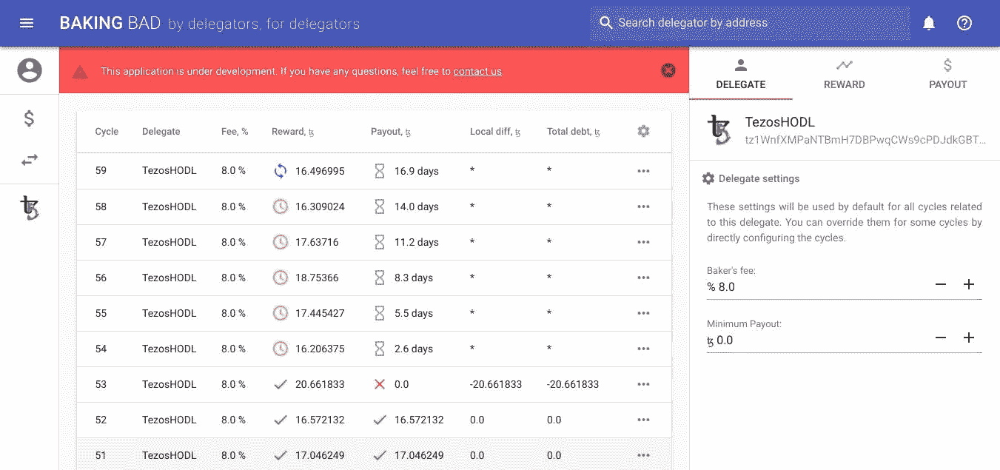

关于收到的奖励的基本信息显示在屏幕中央的表格中。下面简单介绍一下里面的信息:

“循环”是若干个循环。

“Delegate”是您委托给您的 tezzies 的服务名称或 TZ1 地址。

“费用”是你的面包师收取的费用。

“奖励”是奖励的数量和状态。“蓝色箭头”表示循环尚未结束，显示了预测的奖励。“黄色时钟”——周期完成，显示实际累积奖励，但仍处于冻结状态。“绿色对勾”——面包师已经收到奖励。

“支出”是您的奖励金额和状态。“沙漏”——奖励尚未支付，预计在未来支付。“绿色复选标记”——奖励已全额支付。“红色感叹号”——已支付奖励，但金额少于预期。“蓝色感叹号”——已支付奖励，但金额超出预期。

“局部差异”是给定周期的预期报酬和实际报酬之间的差异。

“总债务”是每个面包师所有先前“本地差异”的总和。

## 定制工具

不同的委托服务使用不同的支付奖励方案，因此可能有必要调整几个参数——因此，对于您的特殊情况，如果您的支出看起来像下面的截图——不要被吓倒，首先，您需要检查一些东西。

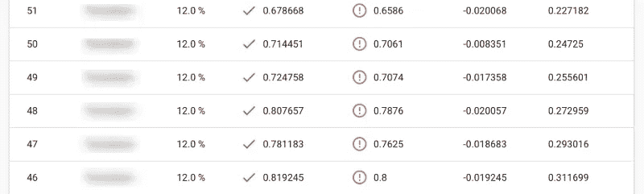

首先要做的是检查你的面包师的费用。

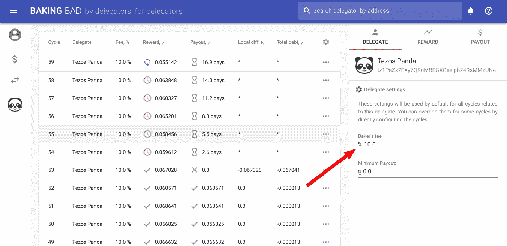

我们使用公共资源上列出的费用。然而，可能与此不同的是你的佣金——例如，许多面包师为他们的第一个客户设定了降低的费用，或者为每个代表单独设定。您可以通过联系您的授权服务支持部门来了解您的具体费用。

碰巧在工作过程中，经过某个特定的周期后，面包师改变了收费。您可以通过两种方式为特定周期设置适当的费用。

第一种方法是直接在支出表中。单击“设置”栏中的“编辑”按钮，用“-”或“+”按钮进行更改，然后单击“保存”。

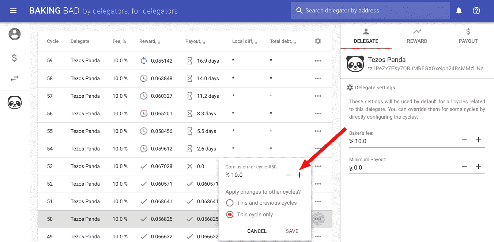

第二种方法是在“奖励”选项卡上，使用“-”或“+”按钮设置所需的奖励。

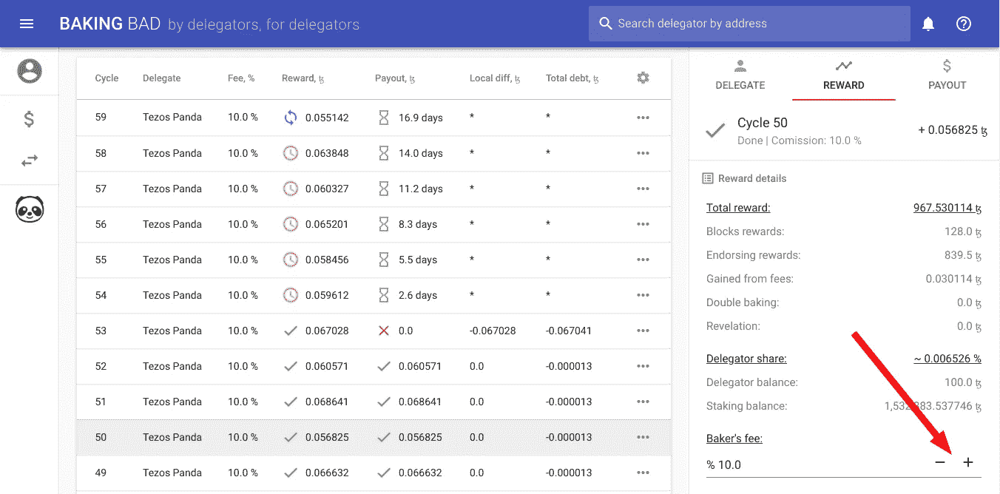

第二种方法是首选，因为“奖励”选项卡显示的奖励信息比支出表多得多。使用它来获得所有关于面包师在一个特定周期赚了多少钱的信息。在以后的文章中，我们将更详细地描述面包师的报酬包括什么。

## 奖励支付计划

除了费用金额之间的差异之外，委托服务对其委托人的奖励支付方案也有所不同。支付奖励没有好坏之分。当你把你的任务委托给面包师时，你很可能知道报酬将如何支付。如果没有，请询问您的面包师支持他们使用什么支付方案。要调整支付方案，请使用“支付”选项卡。

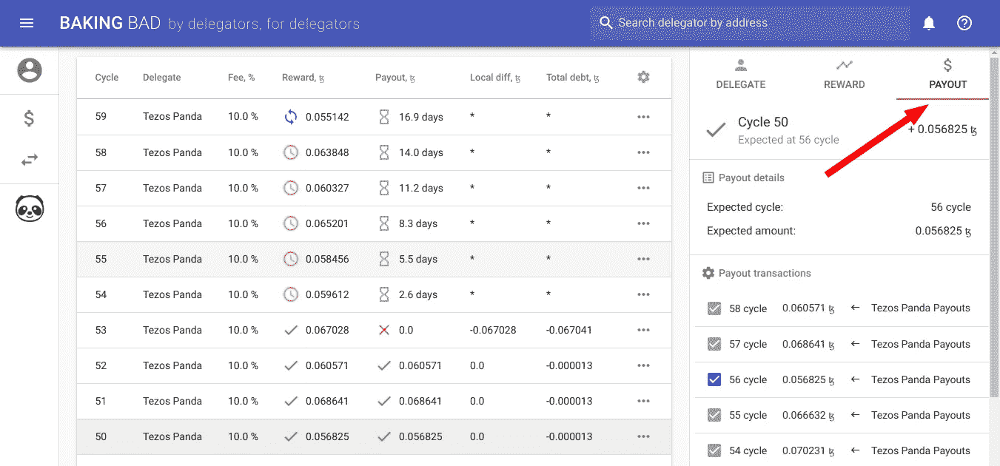

## “账户交易”标签

除了支付报酬之外，面包师可能还与您进行了其他交易。为了正确显示付款，有必要排除不必要的交易。为此，我们制作了“账户交易”选项卡。

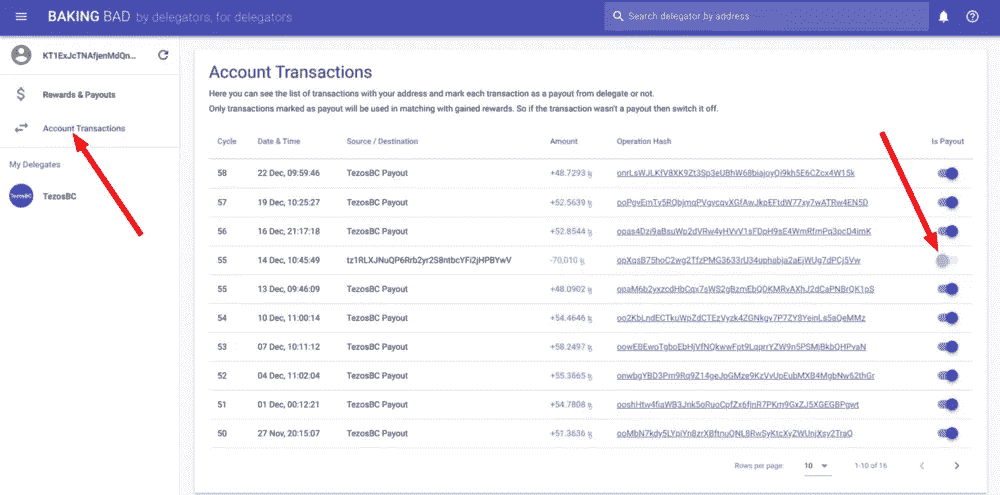

## 结论

最后，如果费用设置正确，支付方案也设置正确，那么支付表应该如下所示:

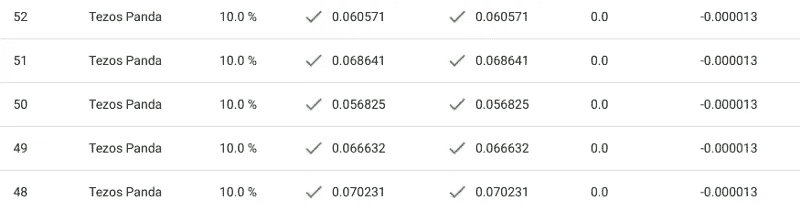

如果不是…

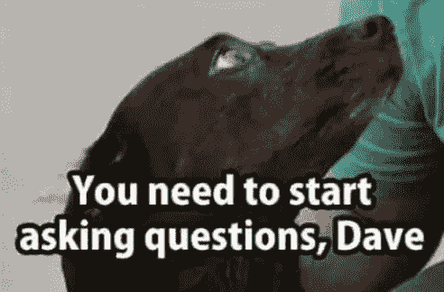

*最初发表于 2018 年 12 月 05 日*[*【https://baking-bad.org】*](https://baking-bad.org/blog/2018/12/05/baking-bad-tezos-rewards-auditor-get-started/)*，在这里你可以找到文章的完整版。*

> 我们将继续致力于我们的服务，因此如果您有任何问题或注意到一些不准确之处，请联系我们，我们将共同努力使我们的服务更好。
> 
> [直接在您的收件箱中获得最佳软件交易](https://coincodecap.com/?utm_source=coinmonks)

