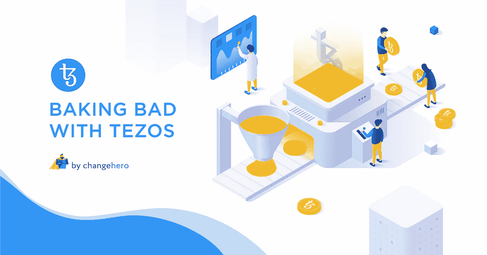

# 用泰索斯烘焙不好

> 原文：<https://medium.com/coinmonks/baking-bad-with-tezos-c840a824a92f?source=collection_archive---------5----------------------->

Tezos 是极少数凭借其轰动一时的 ICO 进入加密领域的加密货币之一。它一直在社交媒体上为其独特的产品做宣传。在过去的几天里，Tezos 的大规模牛市再次在加密社区引起了摩擦，看起来它将很快加入前十名最有价值的加密货币俱乐部。

在本帖中， [ChangeHero](http://changehero.io/) 将你需要知道的关于 Tezos 的一切都集中在一个地方。

## **第一球全垒打**

[Tezos](https://tezos.com/) 是一个去中心化的区块链平台，主要侧重于智能合约和 dApps。夫妻二人组 Arthur Breitman 和 Kathleen Breitman 在近十年前携手合作，旨在开发一个真正的数字英联邦区块链。2014 年，Tezos 发布了官方白皮书，强调比特币的缺陷和潜在的修复方法。由研究驱动的区块链网络在投资者中获得了牵引力，并在 2017 年的第一个 ICO 中筹集了高达 2.32 亿美元的资金。

> 想要下注你的硬币吗？检查这些赌注服务提供商

## **怪癖**

该团队采用了一种非常规的方法来开发网络，整个区块链都是从零开始编码的，而不是基于比特币或任何其他协议。虽然 Tezos 在智能合约和 dApps 等核心功能方面似乎与 Ethreum 相似，但它也有一些与众不同的特点。举几个例子，自我修正、链上治理、烘焙(是的，这次不是打印错误😉)和迈克尔逊是让 Tezos 领先于其他公司的几个特点。

## **F 字？又来了！**

我们已经看到许多案例，其中一些最强大的加密社区由于网络角度的不同而分道扬镳。是的，这是密码中的 F 字，FORK。而且我们也看到了不少类似比特币现金、以太坊经典这样有争议的案例。Tezos 通过自我修正和链上治理来解决这个问题。可以实现网络升级，而不必通过自修正来拆分区块链。链上治理作为一种手段，通过对提议的修改进行投票来推动升级。开发者可以提交升级提案，利益相关者投票决定是否实施该提案。这种治理制度模式将投票权和决策权赋予用户，并确保权力下放。自我修正和链上治理的结合保持了网络的内聚性。

## **迈克尔逊先生核实你的合同**

Tezos 使用一种叫做 Michelson 的独特编程语言在平台上编写智能合同。它是专门为方便智能合同的正式验证而设计的。它使用数学算法来检查开发人员代码的正确性以及每个智能合同背后的逻辑。将这种技术结合到协议中增强了安全性并最小化了错误。

## **烤坏了**

Source: ChangeHero

Tez 是 Tezos 区块链的本地加密货币，交易代码为 XTZ。它可以用于进行交易和与网络交互。Tezos 使用一种基于 PoS 的流动性风险证明机制。Tezos 网络中的赌注过程被称为烘焙，代币持有者被称为面包师。烘焙最有趣的一个方面是可选的委托。这使得每个利益相关者都可以参与到共识中，而无需向第三方或验证者展示他们的令牌。面包师有机会随机烘烤这块蛋糕，并由另外 32 名随机的面包师公证。面包师将因促成共识而获得交易费和奖励。

## **掌握平衡**

尽管该平台最初推出时出现了内部纠纷和诉讼，但 Tezos 的表现一直很好。通过 zk-SNARKS 协议等新的集成来促进私人交易和 Tendermint，Tezos 的未来看起来很有希望。截至发稿时，其交易价格为 2.18 美元，总市值超过 15 亿美元。总而言之，Tezos 是一个在不牺牲可伸缩性和特性的情况下确保去中心化的项目。

ChangeHero 相信 Tezos 的潜力，并承诺给予支持。在 ChangeHero 上，你可以通过交换任何密码获得$XTZ，或者你可以用你的信用卡或借记卡购买。

如果你喜欢这个帖子和评论来引发讨论，请给我们一个掌声。要在 crypto exchange 上获得更多此类文章和令人兴奋的优惠，请在 [Twitter](https://twitter.com/Changehero_io?lang=en) 和 [Medium](/@changehero) 上关注 [ChangeHero](https://changehero.io/) 。

> [直接在您的收件箱中获得最佳软件交易](https://coincodecap.com/?utm_source=coinmonks)

