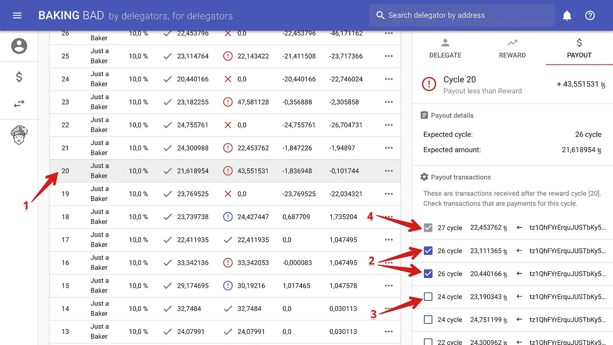

# 烘焙坏:工作与不同的支付方案

> 原文：<https://medium.com/coinmonks/baking-bad-working-with-different-payment-schemes-176559c59785?source=collection_archive---------5----------------------->

> [Baking Bad](https://baking-bad.org/) —一项独立服务，用于计算委托 Tezos 的奖励，并将其与实际收到的付款进行匹配。
> 
> 我们不赞美一个或羞辱另一个代表团服务。我们只是为 Tezos 社区提供了一个免费的工具来检查 baker 的公平性和责任性。因此，授权者可以检查奖励是否全额支付，以及它们与承诺的相符程度。

在本文中，我们解释了委托服务使用的最常见的支付方案，并通过示例展示了如何为这些方案设置 Baking Bad(或只是 BB)。

## 支付方案

首先，让我们记住在泰佐斯，奖励是如何支付给面包师的。面包师每生产一个新的木块、背书一个木块等都会得到一份奖励。但是这个奖励是冻结的，不能被面包师在接下来的 5 个周期里使用。此外，出于安全原因，在接下来的 5 个周期中，面包师账户中的一些存款被冻结。在欺诈的情况下，被冻结的存款将被烧毁。

有两种方法对支付方案进行分类:

1.按支出延迟(滞后):

*   贝克获得奖励后；
*   在贝克得到奖励之前。

2.按支出频率:

*   在每个周期上；
*   N 个周期一次；
*   一旦“敏。支付”的要求。

我们将在下面的文章中详细讨论每个方案的优缺点。现在让我们看看当你有这样或那样的支付方案时，如何与 BB 合作。

## 支出选项卡

我们正试图将 BB 设计得尽可能灵活，这样你就可以在任何支付方案中使用它。目前，这可能不太方便，但却是可能的。为此，有一个“支出”选项卡，您可以在其中设置任何支出，直接将它们与所需的周期关联起来。

1.  选定的周期。
2.  链接到所选周期的支出。默认情况下，这些是在所选周期的奖励可用时(1+5 个周期后)进行的支出。
3.  不与任何周期关联的支出。
4.  与所选周期无关的支出。

看着吓人？放心吧！让我们通过实例来看看如何使用它。

## 第一种情况:在面包师获得奖励后，每个周期都会进行支付

这是最常用的支付方案。如果你的代表使用这个，放松，你不需要做任何事情。所有支出将自动配置。你唯一需要检查的是面包师的费用。

## 第二种情况:在获得奖励之前支付

这也叫“提前奖励制度”。比如“只是一个面包师”在下一个周期支付奖励。对于第 10 个周期，在第 11 个周期支付，第 12 个周期——第 13 个周期，等等。因此，您需要手动将支出与相应的周期相关联。这是我们在“支付”选项卡中设置的。

## 第三种情况:面包师获得奖励后，每 N 个周期支付一次

一些代表团服务每周或每月支付一次奖励。实际上，在这种情况下，你不需要做任何事情，只需观察奖励表中的“总债务”值。但如果你想“美化”奖励表，可以尝试这样配置。

*最初发表于 2019 年 1 月 15 日*[*【https://baking-bad.org】*](https://baking-bad.org/blog/2019/01/15/working-with-different-staking-reward-payment-schemes/)*，在那里你可以找到文章的完整版本。*

我们将继续致力于 BB 服务。如果您有任何问题或发现任何不准确之处，请联系我们。我们将一起让 Tezos 世界变得更好！

> [直接在您的收件箱中获得最佳软件交易](https://coincodecap.com/?utm_source=coinmonks)

