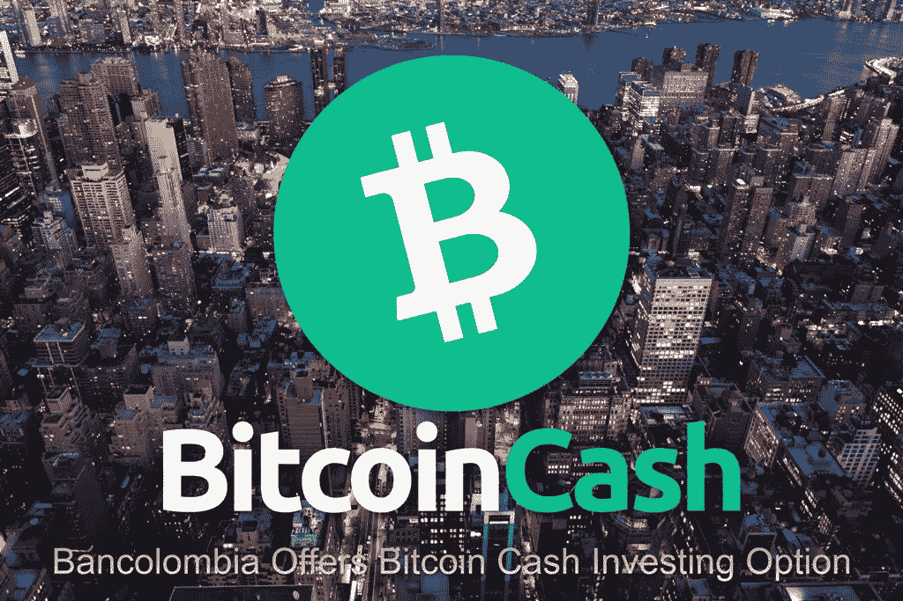
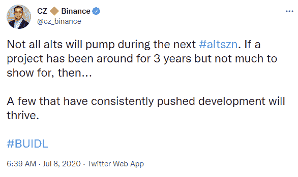

# 哥伦比亚银行提供比特币现金投资选择

> 原文：<https://medium.com/coinmonks/bancolombia-offers-bitcoin-cash-investing-option-bf86060148af?source=collection_archive---------9----------------------->

Gemini exchange 最近与哥伦比亚金融机构" **Bancolombia** "合作，为该银行的客户提供加密货币交易平台。

新平台将授予四种顶级加密货币的交易权限:比特币 BTC、以太坊、**、比特币现金**和莱特币。

随着这一举措，Gemini exchange 向哥伦比亚的主要机构和合格投资者授予加密货币交易的入口，由哥伦比亚金融机构 SFC 监管。

Gemini 和 Bancolombia 合作的第一年是一个测试阶段(*一个监管沙盒*),将根据某些证书选择合格的参与者。

在这一战略合作伙伴关系中，值得注意的是，比特币现金再次被顶级金融机构选择，并作为示范性加密货币和金融资产提供。

# 比特币现金是机构的优先选择

如今，多家老牌金融机构向客户提供比特币现金作为投资选择。

金融机构总是在提供给合格投资者、零售和机构的一小篮子加密货币中选择比特币现金。通常，金融机构优先考虑的四种资产是 BTC、瑞士联邦理工学院、BCH 和长期贷款公司。

比特币现金被认为是建立加密货币是一个重要的成就。与其他加密货币相比，区块链的效率和竞争优势使其成为首选。

下面的列表解释了为什么比特币现金对于任何有加密货币敞口的投资组合来说都是具有战略重要性的资产:

*   **灰度(美国):(BCHG—GBTC—ETHE—LTCN—ETCG)*(***[***阅读更多***](https://read.cash/@Pantera/grayscales-bitcoin-cash-trust-to-become-sec-reporting-company-84ac9c2c)***)***
*   **摩根大通&公司(美国):(BCH—BTC—ETH—ETC)*(***[***阅读更多***](https://read.cash/@Pantera/jpmorgan-allows-access-to-retail-investing-in-bitcoin-cash-c82844b4)***)***
*   **SBI 控股(日):(XRP—BCH—BTC—ETH—LTC)*(***[***阅读更多***](https://read.cash/@Pantera/bitcoin-cash-was-selected-by-sbi-bank-for-the-first-crypto-fund-in-japan-049ea9b7)***)***
*   **21 股(欧盟)**:(**BCH—BTC—ETH)*(***[***阅读更多***](https://read.cash/@Pantera/bitcoin-cash-etp-in-europe-abch-01effa54)***)***
*   **互动券商(美国目前):(BCH—BTC—ETH—LTC)*(***[***阅读更多***](https://read.cash/@Pantera/this-350-billion-fund-is-now-offering-bitcoin-cash-trading-f70f44e1)***)***
*   **AMC 影院— Bitpay(美国) *(*** [***阅读更多***](https://read.cash/@Pantera/amc-theaters-announced-bitcoin-cash-as-a-payment-method-1136eed0)***)***
*   **PayPal(目前为美国&英国):(BCH — BTC — ETH — LTC)**

如今，投资者不仅要求在 BTC 投资，还要求长期投资更多的加密货币资产。该领域的创新推动了机构需求，受监管的金融实体开发并提供各种金融产品来满足其客户的需求。

比特币现金一直是投资组合管理中排名前四的加密货币。

# 最新的币安事件

尽管比特币现金正在获得机构认可，但它仍需要努力才能达到其此前在市场上的地位。

从市值来看，各种新型加密货币已经超过了比特币现金。也有人担心秘密交易所会操纵 BCH 的价格，并抑制其在衍生品市场的交易。

几周前发生了一个币安事件，当时交易所显然用完了 BCH，暂停了取款。这一事件遭到了各种指控，指责币安交易所卖空比特币现金，只向用户出售数字，而不是实际的比特币现金。

[Source](https://twitter.com/cz_binance/status/1280708000928296960)

也许 CZ 不明白“alt”是一个 BTC 最大化的术语，用来减少创新和阻止加密货币在金融领域带来的进步。

也许这是一种威胁，他的交易所正计划不断压低一些“旧”加密货币的价格，只是为了“刺激”那些与币安利益相关的新货币。比特币现金在链上和区块链上的发展令人瞩目。随着 smartBCH 的有机增长，今天的开发人员正争先恐后地提供新的服务。兴奋使网络的价值倍增，所以也许 CZ 应该重新考虑他的方法。

然而，我们看到币安支持各种集中和不发达的网络，而每个人都怀疑它对比特币现金的处理。

虽然 CZ 经常用我们今天理解的谜语说话，但是在币安王国有一些腐败的东西。也许所有这些关于 BCH 抑制和操纵价格的呼吁都有合理的依据。

# 最后

当加密遇到机构采用时，比特币现金总是重中之重。

比特币(BTC)和以太坊是金融机构的首选，比特币现金一直是第三选择。

加密新闻一如既往地淡化 BCH 从一篮子加密货币中被选中的重要性，并被机构视为与 BTC 和以太坊同等重要。

然而，这一事件凸显了投资者分散各种加密货币资产的重要性。人们认识到，比特币现金包含了作为投资资产的所有重要特征。

或许，当加密散户投资者决定进行实际研究，而不是依赖 Reddit 和 Twitter 时，这将有助于他们找到提供长期潜力的加密货币资产，如比特币现金。目前，我们观察机构投资和定位，散户投资者忽略了比特币现金的优点。

Writing at the following websites: ● [ReadCash](https://read.cash/@Pantera) ● [NoiseCash](https://noise.cash/u/Pantera99) ● [Medium](/@panterabch) ● [Hive](https://hive.blog/@pantera1) ● [Steemit](https://steemit.com/@pantera1) ●[Vocal](https://vocal.media/authors/pantera) ● [Minds](https://www.minds.com/pantera99/) ● [Twitter](https://twitter.com/Panterabch) ● [LinkedIn](https://www.linkedin.com/in/panterabch/) ● [email](https://read.cash/@Pantera/localcryptos-p2p-exchange-is-now-offering-bitcoin-cash-trading-06637230#bad-link)

> ***免责声明*** *:本内容发布的所有材料均用于娱乐和教育目的，并符合* ***合理使用*** *的准则。无意侵犯版权。如果您是或代表本文中使用的材料的版权所有者，并且对所述材料的使用有问题，请发送* [***电子邮件***](https://read.cash/@Pantera/cryptouknowns-battlegrounds-the-crypto-battle-royal-part-i-0ca762da#bad-link) *。*

***支持内容创作者。***

如果你喜欢这个故事，就订阅吧！

*原发布于*[*https://read . cash*](https://read.cash/@Pantera/bancolombia-offers-bitcoin-cash-investing-option-4c46a27b)*。*

> 加入 Coinmonks [电报频道](https://t.me/coincodecap)和 [Youtube 频道](https://www.youtube.com/c/coinmonks/videos)了解加密交易和投资

## 另外，阅读

*   [Bitget 回顾](https://blog.coincodecap.com/bitget-review) | [双子 vs 区块链](https://blog.coincodecap.com/gemini-vs-blockfi) | [OKEx 期货交易](https://blog.coincodecap.com/okex-futures-trading)
*   [AscendEx Staking](https://blog.coincodecap.com/ascendex-staking)|[Bot Ocean Review](https://blog.coincodecap.com/bot-ocean-review)|[最佳比特币钱包](https://blog.coincodecap.com/bitcoin-wallets-india)
*   [霍比审核](https://blog.coincodecap.com/huobi-review) | [OKEx 保证金交易](https://blog.coincodecap.com/okex-margin-trading) | [期货交易](https://blog.coincodecap.com/futures-trading)
*   [麻雀交换评论](https://blog.coincodecap.com/sparrow-exchange-review) | [纳什交换评论](https://blog.coincodecap.com/nash-exchange-review)
*   [美国最佳加密交易机器人](https://blog.coincodecap.com/crypto-trading-bots-in-the-us) | [经常性回顾](https://blog.coincodecap.com/changelly-review)
*   [在印度利用加密套利赚取被动收入](https://blog.coincodecap.com/crypto-arbitrage-in-india)
*   [Godex.io 审核](/coinmonks/godex-io-review-7366086519fb) | [邀请审核](/coinmonks/invity-review-70f3030c0502) | [BitForex 审核](https://blog.coincodecap.com/bitforex-review)
*   [最佳比特币保证金交易](/coinmonks/bitcoin-margin-trading-exchange-bcbfcbf7b8e3) | [萝莉点评](/coinmonks/lolli-review-e6ddc7895ad8) | [比特币保证金交易](https://blog.coincodecap.com/bityard-margin-trading)
*   创造并出售你的第一个 NFT | [密码交易机器人](https://blog.coincodecap.com/best-crypto-trading-bots)
*   [如何在 CoinDCX 上购买柴犬(SHIB)币？](https://blog.coincodecap.com/buy-shiba-coindcx)
*   [折叠 App 回顾](https://blog.coincodecap.com/fold-app-review) | [本地比特币回顾](/coinmonks/localbitcoins-review-6cc001c6ed56) | [Bybit vs 币安](https://blog.coincodecap.com/bybit-binance-moonxbt)
*   [加密保证金交易交易所](/coinmonks/crypto-margin-trading-exchanges-428b1f7ad108) | [赚取比特币](/coinmonks/earn-bitcoin-6e8bd3c592d9) | [Mudrex 投资](https://blog.coincodecap.com/mudrex-invest-review-the-best-way-to-invest-in-crypto)