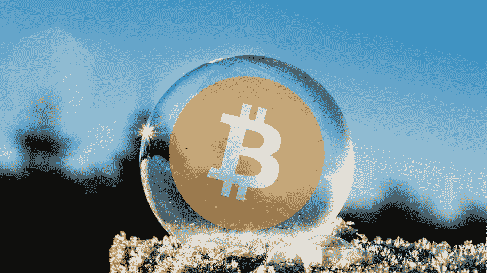

# 美国银行:比特币泡沫已经破裂

> 原文：<https://medium.com/coinmonks/bank-of-america-bitcoin-bubble-has-already-burst-1322fa87653f?source=collection_archive---------6----------------------->

美银美林(BAML)的一组研究人员表示，比特币在“历史上最大的泡沫”之列

首席投资策略师兼研究小组负责人 Michael Hartnett 告诉彭博，BTC 市场已经达到如此高的水平，筛掉了 60%，是一个已经破裂的泡沫。

该银行将比特币与最著名的金融狂热相提并论:Lo System 和南海公司(18 世纪)、黄金、1929 年的美国股市以及 1637 年的荷兰郁金香泡沫。图表显示，比特币是资产价格涨幅最大的一个例子。在加密货币的高峰期，它的价格是 3 年前的 60 倍。同时，当时的郁金香价格仅上涨了 40 倍。

比特币峰值在 2017 年 12 月 17 日为 19 783 美元。现在在 6835 美元水平进行交易。

BAML 图表显示，当著名的历史泡沫破裂时，资产价格保持在新的较低水平。

然而，比特币并不完全符合这种情况。2017 年底和 2018 年初发生的事情并不是世界历史上最大的泡沫，甚至也不是比特币历史上最大的泡沫。在 2010 年和 2011 年，加密货币汇率上涨了 120 倍，达到 11 美元，然后下跌。2013 年和 2014 年的增长也比现在更显著。

尽管如此，BAML 写道，2017 年泡沫与其他泡沫的比较很难说是公平的，因为 2017-2018 年投入的资本比 2010-2011 年和 2013-2014 年多得多。

还有一个因素让比特币与股市的比较变得复杂——资本化。例如，1929 年 8 月，考虑到通货膨胀，纽约证券交易所的资产价值超过 1 万亿美元。

参考—[https://www . Bloomberg . com/news/articles/2018-04-09/bit coin-seen-popping-like-the-great-bubble-by-BofA](https://www.bloomberg.com/news/articles/2018-04-09/bitcoin-seen-popping-like-the-greatest-bubbles-by-bofa)

# ❤️喜欢，分享，留下你的评论

如果你喜欢这篇文章，不要忘记喜欢，与你的朋友和同事分享，并在下面留下你对这篇文章的评论。
跟我来……