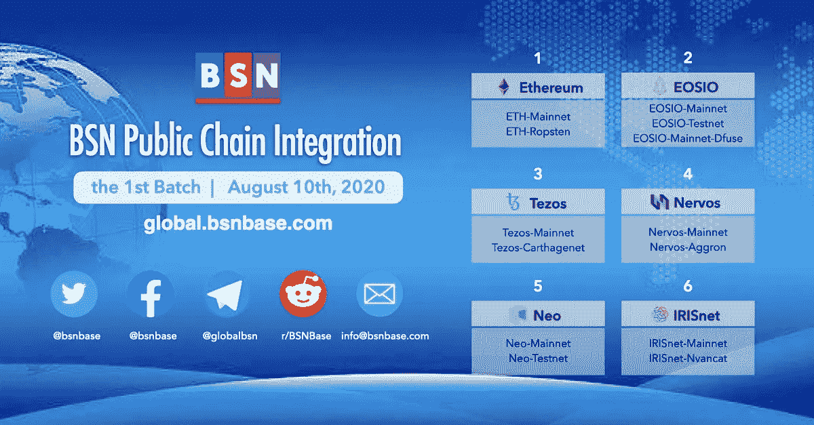
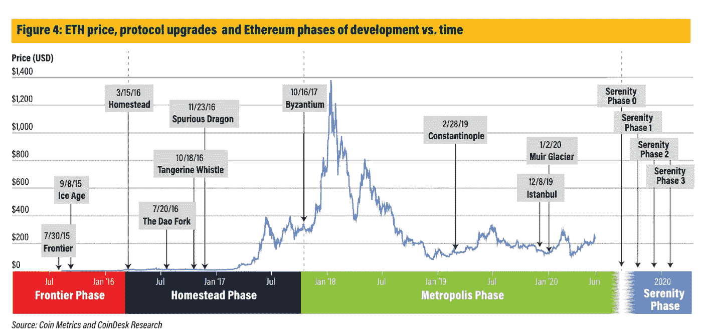

# 银行监管机构允许加密保管/ DeFi 总价值达到 38.4 亿美元/苏斯博士将区块链与数字收藏品相结合

> 原文：<https://medium.com/coinmonks/bank-regulators-permit-crypto-custody-defi-total-value-reaches-3-84b-a9b3308d452e?source=collection_archive---------4----------------------->

*2020 年 7 月 24 日*

***本周景观****……继上周北京的* [***145 页蓝图***](http://www.beijing.gov.cn/fuwu/lqfw/ztzl/yshj/dt/202007/P020200715734061656739.pdf)*(*[*EN 译*](https://law.stanford.edu/wp-content/uploads/2020/07/China_Blockchain.pdf) *) 成为全球* [*枢纽*](https://www.theblockcrypto.com/linked/71992/beijing-government-releases-its-blueprint-for-becoming-a-blockchain-hub) *为区块链科技由****2022****和* ***摩根大通*** *宣布对* [*项目进行 Ubin*](https://www.mas.gov.sg/-/media/MAS/ProjectUbin/Project-Ubin-Phase-5-Enabling-Broad-Ecosystem-Opportunities.pdf?la=en&hash=91091CAD39265C03FF7A4253E70FBEE6D1177714) *， ***新加坡金融管理局* 货币监理署(OCC)****[*宣布*](https://www.occ.gov/news-issuances/news-releases/2020/nr-occ-2020-98.html) *所有国家特许银行均可提供* [*托管服务*](https://www.coindesk.com/banks-in-us-can-now-offer-crypto-custody-services-regulator-says) *为* [*加密货币*](https://www.forbes.com/sites/haileylennon/2020/07/22/bitcoin-meets-banking-as-us-bank-regulator-permits-cryptocurrency-custody/) *。* ***万事达卡*** *和****Visa****分享了他们努力向全球客户提供数字货币和支付解决方案的更多消息，Visa 透露了他们更多的更大计划。OCC 之后不久，总的* [***DeFi 值达到了 3.84 亿美元***](https://defipulse.com/)*……亿。让我们记住这一点，因为就在今年早些时候，我们穿过了$1B。**

**事情并没有‘就此打住……****印度总理*** *力挺区块链为‘前沿技术’在太空领域为国家努力的又一成就。准备好了吗* ***以太坊 2.0*** *即将到来，预计将于 2020 年底发布。***粉丝现在可以在* ***流量区块链****(****Dapper Labs****)上拥有一片不可思议的苏斯博士宇宙作为数字收藏品。NFT 或不可替代的代币正在许多领域迅速建立微观经济，从个人到时尚，到粉丝参与和联系。* ***去中心化*** *和* ***三星区块链*** *联手加速 NFT 采用。NBA 的* ***斯宾塞·丁翁迪*** *通过出售代币筹集了 130 万美元。再加上来自投资者的趋势&见解、采访* ***甲骨文*** *、资金报告、生产部署企业用例、大量研究等等！尽情享受吧！***

## **💳[万事达卡宣布扩大加密货币业务，inks 卡与 Wirex 达成协议](https://www.theblockcrypto.com/linked/72226/mastercard-crypto-card-wirex)**

**万事达卡公布了扩大其加密货币计划的计划，通过增强合作体验，将更多的加密货币和金融科技公司纳入其发卡网络。该公司正在邀请加密货币、金融科技和加密合作伙伴加入万事达卡的加速计划，该计划被认为类似于 Visa 的金融科技快速通道计划，为他们提供快速增长所需的一切。为了支持其努力，它与 Wirex 签署了一项协议，该公司已经在亚洲和欧洲提供了 Visa 卡……[阅读更多](https://www.theblockcrypto.com/linked/72226/mastercard-crypto-card-wirex)**

***相关:📖* [*Visa —推进我们的数字货币方法*](https://usa.visa.com/visa-everywhere/blog/bdp/2020/07/21/advancing-our-approach-1595302085970.html)**

## **👩‍🏫[普罗米修斯学校与 ValidateMe 合作进行区块链数字存储和验证](http://www.businessworld.in/article/Prometheus-School-partners-with-ValidateMe-for-blockchain-digital-storage-and-verification-/15-07-2020-297600)**

**IB 候选学校“普罗米修斯学校”已经与区块链平台 ValidateMe 合作，以便随时访问学生记录。该合作伙伴关系将允许学校验证学术证书、学校报告和反馈整合以及学校转学证书的真实性，同时非常认真地考虑数据和数据安全性。其他相关方，如家长和学生，将有权访问当前的数字记录、整个教育过程和转学流程状态……[阅读更多信息](http://www.businessworld.in/article/Prometheus-School-partners-with-ValidateMe-for-blockchain-digital-storage-and-verification-/15-07-2020-297600)**

***相关:* 🏴󠁵󠁳󠁴󠁸 *󠁿* [*美国得克萨斯州鞍起成为下一个区块链首府*](https://cointelegraph.com/news/us-state-of-texas-saddles-up-to-become-the-next-blockchain-capital)**

## **🇨🇳 [北京公布区块链政府计划](https://technode.com/2020/07/16/beijing-unveils-plan-for-blockchain-based-government/)**

**北京地方政府发布了实施区块链部署的计划蓝图，将交易数据技术集成到城市运营中。长达 145 页的蓝图**(*[*英译*](https://law.stanford.edu/wp-content/uploads/2020/07/China_Blockchain.pdf) *)* 包含了在北京这样的特大城市实现最雄心勃勃的区块链项目的第一步，并于 11 月开始审议选择 12 个应用案例作为该项目的先锋。然而，已经有 140 个政府服务与区块链技术集成，用于数据共享，连接企业以节省时间和疫情控制……[阅读更多](https://technode.com/2020/07/16/beijing-unveils-plan-for-blockchain-based-government/)***

***相关:* 🇸🇬 [*淡马锡力挺区块链项目商业化*](https://www.bloomberg.com/news/articles/2020-07-13/temasek-backs-efforts-to-commercialize-blockchain-projects)**

# **数字货币/中央银行:**

**继上周来自中国和新加坡的消息后，该地区继续显示出巨大的进步，因为[项目联合](https://cointelegraph.com/news/chinese-blockchain-projects-unite-to-push-mainstream-adoption-forward)为区块链主导地位的[冷战](https://www.coindesk.com/money-reimagined-chinas-cold-war-blockchain-strategy)火上浇油。此外，金融巨头蚂蚁集团推出新的区块链品牌“[蚂蚁链](https://www.theblockcrypto.com/linked/72715/chinese-fintech-giant-ant-group-launches-new-blockchain-brand-antchain) [BSN](https://medium.com/u/6a485161573d?source=post_page-----a9b3308d452e--------------------------------) (区块链服务网络)宣布支持[另外六个公共链](https://decrypt.co/36327/chinas-bsn-announces-support-for-six-more-public-chains)——Tezos、NEO、Nervos、EOS、IRISnet 和以太坊。**

****

**Source: [BSN](/@bsnbase/the-bsn-public-chain-integration-plan-first-batch-fb6027e5ca30)**

# **本周的更多内容:**

**🏦[银行不会急于持有 Crypto——但是 OCC 监管机构的批准使得忽视 Crypto 变得更加困难](https://www.coindesk.com/banks-wont-rush-to-hold-crypto-but-occs-regulatory-approval-makes-it-harder-to-ignore)**

**📖[位于怀俄明州的两代情将于 10 月开放，推出一种新的银行发行的数字资产](https://www.coindesk.com/wyoming-based-avanti-to-open-in-october-with-a-new-bank-issued-digital-asset)**

**📖[印度总理支持区块链为“前沿技术”](https://cointelegraph.com/news/indian-pm-backs-blockchain-as-frontier-technology)**

**📖[冒险深入秘密的想法迷宫](https://sunnya97.com/blog/crypto-maze)——[桑尼·阿格沃尔](https://www.sunnya97.com/about/)📖**

**💸 [Avalanche 首次公开募股在 4.5 小时内筹集了 4200 万美元](/avalabs/avalanche-raises-42m-in-4-5-hours-for-its-first-public-sale-d09362bf3efc)——[艾娃实验室](https://medium.com/u/f7c9f4ea738f?source=post_page-----a9b3308d452e--------------------------------)**

**📖[《权力的炼金术》第一部](https://www.aniccaresearch.tech/blog/the-alchemy-of-hashpower-part-i)——[张立嘉](https://twitter.com/leorzhang) & [卡蒂克·文卡特什](https://www.linkedin.com/in/karthik-venkatesh-nyu/)**

**📖[基于使用的支付如何支持基于区块链的综合商业生态系统](/@philippsandner/how-usage-based-payments-are-enabling-blockchain-based-integrated-business-ecosystems-63b3476c76b2)**

**📖 [Figure 的 Mike Cagney:如何在区块链中建立业务](https://www.coindesk.com/figures-mike-cagney-how-to-build-a-business-in-blockchain)**

**📖 [Crypto 不用害怕 GPT 3 号。它应该拥抱它](https://www.coindesk.com/crypto-neednt-fear-gpt-3-it-should-embrace-it)**

**📖[为什么没有区块链我们就不应该有 AI](https://www.forbes.com/sites/forbestechcouncil/2020/07/23/why-we-shouldnt-have-ai-without-blockchain/)**

**📖[德国电信的 T-Systems 现在是一家链式节点运营商](https://cointelegraph.com/news/deutsche-telekoms-t-systems-is-now-a-chainlink-node-operator)**

**📖【**报道**】[区块链最好的分析大脑](https://flipsidecrypto.wpcomstaging.com/2020/07/20/best-analytical-brains-in-blockchain/)**

# **分散式应用程序手表**

## **📖[关于以太坊 2.0 你需要知道的一切](https://www.coindesk.com/everything-you-need-to-know-about-ethereum-2-0)**

****

**Source: [Coindesk](https://www.coindesk.com/research/reports/ethereum-2-0-how-it-works-and-why-it-matters)**

**以太坊 2.0 来了。历时数年的升级——旨在彻底改变世界上最大的智能合同平台——正在慢慢接近部署。以太坊基金会最近宣布了“T0”Medalla，这是 Eth 2.0 信标链 mainnet 发布之前的最后一次测试。截至 7 月 10 日，包括[以太坊](https://medium.com/u/d626b3859bc9?source=post_page-----a9b3308d452e--------------------------------)创始人[维塔利克·布特林](https://www.reddit.com/r/ethereum/comments/ho2zpt/ama_we_are_the_efs_eth_20_research_team_pt_4_10/fxizbhp/)在内的一些开发者估计，经常被推迟的 Eth 2.0 将于今年年底推出……[阅读更多](https://www.coindesk.com/everything-you-need-to-know-about-ethereum-2-0)**

***相关:📖【* ***报告****】*[*以太坊 2.0:工作原理及重要性*](https://www.coindesk.com/research/reports/ethereum-2-0-how-it-works-and-why-it-matters)*——*[*coin desk*](https://medium.com/u/f2fa6f2d51a6?source=post_page-----a9b3308d452e--------------------------------)**

## **📖[由 CryptoKitties](/dapperlabs/dr-seuss-digital-collectibles-on-flow-by-the-creators-of-cryptokitties-7651835643a7)—[Roham Gharegozlou](https://medium.com/u/57907c0bb0a6?source=post_page-----a9b3308d452e--------------------------------)的创作者制作的苏斯博士数码收藏品**

**流量[上的苏斯博士](https://medium.com/u/22ac47d15ea7?source=post_page-----a9b3308d452e--------------------------------)让粉丝以一种前所未有的方式拥有不可思议的苏斯博士宇宙的一部分——作为区块链流量上智能合同创建和保护的数字收藏品。**

****

**[Source](/dapperlabs/dr-seuss-digital-collectibles-on-flow-by-the-creators-of-cryptokitties-7651835643a7)**

**粉丝们竞相收集这些限量版的苏斯博士世界物品，用它们来完成解锁新的和隐藏的独家内容。如果一个粉丝错过了，他们必须与其他粉丝交易以完成他们的收藏，建立生态系统中的参与，并推动粉丝扩大他们对知识产权领域的知识……[阅读更多](/dapperlabs/dr-seuss-digital-collectibles-on-flow-by-the-creators-of-cryptokitties-7651835643a7)由[达帕实验室](https://medium.com/u/6544777e30d2?source=post_page-----a9b3308d452e--------------------------------)**

## **📖 [NFTs:象征(虚拟)未来](/@rhian_is/nfts-tokenizing-the-virtual-future-f0549375d659)**

**平行数字现实已经开始通过游戏、混合现实艺术和密码经济学渗透到我们的物理世界。这也引发了新的伦理困境，我们的社会、法律、经济和行为规则和惯例很容易被全盘移植到我们的平行生命中。另一个问题是二维虚拟世界中身份和所有权的概念。同时，它解决了许多现实世界的问题，就像比特币解决了双重消费问题一样。这些虚拟世界的开发者面临的重大挑战包括协调隐私、身份和所有权的概念，这些概念在不同的司法管辖区有很大的差异，并就解决争议的治理结构达成一致… [阅读更多信息](/@rhian_is/nfts-tokenizing-the-virtual-future-f0549375d659)**

***相关:📖* [*NBA 的斯宾塞·丁翁迪通过出售代币筹集了乏善可陈的 130 万美元*](https://decrypt.co/36427/nba-spencer-dinwiddie-raises-1-3-million-token-sale-sd26)**

**📖 [Crypto 将改变价值，NFTs 将改变社会](https://andrewsteinwold.substack.com/p/crypto-will-change-value-nfts-will)**

**📖[机器人如何从以太坊最大的 DeFi 应用中窃取 800 万美元](https://decrypt.co/36461/how-bots-helped-take-8-million-from-ethereums-biggest-defi-app) — [解密](https://medium.com/u/2de7a312127a?source=post_page-----a9b3308d452e--------------------------------)**

**📖[为什么我把自己变成了 NFT](/@coin_artist_17801/why-i-turned-myself-into-an-nft-6fe08cb7aca8)——[玛格丽特·德库尔](https://medium.com/u/22684087c704?source=post_page-----a9b3308d452e--------------------------------)**

**📖[分散的时尚品牌正把消费者变成创造者](https://decrypt.co/36122/decentralized-fashion-brands-are-turning-consumers-into-creators)**

**📖[chain link——一个去中心化的区块链甲骨文网络——第二部分](/coinmonks/chainlink-a-decentralized-blockchain-oracle-network-part-2-1cecdfb93169)——[Ruma Das](https://medium.com/u/138b3823e81?source=post_page-----a9b3308d452e--------------------------------)**

**📖[去中心化和三星区块链联手加速 NFT 空间](https://decentraland.org/blog/announcements/decentraland-and-samsung-blockchain-team-up-to-accelerate-the-nft-space/) — [去中心化](https://medium.com/u/98348dd48afe?source=post_page-----a9b3308d452e--------------------------------)**

**📖[如何为数据经济构建强大的 Web3 应用](https://crypto-current.co/build-powerful-web3-apps-data-economy/)**

# **📺基线上的知识下降& #VCTV:**

**本周在我们的第二集 [**中，基线**](https://www.baseline-protocol.org/) **、** [约翰·沃伯特](https://medium.com/u/26a7c53cdfeb?source=post_page-----a9b3308d452e--------------------------------)和我与[伊恩·基恩](https://medium.com/u/1ac0adec6884?source=post_page-----a9b3308d452e--------------------------------)甲骨文就他们在区块链和业务自动化方面的努力进行了分解。每周三美国东部时间中午 12:00 在 YouTube 上直播。每周我们都会与客人讨论 mainnet、基线协议、企业中的区块链以及他们对业务自动化的见解。**

**Source: [YouTube](https://youtu.be/V2zK2gMgZc4?t=217)**

# **🎙️研究:2020 年区块链和 DApps 状况:**

****

**Source: [Topio Networks](https://www.topionetworks.com/markets/dapps-stack-landscape-5de8d07eb9abe453e04203f8)**

***现已提供，免费是我最新研究的去中心化应用或*[***【DApp】【栈】景观图***](https://s3.amazonaws.com/spoke-profiles-prod-assets/uploads/a069e1e1e798c975d4eca968c72f4ac1352d62a4/original/DApps_Stack_Landscape_Q2_2020.pdf?utm_source=Social%20Media&utm_medium=LinkedIn&utm_campaign=Topio%20-%20Dapps%20Landscape%20update&utm_content=S3%20Link)**—Q2 2020 版。这张地图提供了新兴 DApps 行业的全面概述和分类，突出显示了在构建下一代应用程序中发挥重要作用的 400 多家全球公司。作为奖励，我包括了一些生态系统玩家和团体，当你准备发布你的应用时，你需要熟悉它们。如果这是你看到的第一个版本，那就把它当作你进一步理解不仅仅是这个行业，而且是构建一个完全或部分去中心化的应用程序所需的所有核心技术的指导性路线图(DApp)。****

****

**Source: [Topio Networks](https://www.topionetworks.com/markets/blockchain-landscape-5bf43854b9abe4633c1f87da)**

***另外，可以找我的《Q1 2020 研究》整个* [***区块链格局***](https://www.linkedin.com/posts/kyleellicott_q12020-blockchain-landscapekyleellicotttopionetworks-activity-6638879840634310656-UNtB) *。这是《风景》的第五版。你会发现地图上包括 747 家公司(总共 900 多家独特的+更广泛的关键生态系统参与者)，它们从 2010 年到 2020 年筹集了 220 多亿美元的资金，仅 2017 年以来就投资了 180 多亿美元！***

**📣*想要了解区块链、DApps、DeFi 和 FinTech 行业的所有头条新闻、投资、深入研究和最新动态吗？* [***订阅***](https://www.topionetworks.com/newsletters) *并关注我的* [***推特***](https://twitter.com/kyleellicott) *获取每周更新及更多！***

> **[*直接在您的收件箱中获得最佳软件交易*](https://coincodecap.com/?utm_source=coinmonks)**

****