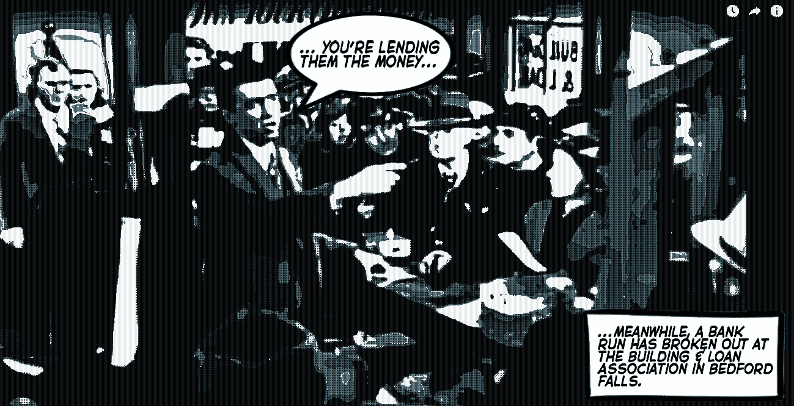
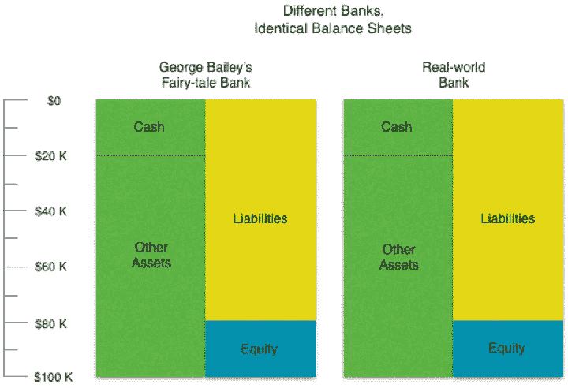
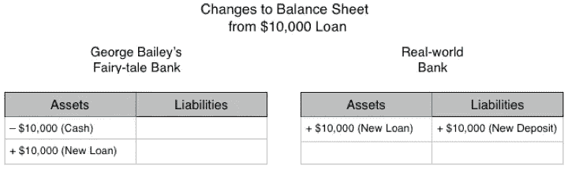
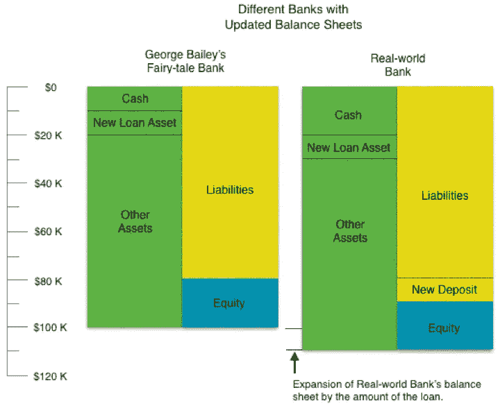
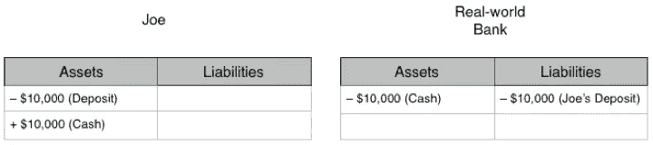
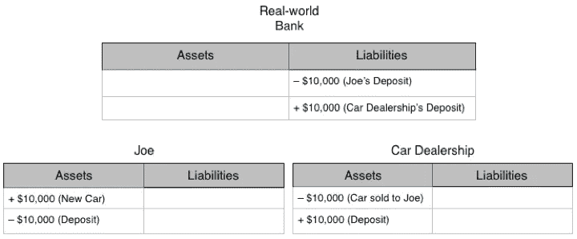
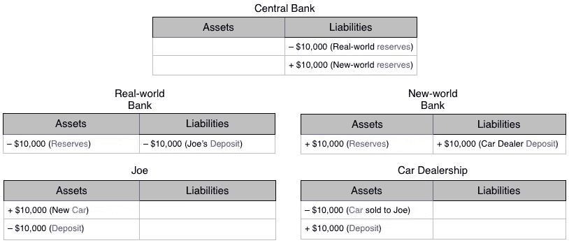
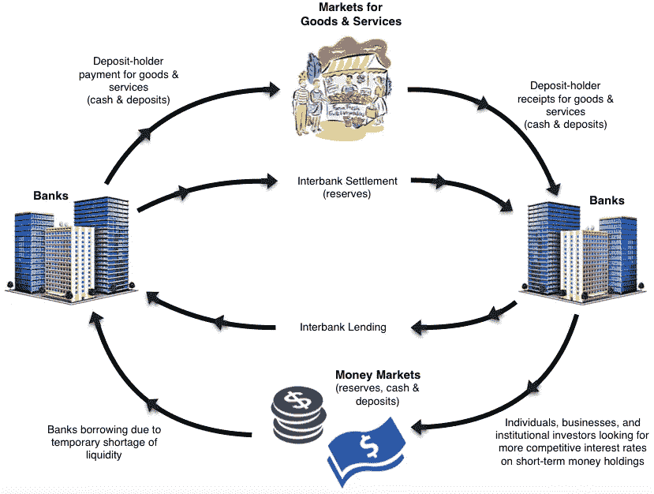
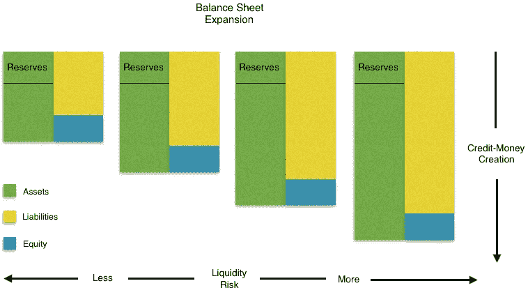

# 寄希望于《美好生活》中的一部小说

> 原文：<https://medium.com/coinmonks/banking-on-a-fiction-in-its-a-wonderful-life-ea32bb1e3e85?source=collection_archive---------4----------------------->

"财务困境的本质是信心的丧失."

——查尔斯·p·金德尔伯格( [*狂乱、恐慌和崩溃*](https://books.google.ca/books?id=Er-6QkkQkeEC&pg=PA94&dq=The+essence+of+financial+distress+is+loss+of+confidence+kindleberger&hl=en&sa=X&ved=0ahUKEwiA08e6is7ZAhWO3oMKHVwWAiMQ6AEIJzAA#v=onepage&q=The%20essence%20of%20financial%20distress%20is%20loss%20of%20confidence%20kindleberger&f=false) *、*最初发表于 1978 年 *)*

你有没有担心过，当你去银行取钱时，银行实际上不会给你任何钱？没有吗？那很好。这意味着，在政府的一点点帮助下，银行在保护(不一定是你的钱，而是对银行业一个伟大幻想的信心)方面做得很好。

我这么说是什么意思？让我们来看看乔治·贝利的建筑和贷款协会银行，找出…

Source: YouTube

这就是你所说的银行挤兑，如果老好人乔治·贝利以前不知道遭受流动性危机是什么样的，他现在肯定知道了。

乔治，钱在哪里？

像乔治·贝利的存款人一样，你可能想知道为什么银行没有他们的现金。有一个简单的原因，但它与乔治提出的原因不同。尽管乔治看起来是一个值得尊敬和诚实的人，但他对银行没有现金支付给存款人的理由有点扭曲。

现在，这部电影的导演弗兰克·卡普拉可能是一个被误导的人，陷入了银行借出存款人现金的普遍谬论。当然，这就是乔治所说的“……你的钱在乔的房子里，就在你的房子旁边(他指着另一家银行的客户)……你借钱给他们建房子，然后他们会尽可能还给你！你打算怎么办？取消他们的赎回权？?"

如果我说过一次([这里](/@mattdjohnston92/canadian-banks-create-money-too-6c69e2c3d8f5))，我已经说过一千遍了，银行是不会把别人的现金借出去的。事实上，他们根本不借出现金。《这是美好的生活》中描述的被误导的观点可能有助于解释为什么仅仅两年后就有人创作了这个短片。

Source: YouTube (Thanks to Éric Tymoigne, whose textbook draft, “The Financial System and the Economy,” is where I first encountered this video.)

你听说过贷款时不换手的那部分吗？这与乔治·贝利告诉他的存款人的故事不同。他试图说服他们相信，他们存入的现金正被直接贷给其他人，以便这些人可以用这些钱买些东西，比如一个新房子。

人们一般不会用现金(或其他很多东西)买房。他们通过提取银行存款账户的余额来购买。诚然，人们可以将现金兑换成更高的余额，但银行也可以通过扩大存款人信用来增加余额。换句话说，当银行向借款人发放贷款时，它将贷款记入借款人的存款账户。它不会给借款人现金。

让我们来说明两种截然不同的观点。首先，这里有两份完全相同的银行资产负债表，一份是乔治·贝利的童话般的银行，另一份是真实的世界银行(不要与真实的世界银行混淆)。

在这个初始阶段，两个资产负债表是相同的。每家银行都有 100，000 美元的资产，80，000 美元的负债和 20，000 美元的权益，这符合资产=负债+权益的基本会计原则。还要注意，每家银行都有 20，000 美元的现金资产。

让我们假设乔治银行的客户之一乔想借 10，000 美元。乔治·贝利的童话般的银行将通过直接将现金交给乔并在其资产负债表上记录一项新的贷款资产来发放贷款。另一方面，真实世界银行会贷记乔的存款账户，同时在资产负债表的资产端记录一笔新的贷款。这个过程看起来会像这样。

这家童话般的银行记录了一笔新的贷款资产，同时将 10，000 美元现金交给了 Joe。然而，真实世界的银行却没有这样做。相反，它记录了一项新的存款负债，即承诺向乔支付 10，000 美元现金。这就是你们所说的信用创造，正如第二个视频所声称的那样。这也是我所说的货币创造(这里的)，因为存款构成了货币供应的一部分，因此，新创造的存款等于新创造的货币。

更新后的资产负债表看起来会像这样。

有一些明显的区别。这家童话般的银行现在的现金只有以前的一半，而其资产负债表的规模却没有变化。另一方面，真实世界的银行仍然拥有和以前一样多的现金，但是它的资产和负债都增加了 10，000 美元。因此，它的资产负债表扩大了同样的数量。那么，这意味着什么呢？

首先，乔治暗示银行只是一个中介，吸收储户的现金，然后借给借款人，而[普遍的误解](https://www.monetary.org/wp-content/uploads/2016/03/money-creation-in-the-modern-economy.pdf)，正是这样，一个误解。银行不仅仅是将购买力从储户转移到借款人的中介。他们创造了它。

其次，如果童话般的银行故事是真的，人们可以看到，银行可以发放的贷款额度是有明确限制的。这家童话般的银行的总现金储备代表了其最大总放贷能力。一旦藏起来的钱没了，就没有贷款了。相比之下，在其他条件相同且没有任何政府监管的情况下，现实世界银行的贷款限额是多少并不明显。其资产负债表的扩张可能是无限的。

我们可以推测一个潜在的极限，如果我们进行一个思维实验，假设一旦贷款完成，乔将他的 10，000 美元存款赎回现金，将会发生什么。

回顾现实世界银行在向 Joe 发放贷款后的资产负债表，并考虑到这一新交易，很有启发性地发现新的资产负债表看起来与童话中银行的资产负债表一模一样。

这个思维实验表明，只要人们能够被说服以存款而不是现金的形式持有他们的钱，银行就有无限的放贷能力。然而，存款人要求现金赎回的风险总是存在的，随着银行通过创造信贷扩大资产负债表，这种风险也会增加。如果说乔治·贝利以前没有意识到这种风险，那么现在他肯定明白了。

失去了存款人的信任，乔治试图通过在这个问题上摆出一副友好的面孔(请注意，不是他自己的面孔)来利用他们的公共情感。如果你现在要求所有的现金，那你就要取消你邻居的赎回权！！记住[两大戒律中的第二条](https://dailyverses.net/mark/12/31)“爱你的……”，好了，你明白了。

不用说，乔治的存款人一点也不同意。他们都想要现金，而且现在就想要。但是，问题就在这里。尽管银行接受现金来换取存款，但它们也创造存款，但同时并不获取现金。由于这两种类型都是支付现金的承诺，银行不可能一次兑现所有这些承诺。这两种支付承诺看起来完全一样，尽管它们来自不同的过程，这正是现代银行业所依赖的虚构。

为了维持这种幻想，银行必须保持存款人对其兑现承诺能力的信心。当对这种虚构的信心消失时，银行就有遭受类似命运的风险。

**支撑小说**

银行要保持信心，相信自己永远能够兑现承诺，最好的办法是在需要的时候兑现承诺。显然，在银行挤兑期间这是很困难的。但银行挤兑通常是在信心丧失之前发生的罕见事件，而不是信心丧失的原因。在银行的日常业务中，它必须证明自己有能力兑现支付承诺。

一种方法是相对于存款负债保持合理规模的现金缓冲。在储户希望将存款兑换成现金的情况下，银行可以动用这笔缓冲资金。储户确实会这么做，这不仅是因为银行挤兑，还因为他们的一些支付通常用现金更方便。这种现金缓冲构成了银行的现金储备。但对现金的需求只是银行面临的一种支付义务。

当存款人依靠存款转移而不是现金兑换进行支付时，就会产生另一项义务。虽然许多小额交易仍使用现金，但大额交易是通过支票、借记卡、汇票和其他各种支付方式完成的。为了理解这些支付方式是如何对银行施加单独的义务的，浏览几个例子是有帮助的。

假设 Joe 想用现实世界银行的贷款购买一辆价值 10，000 美元的新车。为了付款，Joe 给汽车经销商开了一张 10，000 美元的支票。如果我们假设 Joe 和汽车经销商都在真实世界的银行有帐户，真实世界的银行将以下面的方式处理交易。

这很简单。乔得到了一辆车，汽车经销商得到了钱，银行所要做的就是借记乔的存款账户，贷记汽车经销商的账户。银行现在欠汽车经销商 1 万美元，而不是欠乔 1 万美元。但只要汽车经销商愿意继续以现实世界银行存款负债的形式持有其新财富，现实世界银行就不必拿出任何现金来支付。

然而，如果出于某种奇怪的原因，汽车经销商决定现金是唯一可以接受的支付形式，那么现实世界的银行将被要求将现金交给 Joe，Joe 将使用现金支付汽车经销商。如果汽车经销商把现金塞在床垫下，而不是存在他们在真实世界银行的账户里，银行的现金储备就会减少。这种减持将增加该行的流动性风险，因为它没有足够的缓冲来满足类似的现金赎回需求。

不用说，真实世界银行更喜欢非现金形式的支付而不是现金形式——现金越少意味着现金缓冲越少，因此流动性风险越大。然而，只要我们引入另一家不同的银行(汽车经销商在该银行开展业务)，交易中的非现金偏好就变得有点没有意义。我们将把这家银行称为新世界银行。

在这种新的两银行场景下，乔对汽车经销商的付款将产生对真实世界银行的付款义务，这可以通过其在中央银行的存款账户来结算。这种存款账户通常被称为准备金，它与现金一起构成了银行的总准备金。Joe 的付款可表示如下。

乔和汽车经销商之间的交易现在引发了两家独立银行之间的交易。这项交易通过中央银行的资产负债表进行，中央银行借记真实世界银行的储备账户，贷记新世界银行的储备账户。在这种情况下，就像乔支付现金的情况一样，真实世界银行的总储备下降，再次增加了银行的流动性风险。

稍微扩大一下视野，值得记住的是，这样的支付(价值更大和更小的)整天都在发生。在一些经济学家的理想幻想世界中，例如，在一天的相对短的时间内，银行之间的所有支付流可能会归零。如果是这样的话，银行家们就会知道，全天支付流量失衡所产生的任何流动性风险都是暂时的。但当然，我们生活在现实世界中，日常失衡司空见惯。

然而，尽管导致储备流动失衡的支付流动失衡似乎构成了一个问题，但它也提出了一个可能的解决方案。除了极少数存款人将存款兑换成现金并藏在床垫下的情况之外，一家银行的流出就是另一家银行的流入。现在，如果有一个市场，让经历资金外流的银行能够向经历资金流入的银行借款就好了。结果是有的。这叫做货币市场。

事实上，有不同类型的货币市场，但想法很简单:这是一个寻找短期资金的人可以找到那些拥有过剩流动资金、希望赚取有竞争力的利率的人的空间。在这个领域，我们发现银行在争夺个人和企业存款。我们发现，像养老和养老基金这样的机构投资者正在寻找一个短期的地方，将他们的流动资金存放在长期投资之间。是的，我们甚至发现了银行间隔夜拆借市场，银行之间直接交易，知道如果他们今天是贷款人，明天也可能是借款人。

如果银行能够在彼此之间来回调整现金和储备，从而使任何因支付流失衡而导致的流动资产损失都是暂时的，那么流动性风险就被保持在最低水平，或者至少看起来是这样。事实上，如果这种重组保持平稳，即使银行的储备相对于负债的比例因资产负债表的扩张而下降(如下图所示)，

然后，流动性风险开始退居幕后，成为过去危机的短暂记忆…

…回到现实世界，在现实世界中，摩擦可能并且有时确实会发生。这就是为什么有一个备用的流动性来源总是有帮助的。你知道，就像这样…

Source: YouTube

嗯……动用蜜月基金——这是一个敬业的银行家，而且是银行家的妻子！但不管是好是坏，对吗？

**而对于更富有或…**

尽管如今的银行家或许能够负担得起一些相当奢侈的蜜月，但除了蜜月基金，他们还有其他手段来应对暂时的流动性危机。他们有政府，政府有兴趣确保银行体系继续平稳运行，因为它在为新的创业企业和经济增长融资方面发挥着重要作用。

通过政府的代理人中央银行，银行可以在由于货币市场上有时出现的各种摩擦而无法获得短期备用资金的情况下获得短期备用资金。这些通常被称为常备流动性工具的工具，旨在为有偿付能力的银行在遭遇暂时短缺时提供一种获得流动性的途径。这种流动性备份可以防止金融体系中的一个小插曲演变成一场全面危机。这一切都与信心管理有关，维持一个平稳运行的支付系统有助于维持信心。

存款保险是帮助维持它的另一种方式。这种保险是政府对存款人的明确担保，在银行破产的情况下，政府会补偿他们的损失。简单地说，有这样的保险有助于让存款人放心，他们的钱确实是安全的。这种保证本身可能有助于防止银行挤兑，以及此类事件带来的银行倒闭风险的增加。

当然，一家银行倒闭没那么糟糕。事实上，在竞争激烈的市场经济中，强者和有能力的人得到奖励，而软弱和浮躁的业余者受到惩罚，这是意料之中的事。然而，一家银行倒闭的问题是，由于金融体系的相互关联性，它可能引发其他银行倒闭。一家银行倒闭，还不算太糟。完全的金融崩溃，不太好。

大约十年前，在雷曼兄弟破产后，美国金融系统正面临着崩溃的威胁，我已经在这里讨论过这个问题。为了防止这样的灾难发生，美国政府介入救助银行，在危机时刻提供比通常的短期流动性支持更多的隐性担保。这不仅仅是某种暂时的流动性危机(尽管有人可能会假设，如果政府更早介入，不让雷曼破产，这种危机就有可能发生；但是，嘿，开始给一个愚蠢的业余爱好者免费赠品，然后你必须给所有人免费赠品——等等，什么？！).

这种担保的问题在于，无论是存款保险形式的显性担保，还是银行纾困形式的隐性担保，它们实际上都可能让人产生过度的信心。也就是说，当存款人将现金换成银行存款负债时，他们和银行家在正常业务过程中都可能对自己承担的风险感到自满，因为政府在背后支持他们。这就是道德风险问题。

> [在您的收件箱中直接获得最佳软件交易](https://coincodecap.com/?utm_source=coinmonks)

出于这个原因，政府要求银行遵守其规则以换取这些担保，或者像古德哈特和舍恩梅克[声称的](https://www.researchgate.net/publication/5055482_Institutional_Separation_between_Supervisory_and_Monetary_Agencies)，“谁付钱，谁说了算”其中一个规则是流动性要求，规定银行必须保持最低水平的高流动性资产，如现金和储备，以防异常赎回或转移存款。我的意思是，嘿，如果这样一个有利可图的联盟要持续下去，双方都必须愿意做出妥协，对不对？

