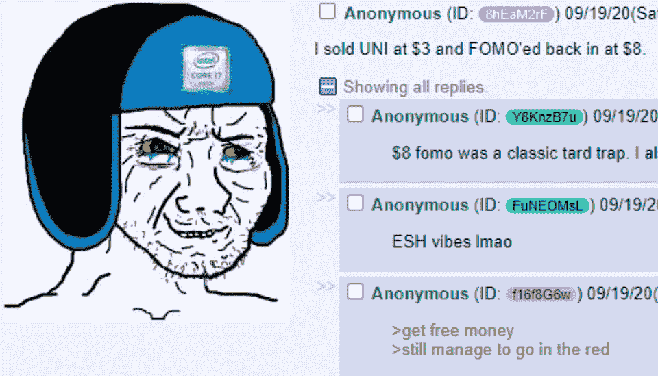
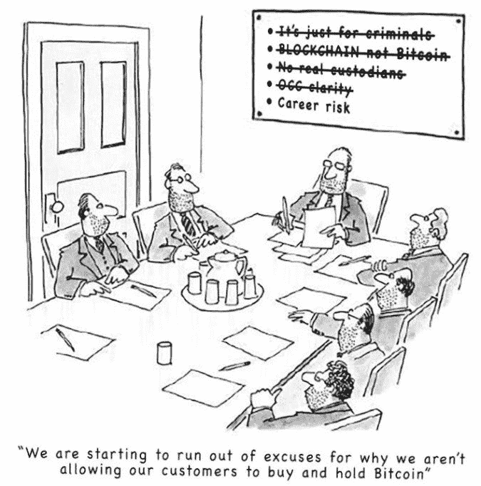
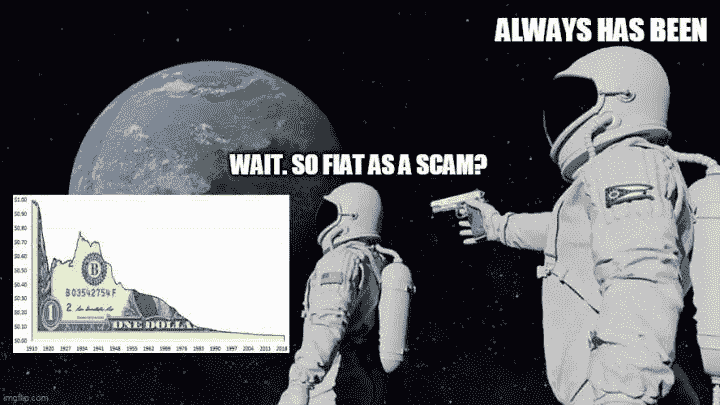
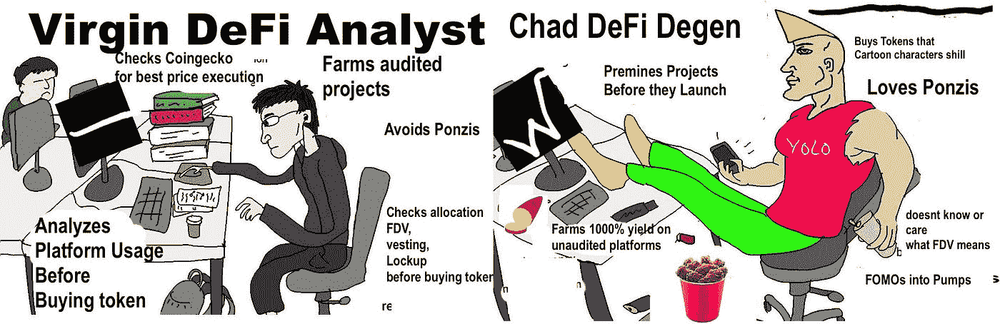
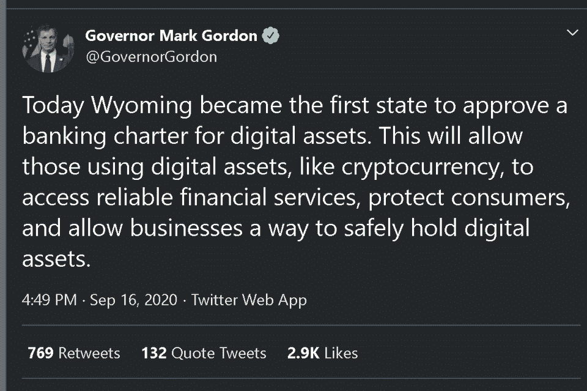

# 银行在洗钱和对抗政府/北海巨妖现在是一家银行/ Uniswap Airdrop

> 原文：<https://medium.com/coinmonks/banks-are-laundering-money-and-defying-governments-kraken-is-a-bank-now-uniswap-airdrop-334c79619ffc?source=collection_archive---------4----------------------->

## 欧盟监管机构准备应对稳定的货币威胁/数字人民币瞄准美元主导地位

上周，Uniswap 发布了其治理令牌 UNI ,并空投给每一位过去使用过 Uniswap 的用户。是不是很酷？😎

目前，我没有任何$UNI 令牌，我想建议不要 Fomo。你有自己的研究，并通过加密推特废话削减。

总是问为什么？为什么这个令牌很值钱？除非你得到明确的答复，否则不要冒险。

**我的个人观点**——治理令牌被高估了，除非它们从协议费/收入中获得很大一部分价值。

## 试试 [Quadency](https://blog.coincodecap.com/go/quadency)

寻找易于使用的一体化加密交易解决方案？阅读我们的[季度回顾](https://blog.coincodecap.com/quadency-review-a-crypto-trading-automation-platform)。

[Quadency](https://blog.coincodecap.com/go/quadency) ，2018 年推出的密码交易自动化平台。它给你带来了一个更聪明的方式来交易和管理你的密码。

## 最新消息📰

*   秘密文件显示罪犯如何利用著名的银行资助恐怖和死亡，而政府却没有阻止
*   中国数字人民币[瞄准](https://www.reuters.com/article/us-china-pboc-yuan-digital/china-needs-first-mover-advantage-in-digital-currency-race-pboc-magazine-idUSKCN26C0NR)美元主导地位
*   联邦监管机构称，美国银行可以为稳定的货币发行者持有储备资金
*   停止在美国到处乱搞[公共令牌空投](https://www.coindesk.com/token-airdrops-icos-defi)
*   北海巨妖正在怀俄明州开办一家加密银行，为可能的股票发行铺平道路
*   由于对欧洲冠状病毒的担忧，T21 股市下跌，比特币下跌
*   [在 Devs 中，我们信任](https://cryptonews.com/exclusives/in-devs-we-trust-bitcoin-bugs-die-in-secret-leaving-altcoins-7762.htm):比特币病毒秘密死亡，使替代币处于危险之中
*   随着 DeFi 冷却，Altcoin 泵上瘾者[闻到 NFTs](https://cryptonews.com/news/cryptoverse-sets-its-eyes-on-rising-nfts-debating-if-they-re-7782.htm) 中的新鲜血液
*   比特币采矿[合法化](https://cryptonews.com/news/bitcoin-mining-legalized-in-venezuela-miners-must-join-natio-7795.htm)在委内瑞拉，矿工必须加入“国家资金池”
*   Graph [与 CoinGecko、CoinMarketCap、Messari、Delphi、Zapper &等一起推出](https://thegraph.com/blog/curator-program-launch)策展人计划
*   万事达卡[支持 CBDCs 苹果](/coinmonks/kraken-becomes-first-us-crypto-bank-mastercard-enabling-cbdcs-apple-pushing-back-on-dapps-b90670e36d28)推回 DApps

> 买一个 [**硬件钱包**](/coinmonks/the-best-cryptocurrency-hardware-wallets-of-2020-e28b1c124069) 保护你的加密货币。

[Source](https://twitter.com/lopp/status/1305923462913912832/photo/1)

## 好的读物📑

*   这是个愚蠢的想法
*   欧盟监管机构正在追逐稳定的收入
*   停止在美国到处乱搞[公共令牌空投](https://www.coindesk.com/token-airdrops-icos-defi)
*   去中心化者的困境
*   世界储备货币的历史:1250-1535 年的意大利文艺复兴标准
*   稳定的货币威胁着国家的货币主权
*   波尔卡多(Polkadot)——早期深度分析

[Source](https://cimg.co/w/articles-attachments/3/5f6/5afdb330ca.jpg)

## 开发商

*   1559 的状态—更新 001🔥
*   如何[在以太坊上实现无气](/coinmonks/how-to-implement-gas-less-transactions-on-ethereum-9f9273d2f059)交易
*   [ETH2.0 快速](https://blog.ethereum.org/2020/09/22/eth2-quick-update-no-17/)更新——此处也可阅读
*   获取最新 [Uniswap 对](https://bitquery.io/blog/uniswap-pool-api)列表的简单 API
*   单个 API 获取[以太币令牌余额](https://bitquery.io/blog/etheruem-token-api)
*   使用 Geth 和 Web3.js 部署您的第一个私有以太坊智能合约
*   模糊化[BLS-预编译](/coinmonks/fuzzing-the-bls-precompiles-ba3728dec622)
*   如何在 CameLigo 延长 FA2 的合同
*   地址[非连锁资金金库更换钥匙](/coinmonks/address-verification-when-changing-keys-for-unchained-capital-vaults-268005e7563e)时的验证
*   [解读](/coinmonks/interpreting-vitaliks-ethereum-roadmap-5f506d783d1b) Vitalik 的以太坊路线图
*   EIP-2938 [账户抽象](https://hackmd.io/@SamWilsn/ryhxoGp4D)解释
*   [温克尔](https://www.benthamsgaze.org/2020/09/16/winkle-a-decentralised-checkpointing-for-proof-of-stake/)——分散式检验点，用于验证利害关系
*   钻石储存的工作原理
*   POA [过渡](https://ethresear.ch/t/poa-transition-to-optimistic-rollup-vm/7983)到乐观汇总虚拟机

[source](https://twitter.com/safetyth1rd/status/1305506037768699904)

## 多方面的

*   [tBTC](https://blog.keep.network/tbtc-the-safe-way-to-use-bitcoin-in-defi-is-live-on-tbtc-network-de2bb8b6eaf7) 在线(第二次)
*   斯帕迪纳发射台正在直播
*   [麻雀](https://www.sparrowwallet.com/)比特币钱包
*   **Fe** 是以太坊区块链的新兴[智能合约语言](https://github.com/ethereum/fe)
*   [创建 Eth 应用](https://github.com/PaulRBerg/create-eth-app)

## 黑客马拉松和会议👷

*   [EthOnline 黑客马拉松](https://www.ethonline.org/)(**9 月 23 日**申请截止)
*   [破解](https://near.org/rainbow/)Rambow—Near 协议
*   [开世界峰会](https://www.onflow.org/open-world-summit)乘流区块链
*   神奇的[密码会议](https://btcm.co/reserve-currencies-1/) VR
*   [**hack atom V**](https://hackatomv.devpost.com/)**，**虚拟黑客马拉松
*   诚实[秘密](https://underhanded.soliditylang.org/)竞赛

## 播客💽

*   为什么[货币贬值](https://art19.com/shows/late-confirmation/episodes/eaf98b68-2e9a-4f69-be8a-4a438f333ac4)不可避免
*   谁是 [Pak](https://thecontrol.co/who-is-pak-e89b12b0f0af) ？

## 加密交易和折扣🔖

*   BlockFi 为注册和存款提供 250 美元的 USDC 奖金
*   全新 [Trezor 钱夹套](https://shop.trezor.io/?offer_id=10&aff_id=5199)有多种颜色可选
*   *试用*[*Hypertrader*](https://hypertrader.app/?utm_soruce=coinmonks)*并使用优惠券****COINCODECAP****获得****15%****折扣*
*   使用[此链接](https://webapp.coinrule.io/coupon/coinmonks-7-25-3-e2bf6c60e795407381edf98d1a174ac2?fp_ref=coincodecap)在 [Coinrule](https://webapp.coinrule.io/coupon/coinmonks-7-25-3-e2bf6c60e795407381edf98d1a174ac2?fp_ref=coincodecap) 享受 7 天免费试用和前 3 个月 25%的折扣
*   *试用* [*哈森在线*](https://www.haasonline.com/?ref=11087) *并使用优惠券****COINCODECAP****获得****10%****的折扣👏*

## 产品评论📙

*   [神童评论](https://blog.coincodecap.com/wunderbit-review)——社交密码交易赚大钱
*   [eToro vs Shrimpy](https://blog.coincodecap.com/etoro-vs-shrimpy)
*   [哈森在线评论](https://blog.coincodecap.com/haasonline-review)—2020 年最佳交易机器人(九折优惠券)
*   you hodler——4 种简单的赚钱方法
*   [Hodlnaut 评论](https://blog.coincodecap.com/hodlnaut-review)——Hodl 的最佳方式是赚取比特币的利息
*   [Botsfolio 评论](https://blog.coincodecap.com/botsfolio-review-automate-crypto-investment) —让您的加密投资自动化的简单方法
*   你需要知道的 2020 年前五大[加密贷款平台](https://blog.coincodecap.com/top-5-crypto-lending-platforms)
*   2020 年最佳加密交易机器人
*   [2020 年最佳密码交易平台](/coinmonks/the-best-crypto-trading-platforms-in-2020-the-definitive-guide-updated-c72f8b874555)

想让我们展示你的产品吗？请通过 [Twitter @coinmonks](https://twitter.com/coinmonks) 联系我们

## 照片说明了一切📷

[Source](https://www.reddit.com/r/Bitcoin/comments/iuqmiy/paving_bitcoins_adoption/)

## 乔布斯

*   Bitquery 正在招聘 [Ruby 开发者](https://angel.co/company/bitquery/jobs)

## 在 Coinmonks 上发布

如果你喜欢在 crypto/区块链空间上写教育文章，并且想在 Coinmonks 出版物上发表。只需在**发邮件给我或者 DM 我**[***推特***](https://twitter.com/coinmonks)**

> ***“如果你喜欢读***[*你也可以捐我们*](/coinmonks/monks-need-your-help-7440418d67ec) *。*****