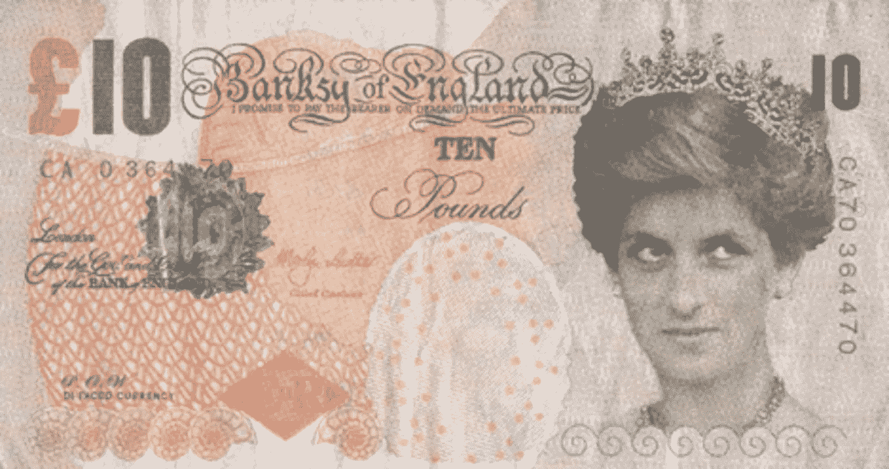
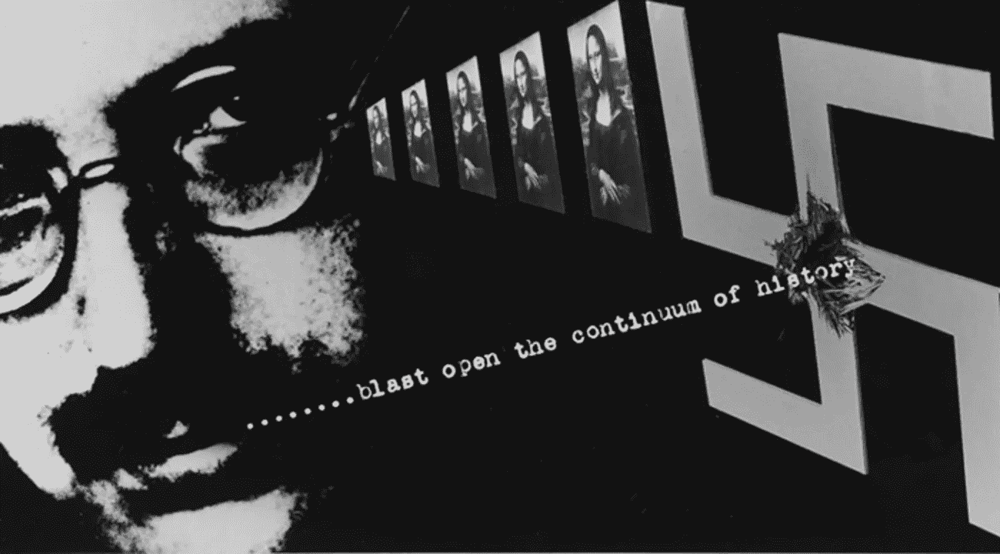

# 班克斯，银行，比特币，纳什均衡，光环，理想艺术

> 原文：<https://medium.com/coinmonks/banksy-banks-bitcoin-nash-equilibrium-aura-ideal-art-a244bca4fdb1?source=collection_archive---------0----------------------->

“Reproduction” Di-faced Banksy note

我们生活的这个现代时代最近被描述为“第二次世界大战加电子邮件”——并且是在松散地引用(至少我是这样猜测的)技术如何推动历史前进；这意味着比特币可能落后于时代，而不是超前于时代？

这种表达方式让我很难理解，我不确定我已经得出或正在得出的结论是否有任何实际意义。

# 摘要印刷品

一篇写于第二次世界大战爆发前的文章，从真实性方面观察了精确艺术复制的副作用:

> “……*即使是最完美的艺术品复制品也缺少一个元素:它在时间和空间中的存在，它在恰好是*的地方的独特存在。”[机械复制时代的艺术](https://en.wikipedia.org/wiki/The_Work_of_Art_in_the_Age_of_Mechanical_Reproduction)

就现代时代而言，在这个时代，消费主义感觉被贬低了，没有了光环，理性可能还不够。

Walter Benjamin

# 艺术与囚徒困境

在博弈论的背景下，对复制和印刷的洞察可以应用于(艺术)领域，因为缺乏原创作品的孕育，图像变得短暂、无处不在、无实质、可用、无价值和自由。

正如[班克斯](https://en.wikipedia.org/wiki/Banksy)所应用的那样，把原作带出画廊——然后有目的地破坏【作品】以保护其价值。

‘Girl with a Balloon’ — aka ‘Love is in the Bin’ by Banksy

# 冷逻辑商品

经济学家并不完全同意印钞——光是这个词就可能让他们畏缩——越是印刷机运转起来就越会驱散现实:一种可信的货币可以和任何数量的纸币一样流通，只要人们普遍相信它所服务的经济现实。

艺术作为一个市场在高端运作，没有明显的目的，除了排他性、故意的流动性，以及所有权是有价格的这一反复无常的现实。

因此，从比喻的意义上来说，鉴于数字市场的分布式特性和[品牌存在](/@jongulson/when-brands-optimise-1b5c033230f3)，一种新的消费习惯心理可能会出现。

在这种情况下，似乎很难逃脱德里达关于比特币起源的观点，比特币是一种非现金形式的*现金*:它是非物质的，没有[的经验基础](/coinmonks/the-bitcoin-problem-4399d89713ab)，并寻找一个普遍存在的理由使自己有用——但它*确实存在*，如果没有明确的原因。

通过询问是什么让艺术变得困难或理想，现实的重新定位很可能会意识到，就这种(比特币)目的而言，Satoshi 正在制造某种艺术吸引力。

> [直接在您的收件箱中获得最佳软件交易](https://coincodecap.com/?utm_source=coinmonks)

