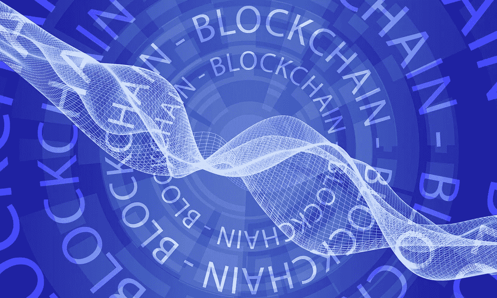

# Baseledger Network:面向企业的安全区块链

> 原文：<https://medium.com/coinmonks/baseledger-network-a-secure-blockchain-for-enterprises-20a756b7c9d7?source=collection_archive---------6----------------------->

“基线协议”，这几天我们经常听到的一个术语，是“企业的以太坊”。那些需要在公共区块链上使用区块链技术而不影响其数据的企业现在选择了基线协议。Baseledger 是运行该协议的公共许可的区块链，由 Baseledger 委员会管理。通常被称为“体系结构的体系结构”，基线网络充当企业组织的基线服务的主网络。作为两家公司(Unibright 和 Provide)的合作，Baseledger 致力于利益相关者共识机制，该机制集成了链外系统(运行于区块链之外)，如客户关系管理(CRM)、企业资源规划(ERP)及其应用程序，如 Microsoft Dynamics。由于其低成本和高性能，它在其他证据网络落后的应用中是有用的。

# 企业基线检查的范围

基线协议使用公共区块链，Baseledger 充当其 Mainnet 或公共参考框架。它支持在以太坊上运行的开源分散金融(Defi)系统。除了 Defi 之外，它还被认为是一种底层分类帐技术，支持其他全球金融多链系统，如比特币和以太坊。它为共识、集成、存储和配置提供了一体化系统。它还有助于协调叶节点共识机制。公司可以使用它来促进工作流退出和令牌化(将敏感和有意义的数据转换为称为令牌的字符串)等过程。它还有助于维护隐私保护工作流(用于保护企业的机密信息)和零知识汇总(零知识是指一方知道另一方拥有某些信息，但不知道信息本身)。

# 充当基线协议的主网络

Baseledger 为企业支持的 mainnet 提供了基线功能，它提供了一个防篡改的、任何人都可以查看的始终在线的状态机。基线协议建立在公共区块链上，不需要暴露企业的私有商业数据，并保持其离线以确保安全。Baseledger 作为基线协议的 mainnet，支持对基线标准至关重要的统一架构。由于不受行业限制，通过使用共识机制，企业组织可以跨多个垂直行业使用 Baseledger。这样，它就像一个合适的主网，可以大规模地跨多个企业工作。该网络充当“UBT 令牌”(Unibright 提供的通用业务令牌)的用例，由工作人员负责节点操作和正确工作。

# Baseledger 的优势

**交易成本低:**在 Baseledger 支持的基线中，交易成本大大降低。在传统的公共区块链中，交易成本来源于矿工的计算能力，矿工可以优先考虑支付更高天然气费的交易。因此，在高网络活动的情况下，汽油费也会提高。另一方面，在基线中，网络节点是已知的，因此不需要交易成本来防止 DDoS 攻击。因为所有的验证器都是已知的，所以不需要很高的计算要求来顺利地进行处理。Baseledger 网络设置预定时间量的交易费用，并将该费用用于除交易验证之外的活动。除了用于奖励矿工的费用之外，一部分费用可以用于执行网络上的其他项目。

**拥有区块链网络的所有优势:** Baseledger，像公共区块链一样，拥有区块链拥有的所有优势:它充当分布式账本，接受不同的加密货币。它是不可变的，并带有强大的共识机制，以确保网络的安全。它帮助企业跨商业生态系统透明地运行他们的系统流程。这提高了没有单点控制的多个流程的效率水平。

**保留了区块链的特性:**有了 Baseledger，企业可以保留他们的业务模型，并且通过使用在架构级别实现的去中心化来保留跨业务流程的效率。它利用了潜在的价值转移技术(加密货币转移)。除此之外，与区块链一样，Baseledger 还帮助企业组织执行记录保存计划，如记录的存储和使用。

**提高性能:** Baseledger 基于一种被称为“Tendermint”的共识机制，它确保节点完全同步。Tendermint 利用拜占庭容错(这意味着网络可以容忍多少恶意节点来达成共识)，因此克服了区块链的工作证明和利益证明机制带来的挑战。在 Baseledger 中，管理委员会决定可以成为验证器的节点，这些验证器需要遵守管理机构设置的法律框架。这确保了问责制，从而提高了网络的性能。由于节点验证器是已知的，所以通过惩罚网络中的节点来抑制任何恶意行为。

**确保数据隐私:**base ledger 网络中的节点确保企业实体的敏感信息保持在链外，从而使任何网络参与者都难以访问它。数据交易被加密，相关的密钥被离线保存。需要时，这些密钥用于解密信息。节点可以根据所有者的请求删除密钥，从而维护数据隐私。因为用于加密的密钥可以被删除，所以不可能访问这些数据。

# Testnet 上线了！！

随着 Baseledger testnet 于 2021 年 9 月 1 日上线，许多公司寻求基线兼容项目的等待结束了。用 CONA 的安德烈·谢莫诺夫的话说，

*“在过去的一年里，CONA 一直在与 Provide 和 Unibright 就基线协议进行合作。我很高兴看到 Baseledger 的进展，并成为 testnet 上的首批节点运营商之一。”*

另一家公司 ConsenSys Mesh 宣布，它将与 Unibright 合作，并提供使用 Baseledger 网络的功能。这三家公司以及 CONA 和其他几个赞助商将于今年 10 月的第一周在亚特兰大科技园组织一次“EthAtlanta 3.0”黑客马拉松(名为“企业以太坊活动”)。

随着越来越多的公司携手为他们的项目建立基线，Baseledger 和底层基线协议的前景似乎一片光明。

> ***要了解更多关于私企、私企的区块链关系网，请点击***[***Hyperledger Fabric***](https://giantsofcrypto.com/hyperledger-fabric/)***和***[***Hyperledger Besu***](https://giantsofcrypto.com/hyperledger-besu/)***。***

> 加入 Coinmonks [电报频道](https://t.me/coincodecap)和 [Youtube 频道](https://www.youtube.com/c/coinmonks/videos)了解加密交易和投资

## 另外，阅读

*   [网格交易机器人](https://blog.coincodecap.com/grid-trading) | [Cryptohopper 审查](/coinmonks/cryptohopper-review-a388ff5bae88) | [Bexplus 审查](https://blog.coincodecap.com/bexplus-review)
*   [加密套利](/coinmonks/crypto-arbitrage-guide-how-to-make-money-as-a-beginner-62bfe5c868f6)指南| [如何做空比特币](/coinmonks/how-to-short-bitcoin-568a2d0b4ae5) | [1xBit 回顾](https://blog.coincodecap.com/1xbit-review)
*   [如何在印度购买以太坊？](https://blog.coincodecap.com/buy-ethereum-in-india) | [如何在币安购买比特币](https://blog.coincodecap.com/buy-bitcoin-binance)
*   [在美国如何使用 BitMEX？](https://blog.coincodecap.com/use-bitmex-in-usa) | [BitMEX 回顾](https://blog.coincodecap.com/bitmex-review) | [买入索拉纳](https://blog.coincodecap.com/buy-solana)
*   [德国最佳加密交易所](https://blog.coincodecap.com/crypto-exchanges-in-germany) | [Arbitrum:第二层解决方案](https://blog.coincodecap.com/arbitrum)
*   [支持卡审核](https://blog.coincodecap.com/uphold-card-review) | [信任钱包 vs MetaMask](https://blog.coincodecap.com/trust-wallet-vs-metamask)
*   [Exness 回顾](https://blog.coincodecap.com/exness-review)|[moon xbt Vs bit get Vs Bingbon](https://blog.coincodecap.com/bingbon-vs-bitget-vs-moonxbt)
*   [如何开始用加密贷款赚取被动收入](https://blog.coincodecap.com/passive-income-crypto-lending)
*   [Coldcard 评论](https://blog.coincodecap.com/coldcard-review) | [BOXtradEX 评论](https://blog.coincodecap.com/boxtradex-review)|[unis WAP 指南](https://blog.coincodecap.com/uniswap)
*   [阿联酋 5 大最佳加密交易所](https://blog.coincodecap.com/best-crypto-exchanges-in-uae) | [SimpleSwap 评论](https://blog.coincodecap.com/simpleswap-review)
*   购买 Dogecoin 的 7 种最佳方式 | [ZebPay 评论](https://blog.coincodecap.com/zebpay-review)
*   [最佳期货交易信号](https://blog.coincodecap.com/futures-trading-signals) | [流动性交易回顾](https://blog.coincodecap.com/liquid-exchange-review)
*   [最佳加密交易信号电报](/coinmonks/best-crypto-signals-telegram-5785cdbc4b2b) | [MoonXBT 评论](/coinmonks/moonxbt-review-6e4ab26d037)
*   [OKEx 评论](/coinmonks/okex-review-6b369304110f) | [Coinswitch 俱吠罗评论](/coinmonks/coinswitch-kuber-review-1a8dc5c7a739) | [比特币基地收费](/coinmonks/coinbase-fees-831e77d4f2c5)
*   [AscendEX 审查](/coinmonks/ascendex-review-53e829cf75fa) | [OKEx 交易机器人](/coinmonks/okex-trading-bots-234920f61e60) | [OKEx 交易机器人](/coinmonks/okex-trading-bots-234920f61e60)
*   [火币交易 Bot](https://blog.coincodecap.com/huobi-trading-bot) | [如何购买 ADA](https://blog.coincodecap.com/buy-ada-cardano) | [Geco？一次回顾](https://blog.coincodecap.com/geco-one-review)
*   [币安 vs 比特邮票](https://blog.coincodecap.com/binance-vs-bitstamp) | [比特熊猫 vs 比特币基地 vs Coinsbit](https://blog.coincodecap.com/bitpanda-coinbase-coinsbit)
*   [如何购买 Ripple (XRP)](https://blog.coincodecap.com/buy-ripple-india) | [非洲最好的加密交易所](https://blog.coincodecap.com/crypto-exchange-africa)
*   [非洲最佳加密交易所](https://blog.coincodecap.com/crypto-exchange-africa) | [胡交易所评论](https://blog.coincodecap.com/hoo-exchange-review)
*   [eToro vs robin hood](https://blog.coincodecap.com/etoro-robinhood)|[MoonXBT vs Bybit vs Bityard](https://blog.coincodecap.com/bybit-bityard-moonxbt)
*   [Stormgain 评论](https://blog.coincodecap.com/stormgain-review) | [Probit 评论](https://blog.coincodecap.com/probit-review) | [北海巨妖评论](/coinmonks/kraken-review-6165fc1056ac)
*   [如何在势不可挡的域名上购买域名？](https://blog.coincodecap.com/buy-domain-on-unstoppable-domains)
*   [印度的秘密税](https://blog.coincodecap.com/crypto-tax-india) | [altFINS 审查](https://blog.coincodecap.com/altfins-review) | [Prokey 审查](/coinmonks/prokey-review-26611173c13c)
*   [Blockfi vs 比特币基地](https://blog.coincodecap.com/blockfi-vs-coinbase) | [BitKan 评论](https://blog.coincodecap.com/bitkan-review) | [期货交易机器人](/coinmonks/futures-trading-bots-5a282ccee3f5)
*   [南非的加密交易所](https://blog.coincodecap.com/crypto-exchanges-in-south-africa) | [BitMEX 加密信号](https://blog.coincodecap.com/bitmex-crypto-signals)
*   [MoonXBT 副本交易](https://blog.coincodecap.com/moonxbt-copy-trading) | [阿联酋的加密钱包](https://blog.coincodecap.com/crypto-wallets-in-uae)
*   [MoonXBT vs Bybit vs 币安](https://blog.coincodecap.com/bybit-binance-moonxbt)
*   [雷米塔诺审查](https://blog.coincodecap.com/remitano-review)|[1 英寸协议指南](https://blog.coincodecap.com/1inch)
*   [买 PancakeSwap(蛋糕)](https://blog.coincodecap.com/buy-pancakeswap)|[matrix export Review](https://blog.coincodecap.com/matrixport-review)