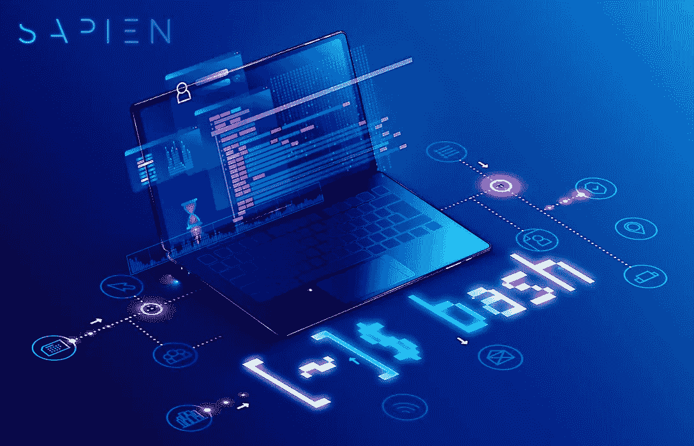

# Bash 脚本:轻型钱包箱

> 原文：<https://medium.com/coinmonks/bash-script-light-wallet-case-624aa04cb216?source=collection_archive---------4----------------------->

本周，Sapien Wallet 团队将发布我们的 Bash 脚本，可以在我们的 Bitbucket [这里](https://bitbucket.org/sapienwallet_mobile/bash_textile_automation/src/taras/)下载。Bash 是一种 Unix Shell 和命令语言，它被广泛用作大多数 Linux 发行版的控制台 Shell。Bash 基本上是一个运行在文本窗口上的命令处理器，用户可以在文本窗口中输入导致操作的命令。

创建 Sapien Wallet Bash 脚本是为了让我们精通技术的追随者能够在我们的用户界面背后看到 Sapien Wallet 是如何真正工作的。通过我们的 Bash 脚本，您将能够看到交易是如何处理的，评级和评论是如何给出和计算的，以及 Sapien Wallet 运行的整体技术。

这对于那些对 Sapien Wallet 感兴趣并且可能希望通过投资或简单地提供反馈来为我们的项目做出贡献的人来说尤其有用。

以下是对 Sapien 钱包如何构建的简要说明，以及不同技术的融合正被用来为用户提供最安全和分散的加密货币轻型钱包。

> 还念:[最佳比特币硬件钱包](/coinmonks/the-best-cryptocurrency-hardware-wallets-of-2020-e28b1c124069)

## **钱包是如何打造的？**

Sapien Wallet 是以 HD wallets(分级确定性 Wallet)为基础构建的，是钱包的构造和架构。通常，加密钱包用于存储用户的加密货币。这是通过存储用户的公钥和私钥来实现的，该公钥可以被发送给其他用户以接收加密货币，该私钥可以被用户用来访问和花费他们自己的加密货币。

这种机制确保了用户加密货币的安全性，但是，用户需要生成一对随机的私钥/公钥，并在每次配置新的一对地址时对其进行备份。随着越来越多的事务被执行，这个过程对用户来说变得非常乏味。

有了高清钱包，用户不需要不断地生成和等待安全密钥。这是通过传递来自单个主种子的所有地址并使用 12 短语主种子密钥的变体来实现的。这使得获得无限数量的新地址成为可能。

## **纺织史**

您可能知道，Sapien Wallet 是分散的，这意味着用户的任何私人数据都不会存储在任何类型的集中式服务器上。我们之所以选择这样做，是因为我们认为用户的隐私是最重要的，因此希望让用户尽可能信任我们的产品。因为钱包是去中心化的，只有用户可以访问他/她自己的钱包，任何人，包括第三方甚至我们，都无法访问你的数据。

为了实现这种去中心化，Sapien 钱包建立在纺织品之上，而纺织品本身主要建立在 IPFS 之上。Textile 提供基于 IPFS 和 libp2p 的加密、可恢复、基于模式和跨应用程序的数据存储。它是一组工具，允许团队及时地构建分散的应用程序。IPFS 允许 Sapien Wallet 通过 IPFS 网络分发和存储数据。

在网络安全方面，Textile 也提供了复杂的加密级别。默认情况下，Textile 使用一种称为 AES-256 GCM 的对称加密类型，这种加密类型将用于加密 Sapien Wallet 上的大多数用户数据和活动。Sapien Wallet 还将在应用程序的不同方面使用不对称加密，采用著名的 NACL 盒加密策略 Curve25519。

## **Bash 脚本**

使用 Sapien Wallet Bash 脚本，用户和测试人员将能够运行 Sapien Wallet 的某些方面，这包括但不限于:发送和接收加密货币，为其他用户留下评级和评论，能够访问他们自己钱包的内容。

此外，Bash 脚本允许用户和测试人员接触 Textile，构建 Textile HD 钱包、线程，并将评级和反馈留在线程中。此外，他们可以使用这个 Bash 脚本在以太坊网络上构建并尝试发送测试硬币。

你可以在这里找到我们包含 Bash 脚本[的 Bitbucket。](https://bitbucket.org/sapienwallet_mobile/bash_textile_automation/src/taras/)

## **正在积极开发中**

目前，Sapien Wallet 协议正在积极开发中，由 Sapien Wallet 团队以及公司聘请的顾问和承包商根据他们的专业知识进行工作。Sapien Wallet MVP 将于 5 月底之前发布，届时用户可以在 Android 设备上下载。我们希望在社区的帮助下不断改进我们的产品，并专注于 Sapien 钱包的交付。