# 基本共识算法，已解释

> 原文：<https://medium.com/coinmonks/basic-consensus-algorithms-explained-69a7a67ac13e?source=collection_archive---------3----------------------->

# 目录

*拜占庭故障
3m + 1 处理器算法
工作证明
终结性问题
卡斯珀·FFG*

# 拜占庭断层

**一致性**是分布式系统中所有节点对单一状态达成一致或做出相同决定的过程。**共识算法**是流程的一套协议或规则。

共识是复杂的，因为它基本上是许多身体问题，当包括各种约束时甚至复杂得多。最困难的约束之一是拜占庭故障。

**拜占庭故障**表示可能存在异常或恶意节点，它们不遵守规则，甚至故意违反规则来阻止共识。这些节点可能会这样做，因为它们被黑客破坏或占用。虽然这个问题从“拜占庭”这个名称来看似乎是一个非常古老的问题，但直到 80 年代人们才开始研究拜占庭断层。

在 1982 年发表的早期论文中，拜占庭断层被描述成如下图。

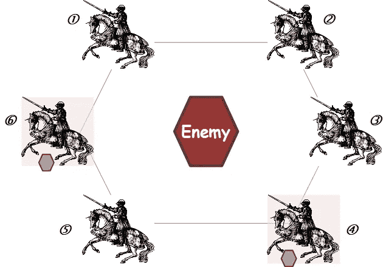

Byzantine Problem

拜占庭军队的几个师在敌人周围扎营。每个师的将军都必须做出进攻或撤退的决定。他们希望达成一致的决定，以避免出现一些师进攻而另一些师撤退的麻烦情况。为了统一决策，拜占庭将军可以派使者把他的意图传达给其他将军。但问题是，将军中也可能有叛徒。这些叛徒会扰乱信息交换，阻止所有正常的将军得出相同的结论。例如，如果将军⑥是叛徒，他可能会向将军①发出进攻意图，但向将军②和将军⑤发出撤退意图，以防止达成共识。

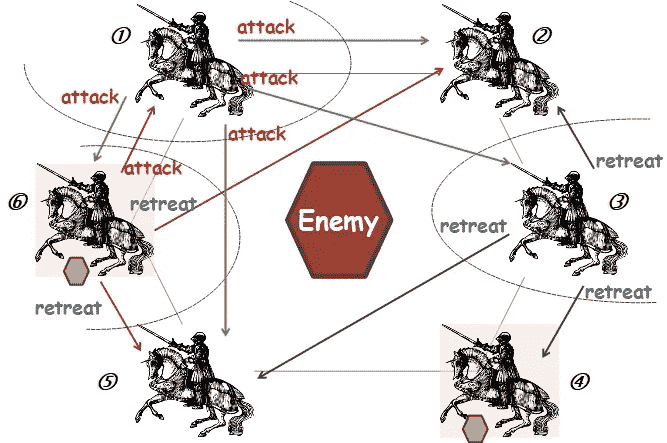

Traitor general tries to disturb the consensus.

如果没有叛徒，简单多数原则总能让将军们达成共识。换句话说，每个将军收集所有其他将军的意图，并根据包括他自己在内的半数以上将军的意图得出结论。如果所有的将军正好被分成两半，则可以应用默认动作。但是有了叛徒的可能性，问题就变得复杂了。如果 6 个将军中只有一个叛徒，这种多数原则是否也能让其他 5 个将军一直达成共识**？或者，是否有其他规则可以保证达成共识？6 个将军中 2 个叛徒怎么样？**

**在像上面这样的情况下，如果一个共识算法可以使所有忠诚(非叛徒)的将军得出相同的决策，这个算法就被称为**拜占庭容错**。算法具有拜占庭容错的特征或要求是**拜占庭容错**或 **BFT** 简称。**

**为了更清楚地理解，让我们用一个最简单的案例进行更详细的解释。**

**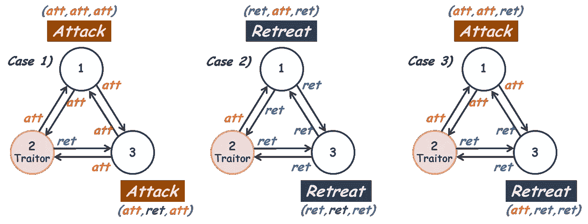**

**Simplest Case : 2 Loyal Generals and 1 Traitor**

**假设总共有三个将军，其中只有一个是叛徒。当然没有人知道谁是叛徒。共识算法是一个简单的多数规则。**

**这个叛徒总是向其他两位将军发出相反的意图来阻碍共识。你可以看到上图中的情况(1)和情况(2)，如果 2 个忠诚的将军有相同的意图，他们会不顾叛徒的干扰，建立一个相同的结论。但就像情况(3)，如果 2 个忠诚的将军有不同的意图，他们中的一个会进攻，另一个会在最后撤退。在情况(3)中，共识将被打破，因此对于这 2 个忠诚的将军和 1 个叛徒，多数规则是**而不是**拜占庭容错。那么，针对这种情况的拜占庭容错一致性算法是什么呢？**

**从理论上证明了如果不使用消息签名，不存在 3 个将军 1 个叛徒的拜占庭容错算法。**

**除了拜占庭式的错误，共识中还有**各种各样的约束**。最常见的约束是消息传递是否有保证，消息是否签名，以及网络是否完全连接。
一个网络被称为**同步** (sync。)如果在一定的延迟限制内保证交付，或者**异步** (async。)如果消息可能由于通信故障或过载而丢失。当然，让异步网络比同步网络具有拜占庭式的容错能力要困难得多。如果应用了消息签名，恶意节点在转发来自其他节点的消息时不能更改消息，尽管它自己的消息仍然可以被操纵。因此，使用消息签名，可以更容易地设计拜占庭容错算法。但是，建立可靠的消息签名系统也需要相当大的成本和精力。**

**[1] L .兰波特、r .肖斯塔克和 m .皮斯，《拜占庭将军问题[》，1982 年](https://www.microsoft.com/en-us/research/uploads/prod/2016/12/The-Byzantine-Generals-Problem.pdf) [数字签名](https://en.wikipedia.org/wiki/Digital_signature)**

# **3m + 1 处理器算法**

**保证拜占庭容错的通用算法的第一个成果是 1980 年出现的“ **3 *m* + 1 处理器算法**”。**

**本文首先证明了对于一个有 *m* 个故障节点的同步网络，如果网络总共有等于或小于 3 个 ***m*** 个节点，则不存在拜占庭容错一致性算法。换句话说，先决条件是**等于或大于 3 个 *m 个* + 1 个**节点。**

**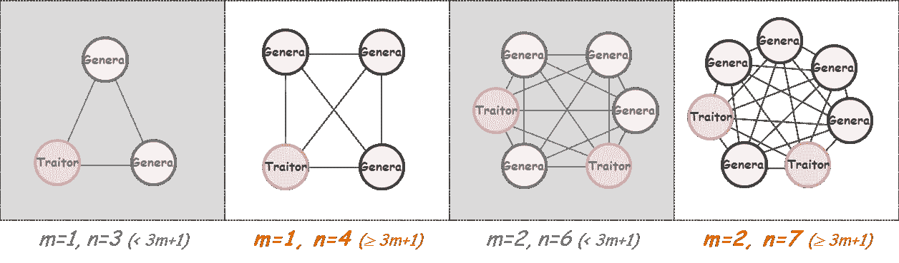**

**例如，如果 3 个节点中有 1 个故障节点，则不存在拜占庭容错算法。当预计有 1 个故障节点时，网络应该至少有 4 (3 *m* + 1， *m* = 1)个节点，如上图中左起第二个。如果节点更脆弱，并且可以同时存在 2 个故障节点，则网络应该至少有 7 (3 *m* + 1， *m* = 2)个节点用于拜占庭容错，如上图中的最后一个。**

**那么，什么是拜占庭容错算法，保证 3 *m* + 1 约束的情况下。在讨论细节之前，我们先来看一个简单的消息传递符号。**

**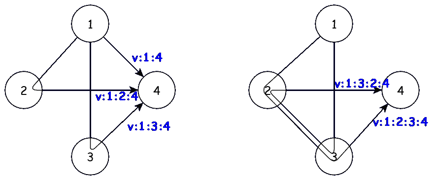**

**Message Delivery for 4 Nodes Network**

**上图显示了一个简单的 4 节点网络的消息传递。从节点①到节点④最多可以有 5 条不同的路径传递消息，包括中继。但是消息将访问中间节点超过 2 次的重复中继被排除在外。
5 条路径包括 1 条直接传送路径、2 条带有 1 个中继的间接传送路径和 2 条带有 2 个中继的路径。
这些案例表示如下**

```
*v:1:4                     : direct delivery from 
v:1:2:4                   : relayed by node 2
v:1:3:4                   : relayed by node 3
v:1:2:3:4                 : relayed by node 2 and 3 in turn
v:1:3:2:4                 : relayed by node 3 and 2 in turn*
```

**例如， *v:1:3:2:4* 表示消息由节点①发送到节点③，由节点③中继到节点②，再由节点②中继，最后到达节点④。**

**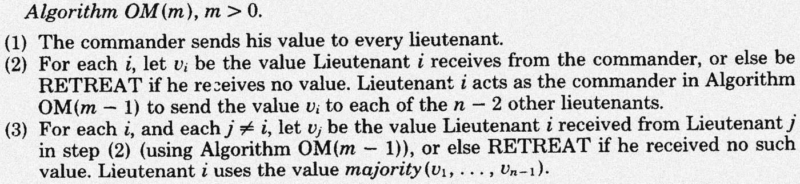**

**3m + 1 Processor Algorithm**

**以上语句是名为 **3 *m* + 1 处理器算法**的共识算法。该算法强制足够的**继电器**用于拜占庭容错。
更确切地说，对于一个最多可能有 *m* 个故障节点，因此至少包含 3 *m* + 1 个节点的网络，应该**将每个消息 *m* 次**中继。并且每个节点必须考虑 *m* 次中继的节点，代表多数原则决定其他节点的意图。**

**如果网络有 4 个节点( *m* = 1)来覆盖最多 1 个故障节点，每个节点必须在收集来自其他 3 个节点的直接消息( *OM(1)* )和 1 次中继消息( *OM(0)* )后做出决策。对于 *m* = 1，2 次中继也是可以的，但是按照算法 1 次中继就够了。
对于 *m* = 2，网络有 7 个节点克服 2 个故障节点，每个节点应收集直接消息( *OM(2)* )、1 次中继消息( *OM(1)* )和 2 次中继消息( *OM(0)* )。7 个节点，最多可以中继 5 次，中继 2 次就够了。
因此，当用 *m* 个故障节点概括时，至少 3 个 *m* + 1 个节点中的每个正常节点必须收集直接传递的消息( *OM(m)* ，1 次中继的( *OM(m-1)* ，2 次中继的( *OM(m-2)* ，等等，直到那些 *m* 次中继的( *OM(0) 【T31)***

**Recursions of 3m + 1 Processor Algorithm**

**您可能会注意到，在转发消息时，消息不会被再次发送到之前已经传递过的节点。例如，在 7 节点网络中，节点①的消息经过节点②中继后到达节点③，就不会再发送到节点②或节点①。该消息将被发送到④到⑦的其他节点。**

## **最简单的情况**

**为了理解继电器如何对拜占庭容错做出更多贡献，让我们更详细地讨论最简单的情况(其中 *m* = 1)。**

**下图显示了节点①、③和④如何根据 3 *m* + 1 处理器算法收集节点②发出的消息**

**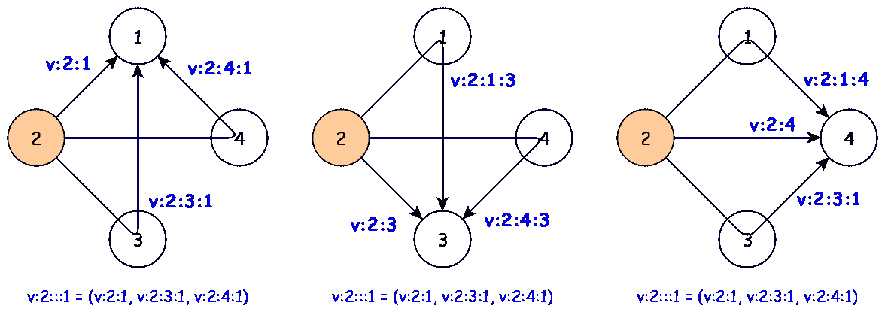**

**OM(1) and OM(0)**

**如果节点②是叛逆者，则有 **6 种不同的情况**节点②将其意图发送给其他节点以扰乱共识。您可以从下表中的 *v:2:1* 、 *v:2:3* 和 *v:2:4* 列中看到这些情况。在这 6 种情况下，节点②向其他节点发送不同的意图。排除节点②发送相同意图的情况，因为这些情况不会扰乱共识。**

**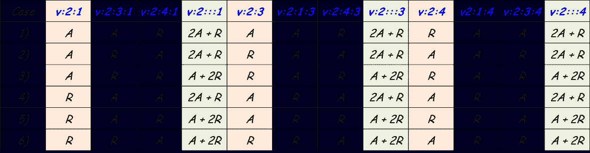**

**如果节点①、③和④只接收来自节点②的直接消息，它们将对每种情况得出不同的意图(进攻或撤退)。你可以在上表的浅橙色背景栏中看到它。
但令人惊讶的是，**如果有一次中继信息被收集到**，事情就变了。
参见上表中的浅绿色列。对于情况 1)。虽然节点②向节点①和③发送'攻'，但向节点④发出'退'，每个节点都可以集合所有这些'攻'、'攻'、'退'。换句话说，节点①、③和④都从节点②收集相同的值( *2A + R* ，2 个‘攻’和 1 个‘退’)，所以它们在节点②上有相同的结论。
对于其他情况——情况 2)情况 6)，情况相同。即使收集的值可能因情况而异，如 *2A + R* 或 *A + 2R* 。在单个案例中，所有节点的值都相同。
6 例中仅 1 例出现。因此，在任何情况下，节点①、③和④对节点②都有相同的结论。**

**更一般地说，通过中继，每个正常节点(①、③或④)可以收集发送者(②)发送给其他节点(①为③和④，④为③和①，④为①和③)的所有消息。换句话说，每个节点将看到相同的消息集，因此有相同的结论。**

```
# When node 2 is traitor*v:2:3:1 = v:2:3
v:2:4:1 = v:2:4
v:2:::1 = v:2:1 + v:2:3:1 + v:2:4:1 = v:2:1 + v:2:3 + v:2:4**v:2:1:3 = v:2:1
v:2:4:3 = v:2:4
v:2:::3 = v:2:3 + v:2:1:3 + v:2:4:3 = v:2:3 + v:2:1 + v:2:4**v:2:1:4 = v:2:1
v:2:3:4 = v:2:3
v:2:::4 = v:2:4 + v:2:1:4 + v:2:3:4 = v:2:4 + v:2:1 + v:2:3****v:2:::1 = v:2:::3 = v:2:::4***
```

**基于中继的相同原理即使在有更多节点时也适用。经过足够的中继后，每个节点可以收集从一个节点发送到其他节点的所有消息，从而做出相同的决策。**

**3m + 1 处理器算法看起来非常有用，因为它有简单的递归规则。但实际上，由于其复杂性，该算法在可扩展性方面存在致命弱点。从下表中可以看出，随着中继的重复，消息的数量急剧增加。相对于 *m* (故障节点数)的复杂度为 *O* ( *nᵐ* )。因此，该算法仅适用于小型网络。对于大型网络，我们需要其他算法。**

**[1] M. Pease、R. Shostak 和 L. Lamport，[在](https://www.microsoft.com/en-us/research/uploads/prod/2016/12/Reaching-Agreement-in-the-Presence-of-Faults.pdf)面前达成协议**

# **工作证明**

**在上面解释的 3 *m* + 1 处理器算法或 pBFT 中，节点**协作**来克服拜占庭故障。为了在损坏或被攻击的节点的干扰下进行协作，算法对节点的数量有限制，并且需要足够的通信，这限制了**可扩展性**。
3 *m* + 1 处理器算法复杂度为 *O* ( *nᵐ* )，pBFT 复杂度为 *O* ( *n* )。**

**工作证明(PoW)算法采用完全不同方法。在电力网络中，每个节点**竞争**而不是合作。成功解决一个极难解决但非常容易验证的数学难题的节点将在那时为整个网络做出决定。在一个谜题被解决并且答案在网络中传播之后，下一个谜题的竞争就开始了。
这类谜题有几种，包括哈希计算和大整数的质因数分解。没有特殊的公式或技术来更快地解决这类难题。只有简单的反复试验才是有效的策略。
所以，一个节点解谜的几率完全是**概率**。概率完全取决于节点的计算能力。如果计算能力在节点间足够分散，那么特定的一个或多个节点实际上不可能统治 PoW 网络。**

**公共区块链网络，如比特币和以太坊，由于网络对任何人开放，任何人都可以作为自己的节点加入，计算能力的集中在很大程度上受到抑制。**

**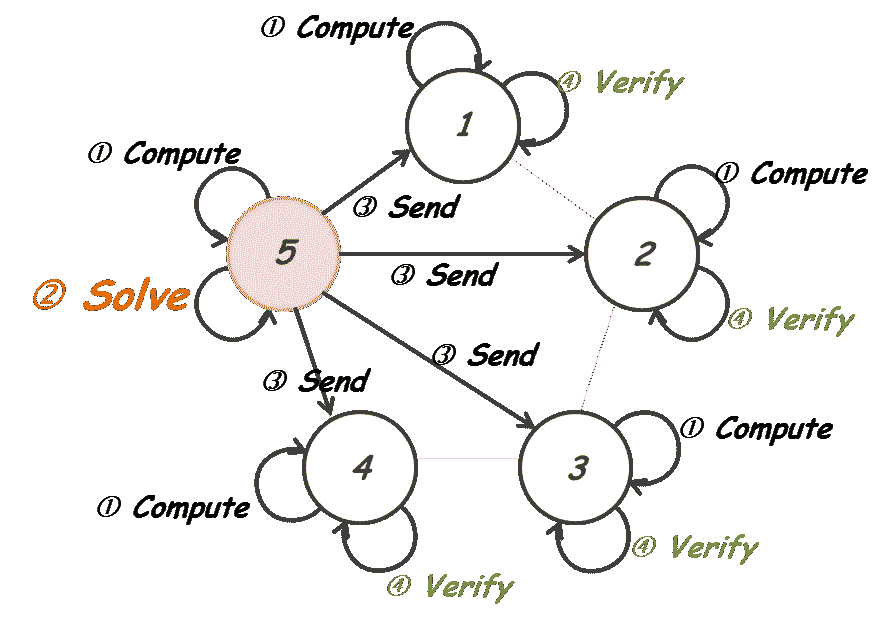**

**Process of PoW**

**对于比特币和以太坊，难题是找到一个随机数，该随机数满足与随机数结合的块头散列的非常特定的条件。
作为理解的一个简单(不真实)的例子，条件说散列应该以 4 个前导零开始。下面的句子更简洁明了地表达了情况或难题— *SHA-256* 是流行的哈希函数之一，而*数据*表示块头**

```
*Find* ***nonce*** *for* ***SHA-256****(****data*** *+* ***nonce****) to Start with '****0000****'*
```

**哈希 function⁴是一个将任意大小数据转换为固定大小的数据的函数，这些数据的值完全不同且不可预测。
哈希函数有一些重要而独特的特性。第一个也是最重要的一个是函数是不可逆的。更正式地说，散列函数没有反函数。
例如，简单明了的 SHA-256⁵哈希值为“ *Hello，world！*"是" *0x315f5bdb76d0…* "，但是对于" *0x315f5bdb76d0…* "是"*你好，世界！*“使用任何配方或特殊技术。**

```
SHA-256("Hello, world!") = "0x315f5bdb76d0…"    # easy
SHA-256⁻¹("0x315f5bdb76d0…") = "Hello, world!"  # no formula
```

**第二个特征是，即使输入发生很小的变化，哈希函数也会改变输出(哈希值)很多。换句话说，哈希函数非常动态地扩散输入。
您可以在下表中看到这一点。在表中，输入值与“ *Hello，world！*【到】*你好，世界！****0****你好，世界！* ***1*** ，*你好，世界！* ***2*** 等等。但是它们的哈希值完全不同。你永远猜不到也算不出“*你好，世界！* ***1*** 【来自哈什】*你好，世界！****0****你好，世界！* ***2*** "，或其他类似的输入。**

**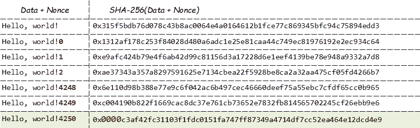**

**Finding Nonce Example**

**如果您需要找到一个 nonce，当追加到“Hello，world！”之后时，它将产生以 4 个前导零(“0x0000”)开始的哈希值—比如“你好，世界！在上表的最后一行，没有比来自 *Hello，world 的简单顺序试验更有效的特殊方式或方法了！* ***0*** 【到】*你好，世界！* ***4250*** ”。**

**以太坊使用具体幂算法是 Ethash⁶.Ethash 使用 Keccak-256 作为哈希函数。Ethash 的难题是找到一个 nonce，使得块头的 Keccak-256 散列和该 nonce 小于指定值。**

**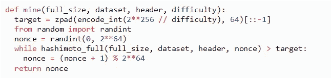**

**Mining Function of Ethash**

**以上`*mine*`是 Ethash specification⁶.中描述的 Python 函数在比特币或以太坊中，找到满足条件的 nonce 并解谜的过程称为**挖掘**。成功找到随机数的节点将被给予奖励。所以解谜就像挖金子一样。**

**在上述函数的`*while*`子句中，重复试验，将 nonce 改变 1，直到散列值(`*hashimoto_full*`)等于或小于某个`*target*`。`*target*`是将 2 个⁵⁶除以指定的`*difficulty*`得到的值。SHA-256 的哈希值是 64 位十六进制数，最大值是 2 ⁵⁶.`*target*`小于 2 ⁵⁶，所以当用 64 位十六进制表示时，值有前导`*0*`(零)s，例如，`*target*`值 2 ⁷有 7 个前导`*0*` s，`*target*`值 2 ⁰⁵有 12 个前导`*0*`**

**Target and Difficulty**

**`*target*` 和`*difficulty*` 的乘积是常数 2 ⁵⁶.升高`*difficulty*` 将降低`*target*` 以便更领先`*0*` s。
sha-256 的所有散列值的数量是 2 个⁵⁶，在给定的难度下，成功挖掘的散列值的数量是`*target*`。所以，`*target*` /2 ⁵⁶在单次试验中成功开采的可能性很大。这与`*difficulty*` (1/ `*difficulty*`)的逆运算相同。**

**下表是以太坊 mainnet 中几个区块的真实`*difficulty*` s 和`*target*` s。如果`*difficulty*`设法保持不变，块创建间隔将受到节点数量或它们消耗的总计算能力的影响。为了防止块创建间隔的波动并保持块创建时间的一致性和可预测性，以太坊根据最近的块时间不断地协调新块的`*difficulty*` 。**

**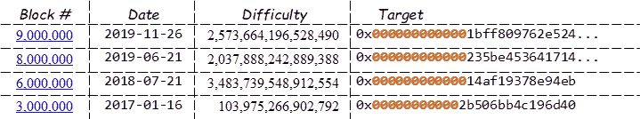**

**Difficulty and Target Samples from Ethereum Mainnet**

**在比特币或以太坊中，每笔交易都经过数字签名，因此故障或叛徒节点无法操纵交易。块非常容易验证，尽管极难挖掘，使得恶意节点不能传播无效块。像这种方式，同时使用 **PoW** 和**数字签名**，比特币和以太坊可以**实现拜占庭容错**。**

**因为 PoW 是基于竞争而不是合作来工作的，所以**复杂性与节点数量**无关。复杂程度很大程度上取决于拼图的难度。因此，对于包含数百或数千个节点的大型网络，PoW 似乎比基于公司的一致性算法(如 pBFT)更有利。但是权力也有致命问题。最广为人知的一个是激烈竞争造成的巨大能源浪费，另一个重要的问题是**终结性问题**，下面将详细解释。**

## **终结性问题**

**概括地说，成功的解谜被称为战俘网络中的挖掘。采矿意味着一个新的区块被创造出来，矿工得到奖励。大量节点激烈竞争以获得奖励。
查看挖掘规则的详细信息，除了要添加的事务和 nonce 之外，哈希计算还包括最后一个块的哈希值。这是为了保持区块链线性或一维。这使得损害区块链的完整性更加困难，并防止了区块链的冲突状态。在大多数情况下，开采间隔足以保持区块链线性。但是无论`*difficulty*` 增加多少，几乎都可以同时进行挖掘，因为挖掘本质上是概率性的。
虽然验证非常简单，但是将挖掘出的块传播到世界上的所有节点需要时间。所以同时挖掘会使整个网络有点不均匀。**

**比如下面这个例子。如果两个遥远的节点 ***P*** 和 ***Q*** 成功地挖掘出一个 block—block***【B(m)****和 block***【B(n)****中的每一个—几乎同时，在时间内不足以传播***【B(m)****和 **围绕 ***P*** 的节点将把***【B(m)***作为最后一个块，围绕***【Q***的节点将把***B(m)****作为最后一个块。 与 ***P*** 和 ***Q*** 距离相近的节点无法区分哪个区块实际上最先开采。********

****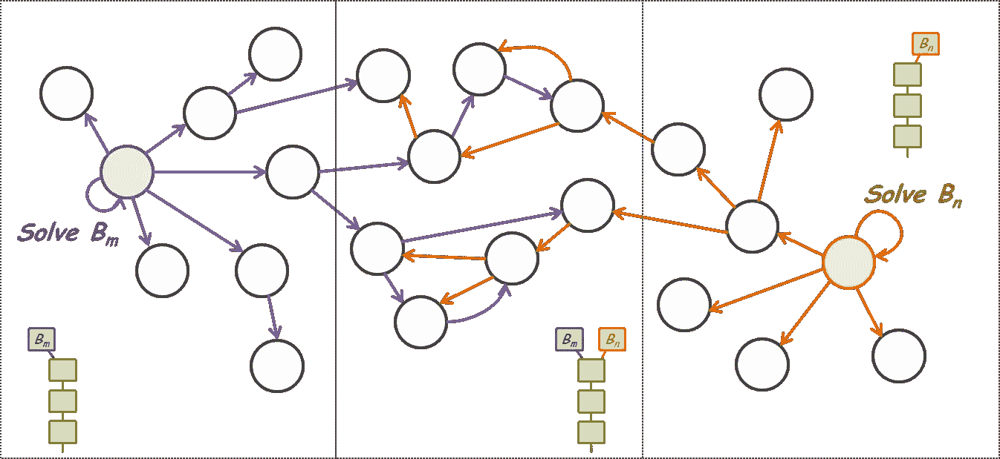****

****Two different nodes may succeed mining almost simultaneously.****

*******B(m)****和***B(n)****都是基于同一个前一个块。换句话说，它们包含前一个块头的相同散列。因此，前一个块被称为父块。******

*****节点不断尝试挖掘下一个块以获取奖励。首先接收到 ***B(m)*** 的一些节点将基于 ***B(m)*** 挑战下一个块，但是之前接收到 ***B(n)*** 的其他节点将基于 ***B(n)*** 挑战下一个块。尽管由于大多数情况下的困难，成功的开采有足够的时间间隔，但几乎同时进行下一次开采的可能性非常低。在这些情况下，挖掘块可以具有不同的父块。例如，第二个同步块之一基于 ***B(m)*** ，另一个基于 ***B(n)*** ，如下图所示。*****

****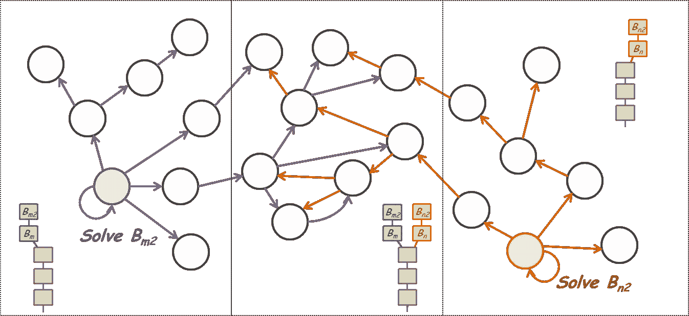****

****Next time, another 2 different miners may succeed mining almost simultaneously again.****

****您可以看到整个链不再是线性的，尽管之前没有违反 PoW 规则。这叫分叉，从分叉点开始的每一个线性(线性连接)的部分叫分支。在上面的例子中，有两个分支。一个分支是 ***B(m)*** 后跟 ***B(m2)*** 另一个是 ***B(n)*** 后跟 ***B(n2)*** 。****

****随着高度的挖掘竞争和网络中的不均匀性，先前的异常(但不是非法的)情况可以进一步继续。换句话说，2 个分支长得更像***B(m)****-****B(m2)****-****B(m3)****-****B(M4)***和***B(n)****-****或者甚至可能出现另一个分支。但是，最终只有一个分支会存活下来，因为挖掘真的很难，而且所有这些都是概率性的。还有另一种称为最长链规则的机制，它强制在分叉情况下选择最长的分支。一旦其中一个同时发生的分支开始快速生长，最长规则只会加速一个分支的存活。*******

****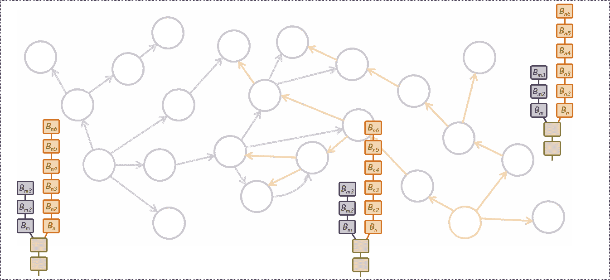****

****Eventually, only one branch will survive after a fork.****

****虽然从长远来看，这个链仍然是线性的，但与此同时，可能会有一个叫做终结性问题的严重问题。**终结性问题**是成功挖掘的事务或块由于上述分叉而变得无效或取消的情况。它不是由侵犯权力引起的。这是权力固有一面。
下图描述了一个终结性问题的典型过程。它显示了区块链随着时间的推移而成长。在 *②* 处，包含 ***tx(b)*** 的 ***B(n)*** 区块开采成功。但几乎同时另一块***【B(m)***它不是***【B(n)***的子块也在制作一个 fork( *③* )。虽然两个分支一直在一起生长，但毕竟一个源于 ***B(m)*** 的分支幸存了下来，使块***【n】***和事务***【tx(B)***失效，就像 *⑥* 一样。这意味着一次完全提交的事务可以在以后回滚。从数据持久性系统的角度来看，这是一个很大的缺点。****

****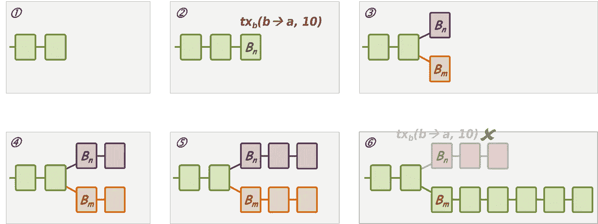****

****为了解决终结性问题，我们应该等待并观察一段时间，让包含我们的事务的块在挖掘后进一步增长。通常，比特币需要 6 块，以太坊需要 12 块。当然，这些数字并不能保证完美的结局。目前以太坊的封锁时间大约是 13 秒。但最终性问题使得确认交易的实际时间从 13 秒变成了 2.6 分钟。****

****终结性问题可以被一个巨大的矿工利用来损害区块链的完整性和信任。如果他或她拥有整个采矿能力的 50%以上，他或她可以使非常重要或昂贵的交易无效，以赚取利润或达到邪恶的目的。这叫“51%攻击”。
尽管在数百家独立和活跃的矿商中占据 50%以上的开采权几乎是不可能的，但实际上仍有 51%的 attack⁷.以太坊类(ETC)是 2019 年 1 月的 attacked⁸，比特币黄金(BTG)是 1 月的 2020⁹.****

****为了解决终结性问题，以太坊开发了一种新的共识算法，称为卡斯珀 FFG，这是以太坊 2.0 的关键特性之一。****

****[1] [工作证明](https://en.wikipedia.org/wiki/Proof_of_work)
【2】[质因数分解](https://privacycanada.net/mathematics/prime-factorization/)
【3】[试错](https://en.wikipedia.org/wiki/Trial_and_error)
【4】[哈希函数](https://en.wikipedia.org/wiki/Hash_function)
[SHA-256](https://en.wikipedia.org/wiki/SHA-2)
【6】[Ethash 规范](https://github.com/ethereum/wiki/wiki/Ethash)
【7】[什么是 51%攻击？](https://academy.binance.com/en/articles/what-is-a-51-percent-attack)
【8】[ETC 51 %攻击——发生了什么以及如何被阻止](https://bravenewcoin.com/insights/etc-51-attack-what-happened-and-how-it-was-stopped)(2019 年 1 月 14 日)
【9】[比特币黄金区块链遭受 51%攻击导致 70K 美元双倍支出](https://cointelegraph.com/news/bitcoin-gold-blockchain-hit-by-51-attack-leading-to-70k-double-spend)(2019 年 1 月 27 日)****

# ****卡斯帕·FFG****

******卡斯珀·FFG**是一种 PoS(利害关系证明)共识算法，具有一些独特的功能，有望解决或显著改善终结性问题。它由 Vitalik Buterin 和 Virgil Griffith 在 2017 年首次提出。****

****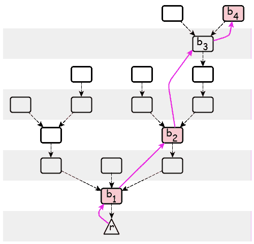****

****首先，卡斯帕 FFG 是一个部分一致算法，它只承担 T2 终结协议。卡斯帕·FFG 没有包括任何规则来制作或确认方块。它定义了一个协议，以便在 fork 情况下更快地在几个分支中确定一个真正的最终块。它可以应用于其他一致性算法，如 PoW。因此，卡斯珀 FFG 被归类为覆盖算法。****

****第二，卡斯珀·FFG 本身是一种 **PoS(利益相关证明)算法**，它期望选择的节点运行。与 PoW 网络中任何节点都可以参与挖掘不同，在 PoS 网络中，只有一些特殊的、有一定利害关系的节点才能加入共识，以决定类似阻塞的事情。在卡斯帕 FFG，这些节点被称为**验证器**。****

****第三，卡斯帕·FFG 定义了激励规则和惩罚规则。包括 pBFT 在内的其他 PoS 算法通常没有惩罚规则。因此，即使一些恶意节点试图扰乱共识，也没有有效的方法来阻止它们。“无利害关系”是 PoS 算法最著名的问题之一。但是，在卡斯帕·FFG 的案例中，不利用任何利害关系的验证者将受到惩罚，并失去他们所有的股份。****

****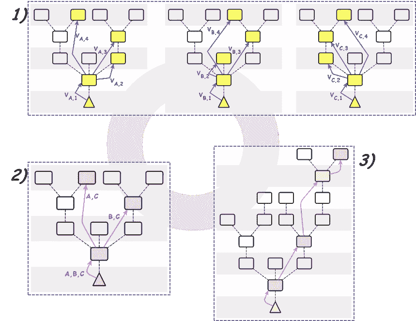****

****Casper FFG Processes — 1) Voting, 2) Justified, 3) Finalized****

****像 pBFT 或通常的 PoS 算法一样，卡斯珀 pBFT 在固定的时间表内运行**轮**。在每一轮中，所有的验证者都应该按照两个严格的规则投票。如果一个验证器违反了一条规则，即使只有一次，它也会失去它的股份，并被逐出验证器。所以，这些规则被称为**斜线条件**。****

****如果一个区块在一轮中收到超过 2/3 的验证者的投票，则该区块被认为是**合理的**。对齐块仍然可以分叉，所以**没有**最终确定。但如果两个**顺序块**被对齐，则两者的**父块**成为**最终终结**。
补充一些细节，因为斜杠条件禁止跨越投票，在两个相邻块赢得投票后，最多 1/3 的验证者可以在后面的回合中按照规则投票给父块以下的任何块。因此，除非另外 1/3 的验证器违反了斜杠条件，失去了所有的股份，否则父块将是所有后来的合理投票的祖先。****

****由于惩罚规则(斜线条件)，卡斯帕 FFG 预计将促进更紧密的合作，并导致比最长链规则更快和更有效的最终确定。****

****Casper FFG 是信标链的控制算法，信标链是以太坊 2.0 相位 0⁴.的最高特性****

****为了更具体的理解，如果阅读最新的论文，我在 SlideShare 的 presentation⁵可能会有所帮助。****

****[1] Vitalik Buterin 和 Virgil Griffith，“[Casper the Friendly Finality Gadget](https://arxiv.org/pdf/1710.09437v1.pdf)”，2017
【2】[没有什么利害攸关的问题——一个分叉的烂摊子！](https://www.mangoresearch.co/casper-nothing-at-stake-problem/)
【3】[以太坊 2.0 信息](https://hackmd.io/@benjaminion/eth2_info)
【4】[验证:下注 eth 2 # 0](https://blog.ethereum.org/2019/11/27/validated-staking-on-eth2-0/)
【5】[卡斯帕 Info 解释](https://www.slideshare.net/OhSangmoon/casper-ffg-explained-198734791) 【6】维塔利克·布特林和维吉尔·格里菲斯，“[卡斯帕友好的终结小工具，版本。4](https://arxiv.org/pdf/1710.09437v4.pdf) ，2019****

> ****加入 [Coinmonks 电报频道](https://t.me/coincodecap)，了解加密交易和投资****

## ****也阅读****

****[](https://blog.coincodecap.com/crypto-exchange) [## 最佳加密交易所| 2021 年十大加密货币交易所

### 加密货币交易所的加密交易需要了解市场，这可以帮助你获得利润…

blog.coincodecap.com](https://blog.coincodecap.com/crypto-exchange) [](https://blog.coincodecap.com/crypto-lending) [## 2021 年 9 大最佳加密借贷平台

### 当谈到加密货币贷款时，大量因素等同于良好的收入状况。此外，借款的一部分…

blog.coincodecap.com](https://blog.coincodecap.com/crypto-lending) [](/coinmonks/crypto-trading-bot-c2ffce8acb2a) [## 加密交易机器人——最佳免费加密交易机器人

### 2021 年币安、比特币基地、库币和其他密码交易所的最佳密码交易机器人。四进制，位间隙…

medium.com](/coinmonks/crypto-trading-bot-c2ffce8acb2a) [](/coinmonks/best-crypto-signals-telegram-5785cdbc4b2b) [## 最佳 6 个加密交易信号电报通道

### 这是乏味的找到正确的加密交易信号提供商。因此，在本文中，我们将讨论最好的…

medium.com](/coinmonks/best-crypto-signals-telegram-5785cdbc4b2b) [](https://blog.coincodecap.com/blockfi-review) [## BlockFi 评论 2021:利弊和利率

### 今天，我们提出了一个全面的 BlockFi 评论，这是一个成立于 2017 年的加密贷款平台，拥有其…

blog.coincodecap.com](https://blog.coincodecap.com/blockfi-review) [](/coinmonks/best-crypto-tax-tool-for-my-money-72d4b430816b) [## 加密税务软件——五大最佳比特币税务计算器[2021]

### 不管你是刚接触加密还是已经在这个领域呆了一段时间，你都需要交税。

medium.com](/coinmonks/best-crypto-tax-tool-for-my-money-72d4b430816b) [](/coinmonks/pionex-review-exchange-with-crypto-trading-bot-1e459d0191ea) [## Pionex 评论 2021 |免费加密交易机器人和交换

### Pionex 是为交易自动化提供工具的后起之秀。Pionex 上提供了 9 个加密交易机器人…

medium.com](/coinmonks/pionex-review-exchange-with-crypto-trading-bot-1e459d0191ea) [](https://blog.coincodecap.com/best-hardware-wallet-bitcoin) [## 存储比特币的最佳加密硬件钱包[2021]

### 保管您的数字资产很容易，但找到正确的存储方式却是一项繁琐的任务。在线钱包有一个风险…

blog.coincodecap.com](https://blog.coincodecap.com/best-hardware-wallet-bitcoin)****