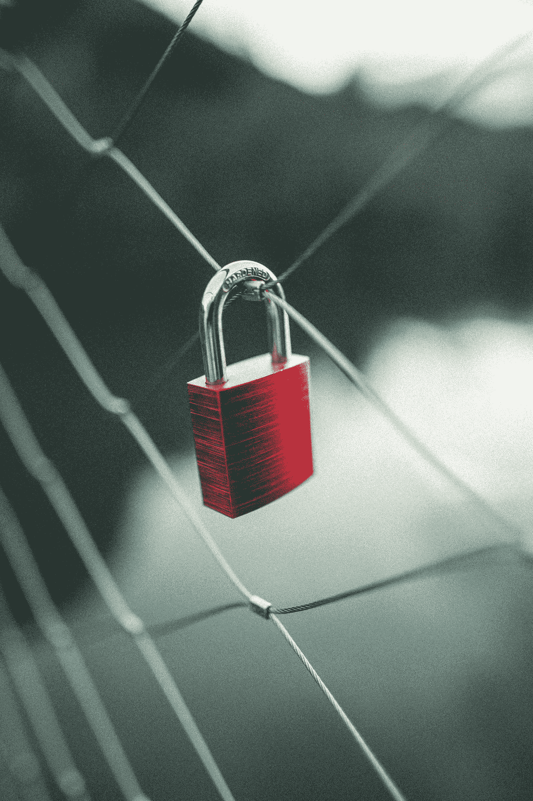

# 区块链的原因

> 原文：<https://medium.com/coinmonks/basics-revisited-the-why-of-blockchain-d4c4133d0b15?source=collection_archive---------5----------------------->

## 区块链基础知识再探

## 了解区块链技术解决的问题

许多开发者、创造者和公司直接进入了区块链项目的技术细节和实现，而没有花一点时间来适当地思考这项技术实际上解决了什么潜在的问题。在本文中，我们将退回这一步，重新审视一个关键问题，以真正理解区块链带来的不同:区块链的意义在哪里？

Photo by [Launchpresso](https://unsplash.com/@launchpresso?utm_source=medium&utm_medium=referral) on [Unsplash](https://unsplash.com?utm_source=medium&utm_medium=referral)

# 旧世界:可变性和集中信任

## 可变性如何阻止数字所有权

首先，让我们后退一步，看看数字革命的开端。计算机及其网络如此迅速流行的原因，很大程度上是基于我们所说的数字数据的**可变性**。

可变性仅仅意味着数据模型可以自由改变；这包括数据复制、数据传输和数据删除。因为数字数据非常容易复制，所以它的传播速度比以前的印刷报纸或邮件要快得多。在某种程度上，正是这种易变性推动了互联网的兴起，在互联网上，数据有时只是被复制并转移到世界上的一个地方，这样当你下次再次访问一个网站时，你就可以更快地访问它。

然而，可变性是有代价的，因为许多模拟的东西转化成数字数据后很快就失去了价值。例如，我们已经在音乐行业和新闻业看到了这种戏剧性的程度。但是为什么会这样呢？

人类似乎对数字事物赋予较少价值的原因正是因为它们的可变性。你在电脑上作为文件保存的任何数字音乐曲目都可以很容易地被复制数百万次，并在全球范围内传播，没有人能够阻止这一点。音乐产业必须想出全新的创收模式来解决这个问题，它本质上是一个所有权问题:当每个人都可以复制和修改时，没有人是真正的所有者。

## 需要信任中央集权的政党

Photo by [Leonie Zettl](https://unsplash.com/@leoniezettl?utm_source=medium&utm_medium=referral) on [Unsplash](https://unsplash.com?utm_source=medium&utm_medium=referral)

唯一真正可行的解决日常变化问题的方法是**信任中央集权的政党**。例如，只有你可以改变你的脸书个人资料，因为你在他们的数据库中存储了你的电子邮件地址和密码；只要您能正确提供这些数据，您就可以更改您帐户的任何内容。但只有当你相信脸书会安全处理你的数据时，这个系统才会起作用。

想想你的电子银行作为另一个例子。理论上，没有什么能阻止那家银行的员工进入数据库并改变你账户的余额——毕竟，它们只是表格中的数字。你相信银行的名字和声誉不会这样做，但当然，他们可以。

这说明了信任集中式实体的两个主要问题:

1.  一方面，大规模攻击的风险**很高**，因为这些实体是黑客的中央蜜罐，在过去几年里，没有一个主要的社交网络没有数据泄露
2.  另一方面，我们的**信任经常被集中服务的提供商利用**:例如，用户行为被跟踪并出售给第三方，数据隐私正成为一个日益敏感的问题。

因此，如果信任一个中央集权的政党不是前进的方向，我们能做什么？这就是区块链技术发挥作用的地方。

# 新时代:去中心化=数字所有权

## 走向真正的数字所有权

区块链上的数据不能随意更改，至少在你不能证明你拥有它的情况下是如此:你需要用你的密钥对(由一个私钥和一个公钥组成)来签署每一笔交易。其他人只能通过查看您的公钥来验证某个数据项是否属于您。这样，区块链允许你实际拥有数据；它实现了**真正的数字所有权**。

最好的一点是，没有必要相信一个中央集权的政党，因为区块链是以完全不信任的方式运作的分散网络。这意味着你的数据并不存在于单个公司或组织的服务器上，而是存在于一个由数千台电脑组成的网络中。这些计算机使用一致算法检查彼此的工作，这使得恶意行为非常不可行，因此也非常不可能。

## 可编程性和互操作性带来的效率

去中心化使得网络上的数据非常安全，区块链甚至可以用于货币、稀有的数字收藏品和艺术品。这些具有本地数字价值的资产的伟大之处在于它们是可编程的:例如，在大多数区块链，你可以实现一种机制，每当艺术品被拍卖时，自动向其创作者支付版税。

此外，区块链上的大多数数字产品都是独立于其来源平台的。例如，即使某一天应用程序不复存在，NBA 顶级投篮时刻仍将归其收藏者所有。这使得区块链支持的数据即使从长期来看也很有价值；它还支持**互操作性**:跨不同平台使用数字产品。这正是区块链在游戏行业越来越受欢迎的原因:一个游戏的物品可以在另一个游戏中使用，甚至可以在分散的市场上进行点对点销售。

# 结论

总之，区块链对每个人都非常有益:建筑商、创造者、用户和公司都一样。真正的数字所有权的可能性为数字世界创造了市场，并允许人们将他们的价值带到数字领域。创作者和知识产权持有人受益于数字价值的透明性和可编程性，而公司可以利用开放生态系统的互操作性，最终用户可以放心，他们的资产得到安全处理，不受审查。

> 加入 Coinmonks [电报频道](https://t.me/coincodecap)和 [Youtube 频道](https://www.youtube.com/channel/UCbyDhTbOiKh2iUMKBi4-4Zg)了解加密交易和投资

## 另外，阅读

 [## 最佳加密交易所| 2021 年十大加密货币交易所

### ICON _ PLACEHOLDEREstimated 预计阅读时间:28 分钟加密货币交易所的加密交易需要知识…

blog.coincodecap.com](https://blog.coincodecap.com/crypto-exchange)  [## 2021 年 10 大最佳加密贷款平台| CoinCodeCap

### 当谈到加密货币贷款时，大量因素等同于良好的收入状况。此外，借款的一部分…

blog.coincodecap.com](https://blog.coincodecap.com/crypto-lending)  [## 2021 年最佳免费加密交易机器人

### 2021 年币安、比特币基地、库币和其他密码交易所的最佳密码交易机器人。四进制，位间隙…

medium.com](/coinmonks/crypto-trading-bot-c2ffce8acb2a)  [## 最佳 4 个加密交易信号电报通道

### 这是乏味的找到正确的加密交易信号提供商。因此，在本文中，我们将讨论最好的…

medium.com](/coinmonks/best-crypto-signals-telegram-5785cdbc4b2b)  [## BlockFi 评论 2021:利弊和利率| CoinCodeCap

### 今天，我们提出了一个全面的 BlockFi 评论，这是一个成立于 2017 年的加密贷款平台，拥有其…

blog.coincodecap.com](https://blog.coincodecap.com/blockfi-review)  [## 如何在印度购买比特币？2021 年购买比特币的 7 款最佳应用[手机版]

### 如何使用移动应用程序购买比特币印度

medium.com](/coinmonks/buy-bitcoin-in-india-feb50ddfef94)  [## 加密税务软件——五大最佳比特币税务计算器[2021]

### 不管你是刚接触加密还是已经在这个领域呆了一段时间，你都需要交税。

medium.com](/coinmonks/best-crypto-tax-tool-for-my-money-72d4b430816b)