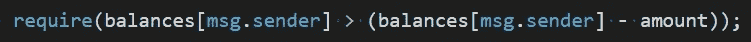

# BatchNoOverflow

> 原文：<https://medium.com/coinmonks/batchnooverflow-670f9ae06f54?source=collection_archive---------7----------------------->

2018 年 4 月 22 日， [PeckShield](https://medium.com/u/76bcf8c698ec?source=post_page-----670f9ae06f54--------------------------------) 的团队在 **BEC** 令牌合约中发现了一个 bug。这个漏洞允许零余额的攻击者向他们想要的任何人支付大量的钱。这将完全稀释任何代币的价值，当你意识到你心爱的代币一文不值的时候，哈克曼早就走了。

## 充满

在编程中，数字不可能变得无限大，在某一点上，如果你继续增加一个数字，它将溢出并“重置”为零。在这个合同的例子中，这个神奇的数字是 1.1579209e+77，这是一个很大的数字。从加密的角度来看，只会有 2.1e+7 个比特币。

如果程序员不小心，这可能会被利用，因此，即使是以太坊网站上最简单的令牌示例也会添加溢出检查。让我们看一下有问题的合同。

攻击者会调用这个函数，并向它提供一个地址列表(***_ 接收者*** )和支付给每个接收者的金额(***_ 值*** )。 ***_value*** 然而要唤醒 BatchOverflow bug 必须满足一个标准，如果乘以提供的 ***_receivers*** 的数量，就必须等于我前面提到的那个幻数。

如果 ***_value*** 满足上述要求，则从发送方余额中减去的 ***总金额*** 为零。这将允许攻击者在*线 12* 处通过大门，这是为了确保您的余额能够支付账单。所有这一切的结果是，攻击者创建了大量的令牌，并将这些令牌存入一个帐户(可能是他们自己的帐户)。

## 修复

通常人们会使用像 Zeppelin 这样的公司构建的库和样板文件，它们经过了彻底的测试，以确保这样的事情不会成为你合同中的一个问题。然而，这个 bug 可以通过一个非常简单的代码修复来解决。

almost there

一个可能的解决方法是添加另一个测试来检查发送者在减去 ***金额*** 后的余额是否小于他的当前余额。如果发生溢出，余额将是相同的，使其成为无效交易。然而，这仍然不能解决问题。如果攻击者有一个小的余额，比方说 10 个*什么的，*攻击者可以设计 ***_value*** 溢出到比他们当前持有的余额小的某个数量，从而通过这个门。

maybe better

也许更好的解决办法是简单地检查将要转移的总额 ***是否大于或等于 ***_value*** 。如果发生溢出，该测试将不会通过。对于攻击者来说，要通过这个门，他们至少需要这个神奇数字的 20 分之一，这仍然是一个非常大的数字，如果不利用另一个漏洞，很可能无法获得。***

## 结论

在构建智能合同时，利用可用的工具。像整数溢出这样的简单错误可能会破坏您的项目。

来玩这个简单的例子看看这个简单的例子[https://github.com/phzietsman/batchOverflow](https://github.com/phzietsman/batchOverflow)