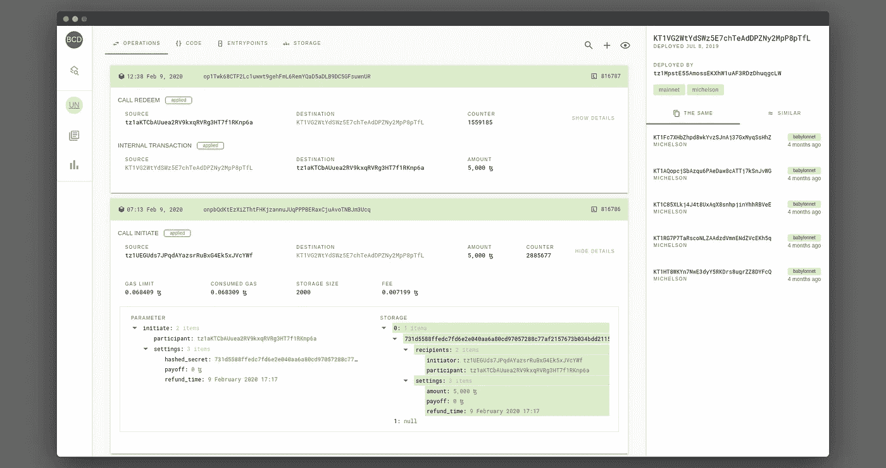
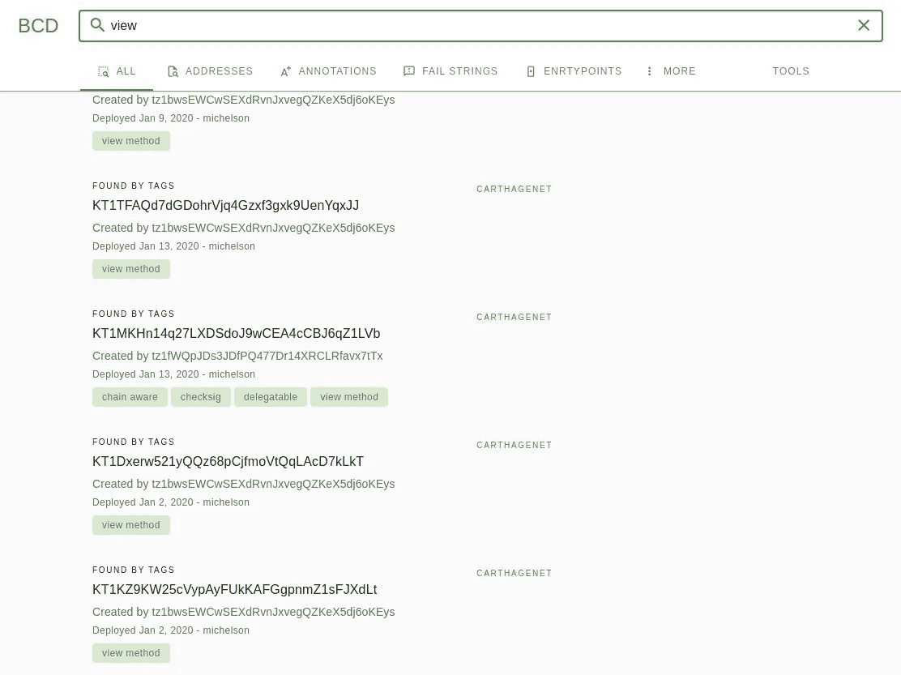

# BCD2 — Tezos 智能合约中心

> 原文：<https://medium.com/coinmonks/bcd2-tezos-smart-contracts-hub-85f6102fc2f9?source=collection_archive---------2----------------------->

## 更好的呼叫开发资源管理器的发展

我们的合同浏览器的第一个版本是一个概念验证，结果证明是成功的，所以我们决定把它带到下一个级别，并建立一个可靠的产品。

到目前为止，我们试图保留的一个关键特性是无需服务器端就能工作的能力。当然，我们向 Tezos 节点发出 RPC 请求，并使用几个索引器 API，但是我们可以在不同的服务器之间无缝切换，这给了我们某种自由，并引入了某种程度的去中心化。部署更好的 Call Dev 也非常容易，我们目前使用 GitHub Pages，这额外保证了您看到的代码是实际运行在您的浏览器中的代码(加上没有跟踪)。

但是这个优势最终变成了一个限制，为了给我们的用户提供更好的体验，我们需要继续前进。在 Tezos 基金会的支持下，我们从头开始重新编写了所有的东西，很快我们将推出一个新版本的合同浏览器，它具有一系列新的酷功能。

# 全球目标

## 给开发者一个工具来管理他们所有的 Tezos 项目

类似于 GitHub 仪表板，但是以一种更加分散的方式。开发人员将能够在一个地方从多个网络监控他们的所有合同，自动按项目和版本进行分组。如果你不是开发者，你仍然可以订阅你感兴趣的项目。这些功能以及丰富的统计数据和可定制的警报将提供给经过身份验证的用户。

## **让 dapp 生态系统对社区更加透明**

当然，你可以通过探索者浏览合同，或者访问像 [tezos.help](http://tezos.help) 和【tezosprojects.com】T5 这样的资源。但是没有什么能让你感觉到你已经掌握了发展的脉搏，一些事情真的在做。你可能想看到最近的更新，新的发布，项目统计等等。在 BCD2 上，您可以通过多种标准搜索合同，方式与 GitHub 搜索类似。

除了关于特定契约的操作、代码和状态的信息之外，我们还将提供以下问题的答案:

*   这个合同属于什么项目？
*   那是哪个版本？
*   这个版本有什么变化？
*   它是用哪种语言写的？
*   使用统计是什么(每个入口点的呼叫次数、每个用户、总观众、技术开发中心音量等)？

# 各种改进和错误修复

除了新的功能，一些现有的功能也将得到扩展。更好的操作显示和过滤，丰富的代码查看器，不同表示之间的切换，当然还有更干净的 UI。我们希望推出几项重大改进:

*   一个更好的迈克尔逊浏览器，具有未展开的宏和下载源代码的能力
*   丰富的错误格式化程序，它不仅显示描述消息，还显示实际失败的代码行
*   一个非常简单的工具，通过拖放自动生成初始存储来将合同部署到测试网
*   将显示仍在等待或滞留在内存池中的操作(与 [TzKT](https://tzkt.io/) 浏览器中的相同)
*   包含多个回调的复杂事务将被完全解码(以前只解码当前与合同相关的操作)
*   公共 API！不需要解释
*   `Pick Random`按钮最终会变成真正的随机😅

当然，许多错误将被修复，尤其是与大地图处理相关的错误。

# 搜索引擎

最后但同样重要的是，终极的 Tezos 智能合同搜索引擎允许您找到代码和存储中的所有内容，包括大地图。BCD 在所有网络中同时搜索，并提供丰富的查询定制。

Hmmm, looks familiar 🤔

# 什么时候发布？

我们正在尽最大努力在三月份发布预览版，就在 TQuorum 活动之前。敬请关注我们的[推特](https://twitter.com/tezosbakingbad)和[电报](https://t.me/baking_bad_chat)，欢迎提问！

*最初发表于 2020 年 2 月 10 日 https://baking-bad.org**的* [*，在那里你可以找到文章的完整版本。*](https://baking-bad.org/blog/2020/03/10/explorer-bcd2-tezos-smart-contracts-hub/)

> [直接在您的收件箱中获得最佳软件交易](https://coincodecap.com/?utm_source=coinmonks)

