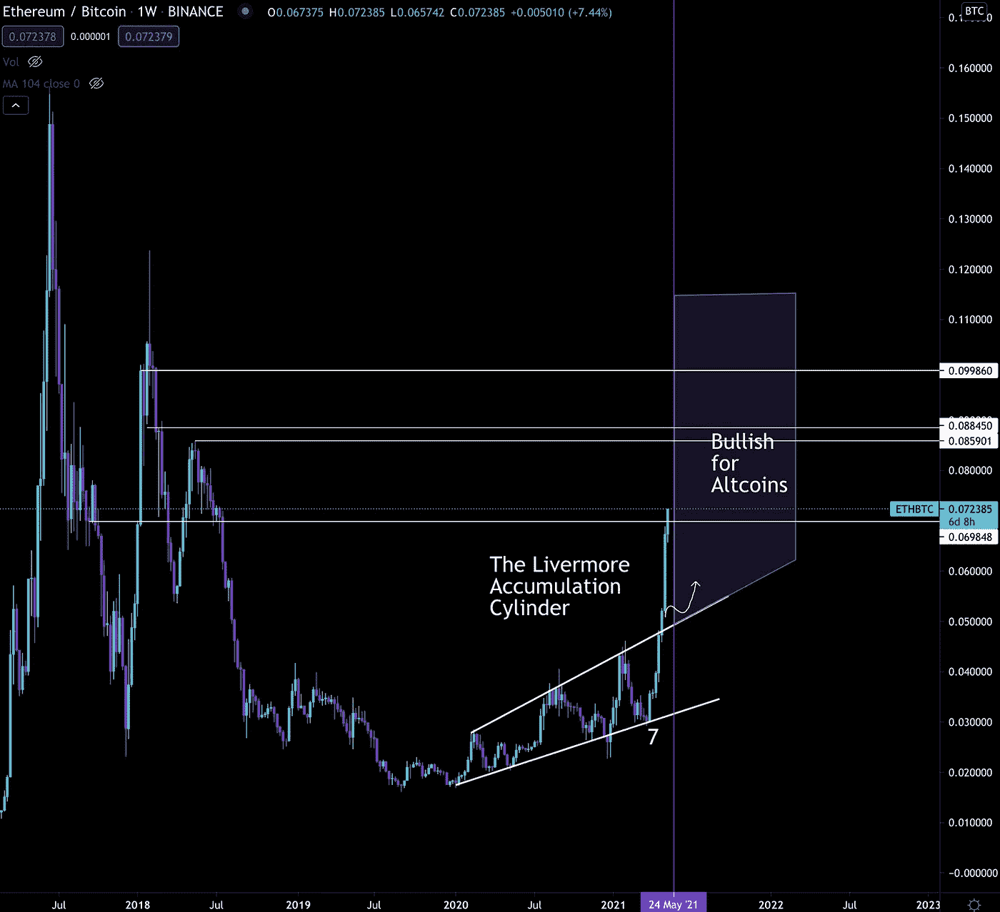
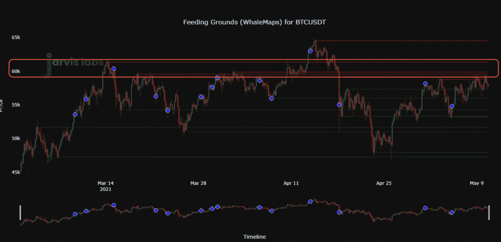

# 做好准备:ETH 和市场更新

> 原文：<https://medium.com/coinmonks/be-ready-eth-and-market-update-2c0705e0a5ba?source=collection_archive---------5----------------------->

PSA:对于目前的贾维斯人工智能订户，请务必阅读我们在问题末尾的公告。

以太坊看起来令人难以置信，因为它在本周末突破了 4000 美元。

对于那些错过了周五的问题标题，“[完美的炮制](https://jarvislabs.substack.com/p/a-perfect-concoction-eth)”的人，我们打破了 ETH 流量如何在周末前看起来看涨。

那期杂志上写的分析现在已经完成了。

期待…

利弗莫尔积累缸正在发挥作用。对于新来这里的人，你可以通过阅读我们 3 月 8 日发行的名为“[展望下一个替代赛季](https://jarvislabs.substack.com/p/eyes-on-the-next-altseason)”的灰度和每周图表部分，或者通过在 Tradingview 上查看这个易于解释的图表来了解速度。

这可能看起来很老，因为这两个资源现在已经存在两个多月了，但它们实际上在今天非常重要。

现在我提出这两种资源，因为在这个周期中，ETH 的价格波动可能会继续超过比特币。

大多数市场都将 0.1 ETH/BTC 视为方格旗。

从图表来看，这是有道理的…

0.1 出来是之前牛市留下的阻力线。以及 0.86–0.885 区域，该区域也将产生一些阻力。

但如果我们暂时离开图表，我认为在本轮牛市的后期，BTC 联邦理工学院有可能突破 0.1。

这是因为以太坊的基本面将使华尔街叙事生根发芽。

今年 7 月/8 月，以太坊将实现名为 London 的升级。在升级中，可能会出现一个名为 EIP-1559 的改进方案。这段代码将改变 ETH 的膨胀。

这意味着以太坊的货币政策即将升级。

如果发生这种变化，ETH 有可能成为一种通缩资产。在这个世界上，由于系统中疯狂的刺激数量，稀缺要求最高的溢价，这种通缩前景意味着 ETH 可以要求溢价。

对于使用比特币来扮演这一角色的高净值个人来说，尤其如此。

一个新的故事是噪音中的信号。一旦我们开始在主流媒体上看到它，0.1 的价格目标就不再是一个终点。

事实上，我甚至不相信前一周收盘价 0.15 是一个终点。这主要是由于 ETH 缺乏流动性。

如果较大的参与者对积累 ETH 有很大兴趣，就不会有像比特币那样多的东西可供流通。

与其他资产不同，ETH 位于 ETH2.0 的信标链(450 万 ETH)、整个 DeFi(1010 万 ETH)和灰度(320 万 ETH)上。仅这三个出口就占现有 ETH 的 15%以上。

如果同样的百分比应用于比特币，它将相当于近 300 万 BTC。

这就是为什么不能只把 0.1 看做终点。鉴于各种智能合约和灰度中锁定了多少流动性，ETH 的任何重大变动都将更加引人注目。

现在，接下来的几天…

我们还没有排除 crypto 整体的熊市前景。

目前，比特币 61000 美元的价格区间令人感兴趣。如果我们的收盘价高于这个价格区间，价格将会进一步上涨。这是一张鲸鱼觅食地的地图，显示在这个区域有一些阻力。我们用红框突出显示了它。

如果我们不低于 61，000 美元，那么重新测试 50-52，000 美元附近的近期低点是可能的。

我们目前没有采取看涨方案的主要原因是，上周末我们目睹了大量替代硬币流入交易所。这是今天替代硬币下跌的部分原因。

随着这些资金流入，比特币并没有发生太大变化。

此外，Tether 开放了它的打印机，释放了一波新鲜的 USDT。这也是为什么我们还没有走完全成熟的熊路线。

如果有的话，这条绳子可以用来买蘸酱。一个比其他资产反弹更快的大幅调整是很有可能发生的。

在市场上涨或下跌之前，我们继续保持谨慎。

希望你听从了建议，在本周末削减一些利润，为买入任何下跌做准备。

我们明天再聊。

你的脉搏在加密，

本·莉莉

附言 Jarvis AI 新用户快速公告…

我们延长了年度会员升级为终身会员的限时优惠。如果您选择这样做，我们将按比例分配订购金额。这意味着你的年费将会成为终身会员的费用。

请记住，我们的数据分析网站 ChainPulse 即将推出。有了它，我们将全面提高 Jarvis AI 的订阅成本。所以，把这些当前的价格看做一个早期接入协议。