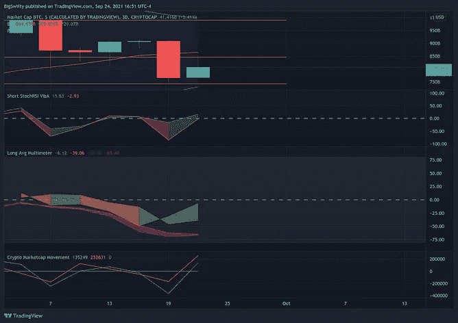
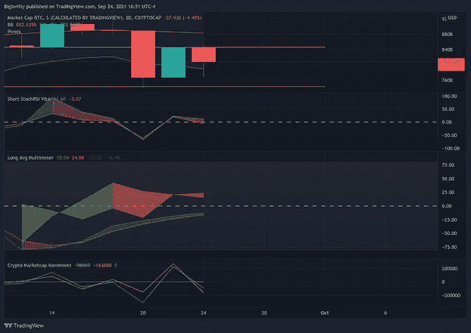
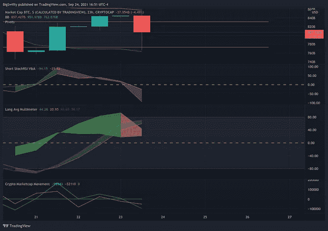
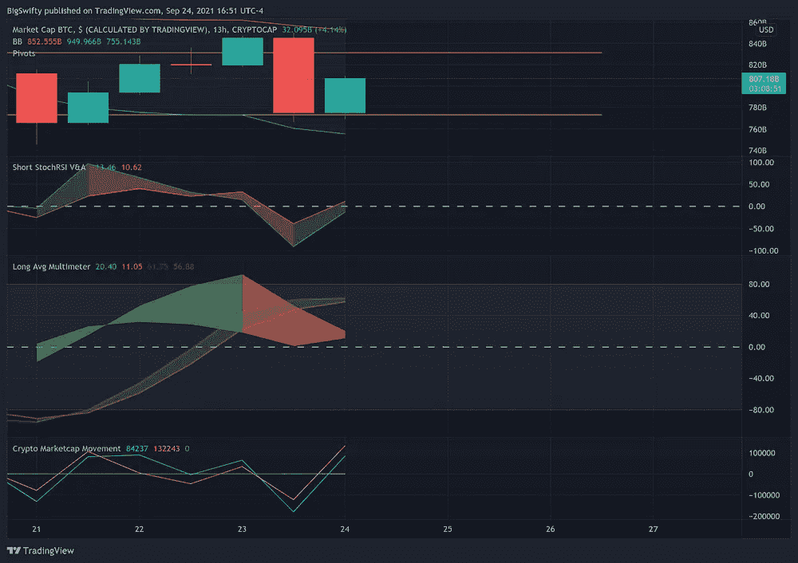
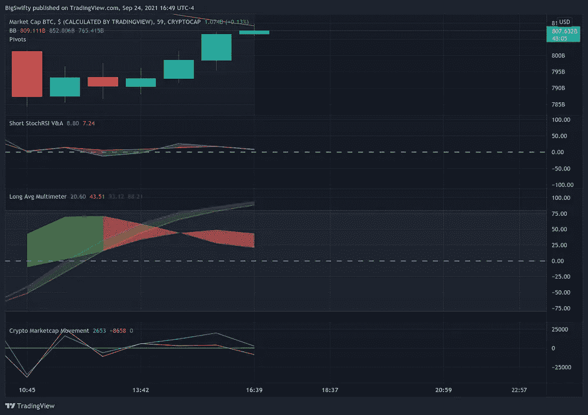
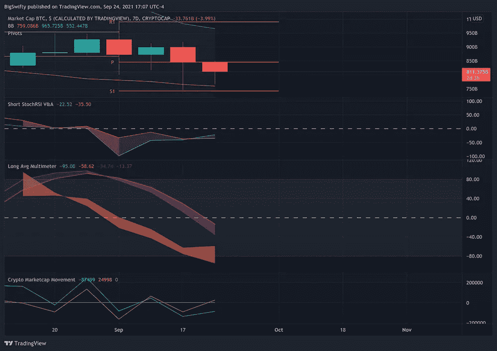
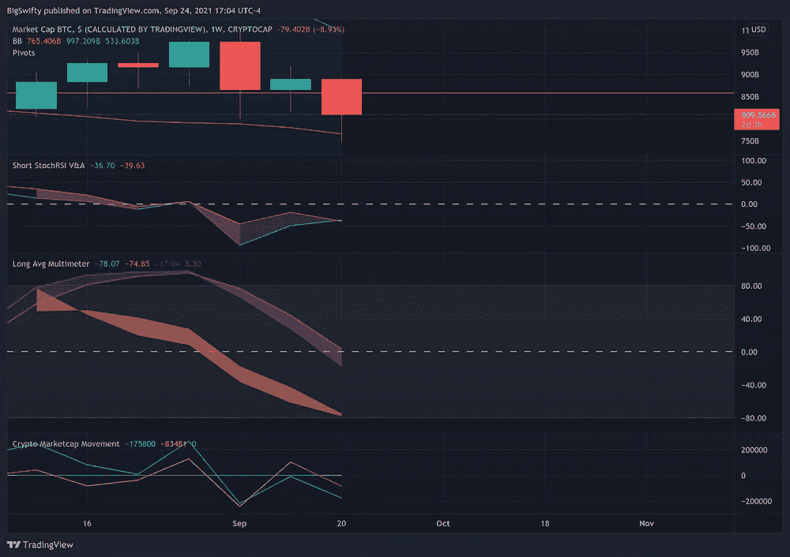

# 要害怕！…但没那么害怕。

> 原文：<https://medium.com/coinmonks/be-scared-but-not-that-scared-72d43ae55ae9?source=collection_archive---------8----------------------->

Bitcoin looks bear for the day.

比特币，是*的*市场指标。如果上涨，一般来说每个人都很高兴，如果下跌，我们就会皱眉。

The three day looks optomistic … maybe.

我改变了我的长 Avg 万用表(LAM ),以考虑到以前几个酒吧的各种措施，并平均它们；ADX 现在也包括在内。我认为，这提供了更高水平的准确性。即使空头 V&A 显示了积极的下一个框架，LAM 显示了总体趋势，并提供了一些幅度，无论价格是在严重下跌，还是你的 5 米棒上涨了 0.5%，最终会在一小时内被 2%的下跌趋势吞噬。这里你可以看到一个普遍的向下拉动。

这一组中的最后一个图表显示了总市值的变动，一个简单的当前减去前一帧的差异，然后是它的导数。绿线是 USDT 的“变化率”，所以当指标高于绿线时，资金在流入，低于绿线时，资金在流出。这是很有预见性的。如果资金正在流入市场，比特币是它首先去的地方。

13 和 2D 显示资金流入市场，但总的趋势似乎是下降，这与我的其他指标相吻合。让我们关注市场，看看我们是在降温还是刚刚开始。我不认为我们看到的是任何类型的悬崖，但这里有两张图表最让我担心；你想怎么做就怎么做。

Bitcoin marketcap on the 5D and 11D

其他窗口显示了一定程度的增长，但指标普遍疲软。

干杯！

> *这不是投资建议。这纯粹是信息性的。我与本文中提到的任何证券、硬币或其他金融工具无关，也不认可它们。这些文章是一种记录变化和保存预测密码市场成功或失败的公开证据的手段。我不对损失负责。声明:我在我概述的资产中持有少量股份，因为我相信它们有增长潜力。我不是霍德勒，我是一个没有证书的业余交易者，我也不是一个财务顾问。不要相信我说的话，做你自己的研究。*
> 
> 加入 Coinmonks [电报频道](https://t.me/coincodecap)和 [Youtube 频道](https://www.youtube.com/c/coinmonks/videos)了解加密交易和投资

## 另外，阅读

*   [尤霍德勒 vs 科恩洛 vs 霍德诺特](/coinmonks/youhodler-vs-coinloan-vs-hodlnaut-b1050acde55a) | [Cryptohopper vs 哈斯博特](https://blog.coincodecap.com/cryptohopper-vs-haasbot)
*   [币安 vs 北海巨妖](https://blog.coincodecap.com/binance-vs-kraken) | [美元成本平均交易机器人](https://blog.coincodecap.com/pionex-dca-bot)
*   [新加坡十大最佳加密交易所](https://blog.coincodecap.com/crypto-exchange-in-singapore) | [收购 AXS](https://blog.coincodecap.com/buy-axs-token)
*   [投资印度的最佳密码](https://blog.coincodecap.com/best-crypto-to-invest-in-india-in-2021) | [HitBTC 评论](/coinmonks/hitbtc-review-c5143c5d53c2)
*   [加拿大最佳加密交易机器人](https://blog.coincodecap.com/5-best-crypto-trading-bots-in-canada) | [赌注加密](https://blog.coincodecap.com/staking-crypto)
*   [如何在印度购买比特币？](/coinmonks/buy-bitcoin-in-india-feb50ddfef94) | [WazirX 审查](/coinmonks/wazirx-review-5c811b074f5b)
*   [比特币主根](https://blog.coincodecap.com/bitcoin-taproot) | [Bitso 评论](https://blog.coincodecap.com/bitso-review) | [排名前 6 的比特币信用卡](/coinmonks/bitcoin-credit-card-bc8ab6f377c6)
*   [最佳免费加密信号](https://blog.coincodecap.com/free-crypto-signals) | [YoBit 评论](/coinmonks/yobit-review-175464162c62) | [Bitbns 评论](/coinmonks/bitbns-review-38256a07e161)
*   [在印度利用加密套利赚取被动收入](https://blog.coincodecap.com/crypto-arbitrage-in-india)
*   [德国最佳加密交易所](https://blog.coincodecap.com/crypto-exchanges-in-germany) | [WazirX P2P](https://blog.coincodecap.com/wazirx-p2p)
*   [如何购买 Monero](https://blog.coincodecap.com/buy-monero) | [IDEX 评论](https://blog.coincodecap.com/idex-review) | [BitKan 交易机器人](https://blog.coincodecap.com/bitkan-trading-bot)
*   [币安 vs Bitstamp](https://blog.coincodecap.com/binance-vs-bitstamp)|[bit panda vs 比特币基地 vs Coinsbit](https://blog.coincodecap.com/bitpanda-coinbase-coinsbit)
*   [如何购买 Ripple (XRP)](https://blog.coincodecap.com/buy-ripple-india) | [非洲最好的加密交易所](https://blog.coincodecap.com/crypto-exchange-africa)
*   [非洲最佳密码交易所](https://blog.coincodecap.com/crypto-exchange-africa) | [胡交易所评论](https://blog.coincodecap.com/hoo-exchange-review)
*   [eToro vs robin hood](https://blog.coincodecap.com/etoro-robinhood)|[MoonXBT vs Bybit vs Bityard](https://blog.coincodecap.com/bybit-bityard-moonxbt)
*   [Stormgain 回顾](https://blog.coincodecap.com/stormgain-review) | [Bexplus 回顾](https://blog.coincodecap.com/bexplus-review) | [币安 vs Bittrex](https://blog.coincodecap.com/binance-vs-bittrex)
*   [Bookmap 评论](https://blog.coincodecap.com/bookmap-review-2021-best-trading-software) | [美国 5 大最佳加密交易所](https://blog.coincodecap.com/crypto-exchange-usa)
*   [如何在 FTX 交易所交易期货](https://blog.coincodecap.com/ftx-futures-trading) | [OKEx vs 币安](https://blog.coincodecap.com/okex-vs-binance)
*   [如何在势不可挡的域名上购买域名？](https://blog.coincodecap.com/buy-domain-on-unstoppable-domains)
*   [印度的秘密税](https://blog.coincodecap.com/crypto-tax-india) | [altFINS 审查](https://blog.coincodecap.com/altfins-review) | [Prokey 审查](/coinmonks/prokey-review-26611173c13c)
*   [布洛克菲 vs 比特币基地](https://blog.coincodecap.com/blockfi-vs-coinbase) | [比特坎评论](https://blog.coincodecap.com/bitkan-review) | [币安评论](/coinmonks/binance-review-ee10d3bf3b6e)
*   [Coldcard 评论](https://blog.coincodecap.com/coldcard-review) | [BOXtradEX 评论](https://blog.coincodecap.com/boxtradex-review)|[uni swap 指南](https://blog.coincodecap.com/uniswap)
*   [阿联酋 5 大最佳加密交易所](https://blog.coincodecap.com/best-crypto-exchanges-in-uae) | [SimpleSwap 评论](https://blog.coincodecap.com/simpleswap-review)
*   [购买 Dogecoin 的 7 种最佳方式](https://blog.coincodecap.com/ways-to-buy-dogecoin) | [ZebPay 评论](https://blog.coincodecap.com/zebpay-review)
*   [美国最佳加密交易机器人](https://blog.coincodecap.com/crypto-trading-bots-in-the-us) | [经常性回顾](https://blog.coincodecap.com/changelly-review)
*   [huo bi 的加密交易信号](https://blog.coincodecap.com/huobi-crypto-trading-signals) | [BitMEX 评论](https://blog.coincodecap.com/bitmex-review)