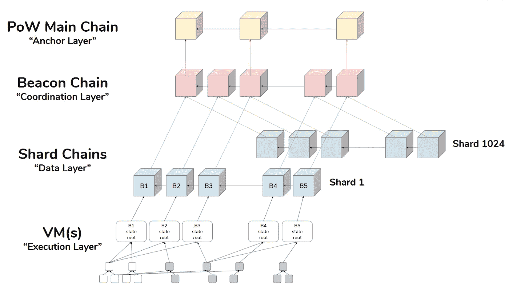
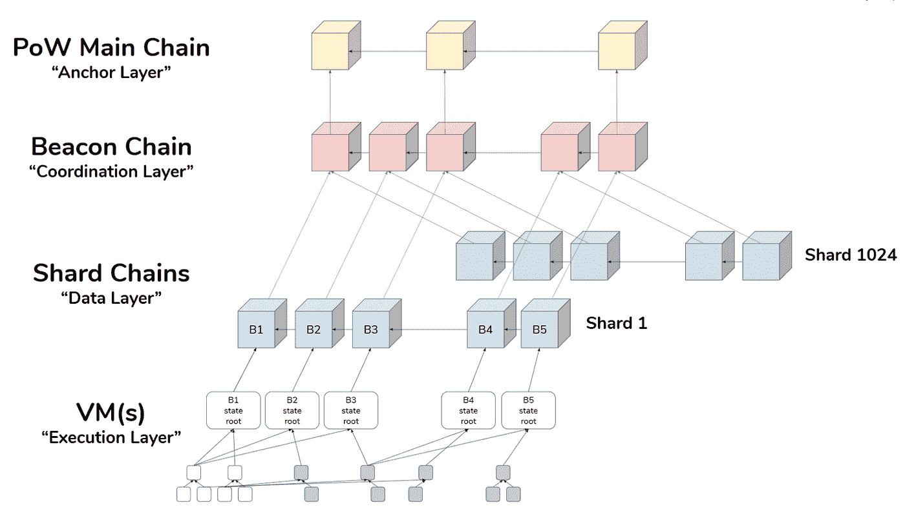

# 灯塔链:以太坊 2.0 之心

> 原文：<https://medium.com/coinmonks/beacon-chain-heart-of-ethereum-2-0-971a0b86cdee?source=collection_archive---------1----------------------->

以太坊 1.0 于 2015 年上线。在撰写本文时，它使用了经典的工作证明(与[比特币](https://blog.coincodecap.com/a-candid-explanation-of-bitcoin/)相同)。Ethreum 向区块链介绍了图灵完成[智能合同](https://blog.coincodecap.com/tag/smart-contact)。

## **什么是智能合约？**

智能合约是[区块链](https://blog.coincodecap.com/what-is-blockchain-a-simple-guide-for-dummies/)上的程序，可以从区块链外部触发，能够存储数据(有限)并改变 EVM 的状态。

这些智能合约支持 CryptoKitties、LocalEthereum 等 Dapps。

然而，所有这些[dapp](https://blog.coincodecap.com/what-are-dapps-an-ultimate-guide/)都因为区块链的限制而面临可扩展性问题。PoW 使得 Dapps 很难面向更多的观众。

最好的例子就是隐猫的流行。2017 年，随着越来越多的人涌向平台获取 cryptokitties，它[拥塞了整个以太坊网络](https://qz.com/1145833/cryptokitties-is-causing-ethereum-network-congestion/)，交易费用到了 20 美元。

这突出了当前网络的缺点。因此，在 2016 年， [Vitalik](https://en.wikipedia.org/wiki/Vitalik_Buterin) 提出了从工作证明向利益证明转变的想法。

这开启了以太坊 2.0 阶段，命名为 **Serenity。**宁静号将会分阶段发布。

在进一步讨论之前，让我们试着对利害关系证明(PoS)有一个大致的了解。

# 什么是利害关系的证明？

在 PoS 中，用户将他/她的资产作为保证金来参与共识协议。

这些人被称为负责形成块的验证者(在 PoW 中，矿工负责形成块)。

随机选择一个验证器来提议下一个块。然后，剩余的验证器对该块进行验证(通过投票)。该块被验证后，将在网络中广播。

一些众所周知的 PoS 协议的例子包括委托利益证明、拜占庭容错型利益证明等等。

以太坊的赌注证明叫做[卡斯珀](https://github.com/ethereum/wiki/wiki/Casper-Proof-of-Stake-compendium)。

# PoS 的优势

1.  消除耗能硬件
2.  减少 51%的攻击几率
3.  提高网络的可扩展性

# 信标链

信标链是以太坊 2.0 的心脏。它是其余组件如 [Shard](https://blog.coincodecap.com/sharding-in-ethereum/) 、eWasm 和 cross-link 构建的基础。

它(基于 PoS 的链)将与 Mainnet(基于 PoW 的链)并行运行。信标链主要是为验证器制作的。

# 如何成为以太坊验证师？

要成为验证者，一个节点必须在以太坊主网中存放 32 以太到一个智能契约。

金额是锁定的，合同将产生一个日志条目(一个 Merkle 散列)，这是你的股份的证明。

它就像通向灯塔链的大门。之后，你就成为了一个“主动的”验证者，并获得了参与验证过程的权利。

该节点将被允许成为验证者委员会的一部分，该委员会将对块的有效性进行投票。委员会由 120 名随机挑选的验证者组成。

每个委员会将负责一个[碎片](https://blog.coincodecap.com/sharding-in-ethereum/)(把它想象成以太坊网络的一段)。

# 信标链中的块生产

就像心脏有心跳一样，信标也有**插槽**。每个时间段大约为 16 秒。

在这个时间范围内，随机选择一个验证者(称为提议者)。委员会中的其余验证者成为证明者。

提议者的作用是收集一组事务以形成一个块。证明人将证明(投票/担保)该块的有效性。

在块验证之后，它将被添加到碎片中。32 个时隙共同形成一个**纪元**。

应该注意，一个块中可以包含的事务数量与验证程序存放的赌注成正比。

例如，Alice 已经下注 38 ETH，如果她被选为提议者，她将仅被允许在区块中包括有限数量的交易。

现在，鲍勃已经押了 200 埃特。如果他被选为提议者，他将被允许包括比爱丽丝多得多的交易。

在该块被确认和广播之后，提议者收到交易费以及激励。根据 Vitalik 的说法，赌注的回报可以从 2.2%到 6%不等。

# 信标链中的斜线

如果验证程序选择了一个无效的交易，该怎么办？在这种情况下，证明人会发现它是无效的，不会担保它。

这样一来，提议者就会因为恶意的做法而损失一部分的股份，这就叫砍杀。

当一个验证者被削减时，如果他/她长时间离线，他/她也可能损失一部分股份(称为二次泄漏)。

如果标记数量低于 16ETH，验证器将从信标链中删除。

任何心智健全的人都不会试图欺骗网络，因为这将导致他自己的金钱损失。因此，为了最大限度地利用赌注，验证者必须积极地参与到正义的实践中。

在初始阶段，信标链不会有智能合同和 EVM。一个人光凭心是做不了什么的。但这对身体其他部分的形成和功能是最好的。

要与信标链交互，您需要一个信标链客户端。您可以使用 Geth、Parity 或 Pantheon 在您的机器上运行信标链客户端。

*最初发表于*[*【https://blog.coincodecap.com】*](https://blog.coincodecap.com/ethereum-beacon-chain/)*。*

**同样，阅读**

*   [顶级 DeFi 项目](/coinmonks/defi-future-10-promising-projects-in-the-defi-world-ff2b697ab006)
*   [最佳加密交易机器人](/coinmonks/whats-the-best-crypto-trading-bot-in-2020-top-8-bitcoin-trading-bot-c16adeb13317)
*   最好的比特币[硬件钱包](/coinmonks/the-best-cryptocurrency-hardware-wallets-of-2020-e28b1c124069?source=friends_link&sk=324dd9ff8556ab578d71e7ad7658ad7c)
*   最好的[加密税务软件](/coinmonks/best-crypto-tax-tool-for-my-money-72d4b430816b)
*   [最佳加密交易平台](/coinmonks/the-best-crypto-trading-platforms-in-2020-the-definitive-guide-updated-c72f8b874555)
*   [unis WAP 最佳钱包](/coinmonks/best-wallets-to-use-uniswap-e91a6385d9e8)
*   最佳[加密贷款平台](/coinmonks/top-5-crypto-lending-platforms-in-2020-that-you-need-to-know-a1b675cec3fa)
*   Bitsgap 评论——一个轻松赚钱的加密交易机器人
*   为专业人士设计的加密交易机器人
*   [3commas Review](https://blog.coincodecap.com/3commas-review-an-excellent-crypto-trading-bot) |一款优秀的密码交易机器人
*   [3Commas vs Cryptohopper](/coinmonks/cryptohopper-vs-3commas-vs-shrimpy-a2c16095b8fe)
*   Bitmex 上的[保证金交易的白痴指南](/coinmonks/the-idiots-guide-to-margin-trading-on-bitmex-dbbd7742c6fc?source=friends_link&sk=7bfa99d2a181142510c8442c8ddb0786)
*   加密摇摆交易的权威指南
*   [Bitmex 高级保证金交易指南](/coinmonks/bitmex-advanced-margin-trading-guide-2270c195ce25?source=friends_link&sk=1d986cca731f5084b9a2db4a4bc4a7ad)
*   [开发者最佳加密 API](/coinmonks/best-crypto-apis-for-developers-5efe3a597a9f)
*   [加密套利](/coinmonks/crypto-arbitrage-guide-how-to-make-money-as-a-beginner-62bfe5c868f6)指南:新手如何赚钱
*   顶级[比特币节点](https://blog.coincodecap.com/bitcoin-node-solutions)提供商
*   最佳[加密制图工具](/coinmonks/what-are-the-best-charting-platforms-for-cryptocurrency-trading-85aade584d80)

> [直接在您的收件箱中获得最佳软件交易](https://coincodecap.com?utm_source=coinmonks)

