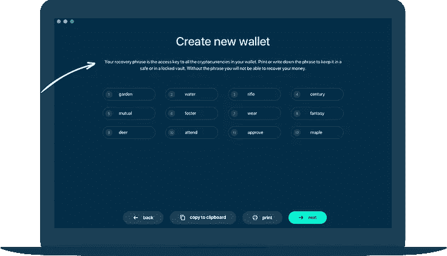
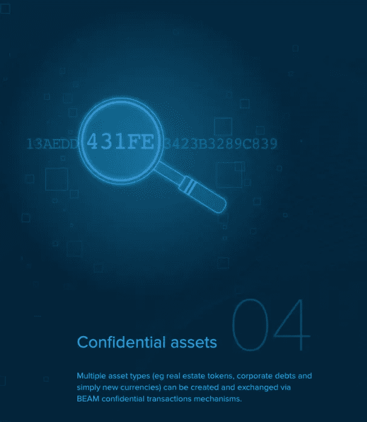

# Beam 和 Mimblewimble 协议让在线隐私重获生机

> 原文：<https://medium.com/coinmonks/beam-breathes-life-back-into-online-privacy-38d2c50c807d?source=collection_archive---------3----------------------->

# 在线隐私被破坏

安全漏洞无时无刻不在泄露我们的私人信息。你甚至可能不知道它什么时候发生在你身上。最近，当安全转账服务 [Zelle 被利用](https://www.nytimes.com/2018/04/22/business/zelle-banks-fraud.html)时，数千名客户的私人交易成为欺诈的对象。此外，糟糕的隐私可能是糟糕设计的副产品。流行的 p2p 资金转移应用 [Venmo 最初无缘无故地公开交易记录](https://www.zdnet.com/article/venmo-refuses-to-say-why-transactions-are-public-by-default/)，引发了围绕该应用隐私的担忧和诉讼。甚至[比特币也不是完美的](https://cointelegraph.com/news/are-bitcoin-transactions-traceable)。

现在比以往任何时候都更是一个反思的好时机，“互联网隐私对你来说意味着什么，私人的、分散的金钱对我们整个社会又意味着什么？”

为了恢复人们对我们每天使用的网络支柱的信心，迫切需要开发保护用户隐私的安全、自主的软件。这是像 [BEAM](https://www.beam.mw/) 这样注重隐私的加密货币的前提。

# 从数字化到数字原生支付

部分问题在于，如今的网上支付试图将一个方钉装进一个圆孔。*数字化*支付将物理技术改造为数字手段。Paypal、Zelle 和 Venmo 等电子商务和汇款解决方案旨在适应代表信用卡、借记卡和在线银行账户的数字化支付。

**网上商店没有创造一种新的*数字原生的*支付方式，而是调整了他们的用户界面(UI)来支持一种熟悉的支付方式——卡。**这种遗留的支付摩擦促使技术领域最优秀和最聪明的头脑专注于通过在线广告和棘手的数据交易创造收入——为我们其他人创造了一个隐私噩梦——而不是创造一个更加开放、公平和用户友好的互联网。

# 滥用隐私伤害所有人

比特币诞生 10 年后，促使比特币诞生的许多不道德的市场操作又开始制造麻烦。这一次，大银行和保险公司并不是唯一的参与者。像 FAANG 这样的互联网巨头继续滥用他们自己的隐私准则，在网上和网下花费我们的个人隐私。

社交媒体将我们的注意力货币化并向第三方出售个性化数据的使命玷污了在线隐私的含义。更糟糕的是，盲目签署放弃我们的数字服务协议的权利已经使放弃对集中化公司的任何合理的隐私期望的过程正常化。因此，当中央集权的互联网巨头因其糟糕的安全和隐私实践而遭到黑客攻击或暴露我们的数据时，我们会吃亏……几乎没有追索权。

针对不充分的隐私解决方案泄露敏感的个人数据，如您在[购买的商品、喜欢的产品、电子邮件地址、电话号码、性别、出生日期等。](https://www.nytimes.com/2018/09/28/technology/facebook-hack-data-breach.html)或[你的整个个人信息历史](https://www.wired.com/story/hackers-posted-private-facebook-messages/)，隐私币和分散式信息服务已经出现，以帮助用户重新获得控制权。

数字化支付停留在过去，通信服务过于集中。以隐私为重点的加密货币 BEAM 提供了一种新的前进方式，使机密的数字原生交易能够在线扩展，以满足现实世界的隐私需求。下面，我们将探索突破性技术的背景和内部工作原理，这些技术使 BEAM 大放异彩，并为真正私人的数字原生交易和分散式消息传递提供了一种新的替代方案。

# BEAM 如何保护在线支付隐私

在世界各地，趋势正朝着越来越严格的监控模式发展，例如中国政府用“[社会信用评分](https://www.npr.org/2018/10/31/662436265/china-tests-a-social-credit-score)”来分析和评估日常网上购物和互动。社会信用分数有效地限制或奖励了公民可以用他们的钱做什么——比如限制购买中国境外的机票，或者奖励公民以折扣价购买某些产品的能力。这项技术尤其令人担忧的是，它是可出口的，这意味着其他国家在未来可能会采用同样的监控技术。 **BEAM 的加密货币基于一个名为**[**Mimblewimble**](/beam-mw/on-linkability-of-mimblewimble-da9ba71e83b4)**的开创性加密协议，该协议默认保护用户隐私，并通过设计减轻监控。**

在传统的借记卡和信用卡支付中，交易应该在相关方之间保密。正如我们所知，事实并非如此(例如 Zelle 泄露的元数据暴露了私人用户交易)。在亚洲，微信支付(WeChat Pay)和支付宝(AliPay)等热门应用提供无缝的移动数字支付和消息服务，交易费用低廉，代价是国家监控(T0)、应用内欺诈(T2)和应用内欺诈(T3)。

在比特币中，交易是化名的。这意味着只有发送和接收地址是模糊的——不是完全匿名的——而交易值是永久公开的。不足为奇的是，政府和大型组织已经开发出对这些假名交易的来源和身份进行三角测量的方法。让人们看到你从谁那里买了什么，花了多少钱，这是比特币设计的一个基本限制。

**BEAM 通过可扩展的保密交易克服了这些限制，这些交易默认支持用户隐私和可选择的可审计性，以实现法规合规性。更重要的是，BEAM 开发了一个** [**安全公告板系统(SBBS)**](/beam-mw/the-secure-bulletin-board-system-sbbs-implementation-in-beam-a01b91c0e919) **用于发送和检索由椭圆曲线加密(ECC)保护并默认为私有的消息。**这一突破实现了带有机密交易的私有存储转发通信。通过向与在线交易相同的 ECC 保证保护的离线节点发送私人消息，SBBS 提供了一个强大的加密、去中心化的替代方案，以取代微信支付(WeChat Pay)等集中式竞争对手。

# 蒲公英+ SBBS 如何保护在线和离线隐私

Dandelion 是一个奇妙的、名副其实的协议，它模糊了事务图。就像一个真正的蒲公英在偶然分发它的种子之前漫无目的地在空中漂浮一样，蒲公英协议在随机广播其交易数据之前绘制了一条匿名路径。

值得注意的是在[比特币改进提案(BIP) 156](https://github.com/bitcoin/bips/blob/master/bip-0156.mediawiki) ，**蒲公英通过创建穿过 ECC 网络的随机交易路径**来帮助保护*何时何地广播*私人交易，通过模糊路由匿名发送交易数据，然后仅在交易到达其最终目的地后*立即向许多节点广播交易。通过这种方式，交易图保持隐藏，去匿名化的机会变得显著降低。对于 BEAM 来说，这意味着数字原生加密货币可以通过设计避免监控。*

结合 BEAM 的 SBBS 存储转发功能，即使没有实时 p2p 连接，用户也可以跨节点匿名通信。就像把一条消息张贴到除了预定收件人以外没有人能看到的公告板上一样，BEAM 通信仍然是保密的、匿名的，并且也可以离线访问。这种结合实现了私有的、分散的资金以及安全的、匿名的通信保证。

# 下一代隐私也需要可扩展

在 Zcash 等下一代保护隐私的加密货币中，zk-SNARKs 和其他零知识协议等许多技术被开发出来，以更全面地匿名化交易数据。**与 BEAM 相比，这些密码协议在可伸缩性和隐私性之间的权衡上存在不足。**

在 BEAM 中，穿透操作就像运行帐户余额一样，只记录最近的交易，以前的交易消失，而每笔交易都保持加密验证和安全。这种修剪方法节省了块空间，确保了可扩展性，并通过一个简单而优雅的加密操作隐藏了事务树，从而保护了用户隐私。

BEAM 与其他注重隐私的加密货币的不同之处在于，使用 BEAM 可以保护用户的身份以及默认的交易和消息路径，交易可以扩展以提供真实世界的价值存储，并且还有第二层性能优化的空间。此外，用户可以选择使交易可审计，以满足法规遵从性和消费者保护需求。 **BEAM 是自主数字支付和可扩展加密货币的巨大进步。欢迎来到可扩展、保密交易的未来！**

更多信息请访问 [www.beam.mw](http://www.beam.mw)

> [直接在您的收件箱中获得最佳软件交易](https://coincodecap.com/?utm_source=coinmonks)

