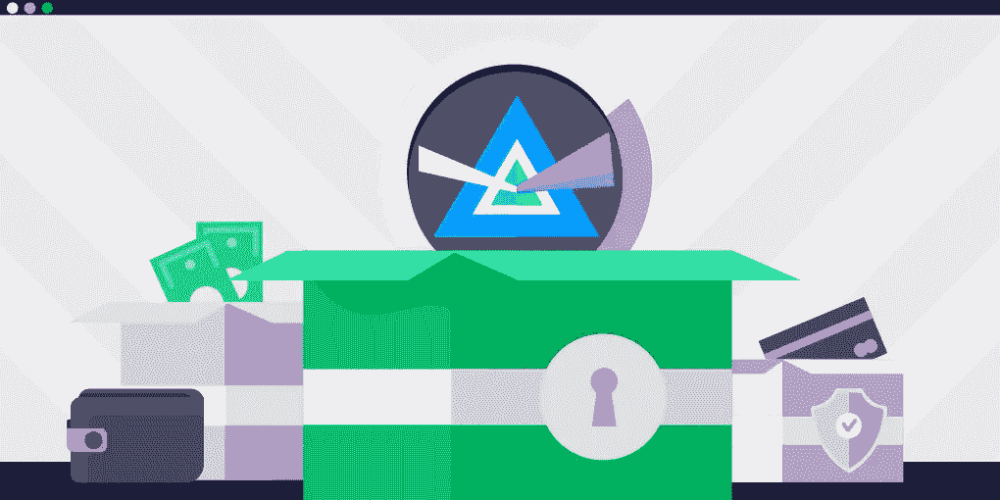

# 光束加密货币及其特性

> 原文：<https://medium.com/coinmonks/beam-cryptocurrency-and-its-peculiarities-83d300b52e15?source=collection_archive---------1----------------------->

最初发表于 [ChangeNOW 博客](https://changenow.io/blog/beam-cryptocurrency)

隐私硬币有一些独特的功能，保证他们在加密世界的好地方。虽然像比特币这样的加密货币经常被称为匿名，但这只不过是用词不当。本质上，这样的区块链是公共的。在将钱包地址链接到用户时，整个交易历史变得为网络的所有参与者所知。隐私币通过使用各种匿名方法来解决这个问题:例如，Beam cryptocurrency 是第一个应用 Mimblewimble 隐私技术的货币。

在深入研究 Beam 加密货币的特性及其功能之前，让我们快速了解一下 Mimblewimble 隐私技术是什么。

# Mimblewimble:光束创建模块

波束区块链是基于 Mimblewimble privacy 技术。Mimblewimble(或 MW)由笔名 Tom Elvis Jedusor 于 2016 年推出，是一种区块链设计，利用工作证明共识机制来提供更多隐私并提高网络可扩展性。

*   **区块链交易的新模式**

MW 区块链设计改变了区块链的传统模式进行交易所遵循的路线。它提供了一种更简单、更快速的下载数据的方式，同时也使同步和验证变得更紧凑、更方便。

Mimblewimble 还有一个被称为*直通*的功能:它可以通过删除多余的交易记录来关闭大量区块链交易。Mimblewimble 隐私技术的核心是将保密交易(CT)的概念向前推进，以隐藏大量的区块链交易。

*   **没有可识别或可重复使用的地址**

微波区块链不包含可识别或可重复使用的地址。虽然参与者可以看到他们交易的详细信息，但对于局外人来说，一切看起来都像一些随机数据。

本质上，块更类似于一个大型事务，而不是多个较小事务的组合。人们还可以验证块而不必泄露交易的细节。著名的输出永远无法追溯到它们的输入。

# 波束加密货币:有史以来第一个使用 Mimblewimble 协议

Beam Mimblewimble 组合是所有隐私币中的首创。光束币于 2019 年 1 月 3 日正式亮相。加密领域的几位顶尖人物(例如，早期比特币开发者之一 Jameson Lopp)在这种货币推出时公开表示支持。

在描述 Beam 的关键特征时，创作者提到了它为用户提供选择的能力，用户可以决定将哪些信息透露给哪些方。由于这种透明的特性是可选的，因此 Beam 对于希望更多地了解交易方的企业也很有用。

*   **蒲公英:附加技术**

除了 Mimblewimble，Beam 还使用了另一种被称为 Dandelion 的复杂技术协议。蒲公英技术旨在掩盖网络流量活动。它使分散在分散网络中的交易路径随机化。

让我们也看看光束系统是如何工作的！

# 光束钱包

人们可以从谷歌 Play 商店或苹果应用商店下载 Beam 钱包。这两种钱包都很方便，非常容易使用。它们兼容所有主要的操作系统——Windows、Mac 和 Linux。也可以从 Beam 官网下载桌面钱包和 CLI 钱包。

# 光束采矿

尽管 Beam 网络拥有验证交易的节点，但人们不能低估其矿工所扮演的角色。正如我们已经看到的，束挖掘遵循工作一致性机制的证明。它使用 Beam Hash III 安全协议，这是 Equihash (150，5)的更新版本。

Beam 挖掘池的网络哈希速率为 0.43 MSol/s，池哈希速率为 0.33 MSol/s。有关 19 个 Beam 挖掘池的所有信息都可以在 Beam 官方网站上找到。

# 波束表征组学

光束最大供应量等于 262，800，000 个硬币。目前，有 75，718，000 枚硬币在流通。通过周期性的减半来确保光束的稀缺性。

BEAM 目前的市场资本总额略高于 2000 万美元。这种货币的价格也经常上下波动。光束硬币价格的历史最高纪录是 3.21 美元；录制于 2019 年 1 月 28 日，距离币行正式上线才几天。梁价格的历史最低值记录在 2020 年 3 月 13 日:0.148340 美元。

Beam 没有持有 ICO 开发者鼓励在新发布的平台上进行光束硬币挖掘。在推出时，决定整体奖励的 20%将进入由 Beam 创始人、其投资者和 Beam 基金会成员管理的财政部。这些整体奖励将在五年后逐步取消。

现在，让我们来看看这个密码固有的特性列表！

# 顶梁特征

*   正如我们已经讨论过的，Beam 是第一个基于 Mimblewimble 隐私技术和最终匿名网络的加密技术。与大多数其他只是“被称为”匿名的加密协议不同，Beam 不存储任何有关区块链上交易参与者的信息。
*   Beam 使用所谓的“无脚本”技术。这项技术使 Beam 超越了单纯的价值转移。它允许用户执行广泛的交易(包括原子交换、托管和时间锁定交易)，保持区块链的唯一性不变。
*   Beam 提供了“选择性审计”选项。它有助于将加密不可伪造和数字签名的发票/合同附加到每笔交易中。然后，一些审计员被授予检查所有附加文档的权限。
*   Beam 保密交易机制支持创建和交换多种资产类型(包括房地产代币、公司债务和新货币)。
*   由于 Beam 加密协议非常注重其可持续性，这种加密技术有很多优点，可以长期使用。首先，它是开源的，可以从头开始实现。其次，它的社区由 Beam Growth Pool 提供支持，获得所有区块开采奖励的 20%。难道不是一个有效的推广和开发工具吗？
*   为了使 Beam 系统广泛兼容，开发人员使用 Equihash 算法和各种旨在运行和管理挖掘节点的工具对其进行了增强。
*   Beam 钱包提供原子交换，通过原子交换，Beam 可以与 BTC、LTC 和 QTUM 进行秘密交换。他们还使用 Lelantus 来改善隐私和断开连接。对于即时支付，光束钱包提供激光束功能。
*   Beam 还有一个名为 BeamX 的机密 DeFi 平台，通过光束着色器实现。BeamX 平台包括一个丰富的生态系统，包括价格先知、分散式桥梁、原子互换和钱包内 dApp 商店。
*   BeamX 还支持广泛的金融应用和工具，包括包装资产、算法稳定硬币、DEX、自动做市商和借贷工具。

# 摘要

Beam 加密货币的独特性源于 Mimblewimble 隐私技术和 Dandelion 协议，它无疑对隐私币领域非常重要。

然而，Beam 创始人目前的目标是不局限于匿名交易的边缘。Beam 协议团队的目标是创建一种可用于各种用例的加密货币。

在成为隐私币领域的领军人物之一之前，看看 Beam 还会探索什么样的道路将会很有意思。敬请关注，看看它在整个加密市场上的表现！

## 另外，阅读

*   最好的[密码交易机器人](/coinmonks/crypto-trading-bot-c2ffce8acb2a)
*   [德里比特评论](/coinmonks/deribit-review-options-fees-apis-and-testnet-2ca16c4bbdb2) |选项、费用、API 和 Testnet
*   [FTX 密码交易所评论](/coinmonks/ftx-crypto-exchange-review-53664ac1198f)
*   [逐位交换审查](/coinmonks/bybit-exchange-review-dbd570019b71)
*   最好的比特币[硬件钱包](/coinmonks/the-best-cryptocurrency-hardware-wallets-of-2020-e28b1c124069?source=friends_link&sk=324dd9ff8556ab578d71e7ad7658ad7c)
*   [密码本交易平台](/coinmonks/top-10-crypto-copy-trading-platforms-for-beginners-d0c37c7d698c)
*   [Bitsgap vs 3 commas vs quad ency](https://blog.coincodecap.com/bitsgap-3commas-quadency)
*   最好的[加密税务软件](/coinmonks/best-crypto-tax-tool-for-my-money-72d4b430816b)
*   [最佳加密交易平台](/coinmonks/the-best-crypto-trading-platforms-in-2020-the-definitive-guide-updated-c72f8b874555)
*   最佳[加密贷款平台](/coinmonks/top-5-crypto-lending-platforms-in-2020-that-you-need-to-know-a1b675cec3fa)
*   [莱杰纳米 S vs 特雷佐 one vs 特雷佐 T vs 莱杰纳米 X](https://blog.coincodecap.com/ledger-nano-s-vs-trezor-one-ledger-nano-x-trezor-t)
*   [block fi vs Celsius](/coinmonks/blockfi-vs-celsius-vs-hodlnaut-8a1cc8c26630)vs Hodlnaut
*   [bits gap review](/coinmonks/bitsgap-review-a-crypto-trading-bot-that-makes-easy-money-a5d88a336df2)——一个轻松赚钱的加密交易机器人
*   为专业人士设计的加密交易机器人
*   [PrimeXBT 审查](/coinmonks/primexbt-review-88e0815be858) |杠杆交易、费用和交易
*   HaasOnline 评论享受九折优惠
*   [埃利帕尔泰坦评论](/coinmonks/ellipal-titan-review-85e9071dd029)
*   [赛克斯石评论](https://blog.coincodecap.com/secux-stone-hardware-wallet-review)
*   [BlockFi 评论](/coinmonks/blockfi-review-53096053c097) |赚取高达 8.6%的加密利息
*   [面向开发人员的最佳加密 API](/coinmonks/best-crypto-apis-for-developers-5efe3a597a9f)
*   [最佳区块链分析工具](https://bitquery.io/blog/best-blockchain-analysis-tools-and-software)
*   [加密套利](/coinmonks/crypto-arbitrage-guide-how-to-make-money-as-a-beginner-62bfe5c868f6)指南:新手如何赚钱
*   顶级[比特币节点](https://blog.coincodecap.com/bitcoin-node-solutions)提供商
*   最佳[加密制图工具](/coinmonks/what-are-the-best-charting-platforms-for-cryptocurrency-trading-85aade584d80)
*   了解比特币的[最佳书籍有哪些？](/coinmonks/what-are-the-best-books-to-learn-bitcoin-409aeb9aff4b)

> [直接在您的收件箱中获得最佳软件交易](/coinmonks/newsletters/coinmonks)

