# 成为一个密码百万富翁:如何导航宏观市场周期

> 原文：<https://medium.com/coinmonks/become-a-crypto-millionaire-how-to-navigate-macro-market-cycles-99953ae21da6?source=collection_archive---------4----------------------->

秘密投资需要对市场周期有透彻的理解。知道什么时候增持比特币，什么时候让我们的投资组合倾向于替代比特币，什么时候在顶部附近卖出，在底部附近买入，可以提供比整体市场多倍的回报。这篇文章简要概括了一些可用于把握市场时机的工具。

## **高级市场结构**

加密市场仍然依赖于比特币。这种情况可能会改变，但截至目前，BTC 动力公司牢牢地主导和决定着更广泛的市场和生态系统。替代硬币(主要由 ETH 主导)的行为与市场周期同步，通常采用以下模式:

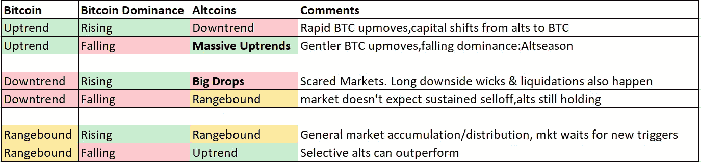

因此，确定比特币的走势是获得宏观视角的起点，这一点至关重要。了解我们在 BTC 周期中的位置及其潜在的下一步行动将随后决定我们的 alt 硬币策略。这篇文章的其余部分集中在 BTC 宏观周期。已经建立了许多指标和工具来识别这些问题，并取得了不同程度的成功。

# **战略指标(中长期)**

**回归模型:**像[库存到流量模型](https://www.lookintobitcoin.com/charts/stock-to-flow-model/)和[彩虹图](https://www.blockchaincenter.net/bitcoin-rainbow-chart/)都是基于对数回归的。S2F 采用用于商品定价的技术(价格轨迹是 BTC 市值与库存到流量值的对数回归，下一个目标是黄金的 mkt 上限),而彩虹图是历史 BTC 价格和后续外推的简单对数回归。

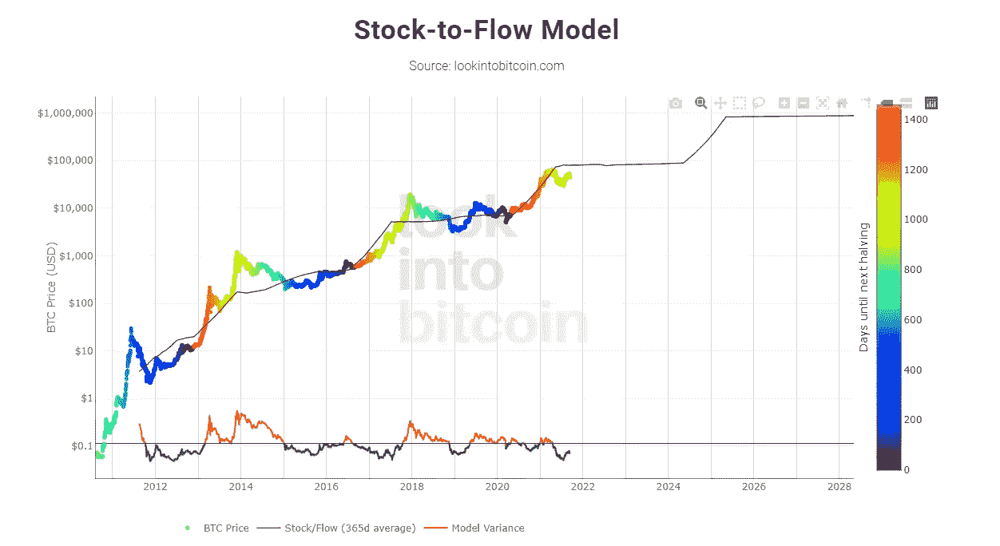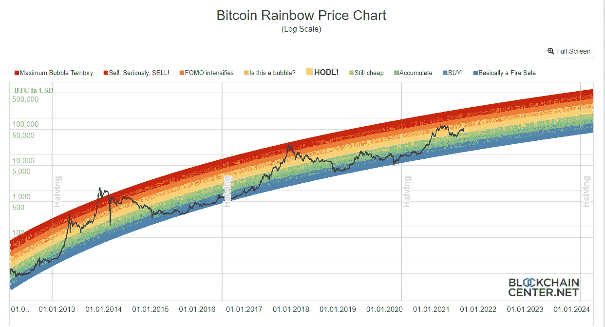

它们是一个很好的视觉市场地图，在加密市场参与者中非常受欢迎。这具有感性和反思的价值(自我实现的预言:如果每个市场参与者都预期价格会走向某个地方，它就会走向某个地方)，但它们并没有真正提供任何可操作的交易信息。他们值得关注，但我们不能依赖他们来管理投资组合。

**观察到的实验模型:**有多个[实验模型](https://charts.woobull.com/bitcoin-price-models/)在经验上表现良好，但这很可能是数据过度拟合的情况。它们本身不能被视为强信号，但当与其他信息来源结合时，可以给出一幅很好的画面。

这个领域的先驱 Willy Woo 创造了许多类似于 **CVDD 和 Delta cap** (下面的粉色和棕色线)的技术，它们似乎能挑出市场底部，还有 **Top cap** (下面的绿色虚线)，根据经验，它们似乎运行良好，能挑出顶部。只有时间能告诉我们这些指标有多强大，但关注它们并把它们包含在我们的心理市场地图中绝对是个好主意。

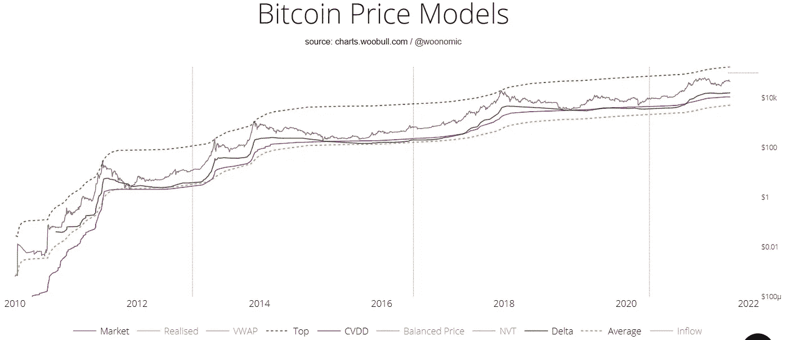

**圆周率周期顶部指标:**市场密切关注这一点，它现在有一点反射性。因此 [Pi 周期](https://www.lookintobitcoin.com/charts/pi-cycle-top-indicator/)中的交叉往往会成为自我实现的预言，需要密切监控以识别潜在的市场顶部。它很好地选择了 2013 年周期的两个顶部，2017 年的顶部以及 2021 年 5 月的中期周期顶部。

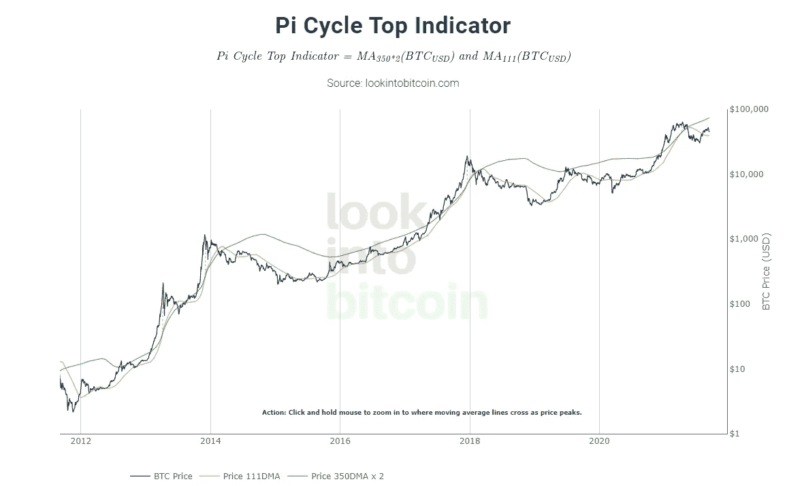

## **上链度量**

在过去的几年中，On chain 工具有了很大的发展。随着市场性质的改变，曾经准确捕捉市场动态的指标必须进行修改，以代表新的现实。(如闪电网络、交易所的活跃程度高于连锁交易所等)。这些早期工具中的一些在今天也能很好地工作，而另一些则不太适用。

使用连锁信息的主要目的是尝试和衡量不同市场参与者的行为，并推断这种行为对价格的未来影响。大多数指标基于两大类信息-

1)硬币最后移动时的年龄和价格

2)钱包地址标记(装有硬币数量的钱包，标记到不同实体的特定钱包等)

**比特币供应冲击指标:**这些指标是目前可用的一些最重要和最有见地的 onchain 信息来源。Glassnode 将多个钱包地址分为几大类(长期投资者、短期投资者和交易流),观察他们的行为可以提供市场活动的相关视图。具体来说，知道长期持有人(通常是经验丰富的老手)何时买入(锁定供应)或卖出(用 BTC 充斥市场)可以很好地判断市场方向。这些供应冲击(由于不同投资者群体的购买而导致供应从市场上消失)在中期具有出色的预测能力。

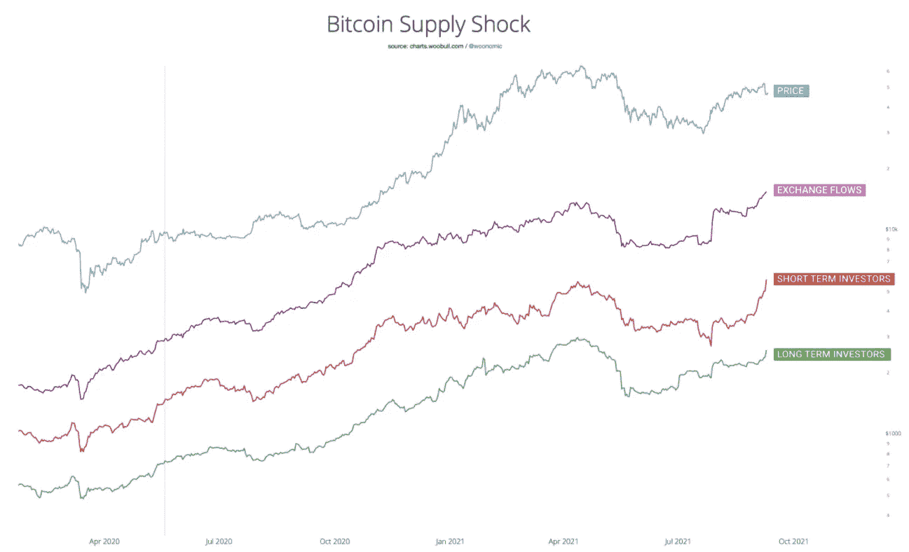

此外，观察基于不同规模的投资者类别(鲸鱼> 1000 btc 或虾< 1 btc)的交易活动具有出色的预测能力。

这是一个不同的观点，试图捕捉类似的信息，即市场老手在做什么。观察旧硬币(老古董)何时被卖出，可以了解我们在周期中的位置，抛售是暂时的，还是我们可能会进入持续的熊市。在 2018 年的反弹中，旧硬币持续抛售，这证实了熊市。(老兵利用退出流动性)。相反，我们在 2021 年没有看到老手卖出，这证实了牛市仍然存在的论点。

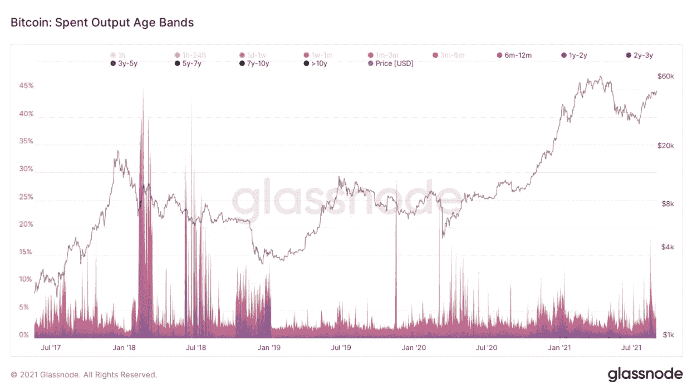

**URPD (UTXO 已实现价格分布):**放量集群表现为支撑位和阻力位。(特定区域的高交易量以及积累和分布意味着市场参与者将来也更有可能在这些级别进行交易)。通过计算硬币数量来观察链条上的交易量，是衡量链条支撑阻力水平的一个有用指标。

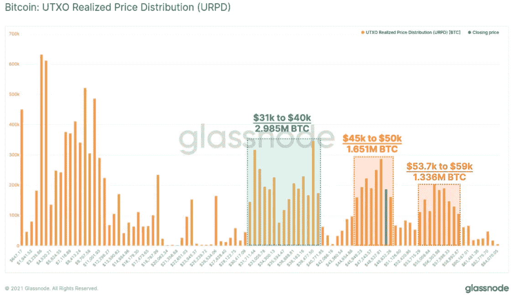

**aSOPR(调整后的支出产出利润率):** SOPR 实际上代表了所有比特币相对于市场价格的当前平均成本价。SOPR 高于 1 意味着市场盈利，低于 1 意味着亏损。调整后的 SOPR 忽略了寿命非常短的失效输出，并减少了指示器中的噪声。据观察，1 级通常在牛市和熊市中分别作为支撑和阻力。此指标反映了市场中的财务收益或损失，应与其他指标结合使用。要获得更详细的视图，应使用不同实体类型(长期持有人、短期持有人等)的 aSOPR。

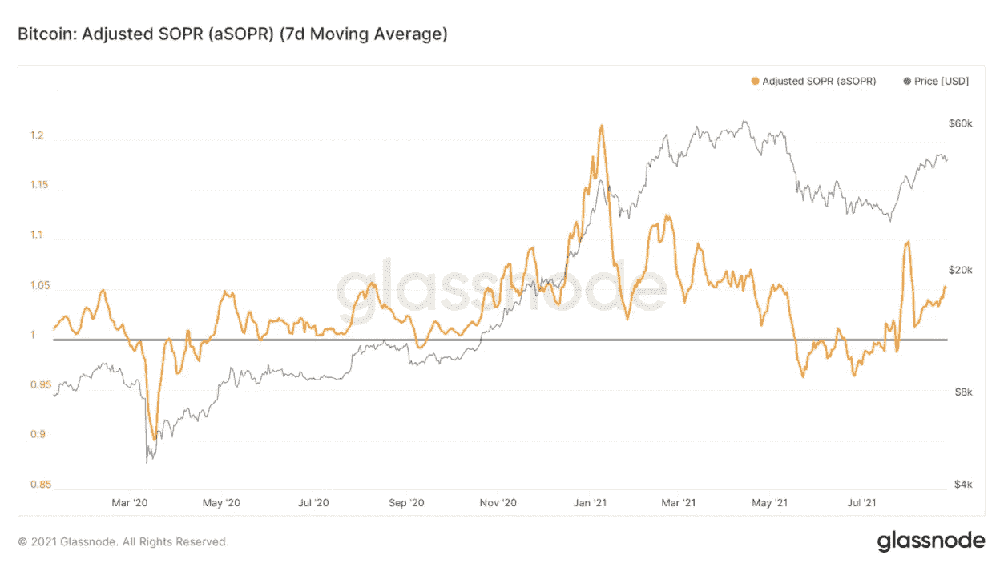

**MVRV-Z 得分(市场价值对实现价值 Z 得分):**这是一个[老一代](https://www.lookintobitcoin.com/charts/mvrv-zscore/) onchain 指标，它试图通过使用当前 btc 市值和实现市值(BTC 购买的成本基础，由硬币最后移动的价格确定)之间的差异来捕捉价格超调和欠调。这需要与其他指标结合使用，很难衡量峰值可以接近市场顶部多高，并且由于市场日益复杂，该信号最近也变得更加模糊。(与过去相比，交易所的交易量显著增加，而非连锁交易)

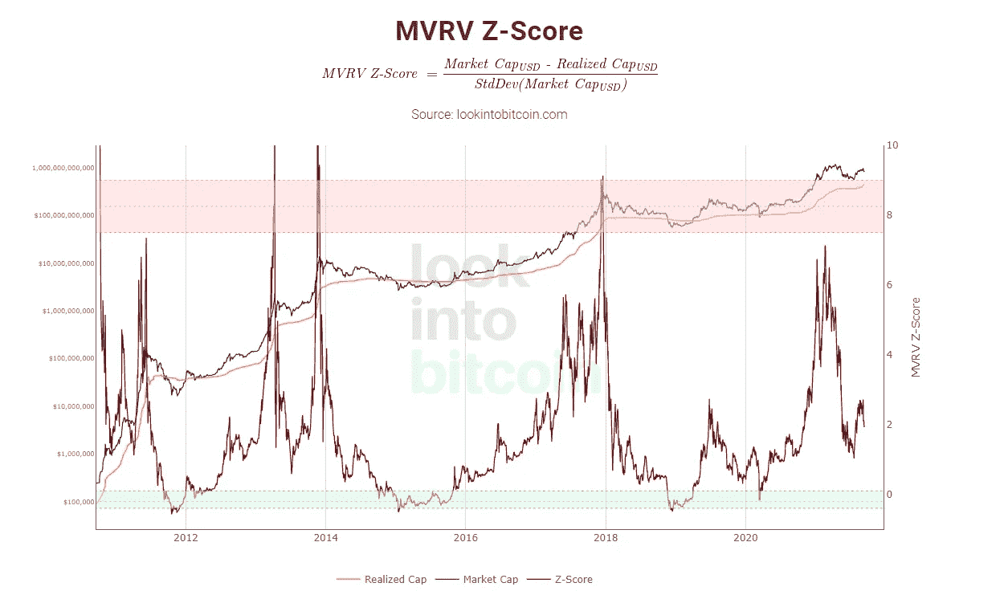

还有许多指标，如 HODL 波、最近活跃供应队列、BTC、交易所的 ETH 余额、普尔倍数等，可以增加增量信息，但上述工具集是一个良好的开端，可以提供一个稳健的中长期市场图景。

# **短期战术工具**

从短期来看，观察战术性市场指标，如 BTC 和 ETH 期货的总未平仓头寸、perp 融资利率和各交易所的总现货借贷水平，可以提供有价值的信息，并可以对由于清算级联而导致的潜在市场抛售事件发出预警。根据更广泛的宏观情景和市场周期中的整体位置，这些事件可能是潜在顶部附近的良好衍生机会，也可能是从暂时错位中受益的绝佳买入交易。虽然投资者影响长期价格，但投机者影响短期价格，因此必须注意过度扩张的投机者头寸。

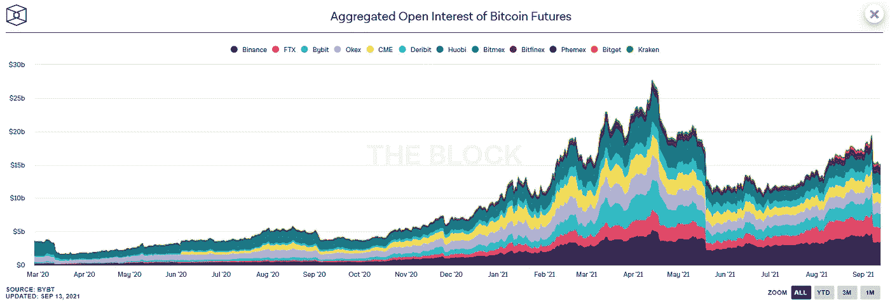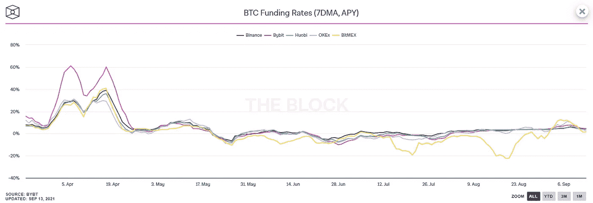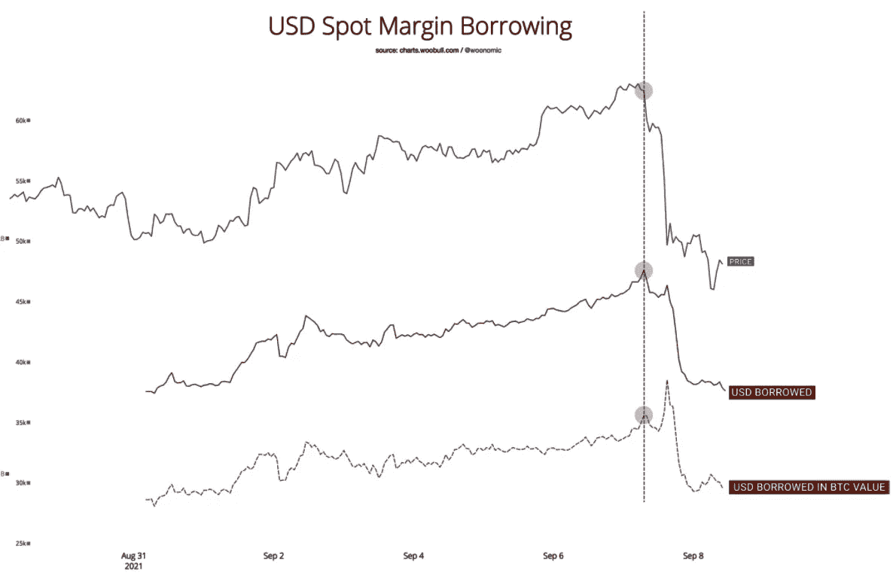

同样重要的是，密切关注总清算量和 OI 减少量，以判断抛售何时平静下来。

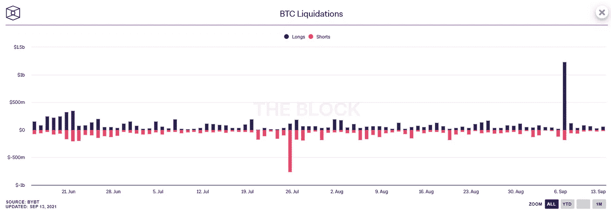

尽管由于冰山等特殊的订单类型，订单簿可能会被欺骗，并不能代表准确的情况，但密切关注订单簿热图确实有助于粗略确定支撑位阻力位。(因为真实订单和做市商发出的信号)这应始终与 SR 水平的其他指标结合使用。

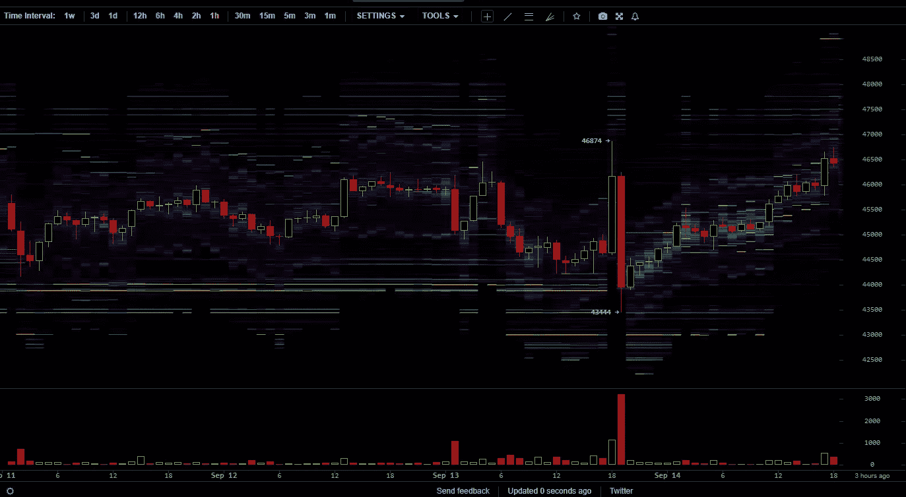

## **其他技术指标**

除了在上涨或下跌时寻找过度扩张的市场定位，还有一整套技术指标帮助进行短期交易，从盘中交易到跨越几周或几个月的波动交易。在较短的时间内，了解影响价格的各种技术因素和障碍至关重要。移动平均线、支撑位阻力位、成交量曲线、斐波那契扩展线、超买超卖位的振荡指标(RSI、cci 等)、波动带以及这些指标的各种组合有助于识别趋势跟踪和均值回复交易的良好风险回报机会。因为这篇文章是关于宏观市场周期的，我们将在后续文章中深入探讨。

> 加入 Coinmonks [电报频道](https://t.me/coincodecap)和 [Youtube 频道](https://www.youtube.com/channel/UCbyDhTbOiKh2iUMKBi4-4Zg)了解加密交易和投资

## 另外，阅读

*   [网格交易机器人](https://blog.coincodecap.com/grid-trading) | [Cryptohopper 审查](/coinmonks/cryptohopper-review-a388ff5bae88) | [Bexplus 审查](https://blog.coincodecap.com/bexplus-review)
*   [如何在 FTX 交易所交易期货](https://blog.coincodecap.com/ftx-futures-trading) | [OKEx vs 币安](https://blog.coincodecap.com/okex-vs-binance)
*   [Botsfolio vs nap bots vs Mudrex](/coinmonks/botsfolio-vs-napbots-vs-mudrex-c81344970c02)|[gate . io 交流回顾](/coinmonks/gate-io-exchange-review-61bf87b7078f)
*   [CoinFLEX 评论](https://blog.coincodecap.com/coinflex-review) | [AEX 交易所评论](https://blog.coincodecap.com/aex-exchange-review) | [UPbit 评论](https://blog.coincodecap.com/upbit-review)
*   [AscendEx 保证金交易](https://blog.coincodecap.com/ascendex-margin-trading) | [Bitfinex 赌注](https://blog.coincodecap.com/bitfinex-staking) | [bitFlyer 审核](https://blog.coincodecap.com/bitflyer-review)
*   [Bitget 评论](https://blog.coincodecap.com/bitget-review) | [双子星 vs BlockFi](https://blog.coincodecap.com/gemini-vs-blockfi) | [OKEx 期货交易](https://blog.coincodecap.com/okex-futures-trading)
*   [AscendEx Staking](https://blog.coincodecap.com/ascendex-staking)|[Bot Ocean Review](https://blog.coincodecap.com/bot-ocean-review)|[最佳比特币钱包](https://blog.coincodecap.com/bitcoin-wallets-india)
*   [霍比审核](https://blog.coincodecap.com/huobi-review) | [OKEx 保证金交易](https://blog.coincodecap.com/okex-margin-trading) | [期货交易](https://blog.coincodecap.com/futures-trading)
*   [麻雀交换评论](https://blog.coincodecap.com/sparrow-exchange-review) | [纳什交换评论](https://blog.coincodecap.com/nash-exchange-review)
*   [如何在印度购买以太坊？](https://blog.coincodecap.com/buy-ethereum-in-india) | [如何在币安购买比特币](https://blog.coincodecap.com/buy-bitcoin-binance)
*   [在美国如何使用 BitMEX？](https://blog.coincodecap.com/use-bitmex-in-usa) | [BitMEX 回顾](https://blog.coincodecap.com/bitmex-review) | [买索拉纳](https://blog.coincodecap.com/buy-solana)
*   [德国最佳加密交易所](https://blog.coincodecap.com/crypto-exchanges-in-germany) | [Arbitrum:第二层解决方案](https://blog.coincodecap.com/arbitrum)
*   [Coldcard 评论](https://blog.coincodecap.com/coldcard-review) | [BOXtradEX 评论](https://blog.coincodecap.com/boxtradex-review)|[uni swap 指南](https://blog.coincodecap.com/uniswap)
*   [阿联酋五大最佳加密交易所](https://blog.coincodecap.com/best-crypto-exchanges-in-uae) | [SimpleSwap 评论](https://blog.coincodecap.com/simpleswap-review)
*   购买 Dogecoin 的 7 种最佳方式
*   [最佳期货交易信号](https://blog.coincodecap.com/futures-trading-signals) | [流动性交易所评论](https://blog.coincodecap.com/liquid-exchange-review)
*   [最佳加密交易信号电报](/coinmonks/best-crypto-signals-telegram-5785cdbc4b2b) | [MoonXBT 评论](/coinmonks/moonxbt-review-6e4ab26d037)