# 成为区块链开发者

> 原文：<https://medium.com/coinmonks/becoming-a-blockchain-developer-a167ddb55efa?source=collection_archive---------2----------------------->

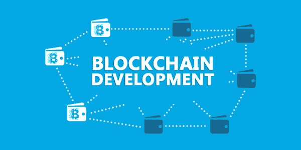

Blockchain and Smart Contract Development

B **lockchain** 是所有加密货币交易的数字化、去中心化的公共分类账。区块链的每个节点都有整个区块链的精确副本。

## 一个区块链开发者应该知道什么？

1.  你必须对经济学了解不多，对交易有个大概的了解。
2.  您还应该了解密码学的基础知识及其工作原理。
3.  了解比特币、以太坊
4.  了解加密货币中如何使用加密技术
5.  了解什么是智能合约
6.  了解区块链开发工具
7.  以太坊智能合约开发

**链接:**

*   [https://blockgeeks.com/guides/what-is-cryptoeconomics/](https://blockgeeks.com/guides/what-is-cryptoeconomics/)
*   [https://block geeks . com/guides/cryptocurrences-cryptography/](https://blockgeeks.com/guides/cryptocurrencies-cryptography/)
*   [https://medium . com/@ louislapat/cryptography-for-cryptocurrency-430 e 676d 9978](/@louislapat/cryptography-for-cryptocurrency-430e676d9978)

**术语:**

*   **地址** —地址是用于在网络上发送或接收交易的字母数字散列。
*   **块** —它们是网络中发生的有效交易的批次
*   **区块链** —它是一个共享的分类账，交易被永久记录为一系列区块。它包含网络在一个长的区块链(所谓的区块链)中进行验证的每个交易。
*   **街区高度**——区块链的长度或区块链的街区数量
*   **挖掘** —验证区块链交易的行为
*   **大宗奖励** —给予参与网络验证交易的矿工的奖励。
*   **共识** —网络中的节点或参与者之间对交易的有效性达成的一般协议，确保所有节点中的分类账都是彼此的精确副本。
*   **Dapp** —一个运行在分散式对等网络上的应用程序，它自主运行，将数据存储在区块链中，并根据一个显示价值证明的协议运行。
*   **道** —去中心化自治组织是一种数字化组织形式，其运行无需人工干预，并受业务规则的控制。
*   **分布式网络** —每个参与节点一起工作执行任务的网络。
*   **难度** —指一个事务的数据块被挖掘的难易程度
*   **双重消费** —数字现金方案中的一个潜在缺陷，单个/同一个数字代币可能被消费多次。
*   **创世纪区块**——区块链第一区块
*   **工作证明**——证明你为验证网络中的交易做了多少工作
*   **智能合同** —这些是编码到区块链中的业务规则，由网络中的参与者执行
*   **钱包** —包含私钥的文件，允许访问钱包设计的区块链

**链接:**

*   [https://blockchainhub.net/blockchain-glossary/](https://blockchainhub.net/blockchain-glossary/)
*   [https://steemit . com/区块链/@ mio 31337/69-区块链常用词汇](https://steemit.com/blockchain/@mio31337/69-common-terms-in-blockchain-vocabulary)

## 加密货币

加密货币是一种交易媒介，在区块链以电子方式创建和存储，使用加密技术来控制货币单位的创建和验证资金的转移。

**链接:**

*   [https://medium.com/@intenex/cryptocurrency-101-7197684775fd](/@intenex/cryptocurrency-101-7197684775fd)
*   [https://hacker noon . com/the-ultimate-guide-to-understanding-区块链和加密货币-f37cf4c0043](https://hackernoon.com/the-ultimate-guide-to-understanding-blockchain-and-cryptocurrencies-f37cf4c0043)
*   [https://blockgeeks.com/guides/what-is-cryptocurrency/](https://blockgeeks.com/guides/what-is-cryptocurrency/)

# 什么是区块链开发者？

找出如何保护不可变分布式数据库的软件开发人员。

# 智能合约？

智能合同是在以太网上运行的分散式应用程序或程序。它们是自动执行的合同，买卖双方之间的协议条款被直接写入代码行。

# 用于区块链/智能合约开发的工具

*   **Solidity**[[http://solidity.readthedocs.io/en/latest/](http://solidity.readthedocs.io/en/latest/)]——用于在以太坊区块链上创建智能合约的编程语言。
*   **Truffle Framework**[[http://truffleframework.com/ganache/](http://truffleframework.com/ganache/)]—以太坊的开发、测试框架和资产管道，内置智能合约编译、链接、部署和二进制管理。
*   **在线 Solidity 编译器[**[http://remix.ethereum.org/](http://remix.ethereum.org/)]—基于浏览器的编译器和 IDE，使用户能够使用 Solidity 语言构建以太坊合同并调试事务。
*   **meta mask**[[https://metamask.io/](https://metamask.io/)——通过浏览器连接以太坊节点的桥梁。
*   **test RPC[**[https://github.com/ethereumjs/testrpc](https://github.com/ethereumjs/testrpc)]—
*   **Ganache**[[http://truffleframework.com/ganache](http://truffleframework.com/ganache)]——这是一个以太坊开发的个人区块链，您可以使用它来部署合同、开发应用程序和运行测试。
*   web 3 . js[[https://github.com/ethereum/web3.js/](https://github.com/ethereum/web3.js/)]—这个库是一个模块集合，包含以太坊生态系统的特定功能。

# 在以太坊中创建一个基本的智能合约

您将从安装开发所需的工具开始。

首先你需要在你的系统中安装 T21，

```
**$ sudo apt-get update**
**$ sudo apt-get install nodejs**
**$ sudo apt-get install npm**
```

现在，我们将安装与以太坊区块链互动的松露框架

```
**$ sudo npm install -g truffle** 
**$ truffle init**
```


这将在目录中生成以下文件。

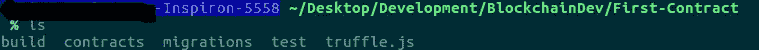

编辑包含区块链网络配置的 **truffle.js** 文件。

```
module.exports = {
    networks: {
        development: {
            host: "127.0.0.1", // ip where ganache is running blockchain server
            port: 7545, // port in ganache
            network_id: "*" // Match any network id
        }
    }
};
```

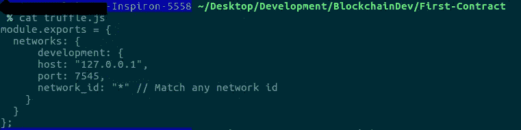

在合同目录中创建文件 **Counter.sol**

```
pragma solidity ^0.4.0;
contract **Counter** {
    int private count = 0; function **incrementCounter**() public {
        count += 1;
    } function **decrementCounter**() public {
        count -= 1;
    } function **getCount**() public constant returns(int) {
        return count;
    }
}
```

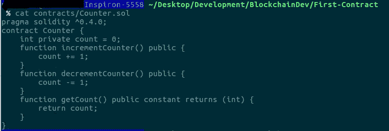

在迁移目录中创建另一个文件 **2_deploy_contracts.js**

```
const Counter = artifacts.require("./Counter.sol")module.exports = function(deployer) {
    deployer.deploy(Counter);
};
```

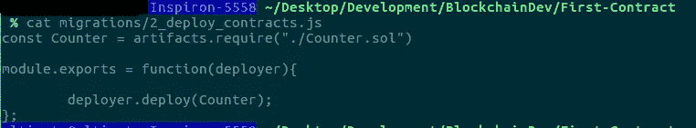

现在，在父目录中

```
 **$ truffle compile**
```

如果代码都没问题，我们将不会看到任何问题。

```
**$ truffle migrate --network development**
```

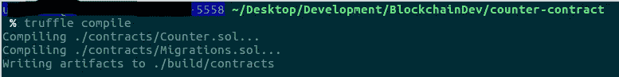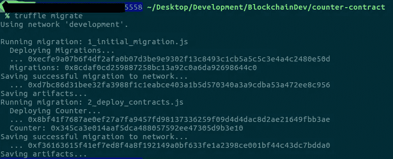

这是通过 rpc **127.0.0.1:7545** 将合同上传到以太网

```
*Using network ‘development’.**Running migration: 1_initial_migration.js*
 *Deploying Migrations…*
 *… 0xecfe9a07b6f4df2afa0b07d3be9e9302f13c8493c1cb5a5c5c3e4a4c2480e50d*
 *Migrations: 0x8cdaf0cd259887258bc13a92c0a6da92698644c0*
 *Saving successful migration to network…*
 *… 0xd7bc86d31bee32fa3988f1c1eabce403a1b5d570340a3a9cdba53a472ee8c956*
 *Saving artifacts…*
 *Running migration: 2_deploy_contracts.js*
 *Deploying Counter…*
 *… 0x8bf41f7687ae0ef27a7fa9457fd98137336259f09d4d4dac8d2ae21649fbb3ae*
 *Counter: 0x345ca3e014aaf5dca488057592ee47305d9b3e10*
 *Saving successful migration to network…*
 *… 0xf36163615f41ef7ed8f4a8f192149a0bf633fe1a2398ce001bf44c43dc7bdda0*
 *Saving artifacts…*
```

迁移是 truffle init 创建的默认合同。我们创建的契约计数器将部署在网络中，正如我们在上面的**0x 345 ca 3e 014 AAF 5 DCA 488057592 ee 47305 d9 B3 e 10**中看到的。

一旦契约被上传到以太网，我们将会看到一个契约地址，这是将来调用契约中的方法所使用的地址。

从上面的例子中，我们已经成功地创建了一个简单的反向契约。这个契约我们有方法来获取计数器(getCount)、递增(increment counter)/递减(decrementCounter)契约中的计数器。

现在，我们可以通过项目目录中的 truffle 控制台直接访问契约中的方法。

```
**$ truffle console**
```

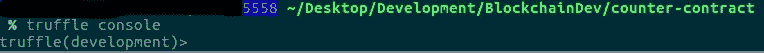

以获得网络中存在的账户。

```
**truffle(development)> addresses = web3.eth.accounts**
```

要获得网络中的第一个和第二个帐户:

```
**truffle(development)> address0 = web3.eth.accounts[0]**
**truffle(development)> address0 = web3.eth.accounts[1]**
```

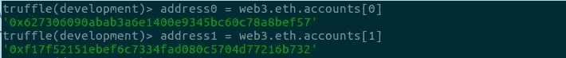

获取网络中部署的合同的地址

```
**truffle(development)> Counter.deployed().then(instance => console.log(instance.address))**
 **0x345ca3e014aaf5dca488057592ee47305d9b3e10**
```

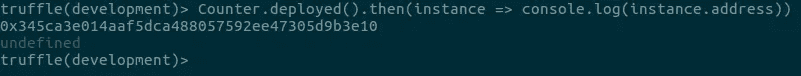

> 或者:
> 
> **../反合同$ truffle networks**
> 
> 网络:未知(id: 5777)
> 计数器:0x 345 ca 3 e 014 AAF 5 DCA 488057592 ee 47305d 9 B3 e 10
> 迁移:0 x8c daf 0 CD 259887258 BC 13 a 92 c0a 6 da 92698644 c 0
> 
> 或者
> 
> **松露(开发)> counter = Counter.address**

调用协定中的方法:

```
**truffle(development)> Counter.at(“0x345ca3e014aaf5dca488057592ee47305d9b3e10”).getCount()**
```

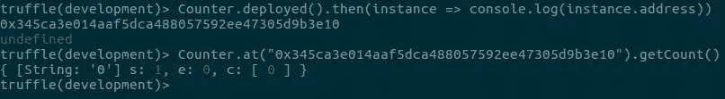

> 或者:
> **松露(开发)>(调配)。然后(函数(实例){app =实例})**
> 
> **松露(开发)> app。<tab>**
> app . ABI app . address app . all events
> app . contract app . decrement counter app . get count
> app . increment counter app . send transaction
> app . transaction hash
> 
> **松露(开发)>app . get count()**
> {[String:' 0 ']s:1，e: 0，c: [ 0 ] }

契约中的 get 方法都是免费的，但是，如果方法/调用改变了契约中值的状态，则需要 gas ie。钱。

> [直接在您的收件箱中获得最佳软件交易](https://coincodecap.com/?utm_source=coinmonks)

[](https://coincodecap.com/?utm_source=coinmonks)

还有一种方法可以通过 GUI 与 MyEtherWallet 交互契约中的方法。在后面的教程中，我们将继续通过 MyEtherWallet 在本地与区块链网络进行交互。