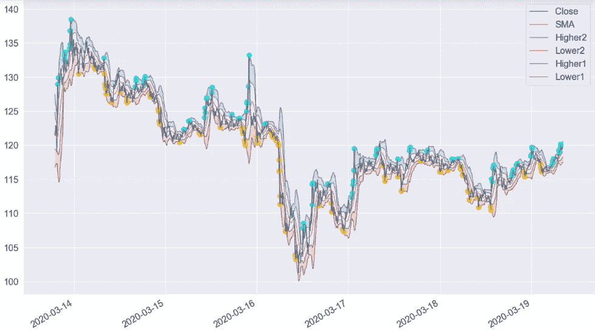
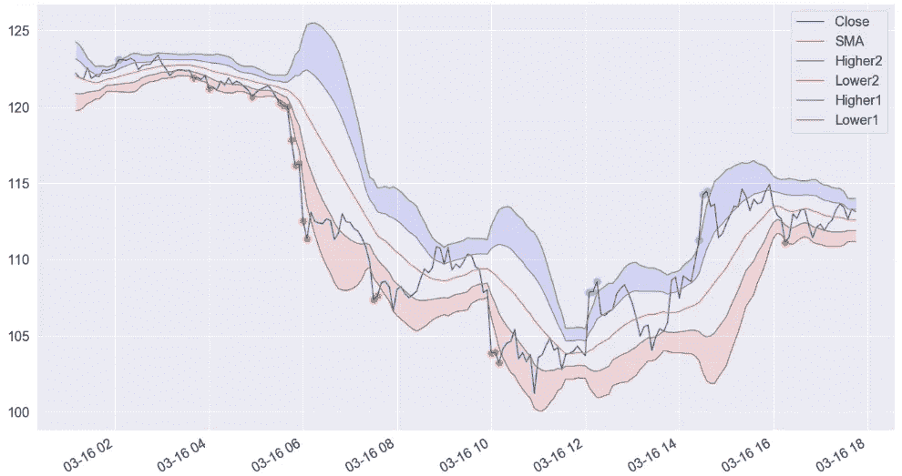
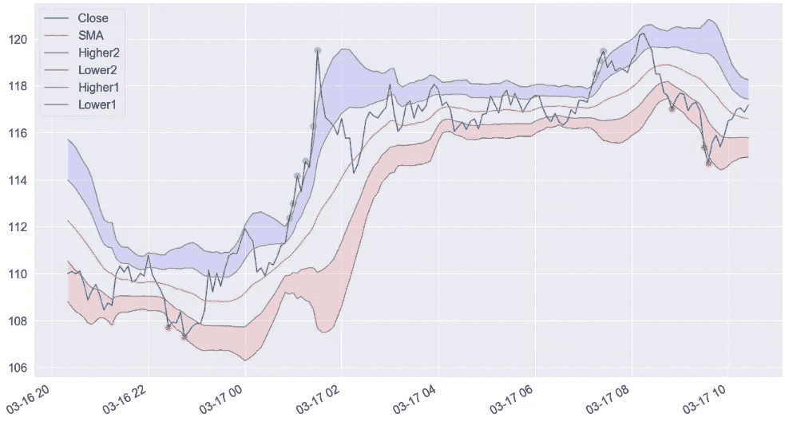
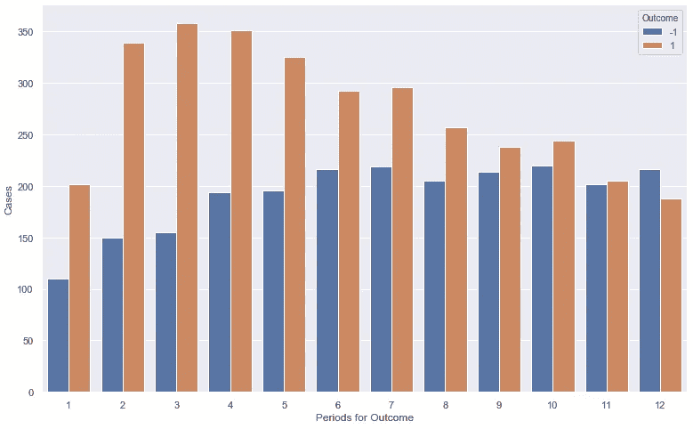
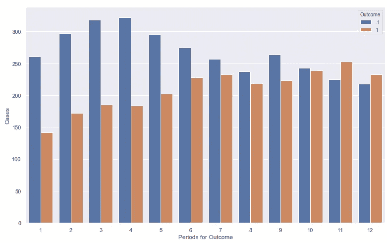
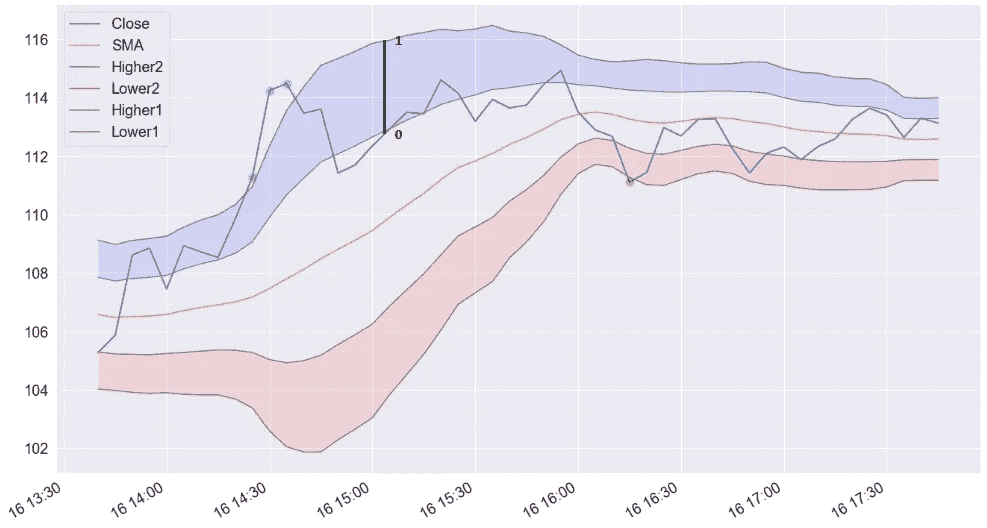
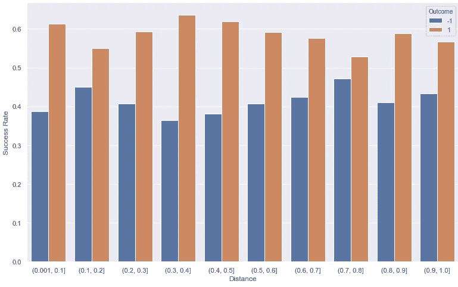

# 成为交易者数据科学家:转换布林线(第四部分)

> 原文：<https://medium.com/coinmonks/becoming-a-trader-data-scientist-transforming-bollinger-bands-part-4-8aab6fbc2f2d?source=collection_archive---------0----------------------->

## 在文章的最后，你会明白如何从零开始抓住一个商业概念，并通过一个应用案例将其物化为机器学习模型的变量。

[*数据科学项目:加密货币第一部分——动机—*](/coinmonks/data-science-project-cryptocurrencies-part-2-volume-and-data-source-b42ac1d6ec12)

[*数据科学项目:加密货币第二部分——量与数据来源——*](/coinmonks/data-science-project-cryptocurrencies-part-2-volume-and-data-source-b42ac1d6ec12)

[*数据科学项目:加密货币第三部分—成为交易者数据科学家—*](/coinmonks/data-science-project-cryptocurrencies-part-3-becoming-a-trader-data-scientist-ada29ee319a9)

# 介绍

今天我将向你们介绍我们将在模型中使用的一个变量。我将向你描述从检索一个交易概念到最终创造一个有洞察力的变量的整个过程。你将了解如何将你的商业见解转化为真正的机器学习材料。

# 我们的数据

我想评估的范围是 5 分钟数据聚合。这意味着我将以标准的 [OHLCV](https://www.mypivots.com/dictionary/definition/144/ohlcv) 信息为间隔收集 5 分钟的数据。我在 Cryptocompare 上遇到了一个小问题。我刚刚发现，为了收集超过一周的分钟数据，我们需要一个企业帐户。我喜欢惊喜！。

因此，为了解决这个问题，我们将使用我们在第一章中使用的 cbpro。如果你已经读过了，你就会知道我们正面临着 300 个最大数据点的问题。为了解决这个问题，我开发了这个方法，当我第一次尝试使用它时，我有一个不确定的错误(我生活的故事)。

我不知道会是什么，但在尝试了几次无用的东西后，灯泡亮了！也许请求太多了，所以我添加了一个 time.sleep(0.5)来帮助设置每个请求之间的时间间隔。像我一样谦虚:这种方法工作得很愉快。这是以防你想改进它。我拿了我们心爱的 ETH-USD 过去 3 年的数据。

# 寻找概念

我们的第一步是做一些快速的研究，看看哪些技术指标是交易者最常用的。好的，简单的谷歌搜索:“日内交易[的最佳技术指标](https://www.investopedia.com/terms/i/intraday.asp)”我在几乎每篇文章中都找到了:MACD、布林线、RSI 和 VWAP。

Proof that I actually clicked the articles. Search by [Google.com](http://www.google.com).

等等，我刚意识到我从来没告诉过你盘中是什么意思。你还记得我们需要时间范围吗？如果你想在几小时或几分钟内持有你的头寸，你可能正在做日内交易。此外，您希望维持头寸的时间周期越短，您应该使用的数据粒度就越短。

这个概念更适用于常规股票市场，因为市场实际上在周末和晚上关闭。日内交易者的目标是在收盘时不持有任何头寸。在我们的情况下，我们有市场不关闭的优势(或痛苦),所以，对我们来说，盘中将只意味着我们不想持有头寸几天。

# 创建特征

好了，我们都准备好了！我们的下一步是在数据框架中构建这些指标。这些技术指标是商业智慧，所以我们将分析如何使用它们来生成我们的变量。起初，我在考虑自己制作，就像我们在最后一章(美丽时光)的最后几周制作马和金十字架一样。

但是这个[伟大的包裹](https://github.com/bukosabino/ta)来拯救我们。我不想想象我一个人要做那么多的工作。TA 包有一个方法来构造所有这些指示器，并将它们附加到数据帧上。最棒的是，我们需要选择的所有参数都有自己的默认值，这意味着我们几乎不需要考虑任何事情就可以创建它们。

另一个很棒的事情是，参数可以改变，所以如果我们急于测试不同的参数来进行分析，我们也可以这样做。

好的，参数本身是我们分析的一个重大进步。尽管如此，我们不能把它们作为原始的特征。我们需要理解它的解释来充分利用它们。但是怎么做呢？和往常一样，我要用一个例子来解释你。

# 布林线

我知道有很多文章描述和创造了[布林线](https://admiralmarkets.com/education/articles/forex-strategy/three-bollinger-bands-strategies-that-you-need-to-know)。正因为如此，我们将用它们作为例子。这些描述是通用的，很少具体化为适合机器学习模型的变量。他们更关注可观察的东西，这对交易者来说不错，但我们需要更多。

我们的目标是将交易概念转化为适合机器学习模型的变量。所以，布林线的例子是我向你们解释一点基于商业概念的特征工程的方式。

作为一个快速定义，布林线使用最后一段时间的波动性，被描述为标准差，并在简单移动平均线的帮助下，设置价格应该在哪里的某种限制。这里你可以看到一个例子。

Wou！你的困惑似乎跨越了时空障碍。我从这里(过去)一路听你提问:“青色和金色的点是什么意思？”“为什么会有彩色区域？”“Lower2 传说是什么？”在我耳边回响。所以把你的大脑放回你的脑袋里，结束你在时空中制造的混乱，我会回答你所有的问题。

# 获得洞察力！

首先，简单介绍一下概念。在图表中，我们看到了带有数字的较高和较低的图例，该数字是所使用的标准偏差，较低的标准偏差更接近于 SMA(通常 SMA 使用 20 个周期和两个标准偏差)

为什么这很重要？因为，如果收盘价在蓝色填充区域，则表明上升趋势将继续，另一方面，如果价格在红色填充区域，则下降趋势将继续。带内没有颜色的区域是中性区。在这些地区，没有强劲的势头或趋势。

让我们放大([这几天讨厌的词](https://www.forbes.com/sites/kateoflahertyuk/2020/04/10/zoom-security-heres-what-zoom-is-doing-to-make-its-service-safer/#5f0192ea30fc))进入下跌趋势。

在这里，要点也更有意义。标有青色或金色的点是收盘价超出波段的点。看起来在下跌趋势中，收盘价在红色填充区和稍微逃离之间波动。它似乎也试图以更大的力量返回，离环带越远。

让我们来看一个上升趋势。

这是相同的，但在相反的一边！这很好，因为现在我们可以开始考虑变量了。

# 转型探索！

现在是艺术部分开始的时候，你可以尝试最疯狂的函数，如果它们复制了变量的行为。这些概念表明，当收盘价位于填充区域时，蓝色区域会上涨，红色区域会下跌。

为了验证这一点，我们将使用一个简单的虚拟方法(如果收盘价高于“高 1”带，则为 1，否则为 0)。创建了变量—我们将其命名为 D_BB_uptrend —让我们进行第一次分析。

创建这个变量的令人兴奋的部分是理解我们将试图预测一个上升趋势。我们假设[密码](https://blog.coincodecap.com/tag/crypto/)的行为是相同的，与这个填充带内的区域无关。例如，如果它离第一个波段最近，变量的行为就好像最近的是第二个波段一样。

我做了一个决定先发生什么的方法:1%的增加或 1%的减少。逻辑如下:该方法寻找接下来的 12 个时间段(对于 5 分钟的数据，1 小时)，并检查价格是否超出我们定义的阈值。这也不可能是一个结果，因为价格可能永远不会在这个界限之外收盘。下面你可以看到如果我们分析整个 2019 年会发生什么。只有 20%的病例有结果。

令人震惊！如果价格很快越过 1%的障碍，我们有难以置信的胜算！但随着时间距离的增加，这种力量似乎失去了作用。

如果我们创建第二个虚拟数据— D_BB_Downtrend —定义为 1，如果收盘价低于“低 1”带，另一种情况下为 0。我们应该期待-1 结果增加。让我们来看看。

Wou！同样的模式，但有可能是负面的结果！

看起来变量可以根据它在波段中的位置来区分积极或消极的结果。这意味着我们已经有了两个从布林线的概念创造的变量，它们看起来不错。

# 测试想法

假设现在我们看我们的图表，我们坚定地认为，如果收盘价最接近第二个波段，预测者的力量将会增加。没有测试我们无法知道那种感觉是否正确，所以让我们试试看。现在，我们将定义距离 H2 变量，从较高波段 1 的 0 到较高波段 2 的 1。逻辑如下所述。如果收盘价在顶部，价值将接近 1，如果在底部，价值将接近 0。

我们可以根据我们的结果是正面还是负面的情况的概率来定义成功率。让我们看看成功率如何沿着变量的 10 个箱移动。

Wou！我们错了，没有可靠的证据表明距离越高，成功率越高。但是在我们检验这个想法的过程中，我们学到了一些东西！在图表中，[0.3，0.6]之间的值成功率最高。这告诉我们，为我们的变量定义区间，而不是给模型一个连续的数字，是至关重要的。

# 你自己试试！

有趣的是，我会把它留给你。你已经知道流程了。你还记得我们看到如果点离第二个带太远，它似乎会试图回来吗？嗯，你可以测试这个想法，并添加，例如，一个变量“从乐队的上限距离。”

你必须弄清楚这个距离是否与价格反转相关，测试它并查看图表。也许有一个阈值:例如，当收盘价距离波段+/- 2%时，可能会开始回来，你必须调整你的变量来适应它。

这只是一个例子，但是您可以在图表中看到许多其他事情以及您的业务问题。我想留给你们“我是如何将这个概念强加于一个数字”的思维模式。如果你在处理机器学习问题时实现了这一点，你的模型性能将会飙升。

今天就到这里吧，伙计们！我们在创建我们的模型方面又迈出了一大步，**业务特征工程，我喜欢给这个过程起名叫**。不要不耐烦。从现在起的 14 年里，我们将继续这段旅程！

> [在您的收件箱中直接获得最佳软件交易](https://coincodecap.com/?utm_source=coinmonks)

如果你喜欢，请在[媒体](/@maletelier)和 [Linkedin](http://www.linkedin.com/in/maletelier) 上关注我。如果你想给我写信，我最近在 [Twitter](https://twitter.com/maletelier) 。我很乐意与你交谈！。

