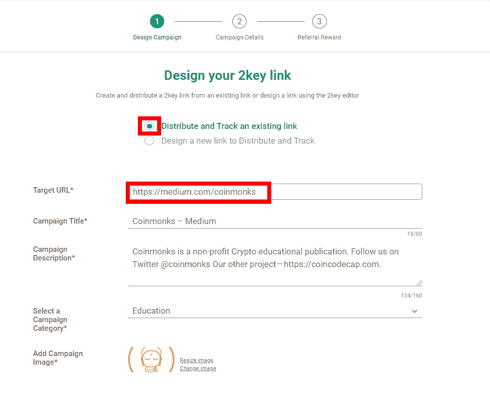
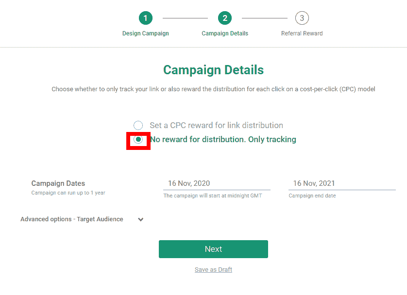
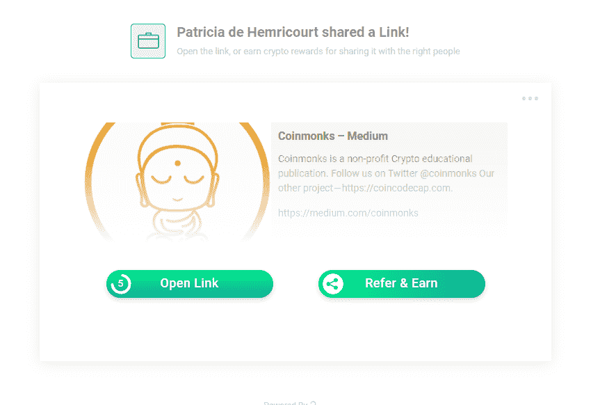
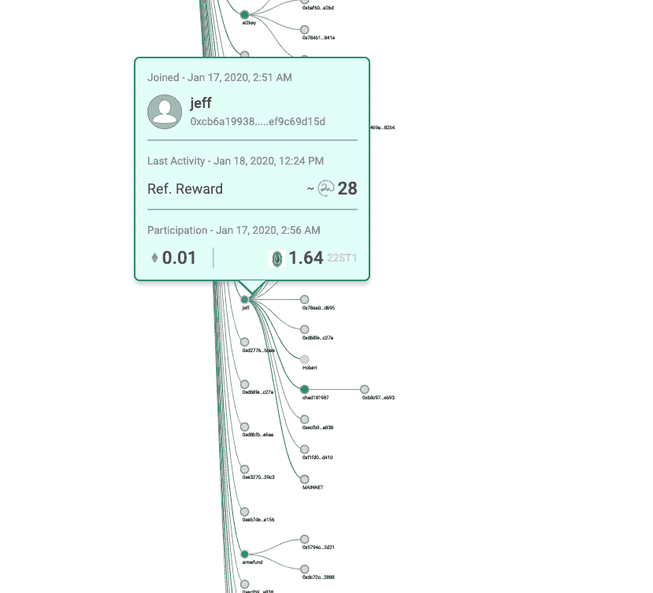

# 基于以太坊的智能链接—分享、追踪和赢取

> 原文：<https://medium.com/coinmonks/before-sharing-any-link-transform-it-into-a-web-2-0-compatible-ethereum-based-smartlink-a42a749120b1?source=collection_archive---------4----------------------->

随着算法在大多数社交媒体平台上占据主导地位，了解你的链接共享活动是否、何时、如何或为什么被使用或忽略几乎是不可能的。

当以私人身份分享链接时，你唯一知道的是，算法决定你的哪些朋友或关注者将看到你分享的链接显示在他们的提要上。算法决策大多是为了最大化社交媒体平台的利润而定制的，忽略了你的意图，当然，也不包括任何与你分享你通过**你的**活动产生的利润的条款。

作为企业，你的情况更糟糕。即使相信该算法确实能够最大化您的广告或原生内容的影响，广告管理系统也充满了从广告竞价到广告欺诈的各种问题。

基于以太坊的新智能链接就不是这样了！

# 通过 SmartLinks 获得加密

SmartLinks 易于创建，它通过将 URL 与特定目标的智能合同相关联，并在 SmartLink 中创建一个散列来“智能化”任何 URL，该散列在用户与链接交互时按时间顺序存储用户的地址。

这几乎和使用链接缩短器一样简单。只需在“创建智能链接”中复制粘贴一个“源”链接，即可生成一个智能链接，显示从原始链接中提取的缩略图和文本。当然，那些是可以根据需要编辑的！

要创建一个简单的 SmartLink，请选择“没有奖励，只有分发”

然后单击 Next，直到合同部署完毕，这样，您就有了一个 SmartLink。例如，这个[智能链接](https://2key.me/CoinmonksMedium/ivFp1)会将你重定向到 CoinMonk Medium 主页。

当您共享链接时，收件人会看到共享该链接的人的姓名、缩略图以及“打开链接”(查看原始链接及其内容)或“推荐并获得”的选项你可以点击[这里](https://2key.me/CoinmonksMedium/ivFp1)看直播。

当你点击“打开链接”并看到原始页面时，你的点击被 2 键系统列表，一些事情发生了。

1.  每一次经过验证的点击都会增加信誉点数，这些点数会产生加密收入，详情请见[这里的](https://www.2key.network/blog-posts/launching-2key-reputation-mining-v1)。这个声誉挖掘系统是社交媒体分享的一场革命，因为这是第一次个人因其在线活动而直接获得奖励，而不是让社交媒体平台受益。
2.  整个推荐链被记录并显示在仪表板上。缩略图被查看了多少次，被点击了多少次，被转发分享了多少次，包括跨越了多少层。( ***注*** *:在发布时，虽然每次点击都被制成表格，但只有来自 2 键账户持有人的推荐才被算作来自新推荐人的份额。跟踪所有分享活动的方法正在开发中。*)
3.  当您的收件人选择“推荐和赚取”时，将创建一个新的 SmartLink，作为上述两个功能的原始 SmartLink，并将链接共享活动添加到 SmartLink shared forward 的总计数中。
    每个推荐人可以在他的仪表板上跟踪他自己的活动和那些分享 SmartLink forward 的活动的影响，其中每个圈都是单个查看者和/或推荐人，推荐链实时显示。

上图是带奖励的 SmartLink。

# 什么是带奖励的智能链接？

基本上，它们是 SmartLink，smart link 创建者为转换提供额外的奖励，选择将营销预算投资在真实的人身上，而不是资助大型企业。

[**PPC SmartLinks**](https://www.2key.network/ppc-smartlinks) 是为营销人员设计的，这些结合了广告竞价、推荐和现有会员系统的优势。

PPC SmartLinks 的工作原理是增加每次点击的奖励，奖励将通过整个推荐链分配到点击，其中每次点击奖励根据选择的分配模型在推荐人之间分配。
PPC(点击付费)奖励金额完全由链接创建者控制，可以提供各种加密货币，如戴、、、ETH 等。
PPC smart link creator 只为经过验证的批准点击付费，不为欺诈性或偏离目标的点击付费！

PPC SmartLinks 解决了困扰数字广告行业的几个问题，从许多[广告投标](https://2key.me/2KeyBlogEndAdBidding/melusine/v2DJT)问题到猖獗的[数字广告欺诈](https://2key.me/CostDigitalAdFraudWillRiseTo35BillionGloballyIn2020CheqReport/Mcz3x)预计 2020 年全球数字广告行业的成本高达 350 亿美元。

由 2key 开发的加密解决方案不仅解决了广告欺诈问题，而且还提供了一种推荐解决方案，像链接缩短程序一样易于使用，并通过智能合同来完成所有工作，从而消除了管理推荐和附属机构的繁重工作。

总的来说，PPC SmartLinks 为数字营销人员提供了另一种解决方案，帮助他们解决困扰当前选择的问题:

*   广告竞价:广告商之间的激烈竞争抬高了每次点击的成本，降低了广告的投资回报率
*   **推荐**:到目前为止带来新用户或买家的最有效方式，当前的推荐系统选项意味着要么购买并整合有限选项的昂贵推荐软件，要么投入无限时间跟踪推荐并奖励推荐人
*   **代销商**:虽然这是一个高效的解决方案，但是管理代销商项目也需要集成代销商管理软件，并且通常需要时间和精力来跟踪每个代销商，发送合格的奖励，回答他们的询问等等。

由 2key 开发的加密解决方案不仅解决了广告欺诈问题，而且还提供了一种推荐解决方案，像缩短链接一样易于使用，并通过智能合同来完成所有工作，从而消除了管理推荐和附属机构的繁重工作。

它还通过让广告商单方面确定每次点击成本和奖励分配模式，迅速消除了广告竞价产生的预算问题，最后但并非最不重要的是，最近[通过将部署迁移到第 2 层，消除了部署的 TX 费用](https://2key.me/2KeyBlogOneGiantStepTowardsSolvingEthereumGasIssuePpcSmartlinksZ/G59sb)。

为了克服由于普通人群对 web 3.0 不熟悉而造成的进入障碍，2key 消除了创建钱包的需要。每个新用户在注册时都会收到一个现成的钱包。只需创建一个密码，将创建和保存私钥密码的任务推迟到以后，例如，在新用户收集到足够的令牌使其相关后，就可以激活这个钱包。
这是让新用户加入 web 3.0 的理想而实用的方式

精明的加密用户可以连接他们的元掩码或分类帐钱包，或使用 WalletConnect 和他们的 2 键帐户，或使用他们认为合适的 2 键钱包。

为了进一步提高推荐的准确性，2key 的[声誉挖掘项目](https://www.2key.network/blog-posts/launching-2key-reputation-mining-v1)提到了对推荐人和 SmartLink 创建者的奖励或惩罚。这提高了推荐人与可能会对共享的链接感兴趣的受众共享 SmartLink 的兴趣，并限制了 SmartLink 被用于传播诈骗或其他恶意内容的风险。

此外，2key 正在通过[社交挖掘](https://www.2key.network/ambassadors)扩展其网络，并提供各种[赌注选项](https://www.2key.network/blog-posts/launching-the-ultimate-staking)。

[**创建一个智能链接**](https://2key.io/) 与您的朋友分享此链接！

## 另外，阅读

*   最好的[密码交易机器人](/coinmonks/crypto-trading-bot-c2ffce8acb2a)
*   [Deribit 审查](/coinmonks/deribit-review-options-fees-apis-and-testnet-2ca16c4bbdb2) |选项、费用、API 和 Testnet
*   [FTX 密码交易所评论](/coinmonks/ftx-crypto-exchange-review-53664ac1198f)
*   最好的比特币[硬件钱包](/coinmonks/the-best-cryptocurrency-hardware-wallets-of-2020-e28b1c124069?source=friends_link&sk=324dd9ff8556ab578d71e7ad7658ad7c)
*   [密码本交易平台](/coinmonks/top-10-crypto-copy-trading-platforms-for-beginners-d0c37c7d698c)
*   最好的[加密税务软件](/coinmonks/best-crypto-tax-tool-for-my-money-72d4b430816b)
*   [最佳加密交易平台](/coinmonks/the-best-crypto-trading-platforms-in-2020-the-definitive-guide-updated-c72f8b874555)
*   最佳[加密贷款平台](/coinmonks/top-5-crypto-lending-platforms-in-2020-that-you-need-to-know-a1b675cec3fa)
*   [block fi vs Celsius](/coinmonks/blockfi-vs-celsius-vs-hodlnaut-8a1cc8c26630)vs Hodlnaut
*   [莱杰 vs 特雷佐](/coinmonks/ledger-vs-trezor-best-hardware-wallet-to-secure-cryptocurrency-22c7a3fd391e)
*   Bitsgap 评论——一个轻松赚钱的加密交易机器人
*   为专业人士设计的加密交易机器人
*   [3commas Review](https://blog.coincodecap.com/3commas-review-an-excellent-crypto-trading-bot) |一款优秀的密码交易机器人
*   [PrimeXBT 审查](/coinmonks/primexbt-review-88e0815be858) |杠杆交易、费用和交易
*   Bitmex 上的[保证金交易的白痴指南](/coinmonks/the-idiots-guide-to-margin-trading-on-bitmex-dbbd7742c6fc?source=friends_link&sk=7bfa99d2a181142510c8442c8ddb0786)
*   [加密摇摆交易的权威指南](/coinmonks/the-definitive-guide-to-crypto-swing-trading-7e4af6496d4d?source=friends_link&sk=70448050bd9323b42f63bfc0bb1e60d1)
*   [Bitmex 高级保证金交易指南](/coinmonks/bitmex-advanced-margin-trading-guide-2270c195ce25?source=friends_link&sk=1d986cca731f5084b9a2db4a4bc4a7ad)
*   面向开发者的最佳加密 API
*   [加密套利](/coinmonks/crypto-arbitrage-guide-how-to-make-money-as-a-beginner-62bfe5c868f6)指南:新手如何赚钱
*   顶级[比特币节点](https://blog.coincodecap.com/bitcoin-node-solutions)提供商
*   最佳[加密制图工具](/coinmonks/what-are-the-best-charting-platforms-for-cryptocurrency-trading-85aade584d80)
*   了解比特币的[最佳书籍有哪些？](/coinmonks/what-are-the-best-books-to-learn-bitcoin-409aeb9aff4b)

> [直接在您的收件箱中获得最佳软件交易](https://coincodecap.com?utm_source=coinmonks)

