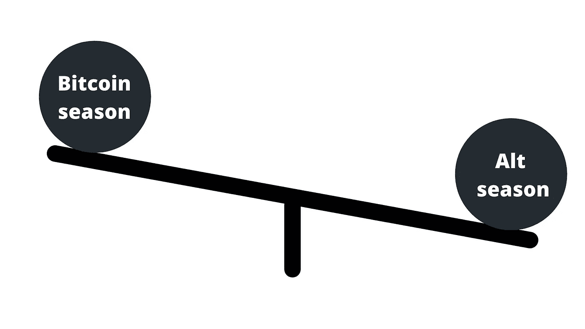

# 首次购买加密货币的初学者指南(2021)

> 原文：<https://medium.com/coinmonks/beginner-guide-for-first-time-cryptocurrency-buyers-2021-11e42b379bad?source=collection_archive---------2----------------------->

我希望这篇文章能给你带来价值，帮助你开始你的加密货币之旅

Some coins you will meet during your journey

2020 年 12 月。我表哥开始给我发加密货币市场的最新消息。2 年前看了关于比特币的视频。那时我对它并不感兴趣。在那些关于市场波动的更新中，什么引起了我的注意。

当时比特币刚刚过 25k 美元。我不明白为什么它总是忽上忽下。我需要更深入。我继续调查。我开始看 Youtube 上关于金融市场、交易基础和区块链/货币解释的视频。令人大开眼界。

从那时起，我开始了我的加密货币之旅。我从 2 美元开始。

从那里开始，我的旅程就像过山车一样:

*   特斯拉买了一些比特币
*   比尔以 6900 万美元的价格卖掉了他的 NFTs
*   中国镇压他们国家的矿工
*   特斯拉停止接受比特币
*   市场于 2021 年 5 月崩盘
*   萨尔瓦多接受比特币作为法定货币

这些事件中的每一个都对市场产生了影响。

什么样的效果？

让我展示给你看。

# 了解市场动向

Psychology of market cycle from Binance

我经历了所有这些阶段。

资产价格会随着市场的变化而上下波动。

市场的定义是人们相遇并交换价值的地方。

例如:

*   在股票市场上，人们用钱交换股票。
*   在债券市场，参与者可以发行新的[债务](https://en.wikipedia.org/wiki/Debt)，称为[一级市场](https://en.wikipedia.org/wiki/Primary_market)，或者买卖债务[证券](https://en.wikipedia.org/wiki/Security_(finance))，称为[二级市场](https://en.wikipedia.org/wiki/Secondary_market)。

现在，密码市场:你购买硬币来换取法定货币。

买入硬币的人数和卖出的数量决定了市场的走势。

你可以用两个因素来分析市场走势:
**技术分析**:看图表，看一个模式的不同指标。

Typical chart view from tradingview.com

**基本面分析**:着眼于大局、监管、市值、其他新闻或围绕特定市场的问题。例如，这种方法将 BTC 值视为一种技术，不管当前价格和外部价格如何，以确定将会发生什么。

理解了这两个基本的市场波动分析，让我来解释一下市场条件。

**牛市:**

The psychological effect of a bull market

牛市是一个上升的市场，经济条件总体上是有利的。

牛市的特征是价格持续上涨。就股票市场而言，牛市意味着公司股票价格的上涨。在这种时候，投资者通常相信[上升趋势](https://www.investopedia.com/terms/u/uptrend.asp)将长期持续。在这种情况下，该国的经济通常很强劲，就业水平也很高。

在加密市场的情况下，这意味着每枚硬币的价格(以美元计)正在上升。

**熊市:**

The psychological effect of a bear market

熊市存在于衰退的经济中，大多数股票都在贬值。

熊市[是指下跌的熊市。一个市场通常不被认为是真正的“熊市”，除非它从最近的高点下跌了 20%或更多。在熊市中，股价持续下跌。这导致了投资者认为将会持续的下降趋势；这种信念反过来又延续了恶性循环。在熊市期间，随着公司开始裁员，经济放缓，失业率上升。](https://www.investopedia.com/terms/b/bearmarket.asp)

在加密市场的情况下，每枚硬币的价格正在下降。

因为金融市场很大程度上受投资者态度的影响，这些术语也表示投资者对市场和随之而来的经济趋势的感受:

> 如果你相信一种资产会涨价，你就是看涨；
> 
> 否则你是悲观的。

现在，您已经了解了市场走势的基本知识，让我们进入加密货币市场。

# 作为投资的加密货币

投资不同于交易。

> 交易意味着你支持短期市场波动。一旦市场按照你预测的方向运行，你就可以获利。如果你开仓说趋势在上升(意味着你在做多)，一旦趋势上升，你就获利。如果没有，你就输了。如果你开仓说趋势在下降(意思是你在做空)，一旦趋势下降，你就止盈。否则你就输了

正如我在最近的文章中所说，比特币是在经济危机的背景下产生的。中本聪语录:

传统货币的根本问题在于它运转所需的所有信任。必须相信央行不会让货币贬值，但法定货币的历史充满了对这种信任的违背。必须信任银行持有我们的钱，并以电子方式转移，但他们在信贷泡沫的浪潮中贷出这些钱，储备几乎没有一部分。我们必须相信他们会保护我们的隐私，相信他们不会让身份窃贼盗取我们的账户。他们巨大的管理费用使得小额支付变得不可能。

这是漫长道路的开始。

2008 年，一个名叫中本聪的匿名人士推出了比特币。是互联网上的钱，没有银行，没有中间人。

**首先，什么是钱？**

金钱通常被定义为它提供的三种**功能**或**服务**:

*   交易媒介:货币最重要的功能是作为交易媒介来简化交易。没有钱，所有的交易都必须通过物物交换来进行。它涉及一种商品或服务与另一种商品或服务的直接交换。
*   **价值储存:**作为交换媒介，货币必须长时间保值；也就是说，它必须是价值储存手段。否则，货币就不能储存一段时间并在交换中保持价值。
*   **记账单位**:货币也起到记账单位的作用，提供了一种*被交换的商品和服务的价值*的通用衡量标准。

Satoshi 是如何设法创造出具有这些功能的“互联网货币”的？

他利用了一个叫做**区块链**的东西。

区块链是一个登记册，记录着每一笔交易。其特点:

*   **不变性**:一旦数据进入分类帐，就不可能对登记簿进行更改。
*   分散化:没有人拥有技术，它由用户共享。
*   匿名:你不需要给出你的凭证，一个随机的密码只给你一个。
*   **安全**:由于网络的密度，几乎不可能被黑。

有了它，聪造出了比特币。没有双重花费的可能性。价值储存。交换的媒介。记账单位。所有这些都结合使用区块链和加密技术。

此后，比特币爆发式增长。13 年后，根据需求的不同，一个单位的比特币现在价值在 3 万至 6.5 万美元之间。

2015 年，一个由 8 个人组成的小组发现他们可以用区块链做更多的事情: ***他们可以在它的基础上建立某种契约*** 。

鉴于区块链是一个寄存器的事实，你在它上面放什么取决于代码的作者。如果他们能找到一种方法来编写函数，并把它放在区块链上，他们将有另一个用例。

> 他们成功了。以太坊诞生了。

你可以像比特币一样创造你的硬币(或代币)，确定最大供应量，并在 5 分钟内释放它，使用一种叫做**“智能合约”**的东西:你编写并部署在区块链上的代码行。

2021 年 1 月，我编写了第一个令牌，我称之为“Wetchit”，意思是“多余的零钱”。我简直不敢相信。我花了不到 5 分钟:

*   我上了 Youtube
*   研究“如何用以太坊创造硬币”
*   我看了教程
*   点击 Github 链接
*   复制代码
*   粘贴到[再混合](https://remix.ethereum.org/)
*   我更改了令牌的名称
*   定义最大供应量，令牌名缩写，整除性，其余不变。

完成了。我编译它。没有错误。

现在，我连接我的元蒙版，它已经准备好部署。

不幸的是，我没有足够的以太币来支付煤气费。

但我可以选择在科万测试网上测试硬币。我工作得很好。我给不同的钱包寄了一些代币。

我就像“哇，这是下一件事”。

你看到用开源程序在 5 分钟内创建一个令牌有多容易了吗？

这就是为什么你需要知道一些统计数据。

## 加密货币市场的宏观视角

以下是 2021 年 9 月 21 日基于 Coinmarketcap 的统计数据:

*   [12037](https://coinmarketcap.com/)加密货币
*   [市值 1828977121702 美元](https://coinmarketcap.com/charts/)
*   [$139，985，252，175](https://coinmarketcap.com/charts/)24 小时成交量

12037 个硬币！！！！！！！这是法定货币数量的 66.872222222 倍。

知道加密货币市场遵循相同的市场规则，你如何选择最好的来投资？

首先，每枚硬币都有一个周期，就像上面币安的图形一样。我们可以将它们分为两类:

*   比特币季节
*   Altcoin(所有不同于 BTC 的硬币)季节

有了这些数据记录，科学家们开发了一个比特币进化的模型，称为**存量到流量模型**。

Stock-to-flow model of bitcoin

它代表了 BTC 建国以来的发展。

X 轴代表年份，Y 轴代表每个 BTC 的价格。

比特币的供应量为 2100 万枚。不会再有了。

**如果前 50 名硬币中有 75%在过去 30 天的表现优于比特币，那么这就是 Altcoin 月。否则就是比特币月。**

**如果前 50 名中有 75%的硬币在上一个季度(90 天)表现好于比特币，那么这就是 Altcoin 季节。不然就是比特币季了。**

**如果排名前 50 位的硬币中有 75%在过去一年的表现优于比特币，那么这就是另类硬币年。否则就是比特币年。**

这里有一个指数可以知道我们是哪个季节:[区块链中心指数](https://www.blockchaincenter.net/altcoin-season-index/)

宏观视角让你对市场有一个全局的看法。

**下面是如何从宏观角度来看待比特币和 altcoin 赛季。**

Altcoin dominates Bitcoin in terms of percentage gain

投资比特币的绝佳机会。

违反直觉对吗？

让我解释一下。

当你知道每个人都在某个特定地点买房时，会发生什么？价格上涨。你有两个选择:

*   FOMO(害怕错过):尽一切可能为你争取一个位置(价格更高，因为需求高，位置可能更小)
*   研究一个地点的替代方案，不要太远而且价格更低。

这也是同样的策略。

如果是 altcoin 季，说明比特币在某种程度上被低估了。是‘便宜’。

当你在一项资产便宜的时候买入，它给了你在你需要的时候更快获利的杠杆。

Bitcoin dominates altcoins in terms of percentage gain

同样的概念。你想投资廉价期权。在这种情况下，它是替代硬币。

现在，你该如何选择投资哪种 altcoin？

这是我的方法论，我称之为:***thetapick***

# 如何使用 themetapick 策略投资另类硬币

**12036**奥特币。那太多了。

如何理解这些？

**1-了解区块链**

**2-了解加密货币市场(我给了你一个概述，但你需要更深入)**

从这里开始:[从区块链和加密资产开始的 100 个工具和参考(2021)](/coinmonks/100-tools-and-references-to-begin-with-blockchain-and-cryptoassets-2021-9d7efb5b4797)

> 你至少做 50 个小时的作业。

之后，你应该能够回答这些问题:

*   什么是区块链？
*   什么是市场周期？
*   比特币和以太坊有什么区别？
*   什么是支撑？什么是阻力？
*   什么是钱包？如何保护钱包？
*   如何购买一枚硬币？去哪里买硬币？
*   如何转让一枚硬币？
*   冷钱包和热钱包有什么区别？
*   什么是种子短语？种子短语和密码有什么区别？
*   比特币和 Dogecoin 有什么区别？
*   Dogecoin 和柴犬·INU 有什么区别？
*   Ethreum 和建在 Ethreum 上面的硬币有什么区别？
*   什么是汽油费？什么是汽油价格？什么是气体？
*   循环供给的定义是什么？循环供给和最大供给有什么区别？
*   为什么不在亚马逊或者其他第三方公司上买一个硬件钱包？为什么你一定要从制造它们的公司购买呢？
*   保护你的硬币最好的方法是什么？
*   丢失硬币的最好方法是什么？
*   为什么投资不能超过你能承受的损失？

如果 50 个小时后你不能回答这些问题中的一个，请在 [Twitter](https://twitter.com/themetaboy) 或 [Instagram](http://instagram.com/themetaboy) 上给我发消息，我很乐意帮忙。

既然你能回答所有这些问题。我们可以继续前进。

说到投资，你必须考虑 4 种情况:

**低风险/低回报潜力:**如果你是一个真正的风险厌恶者，我建议你调查一下排名前 5 的硬币。你可以在 [Coinmarketcap](http://coinmarketcap.com) 或 [coingecko](http://coingecko.com) 上找到它们。

**低风险/高潜在回报:**这些都是骗局。当你没有什么可以失去的时候，你就不是在投资。你在赌博。

**高风险/低潜力回报:**把它想象成挖一口井，你越挖越深，冒着所有的风险，你终于发现有少量的地下水。值得冒这个险吗？不知道，也许现在你学会了如何挖一口井。在加密货币的情况下，我可能是一种尝试的方式。

**高风险/高潜在回报:**这些是你需要调查的，需要时间。

如果你是一个高风险/高回报的人，剩下的就是你的了。

## 第 1 级:所有新的初学者

***1-独特的价值主张*** 是否清晰？引人注目？可信吗？

***2-不公平优势*** 是否可行，是否可以利用？

***3-Team :*** 强大的领域专长，执行能力的佐证，他们能吸引到世界级的团队吗？开发活动:进入 GitHub 休息状态

***4-技术***

*   白皮书:协议共识方法、技术堆栈、协议互操作性、网络可扩展性、使用案例、项目路线图
*   容易或难以复制，良好的产品市场契合度，可扩展吗？

***5-牵引力*** 客户、收入、其他信号、采用的关键挑战

***6-社区*** 他们的不和是主动的吗？他们的推特账号呢？

***7-财经*** 达到一个拐点需要多少资本，能做 10–20 倍的投资吗？

## 第二级:对于更足智多谋的人

***1-访问他们的网站:***

*   真实世界的用例，解决一个真实的问题
*   容易理解
*   功能产品

***2-在 Youtube 上查:***

*   别人在说什么(我推荐[币局](https://www.youtube.com/c/CoinBureau)、[本杰明·考恩](https://www.youtube.com/channel/UCRvqjQPSeaWn-uEx-w0XOIg)、[鲍勃·卢卡斯](https://www.youtube.com/channel/UC0zGwzu0zzCImC1BwPuWyXQ)、[数字资产新闻](https://www.youtube.com/c/DigitalAssetNewsDAN)、 [Finematics](https://www.youtube.com/c/Finematics) 、[异端金融](https://www.youtube.com/c/HeresyFinancial)、[思维密码](https://www.youtube.com/c/AnthonyEdward)、[安德里亚斯·安托诺普洛斯](https://www.youtube.com/c/aantonop)、[目中无人](https://www.youtube.com/c/TheDefiant)、 [JRNY 密码](https://www.youtube.com/c/JRNYCrypto)、[庞普连](https://www.youtube.com/c/AnthonyPompliano)
*   创始人在说什么，看看最近的采访
*   查看他们的 Youtube 频道，了解最新消息

***3-转到 Messari.io***

这是一个研究工具，可以让你用数据驱动你的市场分析。您会发现由专门从事区块链和加密货币开发的最佳风险资本进行的投资:

*   **灰度组合**
*   **潘迪拉资本**
*   **比特币基地风投**
*   **多链资本**

要问的问题是:他们中至少有一个人投资了这个项目吗？

***4——再查查 Messari.io 或币安研究***

*   白皮书:研究令牌文档、令牌组学、共识机制、赌注奖励、挖掘需求

***5-注意你的印象:***

*   1:不清楚
*   2:怀疑
*   3:看涨

***如果你的笔记是 1 :***

*   看看他们的推特，看看有没有更新。
*   如果还没找到，就去 Messari.io，然后搜索硬币，点开，搜索 GitHub 链接，点开。看看最近有没有更新！ *Ruuuuuuuuuun！*

***如果你的注是 2 :***

*   转到#6

***如果你的音符是 3 :***

*   尽管如此，还是去#6

***6-Icodrops.com***

*   看一下代币分配情况:看看从长期来看是否有超过 50%分配给了公众
*   寻找团队:他们有实地经验吗？

***7-Coinmarketcap.com/coingecko.com***

*   看看实际市值、流通供应量和图表
*   交易量，将 24 小时交易量与市值进行比较，看是否在市值的 10-50%范围内
*   交易所上市
*   链上指标:活动地址/有余额的地址，事务之间的时间

***8-Cryptopanic.com***

*   寻找最新消息

***9-检查自己的社区:***

*   推特
*   不调和
*   电报

***10-注意你的印象:***

1-不清楚

2-怀疑

3-看涨

***如果你注的是:***

1:不要投资硬币

2:你有时间在推特上关注他们

这可能是一个投资机会，硬币是你的了。

# 在哪里买你的第一枚硬币？

*   币安(如果你住在美国的话，也可以叫做 Binance.us)
*   [比特币基地](http://www.coinbase.com/)
*   [北海巨妖](https://www.kraken.com/)
*   [FTX](https://ftx.com/fr)

我推荐来自 [Coinbureau](https://www.youtube.com/channel/UCqK_GSMbpiV8spgD3ZGloSw) 的这两个视频，用于分步流程:

# 总结一下:

*1-研究和了解比特币市场周期*

*2-在周期顶部退出市场*

*3-在周期接近底部时回购，在 BTC 和替代货币之间分散投资*

*4-冲洗并重复*

给你。希望这个指南有用。

别忘了订阅，分享，关注。

> 加入 Coinmonks [电报频道](https://t.me/coincodecap)和 [Youtube 频道](https://www.youtube.com/c/coinmonks/videos)了解加密交易和投资

## 另外，阅读

*   [尤霍德勒 vs 考尼洛 vs 霍德诺特](/coinmonks/youhodler-vs-coinloan-vs-hodlnaut-b1050acde55a) | [Cryptohopper vs 哈斯博特](https://blog.coincodecap.com/cryptohopper-vs-haasbot)
*   [币安 vs 北海巨妖](https://blog.coincodecap.com/binance-vs-kraken) | [美元成本平均交易机器人](https://blog.coincodecap.com/pionex-dca-bot)
*   [新加坡十大最佳加密交易所](https://blog.coincodecap.com/crypto-exchange-in-singapore) | [购买 AXS](https://blog.coincodecap.com/buy-axs-token)
*   [投资印度的最佳加密软件](https://blog.coincodecap.com/best-crypto-to-invest-in-india-in-2021) | [HitBTC 评论](/coinmonks/hitbtc-review-c5143c5d53c2)
*   [加拿大最好的加密交易机器人](https://blog.coincodecap.com/5-best-crypto-trading-bots-in-canada) | [赌注加密](https://blog.coincodecap.com/staking-crypto)
*   [如何在印度购买比特币？](/coinmonks/buy-bitcoin-in-india-feb50ddfef94) | [瓦济克斯评论](/coinmonks/wazirx-review-5c811b074f5b)
*   [比特币主根](https://blog.coincodecap.com/bitcoin-taproot) | [Bitso 点评](https://blog.coincodecap.com/bitso-review) | [排名前 6 的比特币信用卡](/coinmonks/bitcoin-credit-card-bc8ab6f377c6)
*   [最佳免费加密信号](https://blog.coincodecap.com/free-crypto-signals) | [YoBit 评论](/coinmonks/yobit-review-175464162c62) | [Bitbns 评论](/coinmonks/bitbns-review-38256a07e161)
*   [huo bi 的加密交易信号](https://blog.coincodecap.com/huobi-crypto-trading-signals) | [BitMEX 评论](https://blog.coincodecap.com/bitmex-review)
*   [7 个最佳零费用加密交易平台](https://blog.coincodecap.com/zero-fee-crypto-exchanges)
*   [分散交易所](https://blog.coincodecap.com/what-are-decentralized-exchanges) | [比特 FIP](https://blog.coincodecap.com/bitbns-fip)
*   [用信用卡购买密码的 10 个最佳地点](https://blog.coincodecap.com/buy-crypto-with-credit-card)
*   [OKEx 回顾](/coinmonks/okex-review-6b369304110f) | [Kucoin 交易机器人](/coinmonks/kucoin-trading-bot-automate-your-trades-8cf0ca2138e0) | [期货交易机器人](/coinmonks/futures-trading-bots-5a282ccee3f5)
*   [AscendEx Staking](https://blog.coincodecap.com/ascendex-staking)|[Bot Ocean Review](https://blog.coincodecap.com/bot-ocean-review)|[最佳比特币钱包](https://blog.coincodecap.com/bitcoin-wallets-india)
*   [霍比评论](https://blog.coincodecap.com/huobi-review) | [OKEx 保证金交易](https://blog.coincodecap.com/okex-margin-trading) | [期货交易](https://blog.coincodecap.com/futures-trading)
*   [Godex.io 审核](/coinmonks/godex-io-review-7366086519fb) | [邀请审核](/coinmonks/invity-review-70f3030c0502) | [BitForex 审核](https://blog.coincodecap.com/bitforex-review)
*   [Crypto.com 费用](/coinmonks/binance-fees-8588ec17965) | [僵尸加密审查](/coinmonks/botcrypto-review-2021-build-your-own-trading-bot-coincodecap-6b8332d736c7) | [替代品](https://blog.coincodecap.com/crypto-com-alternatives)
*   [有哪些交易信号？](https://blog.coincodecap.com/trading-signal) | [Bitstamp vs 比特币基地](https://blog.coincodecap.com/bitstamp-coinbase) | [买索拉纳](https://blog.coincodecap.com/buy-solana)
*   [ProfitFarmers 回顾](https://blog.coincodecap.com/profitfarmers-review) | [如何使用 Cornix 交易机器人](https://blog.coincodecap.com/cornix-trading-bot)
*   [MXC 交易所评论](/coinmonks/mxc-exchange-review-3af0ec1cba8c) | [Pionex vs 币安](https://blog.coincodecap.com/pionex-vs-binance) | [Pionex 套利机器人](https://blog.coincodecap.com/pionex-arbitrage-bot)
*   [我的加密副本交易经历](/coinmonks/my-experience-with-crypto-copy-trading-d6feb2ce3ac5) | [比特币基地评论](/coinmonks/coinbase-review-6ef4e0f56064)
*   [CoinFLEX 评论](https://blog.coincodecap.com/coinflex-review) | [AEX 交易所评论](https://blog.coincodecap.com/aex-exchange-review) | [UPbit 评论](https://blog.coincodecap.com/upbit-review)
*   [AscendEx 保证金交易](https://blog.coincodecap.com/ascendex-margin-trading) | [Bitfinex 赌注](https://blog.coincodecap.com/bitfinex-staking) | [bitFlyer 点评](https://blog.coincodecap.com/bitflyer-review)
*   [麻雀交换评论](https://blog.coincodecap.com/sparrow-exchange-review) | [纳什交换评论](https://blog.coincodecap.com/nash-exchange-review)
*   [加密货币储蓄账户](/coinmonks/cryptocurrency-savings-accounts-be3bc0feffbf) | [加密交易机器人](https://blog.coincodecap.com/best-crypto-trading-bots)