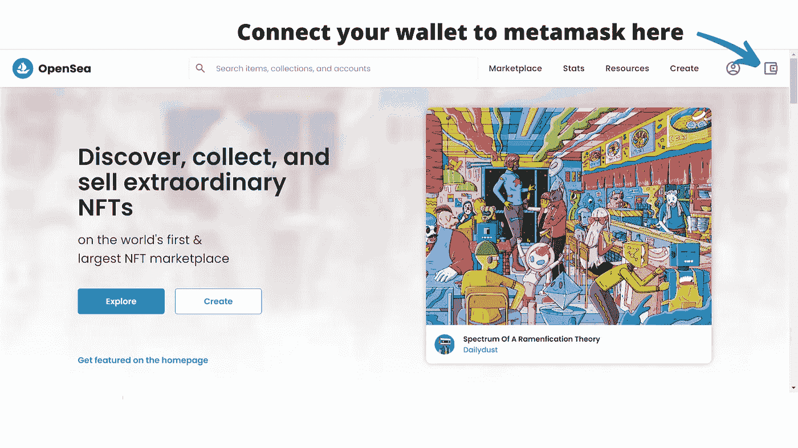
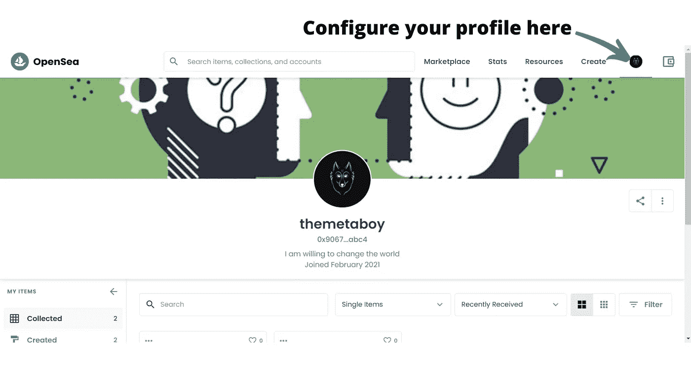
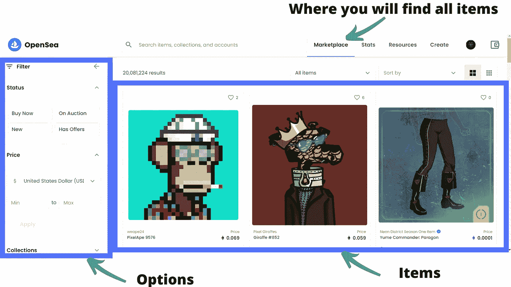

# 首次购买 NFTs 的初学者指南(2021)

> 原文：<https://medium.com/coinmonks/beginner-guide-for-first-time-nfts-buyers-2021-7abecb8dd059?source=collection_archive---------2----------------------->

当我在达喀尔时，我参观了一个叫“Soumbedioune 村”的地方。我正准备去德国汉堡旅行，想给朋友买个礼物。因为她邀请了我和我之前创业公司的其他三名成员。我想给她一些特别的东西。

Soumbedioune village overview

我发现的物品令人惊叹:艺术包、手镯、篮子、连衣裙……对我来说最有趣的是来自当地艺术家的令人惊叹的艺术品。它是如此美丽和令人惊叹，即使其中一些你可以看到时间的痕迹。我太想要他们了…

但是，我有一个问题:

我怎样把它们运到汉堡？

这是不可能的。我没有其他选择，我必须找到另一个项目。像下面这些，我买了一些雕塑。

Small sculptures you can put in a suitcase

从那以后，我一直在问…如果那些艺术品可以是:

*   数字化的
*   可分享的
*   认证的
*   保存

它将更加“可运输”。

我花了两年时间找到了解决方案:NFTs

# 简史

2008 年，一位匿名人士呼吁中本聪推出比特币。是互联网上的钱，没有银行，没有中间人。

一、什么是钱？

金钱通常被定义为它提供的三种功能(T1)或服务(T3 ):

*   **交易媒介**:货币最重要的功能是作为交易媒介，方便交易。没有钱，所有的交易都必须通过物物交换来进行。它涉及一种商品或服务与另一种商品或服务的直接交换。
*   **价值储存:**作为交换媒介，货币必须长时间保持其价值；也就是说，它必须是价值储存手段。否则，货币就不能储存一段时间并在交换中保持价值。
*   **记账单位**:货币也起到记账单位的作用，提供了一种*对所交换的商品和服务的价值*的通用衡量标准。

Satoshi 是如何设法创造出具有这些功能的“互联网货币”的？

他利用了一个叫做**区块链**的东西。

区块链是一个登记册，记录着每一笔交易。其特点:

*   **不变性**:一旦数据进入分类帐，就不可能对登记簿进行更改。
*   **分散化**:没有人拥有技术，它由用户共享。
*   匿名:你不需要给你的凭证，一个随机的密码只给你一个。
*   **安全**:由于网络的密度，几乎不可能被黑。

有了这些，聪造出了比特币。没有双重花费的可能性。价值储存。交换的媒介。记账单位。所有这些都结合使用区块链和加密技术。

从那以后，比特币正在爆炸式增长。13 年后，根据需求的不同，一个单位的比特币现在价值在 3 万至 6.5 万美元之间。

2015 年，一个由 8 个人组成的小组发现他们可以用区块链做更多的事情: ***他们可以在*** 的基础上建立某种契约。

鉴于区块链是一个寄存器的事实，你在它上面放什么取决于代码的作者。如果他们能找到一种方法来编写函数，并把它放在区块链上，他们将有另一个用例。

他们成功了。以太坊诞生了。

你可以像比特币一样创造你的硬币(或代币)，确定最大供应量，并在 5 分钟内发布，使用一种叫做**“智能合约”**的东西:你编写并部署在区块链上的代码行。

2021 年 1 月，我编写了我的第一个令牌，我称之为“Wetchit”，意思是“多余的零钱”。我简直不敢相信。我花了不到 5 分钟:

*   我上了 Youtube
*   研究“如何用以太坊创造硬币”
*   我看了教程
*   点击 Github 链接
*   复制代码
*   粘贴到[混音](https://remix.ethereum.org/)
*   我更改了令牌的名称
*   定义最大供应量，令牌名缩写，整除性，其余不变。

完成了。我编译它。没有错误。

现在，我连接我的元蒙版，它已经准备好部署。

不幸的是，我没有足够的以太币来支付煤气费。

但我可以选择在科万测试网上测试硬币。我工作得很好。我给不同的钱包寄了一些代币。

我就像“哇，这是下一件事”。

你看到用开源程序在 5 分钟内创建一个令牌有多容易了吗？

现在想象一下，如果你能编码一张照片的一些特征:

*   颜色
*   尺寸
*   设计
*   特征

启动智能合同后，您得到的结果是一个 ***不可替换令牌*** ，它是区块链中唯一照片的表示。

术语“可替代的”表示每一个项目的价值是统一的，可以互相互换，并且可以分割。

现在想象一下你能代表什么(或者用技术术语“符号化”):房地产，艺术品…

任何有价值的东西都可以在区块链上进行标记和铸造。

# 非功能测试的特点

*   它是永久的。(像区块链的一切一样)
*   无法复制。(因此术语不可替代)
*   无法伪造。(只有一个模型链接到一个地址)
*   证明他们拥有它(使用区块链浏览器)

OMG…！！！！！！！！！

我现在有了我的解决方案，为我的朋友买一件艺术品…还有一点附加价值:价值可以随着时间的推移而升值。

什么？什么？什么？哦，是的，NFTs 可以在像 Opensea，Rarible，Foundation 这样的公开市场上出售……我的朋友可能会决定出售它，如果她有经济上的担忧。

你还记得我对艺术品的愿望吗？

*   数字化的
*   可分享的
*   认证的
*   保存

而现在，值钱了。

对于数字艺术家和收藏家来说，这是一场革命。

现在，你在想:我怎样才能从这场革命中受益？

这要看你是不是一个**艺术家**、**收藏家**、**霍德勒**(你持有资产，然后稍后卖掉获利)、以及**鳍手**。

我将从收藏家，霍德尔和脚蹼开始。让我们从基础开始。

# 什么使得 NFTs 有价值？

供求关系。

你还记得新冠肺炎时期的纸厕所短缺吗？

正是如此。

当流行的 NFT 需求高而供应低时，价格就会暴涨(看这里:[密码朋克](https://www.larvalabs.com/cryptopunks))

反之亦然:当供给高而需求低时，价格就会下降。

现在，让我们更深入地探讨一下:你为什么要购买 NFTs？

看了差不多 9 个月的空间，让我告诉你这个:**行情波动**。这是什么意思？这意味着你可以购买并持有一件艺术品，总有一天，价格会从你的入场价大幅下跌。

因为在整个市场中你不是一个人。你是市场中的一员。

因此，对于 NFTs 艺术品，你有三种选择(从买家的角度来看):

*   购买且从未打算出售(收藏家)
*   几年后买进卖出以获取利润(霍德勒)
*   购买快速翻转(脚蹼)

# 如果你买了一幅 NFT 的画，并且从来没有打算卖掉它

作为收藏者，不管价格是涨是跌，你都不在乎。

你喜欢它。你拿着它。没人能永远从你手中夺走它。

# 如果你买了 NFT，几年后卖掉获利

了解空间。

为什么《蒙娜丽莎》**的原作如此值钱？**

因为:

*   它很稀少
*   这位艺术家举世闻名:莱昂那多·达芬奇
*   这件作品有一个故事

我称之为“SAS 模式”。(稀缺性、艺术家、故事)

比尔之所以以 6900 万美元的价格售出这幅作品，是因为他的 NFT 是他连续 5000 天拍摄的 5000 张照片的拼贴。是的…你听得很清楚…连续不断。

14 年来，Beeple 每天都在做一个设计，并把它发布在 Instagram、Twitter 和它的博客上。

这是稀缺品吗？是的。世界上只有一件。

这位艺术家很有名？是的。Instagram 上的粉丝超过 220 万。他曾为贾斯汀比伯、单向乐队、凯蒂·佩里、妮琪·米娜、艾米纳姆、佐德、迪德莫等制作音乐会视觉效果。

这首曲子有故事吗？是的。这是他开始设计的第 5000 天，每一天。这样的承诺和纪律是罕见的。

你可以预期购买这件作品的人在几年后会以更高的价格卖出。是的，他有一个计划。

就像你买苹果 iPhone 一样。你可能会说你买它是因为它的功能，但在内心深处，它是因为它给你带来的声望(主要是)。

我也是。不同之处在于，NFT 是一种资产。

# 如果你买了一把 NFT，尽可能快地翻转它以获取利润

了解空间。学习交易的基本知识。

这是一个非常基本的规则:什么时候买，什么时候卖。

> **把握市场时机极其困难。**

所有先例规则都适用(稀缺性、艺术家、故事)+时机。

***亲提示:从最近上市、最近创建、最近卖出、或最近最高卖出开始。***

## **什么时候买？**

当你认为物品被低估时，你就买入。

塞缪尔·汤普森的一条有趣的线索:

探索这三个指标:

*   项目数量
*   底价(最低项目价格)
*   交易量

接下来，你要看看供给和需求。

找体量大楼层低的项目。你可以更有信心，对这些藏品的需求将推高底价。

避免低音量。

第三，看可用物品。

超过 10，000 件藏品的底价很难调整。在限量供应的收藏品上购买会更快地提高底价。

提高楼层是你赚钱的地方。

0.1 ETH 是一个值得关注的底价。

***亲提示:要有单独的账户进行翻转。***

## **什么时候卖？**

当体积开始缩小时。不是价格，是成交量。

让我告诉你:非金融资产是不流动资产。意思是，只有当买家愿意以这个价格购买时，你才能卖出。它与比特币等流动资产不同:你可以在交易所下单卖出，99%的情况下，你都会找到买家。

如果价格下跌，每个人都在抛售，会发生什么？你猜对了:没人想买。它一直下降(下降的另一种说法)直到达到 0。

99%的几率比特币永远不会达到 0，但如果你不仔细选择，你的 NFTs 有 99%的几率会降到 0。

我曾经交易过，当我有 2 倍的利润时，我拿走我的初始投资，让其余的投资继续，在牛市中获利。

你不能用 NFTs 做到这一点，至少现在不能。看起来人们正在努力。

*免责声明*:如我所说，把握市场时机非常非常困难。你会赔钱的。翻盘风险自担。

我建议你看一下【Alex Bucker 关于如何翻转 NFT 的视频

## **你从哪里开始做脚蹼？**

***对于第一次学习密码和交易的人:*** 你会发现这些工具即将推出:

[*稀有度*](http://rarity.tools)

[nftcalendar](http://nftcalendar.io)

****对于更足智多谋的用户:****

*[500 名最成功的交易者购买最多的收藏品的沙丘分析](https://dune.xyz/bitereum/Opensea-Top-Traders)*

*在那里，你会找到 500 名交易者经常购买的收藏品清单。*

*或者你在这里查看跟踪底价:*

*你要找的是价格低、货量大的系列。或者你检查收集与过去的历史高点与量开始水平。*

*如果你想基于 Opensea 的交易量进行研究，[这里是你的链接](https://dune.xyz/hildobby/NFTs)。你会发现一个基于体积的 NFT 项目列表。*

# *在 Opensea 中购买的过程*

*Opensea 是 NFTs 中最大的市场。从那里开始你的旅程。更多市场，请阅读本文。*

*这是你需要的:*

*   *创建并资助元掩码帐户*

*下面是一个如何设置元掩码账户的例子:[https://www.youtube.com/watch?v=MfkqgXNPiHg](https://www.youtube.com/watch?v=MfkqgXNPiHg)*

*现在你创建并资助你的 metamask 账户，让我们来谈谈汽油费。*

## *汽油费*

*每当你想买一辆 NFT，或者卖一辆 NFT，你都得付汽油费。*

*汽油费是您为处理交易而向网络支付的费用。*

*如果您是第一次购买，在以下情况下，您必须支付燃气费:*

*   *你买了一辆 NFT(所以你要支付物品的价格+汽油费)*
*   *解锁并列出你的钱包，出售 NFT(双倍付款)*

*所以，如果你想卖掉你的 NFTs，你必须考虑所有这些费用，并确定你的目标利润率。*

*Opensea 上的一个选项是使用多边形网络(但注意它没有以太坊用得多)。*

## *通过 opensea.io 连接到元掩码*

**

## *配置您的个人资料*

**

## *市场*

**

*现在，您已经拥有了开始探索 Opensea 和 NFTs 所需的所有工具。*

*如果你需要更多细节，请在 [Twitter](https://twitter.com/themetaboy) 或 [Instagram](https://www.instagram.com/themetaboy/) 上给我发消息。*

> *加入 Coinmonks [电报频道](https://t.me/coincodecap)和 [Youtube 频道](https://www.youtube.com/channel/UCbyDhTbOiKh2iUMKBi4-4Zg)了解加密交易和投资*

## *另外，阅读*

*   *[网格交易机器人](https://blog.coincodecap.com/grid-trading) | [Cryptohopper 审查](/coinmonks/cryptohopper-review-a388ff5bae88) | [Bexplus 审查](https://blog.coincodecap.com/bexplus-review)*
*   *[加密复制交易平台](/coinmonks/top-10-crypto-copy-trading-platforms-for-beginners-d0c37c7d698c) | [如何在 WazirX 上购买比特币](/coinmonks/buy-bitcoin-on-wazirx-2d12b7989af1)*
*   *[CoinLoan 点评](https://blog.coincodecap.com/coinloan-review)|[Crypto.com 点评](/coinmonks/crypto-com-review-f143dca1f74c) | [火币保证金交易](/coinmonks/huobi-margin-trading-b3b06cdc1519)*
*   *[Bookmap 评论](https://blog.coincodecap.com/bookmap-review-2021-best-trading-software) | [美国 5 大最佳加密交易所](https://blog.coincodecap.com/crypto-exchange-usa)*
*   *[如何在 FTX 交易所交易期货](https://blog.coincodecap.com/ftx-futures-trading) | [OKEx vs 币安](https://blog.coincodecap.com/okex-vs-binance)*
*   *[OKEx vs KuCoin](https://blog.coincodecap.com/okex-kucoin) | [摄氏替代品](https://blog.coincodecap.com/celsius-alternatives) | [如何购买 VeChain](https://blog.coincodecap.com/buy-vechain)*
*   *[币安期货交易](https://blog.coincodecap.com/binance-futures-trading)|[3 commas vs Mudrex vs eToro](https://blog.coincodecap.com/mudrex-3commas-etoro)*
*   *[如何购买 Monero](https://blog.coincodecap.com/buy-monero) | [IDEX 评论](https://blog.coincodecap.com/idex-review) | [BitKan 交易机器人](https://blog.coincodecap.com/bitkan-trading-bot)*
*   *[尤霍德勒 vs 科恩洛 vs 霍德诺特](/coinmonks/youhodler-vs-coinloan-vs-hodlnaut-b1050acde55a) | [Cryptohopper vs 哈斯博特](https://blog.coincodecap.com/cryptohopper-vs-haasbot)*
*   *[顶级付费加密货币和区块链课程](https://blog.coincodecap.com/blockchain-courses) | [币安评论](/coinmonks/binance-review-ee10d3bf3b6e)*
*   *[MXC 交易所评论](/coinmonks/mxc-exchange-review-3af0ec1cba8c) | [Pionex vs 币安](https://blog.coincodecap.com/pionex-vs-binance) | [Pionex 套利机器人](https://blog.coincodecap.com/pionex-arbitrage-bot)*
*   *[如何在印度购买比特币？](/coinmonks/buy-bitcoin-in-india-feb50ddfef94) | [WazirX 评论](/coinmonks/wazirx-review-5c811b074f5b) | [BitMEX 评论](https://blog.coincodecap.com/bitmex-review)*
*   *[印度加密交易所](/coinmonks/bitcoin-exchange-in-india-7f1fe79715c9) | [比特币储蓄账户](/coinmonks/bitcoin-savings-account-e65b13f92451) | [HitBTC 审查](/coinmonks/hitbtc-review-c5143c5d53c2)*
*   *[币安收费](/coinmonks/binance-fees-8588ec17965) | [Botcrypto 审查](/coinmonks/botcrypto-review-2021-build-your-own-trading-bot-coincodecap-6b8332d736c7) | [Hotbit 审查](/coinmonks/hotbit-review-cd5bec41dafb) | [KuCoin 审查](https://blog.coincodecap.com/kucoin-review)*
*   *[我的加密副本交易经历](/coinmonks/my-experience-with-crypto-copy-trading-d6feb2ce3ac5) | [AAX 交易所评论](/coinmonks/aax-exchange-review-2021-67c5ea09330c)*
*   *[Bybit 融资融券交易](/coinmonks/bybit-margin-trading-e5071676244e) | [币安融资融券交易](/coinmonks/binance-margin-trading-c9eb5e9d2116) | [Overbit 审核](/coinmonks/overbit-review-9446ed4f2188)*
*   *[有哪些交易信号？](https://blog.coincodecap.com/trading-signal) | [比特斯坦普 vs 比特币基地](https://blog.coincodecap.com/bitstamp-coinbase)*
*   *[ProfitFarmers 点评](https://blog.coincodecap.com/profitfarmers-review) | [如何使用 Cornix Trading Bot](https://blog.coincodecap.com/cornix-trading-bot)*
*   *[加密货币储蓄账户](/coinmonks/cryptocurrency-savings-accounts-be3bc0feffbf) | [YoBit 审查](/coinmonks/yobit-review-175464162c62) | [Bitbns 审查](/coinmonks/bitbns-review-38256a07e161)*
*   *[Botsfolio vs nap bots vs Mudrex](/coinmonks/botsfolio-vs-napbots-vs-mudrex-c81344970c02)|[gate . io 交流回顾](/coinmonks/gate-io-exchange-review-61bf87b7078f)*
*   *[CoinFLEX 评论](https://blog.coincodecap.com/coinflex-review) | [AEX 交易所评论](https://blog.coincodecap.com/aex-exchange-review) | [UPbit 评论](https://blog.coincodecap.com/upbit-review)*
*   *[AscendEx 保证金交易](https://blog.coincodecap.com/ascendex-margin-trading) | [Bitfinex 赌注](https://blog.coincodecap.com/bitfinex-staking) | [bitFlyer 审核](https://blog.coincodecap.com/bitflyer-review)*
*   *[Bitget 评论](https://blog.coincodecap.com/bitget-review) | [双子星 vs BlockFi](https://blog.coincodecap.com/gemini-vs-blockfi) | [OKEx 期货交易](https://blog.coincodecap.com/okex-futures-trading)*