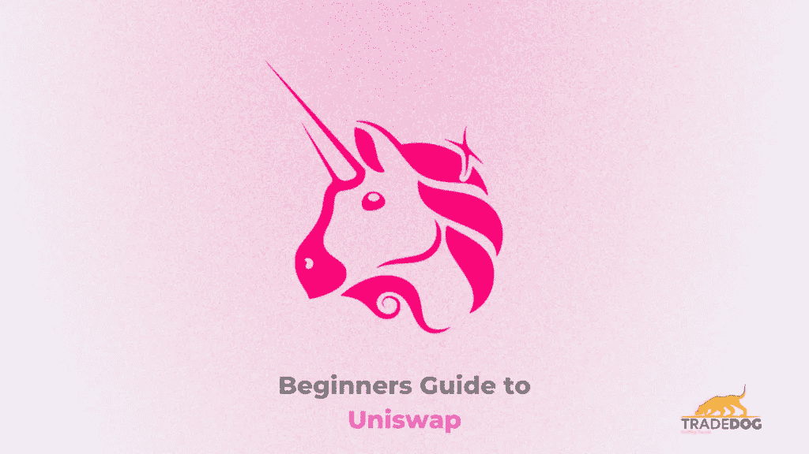
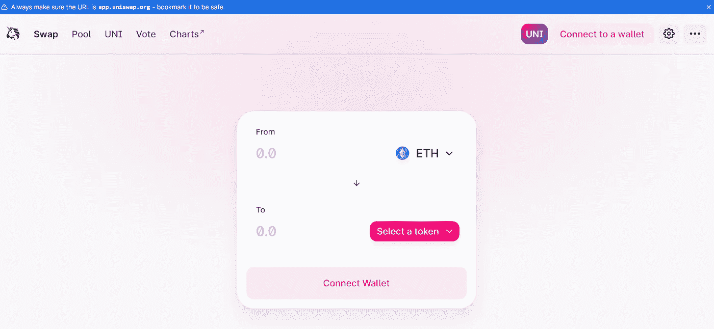
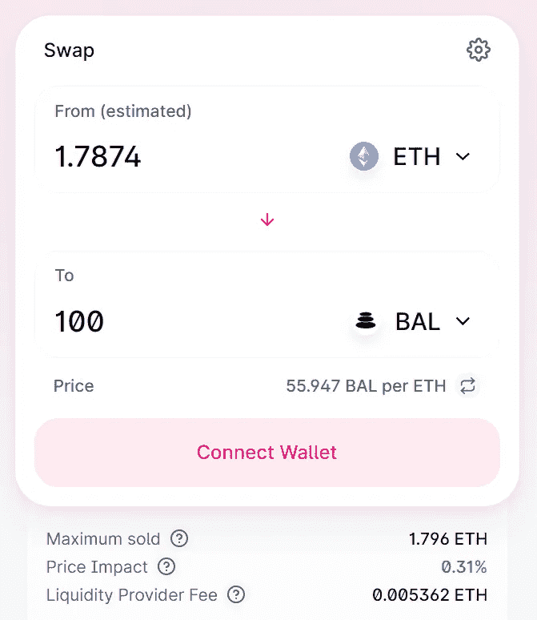

# 2021 年如何使用 Uniswap 的初学者指南

> 原文：<https://medium.com/coinmonks/beginners-guide-on-how-you-use-uniswap-in-2021-12d0a5e7cbd?source=collection_archive---------5----------------------->

tradedog.io

事实证明，加密市场比任何其他传统指数都更有趣，收益也更高。分散金融(DeFi)是区块链协议的另一个领域，旨在提供不间断的分散金融服务。在撰写本文时，DeFi 行业的估值为 248.5 亿美元，预计未来将翻一番。那么我们就来说说 DeFi，它的起源，如何给高收益池增加流动性，通过借贷赚取利息，在这个 Uniswap 教程中获得收益耕种机会。

参观[DeFi](https://tradedog.io/blog/the-wild-west-of-defi-yield-farming-in-liquidity-pools/)的狂野西部，了解流动性汇集、收益农业和自动化做市商机制是如何运作的。请继续阅读本 Uniswap 教程，了解如何购买代币。

## **什么是 UniSwap？**

Uniswap 是一个完全去中心化的交易所(DEX ),没有交易所需的指令簿或任何中央机构。用户可以交换 ERC20 代币，无需买家卖家创造需求。该机制通过一个等式工作，该等式根据可用需求自动设置和平衡这些值。Uniswap 使用一种被称为“[恒定产品做市商模式](https://tradedog.io/blog/top-5-defi-projects-becoming-the-bedrock-of-new-age-digital-collateral/)的定价机制，该机制重新定义了做市商的流动性准备，并允许对资金池的民主化访问。

接下来，让我们向您展示如何访问 Uniswap 并交易(交换)您的第一个令牌！

因为 Uniswap 是基于以太坊的，你需要一个以太坊钱包来开始交易。您可以通过直接进入 uni WAP 或使用在 uni WAP 和 Idex 中聚合池、对和交易信息的 Dextools 来交易和交换您的首选 ERC20 令牌。

敬请关注我们即将在 Uniswap 上发布的同一系列的博客。

## **第一步**

在你首选的浏览器上访问 app.uniswap.org 网站，它不仅可以安全访问，还安装了元掩码。

访问此链接后的第一页将如下图所示。

Uniswap.org

在此页面上，您可以通过选择出现提示“选择令牌”的令牌来开始交换令牌。但在此之前，你必须连接你的钱包才能进行交易。

请注意，有时您的令牌不会显示在上面图像中的过程中。您可以随时通过点击“选择令牌”找到您的令牌，并将您的令牌的联系地址粘贴到搜索栏中，这样您的令牌就可以使用了。

参见-如何[保护您的在线钱包](https://tradedog.io/blog/9-proven-tips-to-secure-your-cryptocurrency-wallet-and-prevent-hacking-in-2020/)，防止黑客入侵

## **第二步**

*点击*连接钱包

*在下一个提示中，您会发现几个选项可供选择。最常用的方法是连接以太坊的 Metamask，但你也可以使用其他选项，如 WalletConnect、比特币基地钱包、Fortmatic 和 Portis。选择您喜欢的选项并将其连接到 Uniswap。*

*我们在这里给出元面具的演示，因为它是第一批以太坊钱包之一*

*确保您已经在浏览器上下载了元掩码扩展。*

## ***第三步***

*单击元掩码*

*将您的以太坊钱包连接到 Uniswap，您成功了！*

## ***第四步***

*现在输入你要购买的代币的价值，上面的 ETH 值将根据你要购买的代币数量自动改变价格，比如说 BAL(平衡器),如上图所示。为了购买 100 个 BAL 代币，您需要用 BAL 交换 1.78 ETH 来完成您的订单。*

**

*如果您在列表中没有找到您的令牌，您可以通过在此列表中粘贴令牌的合同地址来进行搜索。大多数用户都不知道什么是契约地址，大概是这样的*0x ba 100000625 a 3754423978 a60c 9317 c58a 424 E3 d*。只需在 etherscan.io 上输入令牌的股票名称，就可以找到任何合约地址。*

*参考[此视频](https://www.youtube.com/watch?v=dcZ7kVC2-6g)查看完整的 Uniswap 教程。*

*一旦您购买了新的 BAL 代币，您就可以直接在 Uniswap 指数中查看其市场表现。前往*info.uniswap.org/home*，在搜索栏中输入 BAL 搜索您的新代币。从下拉菜单中选择对，你会发现许多统计数据，如流动性，价格，成交量等。与 BAL 相关。*

*现在，你已经找到并交换了你的加密资产，你可以开始交易或持有，并不断获得收益，如果该平台已经实现了赚取利息，流动性提供商奖励和产量农业。*

## ***结论***

*秘密经济正在打破所有先入为主的不信任和怀疑观念。随着数字资产的迅猛增长及其惊人的回报，几乎每个可以访问互联网的人都打算尽快投资。但是，关于如何安全进入密码市场的适当信息和情报是难以捉摸的。散户投资者群体主要关注股票和外汇交易。他们只通过随机广告或一个朋友的口耳相传了解加密，这个朋友要么失去了他的财富，要么通过全押加密发了财。*

*加密市场非常庞大，超过 1 万亿美元的市值分布在 8，281 种加密货币、34，224 个市场和数千种资产对中，例如最受欢迎的 BTC/美元。投资者越来越难从这个庞大的生态系统中选择一项投资来开始盈利交易。*

*在 [tradeDog](https://login.tradedog.io/auth/login) 上注册，定期获得电子邮件更新，如绝对市场英特尔、预测、提示、技术分析、研究等，并找到尽可能好的情报来理解趋势和观点。*

**原载于 2021 年 1 月 19 日*[*https://trade dog . io*](https://tradedog.io/blog/beginners-guide-on-how-you-use-uniswap-in-2021/)*。**