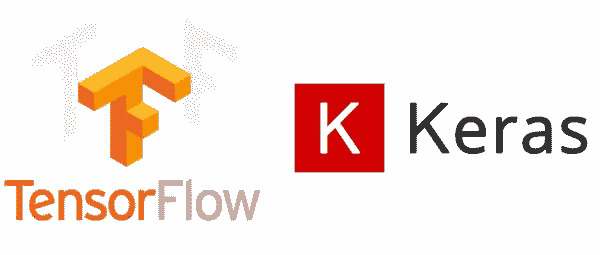
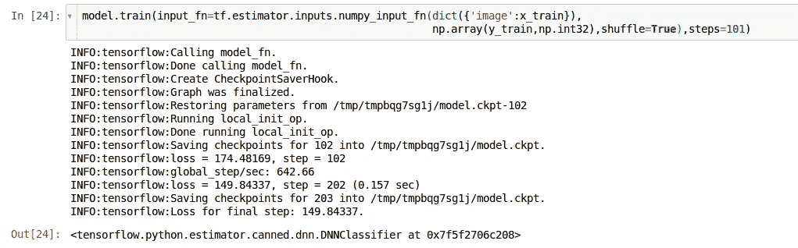
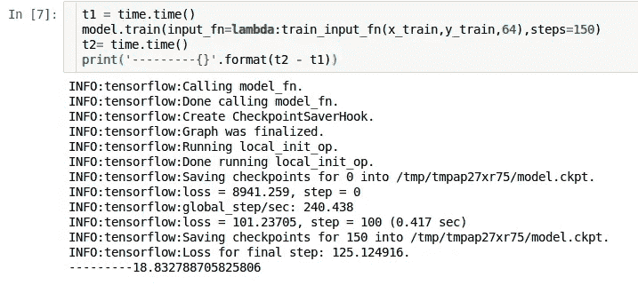

# Tensorflow 中馈送数据的初学者指南—第 1 部分

> 原文：<https://medium.com/coinmonks/beginners-guide-to-feeding-data-in-tensorflow-faf21a745e4c?source=collection_archive---------0----------------------->

嗨，这个系列是关于向 tensorflow 模型提供数据(图像和数字特征)的。阅读完所有帖子后，你将能够—

1.  将内存中的数据提供给模型。
2.  将 TFRecords 格式提供给模型。
3.  将磁盘上的原始图像输入到模型中。

在这一部分中，我将重点关注内存中数据的输入。

这篇文章假设读者具备以下技能— **神经网络的基本工作原理，Tensorflow 的基础知识或 Keras 中的基本建模知识。**

这篇文章的代码可以在[这里找到。](https://gist.github.com/shang-vikas/36176e3bed6f3234fd1c27465d8bec22)

让我们开始吧。

**安装**



`pip install tensorflow-gpu keras`

或者没有 GPU 的话，安装 tensorflow 的 CPU 版本。

`pip install tensorflow keras`

**数据集**

我们将使用流行的 MNIST 数据集。它包含从 0 到 9 的数字图像。通常，该数据集以 **numpy 数组**格式提供。因此，我将提供代码来将数据转换为磁盘上的 [TFRecords 格式](https://gist.github.com/shang-vikas/509cc87d4b37694308f717b1cbb3585a)和 [raw 图像](https://gist.github.com/shang-vikas/3670a06f0e4bfc1a52f4847ac3d31c78)。

**使用估算器 API**

Tensorflow 提供了高级估算器 API，以最小的工作量定义您的模型。我们将使用这个 API 来构建我们的简单模型，该模型由 100 个神经元组成，每个神经元有 10 个输出层，因为数据集有 **10 个类。**

当您使用 Estimator API 创建模型时，它会将数据集的要素列类型作为一个列表，在训练期间提供。由于我们使用包含数字的图像，我们将为其提供一个**数字类型**的特征列。

```
feature_column = [tf.feature_column.numeric_column(key=’image’,shape=(784,))]
```

这里的 key 是我们希望给这个特性列起的名字。请注意，在输入数据时，应该将相同的键传递给模型。

有关 feature_columns 类型的更详细列表，请访问 [tensorflow 的文档](https://www.tensorflow.org/get_started/feature_columns)。

现在，为了创建模型，我们将使用预先制作的估计器，特别是 DNNClassifier，也称为深度神经网络分类器，可以根据需要添加任意多的密集层。

# #定义模型

```
model = tf.estimator.DNNClassifier([100,100],n_classes=10,feature_columns=feature_column)
```

现在我们已经定义了我们的模型，让我们定义**数据集流。**

1.  **使用 Numpy 数组**

```
import numpy as np
import pandas as pd
from keras.datasets import mnist(x_train,y_train),(x_test,y_test) = mnist.load_data()
#since the model expects a single feature vector of size 784 #convert from (28,28) to 784 
x_train = x_train.reshape(-1,784) 
x_test = x_test.reshape(-1,784)
```

*   因为我们这里有 numpy 数组形式的数据。所以最简单的方法就是将数据传递给模型，对吗？？**正确。** Tensorflow 在 **tf.estimator.inputs 下提供这个功能**我们来传递数据，训练模型 101 步。这里的步骤是指模型看到的小批量的数量。默认批量是 **128。**

```
model.train(input_fn=tf.estimator.inputs.numpy_input_fn(
dict({'image':x_train}),                                         np.array(y_train,np.int32),
shuffle=True),steps=101) 
```

输出应该是这样的-



这样做很好，但是如果您想在将数据输入模型之前对其进行一些预处理，该怎么办呢？这里**数据集 API** 来帮忙了。

正如您在上面的代码行中看到的，model.train 期望数据从输入函数中获得。因为该函数需要一个预处理函数，以防我们进行一些预处理，所以让我们编写一个预处理函数，将 numpy 数组转换为张量，并将数据类型更改为 float32，因为密集层的权重是 dtype float32。

**注意:根据经验，总是首先将你的数据转换成张量(float32，int32 ),否则你会得到奇怪的错误，这会导致很多问题。**

```
'''parse function to be used. This function is needed to do the preprocessing of data like reshaping ,converting to tensors from numpy arrays ,one-hot encoding ,etc.'''
def _parse_and_preprocess(x,y):
    x = tf.cast(x,tf.float32) 
    #cast to float32 as the weights are float32.
    y = tf.cast(y,tf.int32) #cast to tensor of int32
    return (dict({'image':x}),y) #return tuple of dict of feature # name with key as provided in the feature column and label.
```

现在编写输入函数，返回一个生成器来获取下一批数据。

```
##define the function that feeds the data to the model .
def train_input_fn(x_train,y_train,batch_size=64):
    ##Here we are using dataset API.
    '''
    take the data from tensor_slices i.e. an array of data-points in simple words.
    '''
    dataset =    tf.data.Dataset.from_tensor_slices((x_train,y_train)) 

    dataset = dataset.map(lambda x,y:_parse_and_preprocess(x,y)).shuffle(buffer_size=128) \
                .batch(batch_size) dataset_iterator = dataset.make_one_shot_iterator()   
    return dataset_iterator.get_next()
```

这里我们使用的是数据集 API(tf.data.Dataset)。因为我们有数组形式的数据，所以我们可以调用 from_tensor_slices 方法并传递数据。

我知道方法的名字是不明确的！！

tensor_from_slices 方法还获取存储在磁盘上的文件名列表。我将在下一篇文章中解释这一点。

如果您有一个包含各种数值和分类特征的数据集，那么您应该使用数据集 API 的 [TextLineDataset](https://www.tensorflow.org/get_started/datasets_quickstart) 方法或 tf.estimator.inputs 的 pandas_input_fn 方法，但我强烈推荐前者。

传入的数据现在被传递给我们编写的 _parse_preprocess 函数，并将返回一个由 **2** 元素组成的元组——第一个是包含键和图像**数据的字典，作为 dtype tf.float32** 的 784 张量，第二个是 dtype tf.int32 的**标签。**

现在顾名思义，**。洗牌()**和**。batch()** 方法分别对数据进行混洗和批处理。

为了迭代这些数据点，我们调用 **make_one_shot_iterator** 返回迭代器，也称为生成器。

的。get_next()只是返回下一批数据。

现在是时候训练我们的模型了。

注意:estimator.train()中的 input_fn 不接受函数中的参数。解决方法是使用 python 的 lambda 特性。

```
import time
t1 = time.time()
model.train(input_fn=lambda:train_input_fn(x_train,y_train,64),steps=150)
t2= time.time()
print('time taken ---- \t {}'.format(t2 - t1))
```



**结论:**

以上代码适用于 numpy 数组格式的图像数据。现在概括一下，不仅仅是图像数据，如果您有各种特性的数据，包括数字列、序数、名义类型，

*   创建模型时，只需在列表中传递特征名称。
*   使用 tf.data.Dataset API 中的 TextLineDataset 方法，而不是 train_input_fn()中的 from_tensor_slices。
*   将数据集映射到适当的预处理函数，该函数仍将返回包含具有 dict 和标签中适当键的特性的元组。
*   然后洗牌，按要求分批，最后做一个迭代器，返回下一批。

> 第二部分的链接在这里是[。](/@16vikas96/beginners-guide-to-feeding-data-in-tensorflow-part2-5e2506d75429)

感谢您阅读帖子。如果你喜欢，请鼓掌。

> 加入 Coinmonks [电报频道](https://t.me/coincodecap)和 [Youtube 频道](https://www.youtube.com/c/coinmonks/videos)获取每日[加密新闻](http://coincodecap.com/)

## 另外，阅读

*   [密码电报信号](http://Top 4 Telegram Channels for Crypto Traders) | [密码交易机器人](/coinmonks/crypto-trading-bot-c2ffce8acb2a)
*   [复制交易](/coinmonks/top-10-crypto-copy-trading-platforms-for-beginners-d0c37c7d698c) | [加密税务软件](/coinmonks/crypto-tax-software-ed4b4810e338)
*   [网格交易](https://coincodecap.com/grid-trading) | [加密硬件钱包](/coinmonks/the-best-cryptocurrency-hardware-wallets-of-2020-e28b1c124069)
*   [最佳加密交易所](/coinmonks/crypto-exchange-dd2f9d6f3769) | [最佳加密交易所](/coinmonks/bitcoin-exchange-in-india-7f1fe79715c9)
*   开发人员的最佳加密 API
*   最佳[密码借贷平台](/coinmonks/top-5-crypto-lending-platforms-in-2020-that-you-need-to-know-a1b675cec3fa)
*   杠杆代币的终极指南
*   [最适合加密交易的 VPN](https://coincodecap.com/best-vpns-for-crypto-trading)
*   [最佳加密分析或链上数据](https://coincodecap.com/blockchain-analytics) | [Bexplus 评论](https://coincodecap.com/bexplus-review)
*   [NFT 十大市场造币集锦](https://coincodecap.com/nft-marketplaces)
*   [AscendEx Staking](https://coincodecap.com/ascendex-staking)|[Bot Ocean Review](https://coincodecap.com/bot-ocean-review)|[最佳比特币钱包](https://coincodecap.com/bitcoin-wallets-india)
*   [Bitget 回顾](https://coincodecap.com/bitget-review)|[Gemini vs block fi](https://coincodecap.com/gemini-vs-blockfi)|[OKEx 期货交易](https://coincodecap.com/okex-futures-trading)