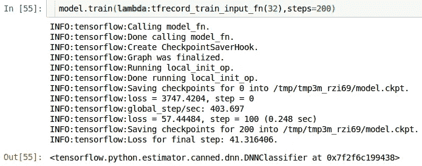
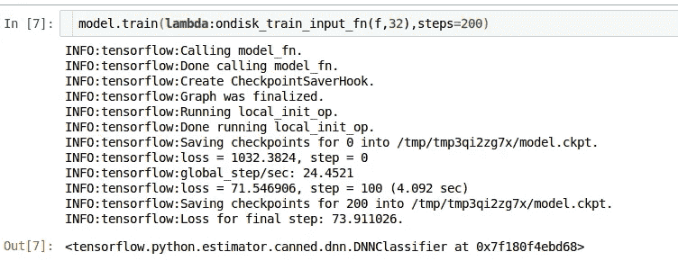

# Tensorflow 中馈送数据的初学者指南—第 2 部分

> 原文：<https://medium.com/coinmonks/beginners-guide-to-feeding-data-in-tensorflow-part2-5e2506d75429?source=collection_archive---------0----------------------->


嗨，这是本系列的第二部分。在这篇文章中，我将展示如何将 TFRecord 数据格式和原始图像输入到 tensorflow 模型中。TFRecords 格式的各种优势是—

1.  读取速度比 PNG 或其他格式更快。
2.  为您提供数据管道的灵活性。
3.  当数据不适合内存时很有用。
4.  减少要管理的文件数量。(个人观点)

part-1 的链接在这里是，转换成 tfrecords 的代码的链接在这里是[。](https://gist.github.com/shang-vikas/509cc87d4b37694308f717b1cbb3585a)

**使用的数据集—** MNIST

**模型架构** —两个各 100 个神经元的隐藏层和一个 10 个神经元的输出层。

我假设您有 TFRecords 格式的数据。让我们开始吧。

```
## import necessary stuff
import tensorflow as tf
import numpy as np
import os,sys
import time## defining the type of features columns to be used on model.
feature_column = [tf.feature_column.numeric_column(key='image',shape=(784,))]##defining the model
model = tf.estimator.DNNClassifier([100,100],n_classes=10,feature_columns=feature_column)
```

现在我们已经创建了模型，让我们定义数据流。我们将使用数据集 API 中的 **TFRecordDataset** 方法。

首先，我们需要定义一个函数，将 TFRecords 格式转换回 dtype 的张量 tf.float32(对于 image)和 tf.int32(对于 label)。

转换会是这样的-

```
**TFRecords --> Serialized Example --> Example --> Tensor**
```

这是函数—

```
def _parse_(serialized_example):
    feature = {'image_raw':tf.FixedLenFeature([],tf.string),
                'label':tf.FixedLenFeature([],tf.int64)}
    example = tf.parse_single_example(serialized_example,feature)
    image = tf.decode_raw(example['image_raw'],tf.int64) #remember to parse in int64\. float will raise error
    label = tf.cast(example['label'],tf.int32)
    return (dict({'image':image}),label)
```

在上面的代码中，我们从序列化的例子中解析单个例子。为了解析一个例子或者简单地说一个数据点，我们需要提供特性的名称和它们对应的类型作为一个字典，连同序列化的例子一起提供给 parse_single_example。我用' image_raw '键存储图像，用' label '键存储标签，数据类型分别为 tf.string 和 tf.int64，所以我在字典中传递了相同的值。如果你不记得功能的名称，有一个技巧可以找出名称。在 Linux 里做`head -n20 /path/to/tfrecords`就行了。这将以可读的格式打印特征的名称。

现在我们知道了如何解析 tfrecords，让我们编写使用 this _parse_ function 的函数，并返回要提供给模型的(features，label)批次。

```
mnist_tfrecord_path = os.path.abspath('./mnist_train.tfrecords')def tfrecord_train_input_fn(batch_size=32):
    tfrecord_dataset = tf.data.TFRecordDataset(mnist_tfrecord_path)
    tfrecord_dataset = tfrecord_dataset.map(lambda   x:_parse_(x)).shuffle(True).batch(batch_size)
    tfrecord_iterator = tfrecord_dataset.make_one_shot_iterator()

    return tfrecord_iterator.get_next()
```

现在我们已经创建了数据输入管道函数，让我们尝试训练模型。

```
model.train(lambda:tfrecord_train_input_fn(32),steps=200)
```



*   **如果我在磁盘上有原始图像会怎样？？？**

> 在磁盘上将 numpy 数组写成 jpg 格式的代码在这里是[。](https://gist.github.com/shang-vikas/3670a06f0e4bfc1a52f4847ac3d31c78)

上面的代码将以“image[i]_[class]的格式写入图像。其中 class 是图像的标签，I 是计数。总图像是 60k。现在，为了读取图像并对其进行预处理，我们需要再次编写一个解析函数来读取图像，分割标签，将标签转换为 tf.int32 的标量，将图像转换为 tf.float 并返回一个元组。

```
path = os.path.abspath('./digit-recognizer/train/')def _ondisk_parse_(filename):
    filename = tf.cast([filename],tf.string)

    label = tf.string_split([tf.string_split(filename,'_').values[1]],'.').values[0]
    label = tf.string_to_number([label],tf.int32)

    path = os.path.abspath('./digit-recognizer/train//')
    path = tf.cast([path],tf.string)

    final_path = tf.string_join((path,tf.cast(['/'],tf.string),filename))

    image_string = tf.read_file(final_path[0])
    image = tf.image.decode_jpeg(image_string)
    image = tf.cast(image,tf.int8)
    image = tf.cast(image,tf.float32)
    image_reshaped = tf.reshape(image,(784,))
    return (dict({'image':image}),label)
```

这里，我使用了 tensorflow 的原生 string_split、string_to_number 等。方法，因为它是 tensorflow 作者推荐的，否则我不得不包装我的将使用 python 方法的函数。分裂，串()等)在一个由张量流给定的包装上，我没有心情这样做。这里，记住将图像转换回 int8，因为在保存图像时，格式是 int8。直接将 int8 转换为其他格式会导致错误。

现在 _ondisk_parse 已经准备好了，让我们编写最终的训练输入函数。

```
def ondisk_train_input_fn(filenames,batch_size=32):
    dataset  = tf.data.Dataset.from_tensor_slices(filenames)
    dataset = dataset.map(lambda x:_ondisk_parse_(x)).shuffle(True).batch(batch_size)
    ondisk_iterator = dataset.make_one_shot_iterator()

    return ondisk_iterator.get_next()
```

在这里，我再次使用了 _from_tensor_slices 方法，因为您可以传递内存中的数据(张量或 numpy 数组)或需要提供给该方法的图像的文件名。管道的其余部分与映射 _ondisk_parse_ first 相同，然后改组、创建批处理、生成 one_shot_iterator 并返回下一个批处理。

最后，训练部分—

```
#list of the images in train folder
f = !ls ./digit-recognizer/train/ 
#train the model
model.train(lambda:ondisk_train_input_fn(f,32),steps=200)
```



**结束**

> 完整的代码可以在[这里找到。](https://gist.github.com/shang-vikas/f25e13bfa5425258eb47c91d8739536b)

如果你喜欢这篇文章，给点掌声。

> 加入 Coinmonks [电报频道](https://t.me/coincodecap)和 [Youtube 频道](https://www.youtube.com/c/coinmonks/videos)获取每日[加密新闻](http://coincodecap.com/)

## 另外，阅读

*   [复制交易](/coinmonks/top-10-crypto-copy-trading-platforms-for-beginners-d0c37c7d698c) | [加密税务软件](/coinmonks/crypto-tax-software-ed4b4810e338)
*   [网格交易](https://coincodecap.com/grid-trading) | [加密硬件钱包](/coinmonks/the-best-cryptocurrency-hardware-wallets-of-2020-e28b1c124069)
*   [密码电报信号](http://Top 4 Telegram Channels for Crypto Traders) | [密码交易机器人](/coinmonks/crypto-trading-bot-c2ffce8acb2a)
*   [最佳加密交易所](/coinmonks/crypto-exchange-dd2f9d6f3769) | [印度最佳加密交易所](/coinmonks/bitcoin-exchange-in-india-7f1fe79715c9)
*   开发人员的最佳加密 API
*   最佳[密码借贷平台](/coinmonks/top-5-crypto-lending-platforms-in-2020-that-you-need-to-know-a1b675cec3fa)
*   [杠杆代币](/coinmonks/leveraged-token-3f5257808b22)终极指南