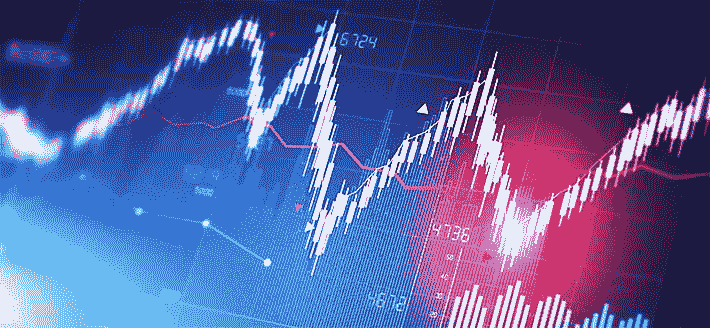
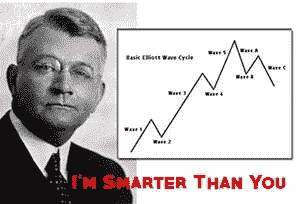
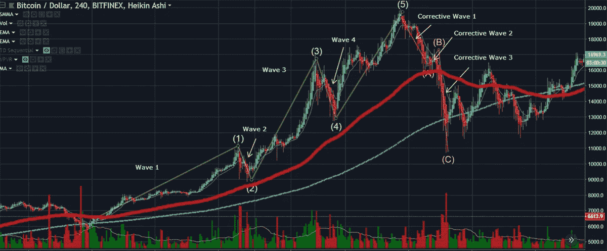
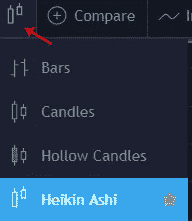
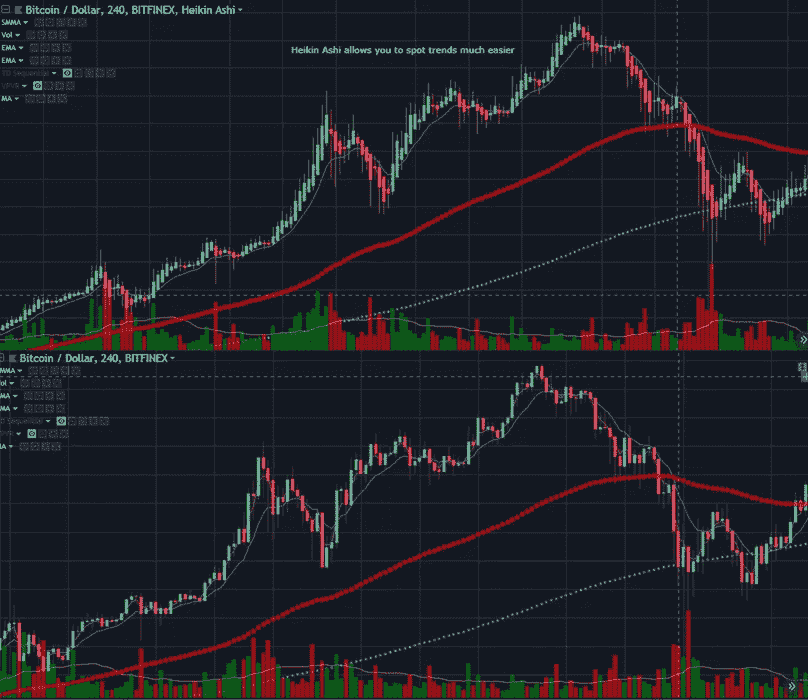
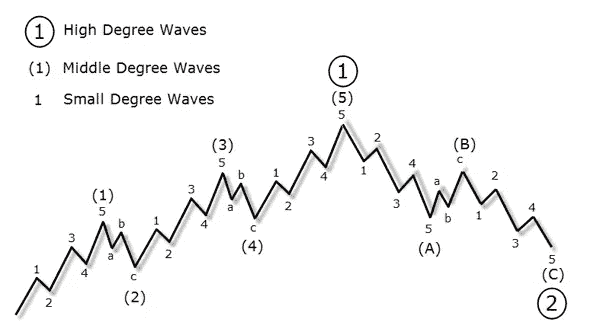
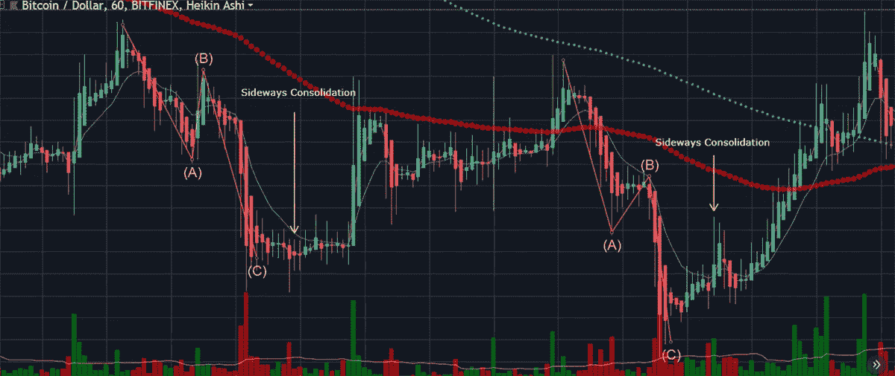

# 加密市场交易艾略特波浪初学者指南

> 原文：<https://medium.com/coinmonks/beginners-guide-to-trading-elliot-waves-for-the-crypto-market-3cb8f26ee393?source=collection_archive---------3----------------------->

艾略特波浪原则背后的基本理论是基于价格如何移动，它通常不是一条直线，而是一系列的波浪。一个很好的类比是，当水上涨时，海潮进来，当水退进下面的沙子时，海潮流出。

在任何金融市场(包括加密货币)内，每一个动作都会产生一个大小相等、方向相反的反应。当价格上涨时，必然会有相反的下跌。

任何金融市场的价格行为通常分为趋势和修正(横向运动)。向上或向下的价格行为将显示趋势的方向，而修正总是与趋势相反。这些重复的模式已经被证明出现在所有的金融市场中。

一个名叫拉尔夫·尼尔森·艾略特的人首先发现了这些重复的模式，被称为冲动波和矫正波。他注意到，这些总是与主要趋势一致的冲动波，往往会以 5 波的形式做出反应。

即使在较小的尺度上，这些脉冲波中的每一个都可以被发现，并在更大的艾略特波浪模式中继续重复。在艾略特波浪原理中，这些“波中波”被标记为“[波度](http://cryptocoinjunky.com/beginners-guide-to-trading-elliot-waves-for-the-crypto-market/#wavedegrees)”。

我们将在下面讨论更多关于波浪度数的内容，但首先是一堂快速的历史课…

> 另请阅读:[最佳加密交易机器人](/coinmonks/crypto-trading-bot-c2ffce8acb2a)

# 艾略特波浪原理背后的历史

拉尔夫·尼尔森·艾略特在 20 世纪 20 年代末发展了艾略特波浪理论。埃利奥特证明了股票市场不会以混乱的方式运行，而是以重复的周期运行。他提出，这些市场周期是投资者对外部影响的反应和大众主导心理的结果。

他的研究得出结论，这些大众心理信号的向上和向下波动在整个时间内继续以相同的重复模式出现。他的理论也基于 T4 道氏理论，该理论也认为股票价格波动。

埃利奥特还注意到，市场倾向于像自然一样表现为“[分形](https://en.wikipedia.org/wiki/Fractal)”。分形是倾向于无限重复自身的数学结构，即使在最小的尺度上。

历史课上够了。让我们来看看你真正想知道的…

# 艾略特波浪到底是如何工作的？

由于贪婪、FOMO 和“弱者之手”统治的人类心理的预测方式，人类的社会性可以在这些重复的模式中找到。你可以称之为另一个“自我实现的预言”,然而，由于这些反应性和基本的人类情感，这些模式在所有金融市场中都出现了。

如上所述，艾略特波浪有两个不同的阶段:动机(趋势)和修正阶段。运动阶段形成 1、3 和 5 的 3 个前进波。反向波(向下)由 2 和 4 组成。

**使用我们高利润的加密帐户创建者>**[**【https://CryptoAccountBuilders.com】**](https://CryptoAccountBuilders.com) **——————————————————————————————————**，在 60 天内将您日益减少的加密帐户转变为强大的投资组合

在修正阶段，你通常会发现两条后退的路线，分别标为 A 和 C，反向波(向上)标为 b。

这在下面的图表中得到了最好的说明…

**动机波背后的规则如下:**

*   波 2 永远不会移动到波 1 的起点以下。
*   第三波从来都不是最短的一波。
*   波 2 和 4 有时在形式上可以交替，例如，波 2 可以显示为锯齿形波，而波 4 将是平的。
*   至少有一个波(1、3 或 5)会比其他两个波长得多。大多数情况下，第三波是三波中最长的，但在 crypto 中并不总是这样。

**纠正阶段的规则如下:**

*   B 波在 A 波的起点或起点以下终止
*   C 波通常在 a 波下方终止。
*   在加密货币市场中，修正波通常会占据历史最高价格的 60%以上(第五波顶部)。有些人会说，正常情况下是 75%到 80%，如果与坏消息相关，可以发现 100%到 120%的回撤。

好了，规则说够了。请记住，如果你从图表中得到了令人困惑的结果，很可能是你计算错误，忽略了上面提到的一些规则。不过不要担心；最初几次尝试时，你很可能会数错这些波。

为了解决这个计算错误的问题，我用了一个技巧来帮助发现这些波。

前往顶部栏，您可以在[交易视图](http://cryptocoinjunky.com/tradingview)上更改烛台显示，并选择 Heikin Ashi 烛台。这种类型的烛台有助于您更好地查看符合特定趋势的红色或绿色蜡烛。

Heikin Ashi 显示价格的平均速度，这在识别趋势周期方面非常有用。这就是艾略特波浪的全部。这将大大减少对烛台模式是显示熊市还是牛市的混淆。相信我，这些帮助很大。

提示:我用 Heikin Ashi 进行所有交易，而不仅仅是识别艾略特波浪。它可以在没有任何指标或图表模式的情况下单独使用，以发现各种趋势。将像 Elliott waves 这样的图表模式与 Heikin Ashi 配对，将为您提供一个极其准确和强大的预测工具集。

正如你从上图中看到的，使用 Heikin Ashi 烛台比标准烛台更容易计数波浪。

# 波度:波中的波

5 波艾略特原则的每一波都是由一个更长的时间周期组成的。每一波都可能包含持续数十年的更大的市场周期。

每个波型的度数有不同的名称，如下所示。

*   子分钟:分钟
*   小步舞曲:小时
*   分钟:天
*   次要:周
*   中间:几周到几个月
*   初级:几个月到几年
*   周期:一至几年
*   超级周期:几十年(40-70 年)
*   大超级周期:多个世纪

# 什么是最好的入口和出口？

最好的进场点最好是在第一波开始的时候，但是很难发现，因为它们是在一段时间的盘整(有时会持续几天或几周)后或突然下跌后出现的。

大多数交易者在第二波或第四波底部开始交易。这些更容易被发现。无论你做什么，永远不要在第三或第五波顶部附近买入。

最好的出场是在第三个修正浪结束时，但是这也很难确定时间，因为这些最后的浪可以回到最初 5 浪艾略特模式的 100%。

为了更安全的出场位置，寻找突破最终修正波趋势线的盘整。

# 结果

艾略特波浪原则是另一个非常有用的图表模式，许多资深交易者用它来识别趋势的开始和结束。

永远不要只相信新闻或炒作。这些系统被用来欺骗人们在市场的顶部或底部买入，这是一种获得回报的可靠方式。

在市场上买卖之前做好自己的研究。了解市场目前所处的阶段(动机或修正)，利用艾略特波浪原则做出明智的购买决定。

更多“初学者友好”的交易教程，请访问我们的交易部分，[位于这里](http://cryptocoinjunky.com/cryptocurrency-trading/)。

一如既往，如果你有任何问题，请在下面评论。

**利用我们高利润的加密帐户创建者>**[**【https://CryptoAccountBuilders.com】**](https://CryptoAccountBuilders.com)，在 60 天内将您日益减少的加密帐户转变为强大的投资组合

## 另外，阅读

*   最佳加密交易机器人
*   [Deribit 审查](/coinmonks/deribit-review-options-fees-apis-and-testnet-2ca16c4bbdb2) |选项、费用、API 和 Testnet
*   [FTX 密码交易所评论](/coinmonks/ftx-crypto-exchange-review-53664ac1198f)
*   最好的比特币[硬件钱包](/coinmonks/the-best-cryptocurrency-hardware-wallets-of-2020-e28b1c124069?source=friends_link&sk=324dd9ff8556ab578d71e7ad7658ad7c)
*   [密码本交易平台](/coinmonks/top-10-crypto-copy-trading-platforms-for-beginners-d0c37c7d698c)
*   最好的[加密税务软件](/coinmonks/best-crypto-tax-tool-for-my-money-72d4b430816b)
*   [最佳加密交易平台](/coinmonks/the-best-crypto-trading-platforms-in-2020-the-definitive-guide-updated-c72f8b874555)
*   最佳加密贷款平台
*   [莱杰 vs 特雷佐](/coinmonks/ledger-vs-trezor-best-hardware-wallet-to-secure-cryptocurrency-22c7a3fd391e)
*   Bitsgap 评论——一个轻松赚钱的加密交易机器人
*   为专业人士设计的加密交易机器人
*   [PrimeXBT 审查](/coinmonks/primexbt-review-88e0815be858) |杠杆交易、费用和交易
*   HaasOnline 评论享受九折优惠
*   Bitmex 上的[保证金交易的白痴指南](/coinmonks/the-idiots-guide-to-margin-trading-on-bitmex-dbbd7742c6fc?source=friends_link&sk=7bfa99d2a181142510c8442c8ddb0786)
*   [eToro 评论](/coinmonks/etoro-review-78807ddeb33c) |交易股票、密码、交易所交易基金、差价合约和商品
*   [Bitmex 高级保证金交易指南](/coinmonks/bitmex-advanced-margin-trading-guide-2270c195ce25?source=friends_link&sk=1d986cca731f5084b9a2db4a4bc4a7ad)
*   面向开发者的最佳加密 API
*   [加密套利](/coinmonks/crypto-arbitrage-guide-how-to-make-money-as-a-beginner-62bfe5c868f6)指南:新手如何赚钱
*   顶级[比特币节点](https://blog.coincodecap.com/bitcoin-node-solutions)提供商
*   最佳[加密制图工具](/coinmonks/what-are-the-best-charting-platforms-for-cryptocurrency-trading-85aade584d80)
*   了解比特币的[最佳书籍有哪些？](/coinmonks/what-are-the-best-books-to-learn-bitcoin-409aeb9aff4b)

> [直接在您的收件箱中获得最佳软件交易](https://coincodecap.com?utm_source=coinmonks)

