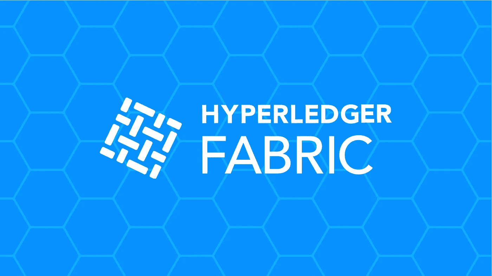

# 从 Hyperledger 结构开始

> 原文：<https://medium.com/coinmonks/beginning-with-the-hyperledger-fabric-241b54859476?source=collection_archive---------4----------------------->

自过去 3 年以来，区块链技术一直在快速发展。这一切都始于 10 年前的比特币。今天，我们有超过 1600 种加密货币，许多项目使用区块链技术完成加密货币交易以外的任务。这篇文章讲述了这类项目中最流行的一个，Hyperledger Fabric。

区块链框架被分为公共、私有和联盟(又称许可)。比特币被认为是公共的，因为它允许任何人连接并开始挖掘。加入该网络进一步意味着你将有机会获得一份完整的账本。即使你不能确定谁拥有多少比特币，这个概念对于 B2B 网络来说仍然是不可取的。

在 B2B 网络中，企业所有者必须有权决定谁能够看到他们的信息。这就是像 Hyperledger Fabric 这样的区块链联盟框架发挥作用的地方。如果您想要加入 Hyperledger Fabric 网络，您必须首先获得该网络其他参与者的同意。此外，通过渠道特性，业务数据只对那些真正需要它的参与者可用。

我将为另一篇文章保留 Hyperledger Fabric 的详细架构。但这里有一些基本概念。

# 资产

在加密货币网络中，你拥有的硬币就是你的资产。在比特币里叫比特币本身，在以太坊里叫以太。在这些网络中发生的交易包括发送和接收这些硬币。

由于区块链不仅仅是兑换硬币，Hyperledger Fabric 允许您定义自定义资产。例如，车辆可以是汽车制造商的资产。车辆将有几个带值的属性，这些属性被称为该资产的状态。这种状态的任何变化都被视为一笔交易，记录在分类账中。

# 链码/智能合同

现在，这些定制资产是如何定义的呢？答案是链码。它只是一个用 Golang 或 Node.js 编写的程序(对其他语言的支持正在进行中)。该代码将包含将成为网络中资产的结构或对象，以及将对这些对象执行 CRUD 操作的几个方法或函数。这些功能执行的每个创建、更新和删除操作都将记录在分类帐中。

# 共识；一致

正如在区块链中，每个参与者都有自己的本地账本，我们需要一种机制来保持它们同步。做到这一点的唯一方法是确保每个参与者都以相同的顺序提交事务，并且这些事务必须得到相应各方的批准。

这是由共识机制处理的，共识机制不仅在区块链中流行，在分布式系统中也很流行。工作证明是比特币使用的共识算法。鉴于此，Hyperledger Fabric 使用订购者实体来实现此目的。核心思想是，在实例化链码时，定义一个认可策略，该策略指示必须通过该链码认可交易的网络参与者。订购者从这些参与者处获得已认可的交易，并对它们进行批量订购，然后分发给所有参与者。

# 频道

假设你是一家汽车制造商，想与一家零部件制造商和一家汽车经销商做生意。现在你不想让汽车经销商知道你和零部件制造商之间的交易，反之亦然。一种方法是设置两个 Hyperledger Fabric 服务器实例，或者通过将它们连接到不同的通道来隔离它们。

Hyperledger 结构网络中的参与者实际上连接到一个或多个渠道，并且他们对每个渠道都有单独的分类帐。此外，在一个通道上运行的链码不能访问另一个通道的数据。

# 设置您的第一个网络

理论部分到此为止，让我来帮你建立一个个人网络，让你兴奋起来。

> 开始前给你一点建议。不要试图在 Windows 机器上运行它，因为有些问题你现在不想处理。而且为了这篇文章的篇幅，我也不想描述他们。请改用云虚拟机。即使是 Amazon EC2 的 t2.micro 自由层 VM 对于本教程也足够了。

**软件安装** 下面是你必须安装的软件。

*   **Docker:** 从[这里](https://store.docker.com/search?type=edition&offering=community)抓取最新版本
*   **Docker-compose:** 随 Mac 版 Docker 自动安装，对于 Linux，从[这里](https://docs.docker.com/compose/install/#install-compose)下载
*   **Go 编程语言编译器:**从[这里抓取最新版本](https://golang.org/dl)
*   **Node.js 运行时:**撰写本文时还不支持 9.x 及更高版本，所以从这里的[抓取 8 . x](https://nodejs.org)
*   **Python 2(不是 3):** Linux 和 Mac 必须已经有了，但是要确保用`python`命令激活版本 2
*   **Git 运行时:**从[这里](https://git-scm.com/downloads)抓取最新版本
*   **cURL:** 你必须已经在 Linux 和 Mac 上安装了它，如果你想升级的话从[这里](https://curl.haxx.se/download.html)获取最新版本

您必须确保上述所有软件都在您的路径中，并且 Docker 守护程序正在运行(运行命令`docker ps`)。如果不是，就执行 Mac 版的 Docker 应用程序，或者如果你使用的是 Linux，就运行`dockerd`命令。

**下载 Docker 图像、样本&实用程序**
软件设置完成后，导航至您选择的目录并运行以下命令:

这个命令需要几分钟的时间来下载所需的 Docker 映像，并将包含一些示例和实用程序的 Git 存储库克隆到“fabric-samples”目录中。以下是 fabric-samples 中一些文件夹内容的详细信息:

*   **bin** :包含设置网络的命令行实用程序
*   **chaincode** :包含示例链码，在本教程中我们将从中运行 chaincode_example02
*   **包含一个脚本，用于设置一个包含一个订购者、一个组织和一个 cli 的网络。这有助于在开发过程中对链代码进行单元测试**
*   **配置:**示例网络配置，您稍后在设置生产网络时需要参考
*   **first-network:** 包含 shell 脚本，用于启动包含两个组织、四个对等方、一个订购方和一个 cli 的网络

让我们使用 first-network 中的脚本生成一个网络。导航到该目录并执行 byfn.sh shell 脚本，如下所示:

以上命令将启动示例网络并实例化用 Go 语言编写的[链码 _ 示例 02](https://github.com/hyperledger/fabric-samples/blob/release-1.2/chaincode/chaincode_example02/go/chaincode_example02.go) 链码。链码由两个实体“a”和“b”初始化，分别包含 100 和 200 个单元。如果一切顺利，会输出一个大大的“结局”。

chaincode_example02 chaincode 还包含在它们之间转移单元、删除任一实体以及查询一个实体拥有多少单元的方法。因为我们的 chaincode 已经被实例化了，所以让我们看一个查询、传输和删除方法的例子。

如果你运行命令`docker ps`，那么你可以看到一堆由 byfn 脚本创建的容器。`cli`就是其中之一，它配置了所需的环境变量，并包含了使用我们的链码所需的实用程序。遵循以下要点中的步骤来处理该问题:

这里，我们使用了示例脚本来准备我们的网络。但是它们不能用于生产部署。Hyperledger Fabric 中有许多概念和配置，我将在以后的文章中介绍它们。所以，敬请期待！