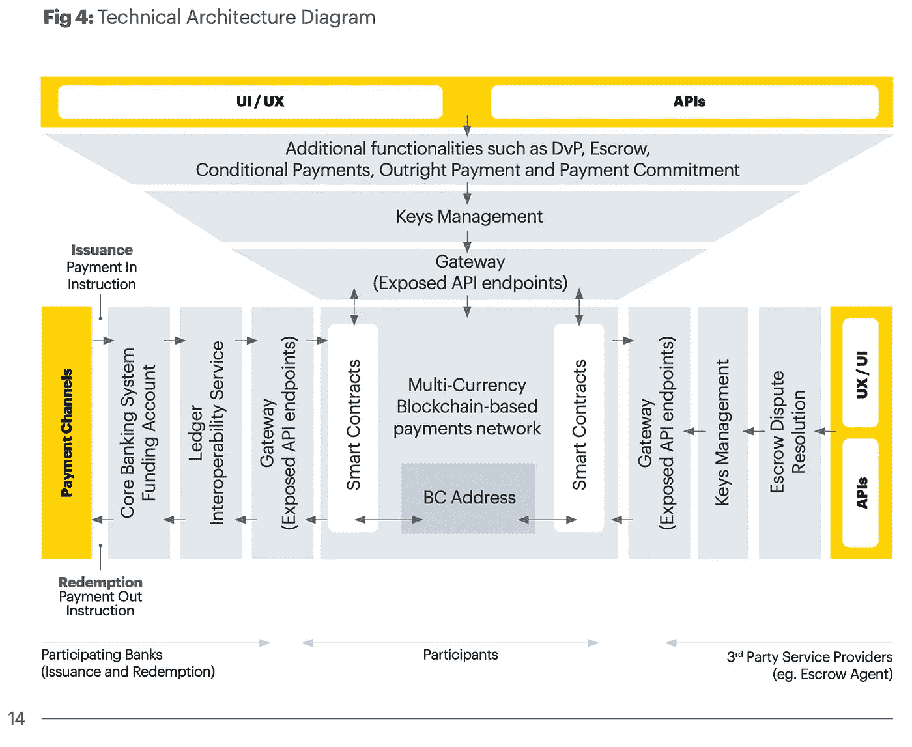
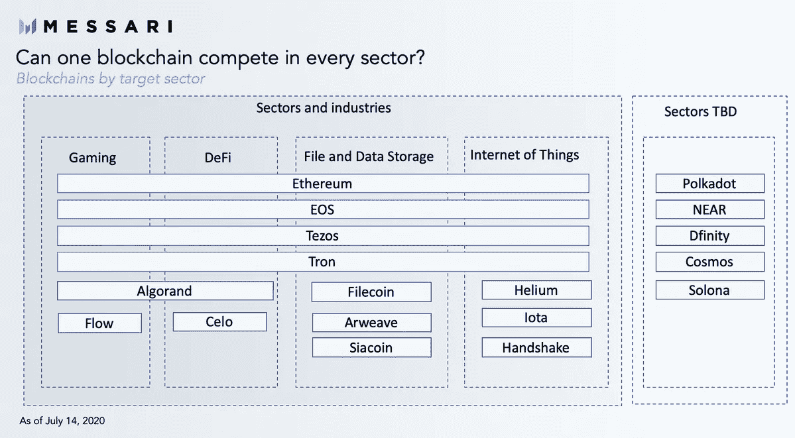

# 北京披露 145 页蓝图成为区块链中心/ JP 摩根首次亮相新加坡支付网络/无代码区块链集成

> 原文：<https://medium.com/coinmonks/beijing-reveals-145-page-blueprint-to-be-blockchain-hub-jp-morgan-debuts-singapore-payment-584174d40b5?source=collection_archive---------0----------------------->

*2020 年 7 月 17 日*

***本周景观****…重大新闻出炉* ***北京*** *随着北京市政府发布一份* [***145 页的蓝图***](http://www.beijing.gov.cn/fuwu/lqfw/ztzl/yshj/dt/202007/P020200715734061656739.pdf)*(*[*恩译*](https://law.stanford.edu/wp-content/uploads/2020/07/China_Blockchain.pdf) *) 详述其计划成为全球* [*枢纽*](https://www.theblockcrypto.com/linked/71992/beijing-government-releases-its-blueprint-for-becoming-a-blockchain-hub) *为区块链科技由****2022****…据多家* [*报道*](https://technode.com/2020/07/16/beijing-unveils-plan-for-blockchain-based-government/) *北京是中国 11 个城市中第一个发布环区块链官方战略的，就在不久前，北京市政府发布了* *这类似于国家的五年计划，规划了重点领域(城市、技术、产业等)。)和国家的经济计划。在最近的第十三个五年计划(2016 年至 2020 年)中，区块链曾出现过，但在过去一年里，它已成为中国科技努力的核心。作为一个提醒，上周我们提到了 [***【滴滴出行】*** *s 正在该国的 CBDC*](https://www.coindesk.com/chinas-uber-didi-said-to-trial-pbocs-central-bank-digital-currency) *进行试验，今年早些时候，我们看到了* [***区块链服务网络***](https://technode.com/2020/06/19/exclusive-chinas-bsn-and-irisnet-are-building-an-internet-of-blockchains/)**(BSN)的发布，该网络已经与*一起在全球部署**

***如果这还不够一周的活动，我细数一下刚刚发生在* ***央行数字货币*******CBDCs****板块如下 JP* ***摩根*******新加坡金融管理局****(****MAS 奔驰* ***戴姆勒*** *正在测试区块链的供应链数据共享，因为* ***沃尔沃*** *在其电池中投入了微量钴。****JM Smucker****1850 咖啡要上* ***IBM 的食品信托区块链*** *。* ***沃达丰*******西班牙电信*** *和* ***德国电信*** *正在试验基于区块链的漫游数据结算。Consensys 的 Codefi 为我们提供了一份关于以太坊 defi 的 Q2 2020 报告。梅萨里分享了 Web3 中的新兴趋势和叙述。我们得到了一张精心绘制的比特币网络地图，了解了为什么有人会把自己变成不可替代的代币(NFT)。********

***Plus trends &来自投资者的见解、ChainLink 的采访、融资报告、生产部署的企业使用案例、大量研究，等等！尽情享受吧！***

## **🏦[摩根大通的新加坡区块链支付网络准备推出](https://decrypt.co/35374/jp-morgans-singapore-blockchain-payment-network-ready-for-roll-out)**

**摩根大通(JP Morgan)、新加坡金融管理局(MAS)和淡马锡(Temasek)的多货币网络 Ubin 项目，经过五年的制作，已经准备好进行商业化推广。根据彭博的一份报告，Ubin 项目已经在多个商业领域进行了测试。报告指出，用于向招聘机构 Adecco Group AG 支付工资的原型**

***相关:📖* [*新加坡区块链格局自去年以来增长超过 50%*](https://cointelegraph.com/news/singapores-blockchain-landscape-has-grown-more-than-50-since-last-year)**

## **🚘[梅赛德斯制造商戴姆勒测试供应链数据共享区块链](https://www.coindesk.com/mercedes-maker-daimler-tests-blockchain-for-supply-chain-data-sharing)**

**总部位于新加坡的 Ocean Protocol 宣布与汽车制造商戴姆勒(Daimler)合作，研究在该跨国公司的生产中心之间以及在其供应链采购合作伙伴之间分散共享内部销售和财务数据。… [阅读更多](https://www.coindesk.com/mercedes-maker-daimler-tests-blockchain-for-supply-chain-data-sharing)**

***相关:📖* [*沃尔沃投资区块链创业公司追踪其电池中的钴*](https://cointelegraph.com/news/volvo-invests-in-blockchain-startup-to-trace-cobalt-in-its-batteries)**

## **📖 [Visa 为新的“分布式应用”寻找以太坊开发者](https://www.coindesk.com/visa-hiring-ethereum-developer-for-new-distributed-application)**

**支付巨头 Visa 最近在一份招聘启事中透露，该公司正在寻找一名至少有两年区块链架构和分散化应用经验的区块链工程师。任职者将加入其总部位于区块链的跨境支付平台，并作为团队的一部分，建立一个新的分布式应用… [阅读更多信息](https://www.coindesk.com/visa-hiring-ethereum-developer-for-new-distributed-application)**

***相关:📖* [*微软与 Waves 合作将工业资产进行令牌化*](https://www.coindesk.com/microsoft-partners-waves-tokenize-industrial-assets)**

# **数字货币/中央银行:**

**正如中国本周的大揭露一样，我们也收到了许多关于许多当前活跃的国家驱动的央行数字货币(CBDCs)倡议的更新和见解。我们听到的许多消息都是在 20 国集团(G20)在 T21 宣布其计划开始一个全球接受数字支付的框架时发生的。作为回应，国际清算银行发布了一份关于加强跨境支付的报告。**

****

**Source: [Project Ubin](https://www.mas.gov.sg/-/media/MAS/ProjectUbin/Project-Ubin-Phase-5-Enabling-Broad-Ecosystem-Opportunities.pdf?la=en&hash=91091CAD39265C03FF7A4253E70FBEE6D1177714)**

**摩根大通毫不迟疑地向世界宣布，他们推出了商业就绪的 Ubin 项目，这是一个多货币支付网络，过去五年来一直在与新加坡金融管理局和主权财富基金淡马锡合作开发。这一成功让新加坡政府有能力跳过对 CBDC 发展的担忧，这一点与许多受人尊敬的对手不同。**

**延续该地区的趋势，日本银行业巨头三菱 UFJ 金融集团正计划于 2020 年下半年在[发行自己的 stable coin](https://cointelegraph.com/news/japanese-banking-giant-mufg-to-issue-its-own-stablecoin-in-h2-2020)，同时泰国银行的数字货币进入其[第三阶段，将使用范围扩大到大型企业](https://www.coinsnetwork.com/2020/07/18/the-bank-of-thailands-digital-currency-steps-into-the-third-phase-of-plan-to-be-extended-to-large-enterprises/)。**

**要点:这些努力不仅仅是头条新闻，而是朝着迫切需要的金融系统和数字支付的数字化采取的行动。正如我们所了解到的，一些地区的发展比以前想象的更深入，更接近消费者的使用。这只是一个小样本，请密切关注这一领域，并期待在 2020 年底之前实现大规模部署和融入社会——即使能力有限。**

# **本周的更多内容:**

**👩‍🏫[首席管理人员将区块链作为业务重点](https://deloitte.wsj.com/cio/2020/07/10/c-suite-embraces-blockchain-as-business-priority/) — [德勤 2020 年全球区块链调查](https://www2.deloitte.com/us/en/insights/topics/understanding-blockchain-potential/global-blockchain-survey.html?id=us:2el:3dp:wsjspon:awa:WSJCIO:2020:WSJFY20)**

**📖 [JM Smucker 1850 咖啡将在 IBM Food Trust 区块链上被追踪](https://www.ledgerinsights.com/jm-smucker-blockchain-1850-coffee-ibm-food-trust/)**

**📖[美国 FDA 考虑将区块链用于食品安全](https://cointelegraph.com/news/us-fda-considers-blockchain-for-food-security)**

**📖[企业为何钟情区块链技术](/cfc-st-moritz/why-enterprises-love-blockchain-technology-97354c8dbaba)——[CfC 圣莫里茨](https://medium.com/u/cd4a8ff6611f?source=post_page-----584174d40b5--------------------------------)**

**📖[推特账号被黑:事件的综合时间表](https://www.theblockcrypto.com/post/71906/twitter-account-hacks-timeline)——[封杀](https://medium.com/u/94a299693829?source=post_page-----584174d40b5--------------------------------)**

**📖[三星在加密方面加倍努力，支持支付区块链](https://www.forbes.com/sites/benjessel/2020/07/15/samsung-doubles-down-on-crypto-with-support-for-payments-blockchain-stellar/?utm_source=TWITTER&utm_medium=social&utm_content=3497500002&utm_campaign=sprinklrForbesCrypto#8b9fb6076ef0) [Stellar](https://medium.com/u/99518a49d085?source=post_page-----584174d40b5--------------------------------)**

**💸[蜻蜓资本对加密初创公司的要求](/dragonfly-research/request-for-crypto-startups-ea6a520cac48)——[汤姆·施米特](https://medium.com/u/b7b7c70688fb?source=post_page-----584174d40b5--------------------------------)**

**📖[沃达丰、西班牙电信和德国电信试行基于区块链的漫游数据结算](https://thedailychain.com/vodafone-telefonica-and-deutsche-telekom-trials-blockchain-based-settlement-for-roaming-data/)**

**📖[为什么以太坊比 AWS 好](https://harryglynn.substack.com/p/why-ethereum-is-better-than-aws)**

**📖所有权经济:密码消费软件的下一个前沿 — [杰西·沃尔登](https://medium.com/u/e7d4eae1a2eb?source=post_page-----584174d40b5--------------------------------)**

**📖[韩国央行部署三星支持的区块链认证证书系统](https://thedailychain.com/south-korea-central-bank-to-deploy-samsung-backed-blockchain-authentication-certificate-system/)**

**📖【**报告**[Q2 2020 以太坊 DeFi 报告](https://consensys.net/insights/q2-2020-defi-report/)——[ConsenSys Codefi](https://medium.com/u/fb1abeb9b570?source=post_page-----584174d40b5--------------------------------)， [ConsenSys](https://medium.com/u/6c7078bf7b01?source=post_page-----584174d40b5--------------------------------)**

**📖【**报告**】[无银行 Q2 令牌报告](https://bankless.substack.com/p/bankless-q2-token-report)**

# **分散式应用程序手表**

## **📖[Q2 20 年回顾:网络 3 中的新兴趋势和叙述](https://messari.io/article/q2-20-review-the-emerging-trends-and-narratives-in-web3) — [梅萨里](https://medium.com/u/7cf93d3c3400?source=post_page-----584174d40b5--------------------------------)**

****

**Source: [Messari](https://twitter.com/MessariCrypto/status/1283123529974788096)**

**认识到技术的长期趋势对于开发者、产品创造者，当然还有投资者来说是至关重要的。Web3 是一个广阔的数十年，包含各种技术，包括加密、VR/AR、物联网等。久而久之，这些趋势的细微差别和分解变得更加明确和可行。虽然一些趋势可能需要数年才能显现，但在区块链基础设施、数据和游戏等领域，其他趋势正变得越来越明显。趋势 1:区块链的崛起质疑… [阅读更多](https://messari.io/article/q2-20-review-the-emerging-trends-and-narratives-in-web3)**

***相关:📖* [*以太坊与 USDC 的建筑介绍—第一部分*](https://blog.coinbase.com/introduction-to-building-on-defi-with-ethereum-and-usdc-part-1-ea952295a6e2) *—* [*皮特·金*](https://medium.com/u/41d94dd81c13?source=post_page-----584174d40b5--------------------------------) *、* [*比特币基地*](https://medium.com/u/913e7ed84452?source=post_page-----584174d40b5--------------------------------)**

## **📖[无代码区块链整合:企业对区块链的未来？](/@michaeltuijp/no-code-blockchain-integration-the-future-of-business-to-blockchain-2c5b21b32613)**

**使用 [Unibright.io](https://medium.com/u/9fe2494e51f4?source=post_page-----584174d40b5--------------------------------) 框架，您无需编写一行代码就可以在自动区块链上创建工作流程！。对于供应链行业的慈善机构或企业来说，这可能是一个特别有用的解决方案。该公司不提供白皮书梦想，而是专注于在区块链用真实世界的商业解决方案解决真实世界的商业问题……[阅读更多](/@michaeltuijp/no-code-blockchain-integration-the-future-of-business-to-blockchain-2c5b21b32613)**

## **📖[中国:chain link-adopter 国家区块链项目启动；135 公共节点运行](https://cryptoslate.com/china-chainlink-adoptee-national-blockchain-project-goes-live-135-public-nodes-running/)**

**浙江中文区推出了区块链服务网(BSN)。就政府支持的项目而言，BSN 已在中国 100 多个城市建立了公共城市节点，是全球最大的区块链基础设施网络。… [阅读更多信息](https://cryptoslate.com/china-chainlink-adoptee-national-blockchain-project-goes-live-135-public-nodes-running/)**

**📖[比特币网络图](/@gloriazhao/map-of-the-bitcoin-network-c6f2619a76f3)——[Gloria Zhao](https://medium.com/u/7eadb64f3e1?source=post_page-----584174d40b5--------------------------------)**

**📖[为什么我把自己变成了 NFT](/@coin_artist_17801/why-i-turned-myself-into-an-nft-6fe08cb7aca8)——[玛格丽特·德库尔](https://medium.com/u/22684087c704?source=post_page-----584174d40b5--------------------------------)**

**📖[以太坊 2.0 经济评论](/@thomasborgers/ethereum-2-0-economic-review-1fc4a9b8c2d9)——[汤姆·博格](https://medium.com/u/ce991df7cccc?source=post_page-----584174d40b5--------------------------------)**

**📖[智能合约——区块链运行应用](/coinmonks/the-blockchain-running-applications-80ec0d9c3eb0)——[乔纳斯·鲁贝尔](https://medium.com/u/8866b0dcacf6?source=post_page-----584174d40b5--------------------------------)**

**📖 [FLETA 区块链](https://medium.com/u/8d92496633ed?source=post_page-----584174d40b5--------------------------------)，[一个面向 DApps 的区块链平台](/fleta-first-chain/fleta-a-blockchain-platform-for-dapps-a071dd5cb73e)**

**📖[灵动网络推出首个通用 Javascript 库](https://cointelegraph.com/news/exclusive-liquid-network-gets-its-first-general-purpose-javascript-library) — [区块流](https://medium.com/u/b04e9938aa06?source=post_page-----584174d40b5--------------------------------)**

# **📺基线上的知识下降& #VCTV:**

**本周，我有机会与约翰·沃伯特(John Wolpert)共同主持一档名为《基线》(Baseline)的新每周节目。我们将更多地讨论 mainnet、基线协议、企业中的区块链，并采访名人嘉宾来分享他们对企业工作的见解。本周我们带来了 [ChainLink](https://medium.com/u/87d28920d977?source=post_page-----584174d40b5--------------------------------) 与我们分享。每周三美国东部时间中午 12:00 在 YouTube 上直播。**

**Source: [YouTube](https://youtu.be/7Jnhp86mfwg?t=136)**

**如果这对你来说还不够，这是我本周在 VCTV 与遍布世界各地的风投进行的小组讨论，他们就**金融科技**和**区块链**的现状以及未来 12 个月这些行业的发展方向发表了看法和见解。**

**Source: [YouTube](https://www.youtube.com/watch?v=8YAUIfvZOEA&t=1s) / [LATOKEN](https://medium.com/u/eb73c6f6ed28?source=post_page-----584174d40b5--------------------------------)**

# **🎙️研究:2020 年区块链和 DApps 状况:**

****

**Source: [Topio Networks](https://www.topionetworks.com/markets/dapps-stack-landscape-5de8d07eb9abe453e04203f8)**

***现已提供，免费是我最新研究的去中心化应用或*[***【DApp】【栈】景观图***](https://s3.amazonaws.com/spoke-profiles-prod-assets/uploads/a069e1e1e798c975d4eca968c72f4ac1352d62a4/original/DApps_Stack_Landscape_Q2_2020.pdf?utm_source=Social%20Media&utm_medium=LinkedIn&utm_campaign=Topio%20-%20Dapps%20Landscape%20update&utm_content=S3%20Link)**—Q2 2020 版。这张地图提供了新兴 DApps 行业的全面概述和分类，突出显示了在构建下一代应用程序中发挥重要作用的 400 多家全球公司。作为奖励，我包括了一些生态系统玩家和团体，当你准备发布你的应用时，你需要熟悉它们。如果这是你看到的第一个版本，那就把它当作你进一步理解不仅仅是这个行业，而且是构建一个完全或部分去中心化的应用程序所需的所有核心技术的指导性路线图(DApp)。****

****

**Source: [Topio Networks](https://www.topionetworks.com/markets/blockchain-landscape-5bf43854b9abe4633c1f87da)**

***另外，可以找我的《Q1 2020 研究》整个* [***区块链格局***](https://www.linkedin.com/posts/kyleellicott_q12020-blockchain-landscapekyleellicotttopionetworks-activity-6638879840634310656-UNtB) *。这是《风景》的第五版。你会发现地图上包括 747 家公司(总共 900 多家独特的+更广泛的关键生态系统参与者)，它们从 2010 年到 2020 年筹集了 220 多亿美元的资金，仅 2017 年以来就投资了 180 多亿美元！***

**📣*想要了解区块链、DApps、DeFi 和 FinTech 行业的所有头条新闻、投资、深入研究和最新动态吗？* [***订阅***](https://www.topionetworks.com/newsletters) *并关注我的* [***推特***](https://twitter.com/kyleellicott) *获取每周更新及更多！***

> **[*直接在您的收件箱中获得最佳软件交易*](https://coincodecap.com/?utm_source=coinmonks)**

****