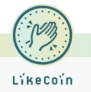

# 当大使！(+目前为止最好的 10 个项目！)

> 原文：<https://medium.com/coinmonks/being-an-ambassador-10-best-projects-so-far-38c05c85782?source=collection_archive---------4----------------------->

**Is this the new 21st century mindset?**

我们生活在有趣的时代。一段时间以来，你不必经历一个完整的*求职过程*去寻找灵感和抱负的世界，或者让自己置身于一个志同道合的团队中，然后去做一个产品*。不…现在你可以开始并成为一个(在线)社区的一员，或者很容易成为你喜欢的项目的大使。而且有很多机会…*

*… ***即使你不是开发者！****

*在与项目互动的过程中，你可以建立有趣的联系，了解很多关于 crypto 的事情，并从那里开始工作。我已经多次从密码领域的人那里听说，这些努力会带来真正的工作，我认为这是一个非常酷的发展。*

> **如果你想聊聊这个，你可以在*[*block dam*](http://www.meetup.com/nl-NL/Permissionless-Society/events/252590092/)*社区找到我和我的密码爱好者们。我们也有合作星期二，在那里你可以和我们的社区互动…**

*参与的方式有很多，大多数加密项目都愿意帮助新的、有积极性的社区成员，让他们有一个良好的开端。毕竟加入社区的人越多，对代币价格越有利，不是吗？；)*

*很多时候，你可以通过发推文、张贴文章、组织聚会、测试新应用或在电报组中帮助提供有效信息来获得代币作为参与的奖励……每个人都有一个开始的地方。*

*当然，我也听到了一些对此的批评。有人对我说:“这就像做一份工作，却得到更少的报酬。”。是的，我想你可以这样看，但我不一定同意这个观点。我希望看到这种发展成为人们在世界上获得成功的新机会，没有限制。你同意这个观点吗，或者不同意…为什么？请在评论中分享你的想法。*

*以下是十个可能的大使项目列表。它们是我迄今为止发现的最好的程序。这不是一个完整的列表，所以如果你发现了很酷的补充，或者另一个项目应该可以进入前 10 名？请在评论中告诉我，我会尽快查看，也许以后会把它们添加到列表中。*

*按字母顺序，因此是随机顺序…*

# *实体的大使计划！*

*来自美国的大使项目不会给你代币，但是他们会给你提供很多其他的东西。你会得到什么支持？*

***1。**AEmbassador 工具包，内含相关材料，帮助您以最佳方式展现耐心。 **2。**meetup 101-为您的活动提供后勤和组织建议以及友好支持。 **3。**以 Skype 会话形式进行的区块链技术培训，旨在了解什么是智能合同、国家渠道、分散式 oracles 和身份管理系统，以及它们可以实现的用例。 **4。**进入充满活力的企业家的全球网络。*

*我本人没有参加这个项目(目前还没有；)，但这看起来确实是一个有趣的提议！也许有什么可以跟进的！*

# ***阿拉贡***

*阿拉贡月刊的整体目标是成为一份由社区策划的报纸。他们希望邀请每个人通过[阿拉贡月度资料库](https://one.us15.list-manage.com/track/click?u=a590aa3843a54b079d48e6e18&id=ea8890840f&e=f6d49f121c)提交有趣的新闻项目、文章和分类广告！在我看来，唯一的缺点是..对于非开发者或初学者来说，与 Github 互动是非常复杂的。也许这是你可以改变的？我建议直接参与进来。*

# ***块堆栈***

*我早些时候已经就此写了一篇内容广泛的文章。有了 [Blockstack 贡献计划](https://contribute.blockstack.org/)，有很多方法可以获得堆栈。对我来说，作为一个非开发人员，这是迄今为止我遇到的最好和最容易使用的程序。唯一的缺点是还没有实际的付款，因为区块链仍然处于测试阶段。但是在 cryptoland，我们已经学会了耐心……所以只要按程序工作，同时 HODL 继续！；)*

# *Dapped*

*ConcourseQ 和 T2 Concourse 开放社区的联合创始人想要尝试一个完全不同的实验。他们一直在建立一个开放的社区，在更广泛的社区的帮助下，他们以惊人的高速度揭露 ICO 骗局。*下一步是什么？*一个**盈利性的努力，创建一个无骗局的 dapp 发现网站。** [任何人都可以向 Dapped 投稿，赚取权益代币。所有衣冠楚楚的所有者都投入到去中心化游戏的成功和构建它们的生态系统中。](https://prelaunch.dapped.io/post/7990/Dapped_is_in_PRELAUNCH_mode_)*

# ***指示器***

**Cindicator 创意挑战赛*完全是关于视频的。你可以随心所欲地发挥创造力:演示、采访、动画——任何东西！两个关键点:确保你的视频至少 1 分钟长，并且分享你的独特体验。挑战将持续到 8 月 31 日，所以你还有一些时间。点击查看规则和奖励[。顺便说一下，他们也在为社区计划一个大使项目，敬请关注！](https://cindicator.com/triple-c.pdf)*

# *数据基金*

*为了他们的隐私意识活动，Datafund 将会分配 30，000，000 DEX T21 代币。他们打算建立一个强大的社区，并奖励其成员传播对数据隐私和 Datafund 项目本身日益增长的重要性的认识。所以去看看他们，并传播消息！*

# *数据*

*超过 100，000 美元奖金的[数据奖金计划](https://beta.bounty0x.io/hosts/Datum)现已向加密货币社区开放。你所需要做的就是在你的社交账户上写下、谈论和分享关于数据的内容，你将会获得数据代币作为奖励。国家大使的面试正在进行中。如果你想申请，可能还有时间。*

# *和欣托斯*

*在 Elastos，他们似乎为社区做一切事情，我认为这很美好。你可以[写](/elastos/write-for-the-community-ba7a1e75be59)或者参加[信息图表大赛](/elastos/elastos-infographic-contest-a991829d4640)，比如说一直持续到 8 月 15 日。视频竞赛提交期刚刚结束，但这里是[前 10 名决赛选手](http://elanews.net/2018/07/20/elastos-video-contest-update/)。他们正在 [**招聘**](/elastos/we-want-you-elastos-community-recruitment-da0e97694f63) 全职和兼职**社区成员**担任技术和非技术职位！是的，你听得很清楚。是社区招聘。致力于项目的方式。我知道他们也有一个大使招募项目..所以快去问问吧[比如这里](https://t.me/elastosgroup)！*

# *科莫多岛*

*帮助 Komodo 平台众包和[分散他们的内容创作](https://forum.komodoplatform.com/t/start-here-komodo-influencer-network-category/117)。分享与平台合作的机会，或者选择自己完成部分工作。为此有一笔**25000 美元的 KMD 赏金**！是的，这个活动确实可以更开放和更容易接近。也许这是你能帮忙的事？；)*

# *直播同行*

*有一个真正的 [Livepeer 社区节点](https://forum.livepeer.org/t/transcoder-campaign-decentralized-community-node/203)处于活动状态，你可以在那里下注你的代币，所有的收入都将“T22”返还给社区。这似乎是一个非常有趣的发展，虽然我必须承认，我还没有找到任何时间来看看和检查它。如果你有更多关于*这个社区节点*实际上如何工作的消息(或者没有；)，在评论里让我和其他人知道！另外[先阅读](https://livepeer.us16.list-manage.com/track/click?u=57807e9b74db375864b2c4c68&id=e9dda9ea9f&e=7866756559) Livepeer for 初学者…*

*是的..已经结束了。我希望你能参与其中，并对这个列表感到满意。否则，你可能也想参与这篇文章，并开始…*

***…添加到列表中！***

*我意识到作为大使的“一般主题”有一点重叠。成为社区的贡献者和成为真正的大使之间的界限非常模糊。但我觉得这是件好事。你想让人们首先参与你的产品，如果他们喜欢，或者如果他们想做额外的工作，那么你应该给他们这个机会。我们都得从某个地方开始，不是吗？；)*

*对于列表中的所有项目也同样重要:如果你已经参与，请在评论中分享你的想法，这样其他人就可以从你的经历中学习。*

*你对这个列表有真正好的补充吗？ 请在评论中添加！我会去检查这个项目，可能会添加和删除另一个项目，我也会跟踪这个列表中已经删除的内容。*

*如果你第一次在秘密空间开始互动:享受旅程，小心！因为你可能最终会在月球的某个地方！**；)***

****如果你喜欢这篇文章，你可以通过*** [***这个链接***](https://button.like.co/masteringcrypto) ***免费发给我一些你喜欢的硬币！:)****

**

****没有上榜的项目(还没有；)或被摄的…****

*   *埃丝兰。谁想成为[海伦大使](https://blog.ethlend.io/who-wants-to-be-an-ethlend-ambassador-f5b6ec9e2e4b)？在测试期间，会有一些评估你是否适合的任务。*
*   ***EOS。你一直在关注 EOSIO 的开发和发布吗？“cleos”、“nodeos”和“keosd”这些词有什么含义吗？那么也许你喜欢[申请成为未来 EOS 黑客马拉松的技术导师](https://eoshackathon.io/mentors/)。***
*   ***LBRY** 。新的应用程序用户可以通过完成应用程序中的任务获得超过 **40 LBC** 的奖励，因此请查看 LBRY [奖励页面](https://lbry.io/faq/rewards)了解最新的细节和金额。与产品互动是成为大使的第一步，但不幸的是，参与似乎仅限于此…*
*   *POA 感谢所有申请参加 [POA 大使项目](/poa-network/poa-ambassador-program-d88ca5139951)的申请人。一旦他们在今年晚些时候正式启动该计划，他们将恢复接受候选人的申请，以便他们可以加速 POA 社区的发展。*
*   ***整党**似乎真的有了[酷大使计划](https://ambassadors.rsk.co/)也。这里唯一不好的是，只有一张申请表！这就缺少了一种未经许可就参与进来并开始做出贡献的方式。如果他们能消除这个障碍，可能会有更多的人参与进来，我希望他们能改变它，因为我真的很喜欢这个项目。*
*   ***视野开阔**。[创造者奖励计划](/view-ly/announcing-the-viewly-distribution-game-7ea38f3b162c)是一个代币分配计划。您可以交付内容，让令牌持有者对最佳提交内容进行投票。简而言之，创作者因发布高价值、引人入胜的内容而直接获得报酬。从 7 月 25 日**起**它对公众开放，所以有一些时间来深入了解它！*
*   ***Zeepin** 公布了他们的[社区贡献计划](https://neonewstoday.com/general/zeepin-community-contribution-program/)，但是要求有点高，难以上手。如果你不同意，并有不同的意见，向我解释为什么我们一定要检查这个程序！*