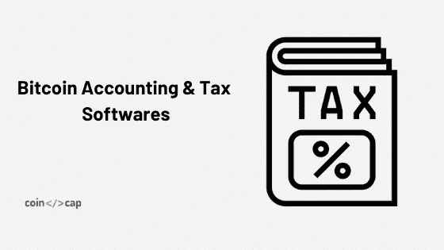

# 最佳比特币会计和税务软件

> 原文：<https://medium.com/coinmonks/best-bitcoin-accounting-and-tax-softwares-2c38beab11c7?source=collection_archive---------6----------------------->

比特币会计和税务软件可以帮助你对[比特币](https://blog.coincodecap.com/tag/bitcoin/)报税，并在一个地方监控你所有与加密相关的金融交易。

在这篇文章中，我们将讨论不同的加密会计和税务软件及其特点。

# 我用 crypto，需要交税吗？

您需要纳税，如果您:

*   将比特币(或任何替代币)换成任何其他币，用于任何产品、服务或其他币。
*   使用密码购买商品或服务。
*   通过采矿、打桩获得您的密码
*   持有一年以上后交易或办理密码
*   接受加密工资

# 什么是比特币会计税务软件？

比特币会计和税收软件通过与您的交易所、钱包和其他应用程序集成，聚合所有比特币交易、支付和其他交易。

这些软件还允许您将交易分类为特定事件，如赌注、贷款、借款、空投、交易、支付等。

通常，这些软件支持所有主流的加密货币。因此，在整篇文章中，我们将称它们为加密会计和税务软件。

加密会计和税务软件分析和跟踪你的投资组合。您还可以打印计算应税事件的纳税报告。

您还可以查看与您所在国家的税收规则相关的所有税收信息，如利润、损失和费用。

简而言之，这些软件帮助你对比特币和其他加密活动进行纳税申报。

> 查看加密[会计和税务](https://coincodecap.com/category/accounting-and-tax)软件的完整列表。

# 比特币会计和税务软件的特点

让我们讨论一个加密会计和税务软件的一些重要特征。

## 集成

这些软件与加密货币交易所、钱包和其他应用程序集成，以导入您的金融交易和贸易。

您也可以使用 CSV 文件导入您的事务，或者手动添加其他类型的事务。

## 投资组合跟踪

加密税务软件跟踪您的完整投资组合，在一个地方显示、分析和监控您的所有金融交易。

这里有不同类型的加密交易。

*   费用跟踪
*   保证金交易
*   Defi 交易(不包括贷款、借款或资本收益)
*   采矿和利润赌注
*   标准交易和钱包交易
*   支付和捐赠
*   空投
*   叉

## 税收损失收获

税收流失收获是一种做法，帮助你看到你的未实现的收益和损失。因此，你可以战略性地亏本出售资产，以减少你的应税收益。

## 税收方法支持

政府税务机构要求纳税人选择准确反映其收入的会计方法，并要求他们每年选择的会计方法保持一致。

选择加密税务软件时，您需要检查它是否支持您需要的会计方法。这些会计方法的几个例子是先进先出法、后进先出法、平均成本法和 ACB 法。

## 报告

报告是基本特征之一。会计和税务软件提供关于你的交易、流动资产、资本收益和损失的广泛报告。

## 税务报告

使用税务软件的目的是生成税务报告，为您的比特币和其他替代币报税。这些报告应根据您所在国家的税收规则生成。大部分会计和税务软件支持多个县。

## 税务专业套件

一些加密税务软件允许你跟踪多个账户。最适合有很多客户的注册会计师和会计师事务所。

## 会计软件集成

加密税务软件还集成了传统的税务软件，如 TurboTax，这样你就可以在一个地方分析所有的加密和法定交易。

## 税收优化器

税务优化提供建议，以节省税款，让您随时改变税收方法，以优化您的资本利得和损失。

# 顶级比特币和会计税务软件

我们为你挑选了一些最好的加密会计和税务软件。

> 查看加密会计和税务软件的完整列表，并在 [**CoinCodeCap 上阅读它们的评论。**](https://coincodecap.com/category/accounting-and-tax)

## [会计](https://www.accointing.com/en/en?discount=FRIEND-H14E8C5W)

Accointing 集成了多个加密货币交易所和钱包，支持 6000 多种货币(加密和法定)。它有桌面版和移动版。Accointing 跟踪您的投资组合，并提供一个额外的功能来查看不同加密货币的持有期。它还有一个税务优化器，你可以用 accointing 一键生成税务报告。

[**阅读客户评论**](https://coincodecap.com/product/accointing-2)

## [CoinTracker](https://www.cointracker.io/i/3p75ghwS0Nz9)

[CoinTracker](https://www.cointracker.io/i/3p75ghwS0Nz9) 集成了 300 多个交易所和钱包，支持 2500 种加密货币。它还可以跟踪 Defi、保证金交易和其他复杂的加密交易。

该软件自动实时跟踪您的投资组合，您可以根据您所在国家的税法生成税务报告。

[**阅读 CoinTracker 客户评论**](https://coincodecap.com/product/cointracker-4)

## [代币税](https://tokentax.co/?via=coincodecap)

TokenTax 支持所有主流加密货币交易所，并与 TurboTax 集成。它是为专业会计师设计的，这意味着它可以跟踪不同实体或个人的多个账户。

该软件允许投资组合跟踪和国别税务报告。它有一个税收损失收获仪表板，显示您的未实现收益和损失，以便您可以亏本出售资产，以减少您的应税收益。

除了支持标准的贸易和交易，它还能够跟踪保证金交易，Defi 交易，ICO，加密挖掘。

[**阅读 TokenTax 客户评论**](https://coincodecap.com/product/tokentax-2)

## [硬币跟踪](https://cointracking.info/?ref=T987862)

CoinTracking 是最著名的加密会计和税务软件之一。它支持 70 多种加密货币交易所和钱包。

您可以分析您的交易并生成利润/损失和审计报告。它支持超过 12 种会计方法和多个国家。您还可以查看 7000 多种加密货币的历史图表，并为它们生成税务报告。CoinTracking 还提供各种余额和交易报告。

[**阅读 CoinTracking 客户评论**](https://coincodecap.com/product/cointracking-8)

## [密码交易商。税收](http://cryptotrader.tax?fpr=ruo9q)

密码交易商。Tax 是一款专业的会计和税务软件，允许从多个加密货币交易所进行贸易进口。它还与 TurboTax 集成。

该软件支持税收损失的收获，并提供广泛的贸易报告。

[**读 CryptoTrader。税务客户点评**](https://coincodecap.com/product/cryptotrader.tax-8)

# 正在总结…

全世界的政府都在监控密码，并制定法规和法律。所以如果你正在使用 crypto，最好咨询一下会计师，看看你是否有纳税义务。

没有什么比守法公民更让政府高兴的了，你也不想惹恼政府，对吧？

请在评论区告诉我们你的想法，如果你正在使用任何会计软件，请在 [CoinCodeCap](https://coincodecap.com/category/accounting-and-tax) 上写一篇评论。

另外，看看

*   [**如何获取比特币历史价格？**](https://blog.coincodecap.com/how-to-get-bitcoin-historical-price/)
*   [**比特币支付处理器**](https://blog.coincodecap.com/best-bitcoin-payment-processors/)
*   [**加密交换服务**](https://blog.coincodecap.com/convert-bitcoin-best-crypto-exchange-services/)
*   [**比特币节点提供商**](https://blog.coincodecap.com/bitcoin-node-solutions/)

> [直接在您的收件箱中获得最佳软件交易](https://coincodecap.com/?utm_source=coinmonks)

