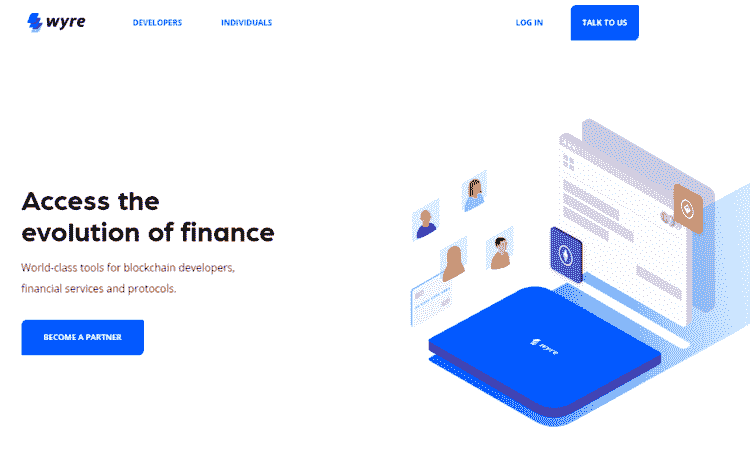

# 面向开发者的 13 个最佳加密 API 和区块链 API

> 原文：<https://medium.com/coinmonks/best-crypto-apis-for-developers-5efe3a597a9f?source=collection_archive---------0----------------------->

比特币最近于 2019 年 1 月 3 日迎来了它的十周年纪念日，距离中本聪 2009 年开采创世纪区块已经整整十年了。除了加密社区中最有激情的人之外，比特币历史的最初几年并没有引起大多数人的注意。

虽然基础设施开发起步缓慢，但 2017 年的牛市将一波新的产品带到了加密领域。如今，加密技术的发展达到了前所未有的高度，来自其他行业的新开发人员蜂拥而至，寻找“加密淘金热”。

想开发自己的加密应用程序吗？无论你是加密货币的开发者、交易者，还是对加密充满热情的人，都有一些 API 可以让你的加密之旅更加顺畅。无论您是想开发个人交易机器人、支付应用程序还是商业结算解决方案，都有一些 API 可以帮助您入门。

 [## 学习可靠性的 8 个最佳免费课程[2022 年 5 月] | CoinCodeCap

### 像所有其他 web 开发语言一样，学习 Solidity 也需要时间和精力。然而，你将领先于…

coincodecap.com](https://coincodecap.com/best-free-courses-to-learn-solidity) 

让我们探索一下市场上最好的加密 API。

## 1. [Bitquery](https://graphql.bitquery.io/ide/explore/All%20queries)

[Bitquery](https://bitquery.io/) 为 40 多个区块链提供[区块链数据 API](https://bitquery.io/)。这些 API 是使用 GraphQL 技术构建的。因此，您可以使用单个 [GraphQL 端点](https://graphql.bitquery.io/)访问整个区块链的数据。此外，您可以编写 GraphQL 查询来根据需要获取特定的数据。

除此之外，Bitquery 的[coin path API](https://graphql.bitquery.io/ide/explore/coinpath)、[DEX API](https://graphql.bitquery.io/ide/explore/dexTrades)、 [Transfer](https://graphql.bitquery.io/ide/explore/transfers) 、[Balance API](https://graphql.bitquery.io/ide/explore/address)；您还可以提取通用的区块链数据，例如 [SmartContractCalls](https://graphql.bitquery.io/ide/explore/smartContractCalls) 、事件和[参数](https://graphql.bitquery.io/ide/explore/arguments)。

> 还可阅读:[最佳区块链分析工具](https://bitquery.io/blog/best-blockchain-analysis-tools-and-software)及其工作原理？

## 2. [QuikNode](https://quiknode.io/?tap_a=67226-09396e&tap_s=996309-882188)

如果你是开发人员，运行一个节点总是一件痛苦的事。你需要一个专用的设备并维护它。这需要额外的技能和时间。此外，安全性总是一个大问题，但是 QuikNode 解决了这些问题。

要开始使用 QuikNode，您需要注册并获得免费的节点 URL 来连接您的节点。它为新开发人员提供了最佳的入职体验。

QuikNode 支持 20+区块链，并从 Infura 提供更好的基础设施。

 [## 十大区块链数据 API(索引数据提供商)

### 在 Web3 中，与用户和应用程序之间的所有交互都受到保护的 Web2 相反，区块链是…

medium.com](/coinmonks/top-10-blockchain-data-apis-indexed-data-provider-23efd92d2e79) 

## 3.交换区

[Swapzone](https://swapzone.io/) 是一个一键式加密货币交易聚合器，汇集了 20 多家交易提供商的 1000 多项加密资产。这项服务是即时的，不需要注册或 KYC 程序。

[Swapzone API](https://swapzone.io/partners/exchange-api?refId=fdJ9VsV5_) 是一个白标解决方案，将 Swapzone 服务的所有功能转移到任何加密货币项目；Swapzone 取代了与提供商、客户支持和基础设施更新的所有通信，但是您可以将 API 无缝地构建到您的界面中。它还提供了一个透明而灵活的奖励系统，包括额外费用(加价)，可以增加合作伙伴的佣金并带来更高的利润。

Swapzone API

API 是通过 REST 技术嵌入的，因此它可以被引入到任何流中，无论是桌面服务还是移动应用程序，都不需要额外的编码。

Swapzone 提供的加密货币交换 API 是一个方便的选择，可以扩展资产数量，通过稳定的交换提供商网络和优质的客户支持来支持您的服务，或者通过即时加密交换解决方案来丰富您的服务。

## 4.[简单交换](https://simpleswap.io/?ref=660adad2c784)

SimpleSwap 为其客户提供了一个无需注册即可兑换 500 多种加密货币的绝佳机会。上市 4 年来，该项目赢得了密码爱好者的信任和喜爱。

SimpleSwap

[SimpleSwap API](https://simpleswap.io/affiliate-program/how-to-start/api?ref=660adad2c784&utm_source=coinmonks&utm_medium=sponsored&utm_campaign=API) 免费且使用方便。平均来说，集成只需要一天时间。借助 SimpleSwap API，应用程序可以实现加密货币兑换服务。开发人员可以设计自己的加密服务，并使用不同的 API 方法来访问所有的货币对、估计的汇率等等。API 使用 HTTP 协议，响应通过 JSON API 格式传递。

详细的技术文档可以看这里:[https://API . simple swap . io](https://api.simpleswap.io/?ref=660adad2c784)

注册会员帐户后，合作伙伴可以获得 API 密钥，并从每笔完成的交易中定制自己的佣金(最高 2%)。SimpleSwap API 是可持续的，有 99.95%的正常运行时间。不同的钱包和交换合作伙伴已经根据他们的需要集成了这个 API。

## 5.[硬币 API](https://www.coinapi.io/)

[CoinAPI](https://www.coinapi.io/) 是一家专门提供价格和市场数据的服务提供商。CoinAPI 的数据库中有超过 20TB 的原始市场数据，在市场上享有高质量加密数据的美誉。

CoinAPI 提供**实时**数据流服务和**历史市场数据数据库**。CoinAPI 的服务器遍布世界各地，旨在可靠、快速地传输数据。

## 6. [CoinMarketCap API](https://coinmarketcap.com/api/)

CoinMarketCap 是一个跟踪各种加密货币和数字资产的交易所和流动性市场的网站。作为加密领域最知名的资源之一，CoinMarketCap 是追踪加密市场的顶级数据聚合器。CoinMarketCap 还为交易者和开发者提供了一个专业的 API，其中包括自 2013 年以来完整的历史加密货币市场数据。

CoinMarketCap API 有一个有限的免费计划，可以根据每月通话积分的数量快速提高价格。

## 7.[经济学 API](https://p.nomics.com/cryptocurrency-bitcoin-api)

[Nomics](https://nomics.com/) 是一个比特币和加密货币数据 API，其功能目的是成为**“开发者和专业加密投资者的数据支柱**”Nomics 的 API 建立在其核心产品**存档**、**汇总**和**分析**完整加密资产数据的基础上。

Nomics 的 API 对于交易员、量化分析师和对冲基金经理来说是一个很好的资源，因为它提供了详细的原始交易数据，但对于寻找负担得起的数据提供商的小团队和独立开发者来说可能相当昂贵。

 [## 更好的区块链职业生涯的 9 个最佳区块链工作[2022] | CoinCodeCap

### 随着加密货币的兴起，公众对加密货币产生了浓厚的兴趣

coincodecap.com](https://coincodecap.com/best-blockchain-jobs) 

## 8. [Coincap.io API](https://coincap.io/)

[CoinCap](https://coincap.io/) 是一款收集 1，000 多种加密货币的实时定价和市场活动的工具，其目标是提供关于数字资产市场的透明而准确的数据。由 ShapeShift 团队创建的 CoinCap API 对所有用户都是免费的。

CoinCap API 作为一个免费的 API，可以很好地聚合实时价格和市场，但作为一个需要准确历史数据的解决方案，如回溯测试投资组合策略，可能会有所欠缺。

## 9.[怀尔](https://www.sendwyre.com/)

[Wyre](https://www.sendwyre.com/) 为加密应用和服务提供受监管且合规的平面加密入口。Wyre API 是一个简单的集成支付解决方案，适用于希望将加密作为一种支付方式而非传统支付方式来实施的加密初创公司。

## 10.[密码比较 API](https://min-api.cryptocompare.com/)

[CryptoCompare](https://www.cryptocompare.com/) 被广泛的商业、投资机构和加密公司使用。CryptoCompare 包括来自市场、贸易、区块链和社会来源的各种数据。

CryptoCompare 的 API 提供了高度可靠和可扩展的端点，在高峰时间达到每小时 1.8 亿次请求，每秒收集 800+笔交易。他们的全球数据中心支持超过 3 万个客户端。

## 9. [BitPay](https://bitpay.com/)

[BitPay](https://bitpay.com/) 是一个比特币和加密货币支付处理器，使商家和消费者能够立即接受加密货币作为支付，而没有风险或价格波动。目前，信用卡可以对每笔交易收取高达 3%的手续费。与信用卡相比，BitPay 只收取 1%的加密到法定银行转换结算费用。此外，传统支付方式要求客户提供敏感的个人信息，这可能导致欺诈和身份盗窃。

BitPay API 可用于创建和管理发票、发放退款、管理账单、检索实时费率信息、查看商家分类账条目等等。

## 11.[守宫](https://www.coingecko.com/en#)

[CoinGecko 的](https://www.coingecko.com/en#)使命是赋予加密用户权力，帮助他们更好地理解推动市场的基本因素。除了加密价格、交易量和市值，CoinGecko 还测量社区增长、开源代码开发、事件和链上指标，以进行超越技术指标的完整分析。CoinGecko 自 2014 年开始运营，是最大的加密数据提供商之一，跟踪来自 260 多个加密货币交易所的近 3，300 个令牌。

CoinGecko 是一个免费使用的 API，提供对实时定价、交易量、报价器、交易所和历史数据等数据的访问。该 API 还提供非市场数据，如图像、开发和社交社区统计数据、事件、全球市场和交易所状态更新。

 [## 顶级加密货币和区块链课程 2022 | CoinCodeCap

### 本文将围绕各种课程展开，帮助您了解区块链和加密货币。你…

coincodecap.com](https://coincodecap.com/blockchain-courses) 

## 12.[现在节点](https://nownodes.io/)

NOWNodes 提供了对资源管理器和节点 API 的访问。连接了 40 多个最受欢迎的区块链网络。使用 NOWNodes，您可以:

添加新的区块链网络、硬币和代币；
获得一个方便的备份解决方案来维护网络的平稳工作&服务质量；
专注于产品开发，同时降低基础设施成本。

对于任何支持的网络，该服务有一个每天最多 20，000 次请求的免费计划。

您可以使用 NOWNodes 开始使用区块链节点，免费计划是可用的。

## 13.[隐蜂](https://coincodecap.com/go/cryptoapis)

Crypto APIs 的升级版 2.0 包括一个强大的产品套件，由钱包即服务、区块链数据、区块链事件、区块链工具、区块链自动化和市场数据组成。

基础设施层利用 Kubernetes 和 OpenAPI 3.0 规范，使其易于扩展和定制。使用单一集成点，客户可以访问 170 多个使用顶级区块链协议连接的端点。开发人员可以在 9 个 SDK 库中选择他们喜欢的语言，并将集成添加到他们的系统中。

定价选项基于使用情况，因此如果您需要满足更高的需求或快速扩展，您可以随时升级您的计划。使用 Crypto APIs Wallet 作为服务产品还可以为您节省高达 90%的交易网络费用。

> **使用优惠券** [**GET30**](https://coincodecap.com/go/cryptoapis) **获得新订阅 30%的折扣。**

## 14 . [Shrimpy API](https://developers.shrimpy.io/) (关闭)

[Shrimpy 的通用加密交换 API](https://help.shrimpy.io/hc/en-us/articles/4412537448219-Shrimpy-Developer-API-Shutdown?utm_source=medium&utm_medium=web-article&utm_campaign=developer-api-03-09-2019) 允许第三方应用程序开发者利用 Shrimpy 的交易引擎和服务器端架构[快速实施和部署他们自己的应用程序](https://blog.goodaudience.com/8-things-you-can-build-with-the-shrimpy-universal-exchange-apis-b4cd8ae3bc56)。 [Shrimpy 的 API 提供了一个基于实时数据的低延迟订单执行&自动化交易引擎，能够根据需要管理用户**和**规模使用](/@ShrimpyApp/developing-trading-applications-with-shrimpys-crypto-exchange-api-4ee3c8f2552)。

Shrimpy API 是市场上最强大的交易 API。他们连接到最流行的密码交换网络。提供实时完整的订单簿数据、限价订单、未结订单、智能订单路由、exchange 帐户管理、用户管理以及开箱即用的完整云基础架构解决方案。所有这些都集成到一组 API 中，可以在每个交易所工作。

由于有限的资源和紧张的时间表，开发团队经常捉襟见肘。当涉及到开发加密应用程序时，这一挑战变得更加严峻，因为目前缺乏扩展操作的工具。对于独立的第三方应用开发者来说，维护一个正常工作的商业产品是非常昂贵的。

# 关于虾皮

[Shrimpy.io](https://shrimpy.io/referral?r=I6VFZ7d2E) 是一个加密管理工具，任何人[都可以像管理指数投资组合一样管理自己的加密货币资产](https://blog.goodaudience.com/cryptocurrencies-index-funds-9bbad17f1e2c)。用户能够配置定制的加密货币组合，并实施被动的[再平衡](/@ShrimpyApp/cryptocurrency-rebalancing-taxes-95b2a89c10af)策略，消除了必须主动交易加密的麻烦。Shrimpy 还在其高级订阅服务中提供社交交易和用户洞察。

## 给消费者的礼物

用户能够配置定制的加密货币组合，并实施被动管理策略，消除了必须主动交易加密的麻烦。

Shrimpy 的免费版本为所有用户提供了完整的自动交易、指数和再平衡功能。Shrimpy 还提供每月 8.99 美元的月费订阅。高级订阅包括:

Shrimpy Social :关注、交流和分享其他 Shrimpy 交易者的策略。

[**Shrimpy Insights**](https://blog.shrimpy.io/blog/shrimpy-introduces-social-insights) :了解其他 Shrimpy 用户如何构建和管理他们的加密组合。

[**高级回溯测试**](https://blog.shrimpy.io/blog/the-crypto-portfolio-rebalancing-backtest-tool) :用于评估定制加密货币组合&策略的健壮回溯测试工具。

 [## Shrimpy —加密货币投资组合管理

### 管理您的数字资产的最简单、最值得信赖的方式。

www.shrimpy.io](https://www.shrimpy.io/) 

## Shrimpy 为开发者提供的加密交易 API

除了消费者应用程序，Shrimpy 还为希望将可扩展的交易所交易功能集成到其应用程序中的开发人员提供了一个交易 API。

Shrimpy 的 Universal Exchange API 是作为一个基于云的解决方案创建的，以解决几个加密开发人员的障碍，包括**交换交易**、**产品可扩展性**和**用户管理。**有了 Shrimpy 的 API 在手，开发人员在创造将塑造加密未来的下一个时代的突破性产品时就不会受到范围的限制。

Shrimpy 的 API 是一种加密货币交易 API，可与以下所有交易所及其 API 端点兼容:币安 API、CoinbasePro API、Bittrex API、北海巨妖 API、Gemini API、Poloniex API、Huobi API、KuCoin API、Bibox API、BitMart API 和 HitBTC API。用户不必管理每个交易所的所有连接，只需利用 Shrimpy 现有的加密交易所交易基础设施，并专注于实际的产品开发。

 [## 面向开发者的加密交易 API

### 业界领先的加密交易、实时数据收集和交易账户管理 API。

developers.shrimpy.io](https://developers.shrimpy.io/) 

**虾米链接**:

[电报](http://t.me/ShrimpyGroup) [推特](https://twitter.com/ShrimpyApp)脸书 [Reddit](https://www.reddit.com/r/ShrimpyApp/) [不和](https://discord.gg/gXyy95y)

> 加入 Coinmonks [电报频道](https://t.me/coincodecap)和 [Youtube 频道](https://www.youtube.com/c/coinmonks/videos)获取每日[加密新闻](http://coincodecap.com/)

 [## 顶级令牌持有者 API

### 好奇币安智能链上代币的最高持有者，或者哪个钱包拥有最多代币？这是答案

medium.com](/coinmonks/top-token-holders-api-e881bbb63c93)  [## 最佳 Algorand API 供应商

### 发现安全高效区块链开发的最佳 Algorand API 提供商

medium.com](/coinmonks/best-algorand-api-providers-1c05899500b1)  [## 使用 Gephi 可视化资金流动

### 区块链可视化工具可以帮助用户更好地了解链上活动，通过提供图形…

medium.com](/coinmonks/visualize-money-flow-using-gephi-92cfa5d8499a)  [## 十大索引区块链数据 API 提供商

### 区块链技术彻底改变了我们对数据存储和管理的思考方式。分散网络…

medium.com](/coinmonks/top-10-indexed-blockchain-data-apis-providers-3a43da97e54c) 

## 另外，阅读

*   [密码电报信号](http://Top 4 Telegram Channels for Crypto Traders) | [密码交易机器人](/coinmonks/crypto-trading-bot-c2ffce8acb2a)
*   [复制交易](/coinmonks/top-10-crypto-copy-trading-platforms-for-beginners-d0c37c7d698c) | [加密税务软件](/coinmonks/crypto-tax-software-ed4b4810e338)
*   [网格交易](https://coincodecap.com/grid-trading) | [加密硬件钱包](/coinmonks/the-best-cryptocurrency-hardware-wallets-of-2020-e28b1c124069)
*   [印度的加密交易所](/coinmonks/crypto-exchange-dd2f9d6f3769) | [印度的加密应用](/coinmonks/buy-bitcoin-in-india-feb50ddfef94)